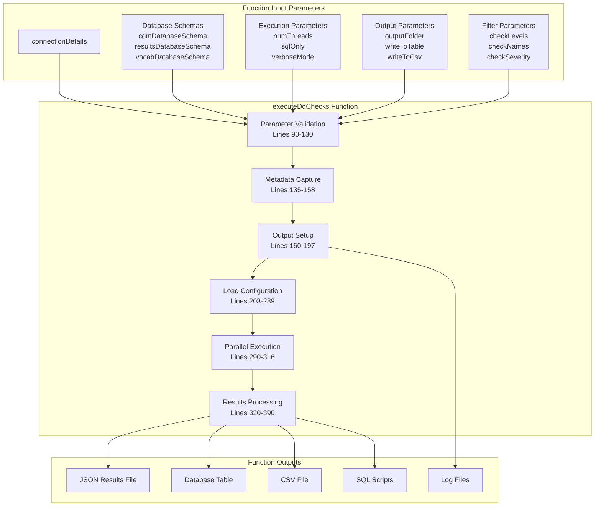
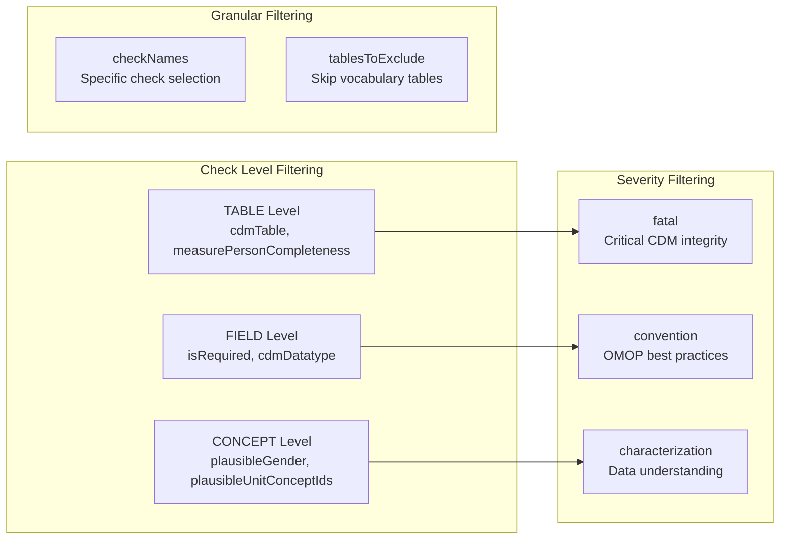
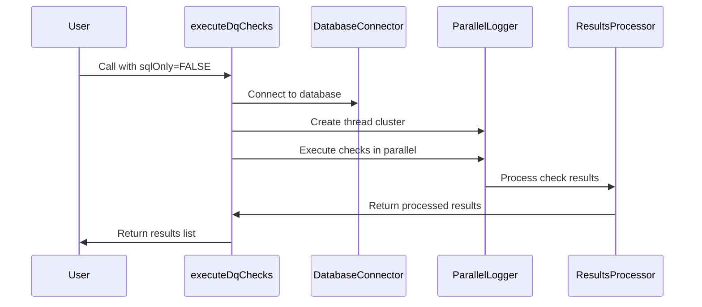
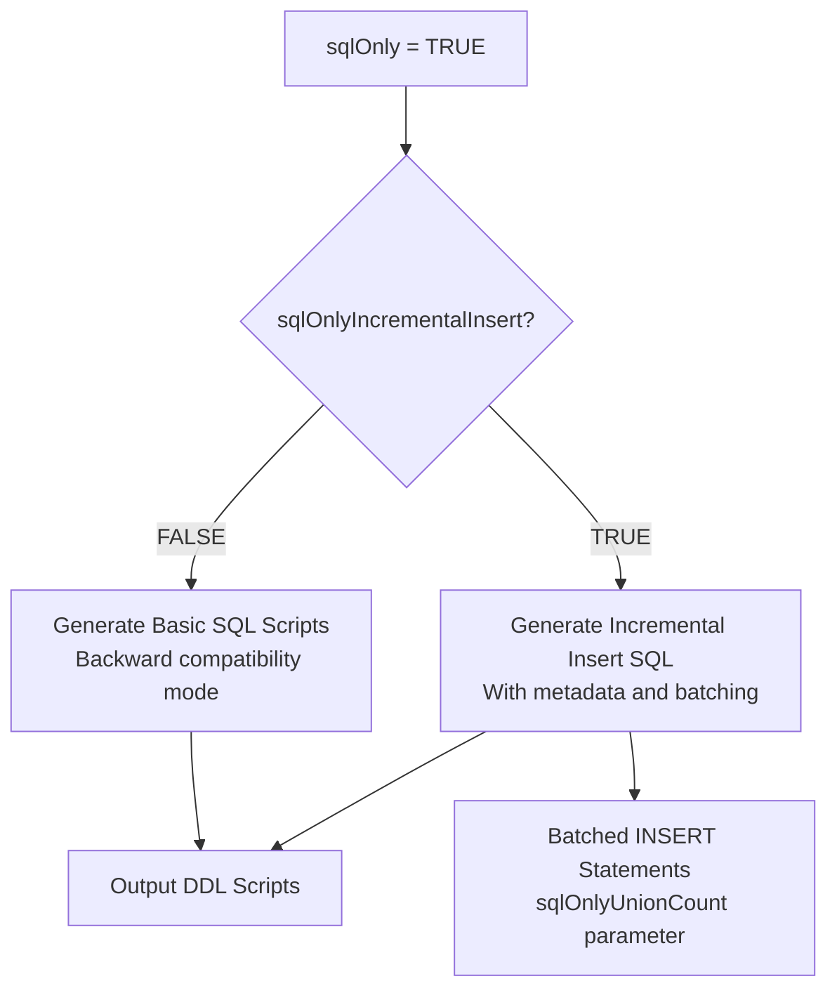
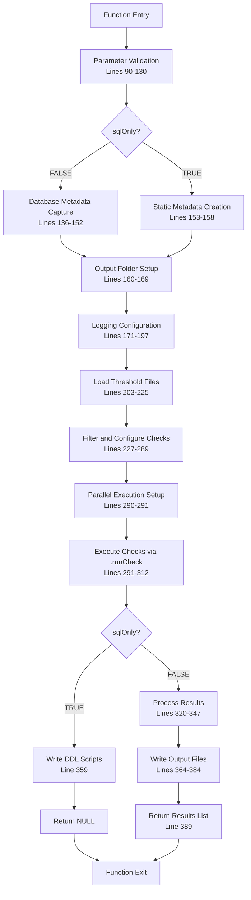
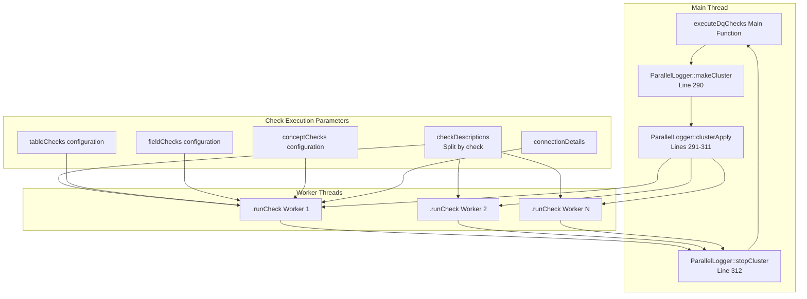
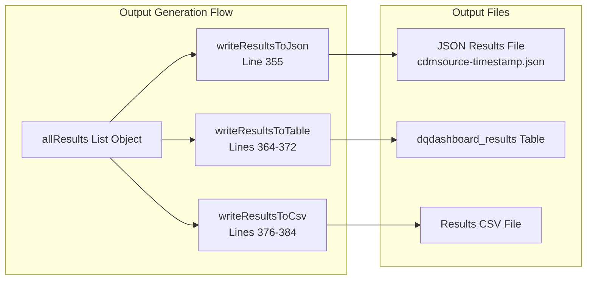
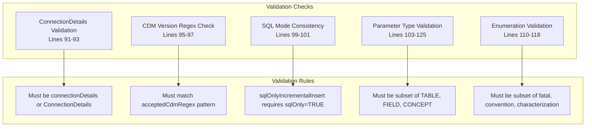

# Page: executeDqChecks Function

# executeDqChecks Function

Relevant source files

The following files were used as context for generating this wiki page:

- [DESCRIPTION](DESCRIPTION)
- [NAMESPACE](NAMESPACE)
- [NEWS.md](NEWS.md)
- [R/executeDqChecks.R](R/executeDqChecks.R)
- [docs/LICENSE-text.html](docs/LICENSE-text.html)
- [docs/authors.html](docs/authors.html)
- [docs/reference/executeDqChecks.html](docs/reference/executeDqChecks.html)
- [docs/reference/index.html](docs/reference/index.html)
- [docs/reference/viewDqDashboard.html](docs/reference/viewDqDashboard.html)
- [docs/reference/writeJsonResultsToTable.html](docs/reference/writeJsonResultsToTable.html)

This page provides comprehensive documentation for the `executeDqChecks` function, which serves as the primary entry point and orchestrator for the entire Data Quality Dashboard system. The function coordinates database connections, SQL generation, parallel execution of data quality checks, results processing, and output generation across multiple formats.

For information about specific execution modes and SQL generation details, see [Execution Modes and SQL Generation](#3.2). For details about individual check implementations, see [Check Implementation](#5).

## Function Overview

The `executeDqChecks` function is defined in [R/executeDqChecks.R:63-391]() and serves as the main interface for running data quality assessments against OMOP CDM databases. It supports three primary execution modes: live database execution, SQL-only script generation, and incremental insert batch processing.

Sources: [R/executeDqChecks.R:63-391]()

## Parameter Categories

The function accepts 27 parameters organized into logical categories for database connectivity, execution control, filtering, and output configuration.

### Database Connection Parameters

| Parameter | Type | Description |
|-----------|------|-------------|
| `connectionDetails` | ConnectionDetails | Database connection object |
| `cdmDatabaseSchema` | character | CDM schema location |
| `resultsDatabaseSchema` | character | Results schema location |
| `vocabDatabaseSchema` | character | Vocabulary schema (defaults to CDM schema) |

### Execution Control Parameters

| Parameter | Default | Description |
|-----------|---------|-------------|
| `numThreads` | 1 | Concurrent execution threads |
| `sqlOnly` | FALSE | Generate SQL scripts without execution |
| `sqlOnlyUnionCount` | 1 | SQL unions per incremental insert query |
| `sqlOnlyIncrementalInsert` | FALSE | Generate incremental insert SQL |
| `verboseMode` | FALSE | Console logging verbosity |

### Check Filtering Parameters

Sources: [R/executeDqChecks.R:79-81](), [R/executeDqChecks.R:85](), [R/executeDqChecks.R:110-118]()

## Execution Modes

The function supports three distinct execution modes controlled by the `sqlOnly` and `sqlOnlyIncrementalInsert` parameters.

### Live Execution Mode

When `sqlOnly = FALSE` (default), the function:
- Establishes database connections
- Executes SQL queries in parallel
- Processes and evaluates results
- Generates output files and database records

### SQL-Only Mode

When `sqlOnly = TRUE`, the function generates SQL scripts without database execution:

Sources: [R/executeDqChecks.R:69-71](), [R/executeDqChecks.R:99-101](), [R/executeDqChecks.R:358-360]()

## Internal Execution Flow

The function follows a structured execution pipeline with comprehensive error handling and logging.

Sources: [R/executeDqChecks.R:90-391]()

### Parallel Execution Architecture

The function uses `ParallelLogger` to execute checks concurrently:

Sources: [R/executeDqChecks.R:290-312]()

## Return Values and Output Formats

### Live Execution Return Object

When `sqlOnly = FALSE`, the function returns a structured list containing:

| Field | Type | Description |
|-------|------|-------------|
| `startTimestamp` | POSIXct | Execution start time |
| `endTimestamp` | POSIXct | Execution end time |
| `executionTime` | character | Human-readable duration |
| `executionTimeSeconds` | numeric | Duration in seconds |
| `CheckResults` | data.frame | Individual check results |
| `Metadata` | data.frame | CDM source metadata |
| `Overview` | data.frame | Results summary |

### Output File Generation

Sources: [R/executeDqChecks.R:338-347](), [R/executeDqChecks.R:355](), [R/executeDqChecks.R:364-384]()

## Error Handling and Validation

The function implements comprehensive parameter validation and error handling throughout execution.

### Parameter Validation

### Runtime Error Handling

The function includes error handling for:
- Database connection failures [R/executeDqChecks.R:137-143]()
- Empty CDM source table [R/executeDqChecks.R:144-146]()
- Missing check configurations [R/executeDqChecks.R:264-266]()
- Invalid threshold file locations
- SQL execution errors within individual checks

Sources: [R/executeDqChecks.R:90-130](), [R/executeDqChecks.R:137-158](), [R/executeDqChecks.R:264-266]()