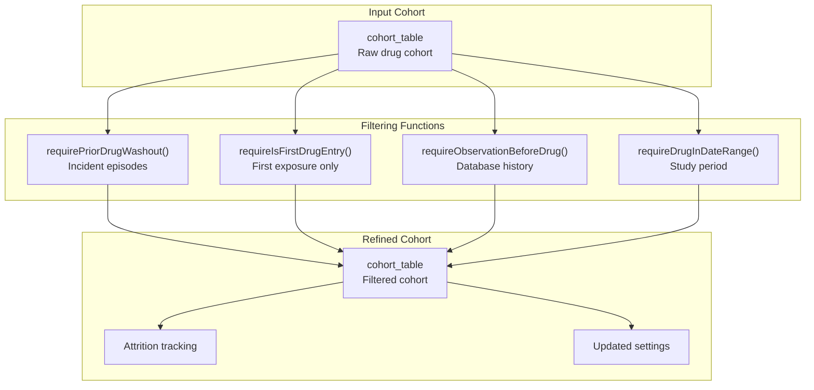
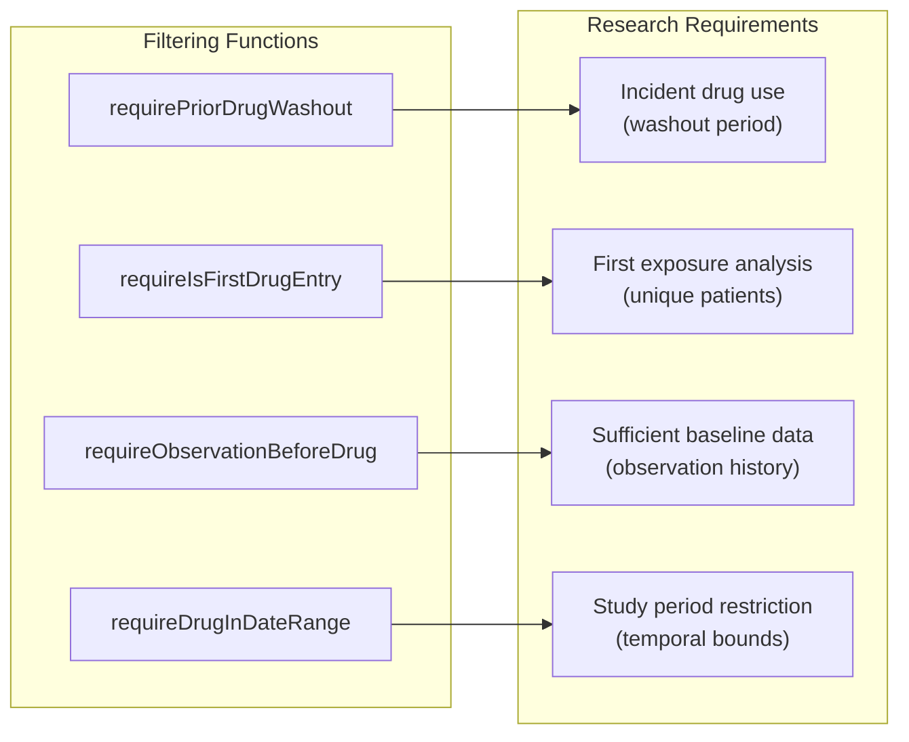
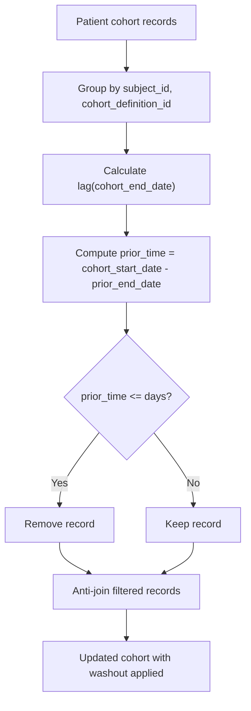
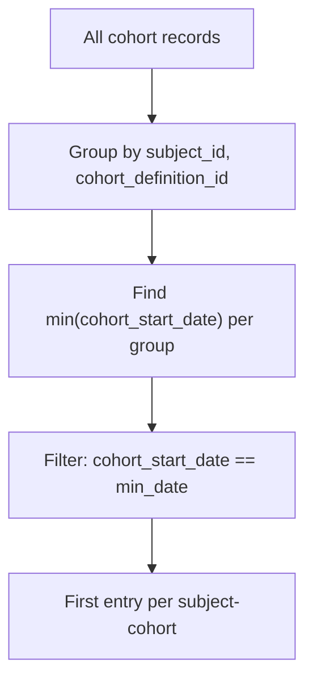
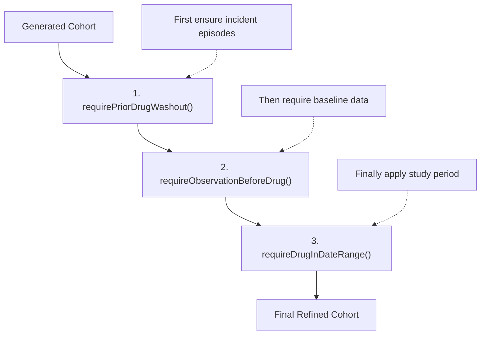
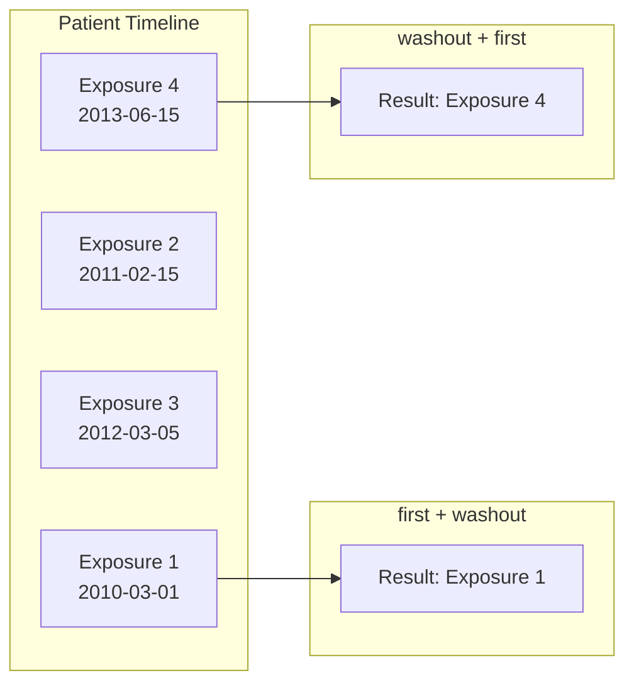
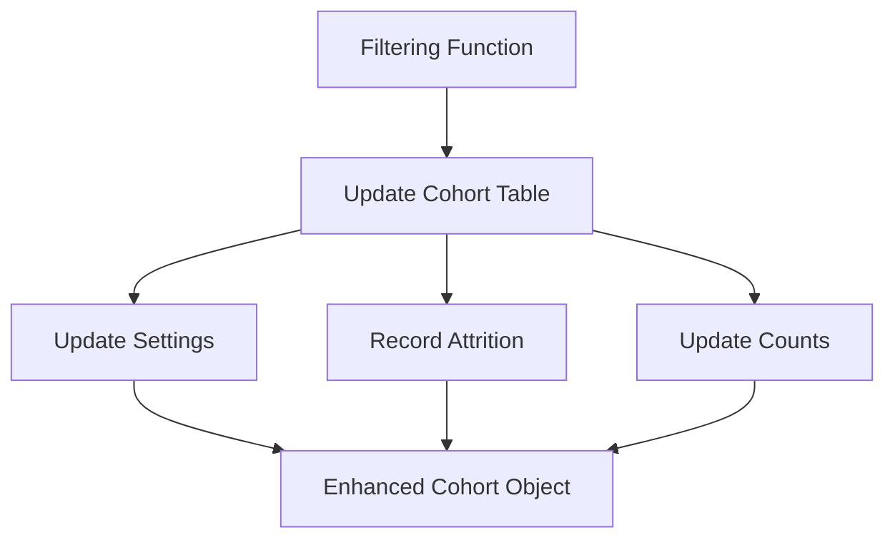

# Page: Cohort Filtering and Refinement

# Cohort Filtering and Refinement

Relevant source files

The following files were used as context for generating this wiki page:

- [.Rbuildignore](.Rbuildignore)
- [R/require.R](R/require.R)
- [_pkgdown.yml](_pkgdown.yml)
- [man/requireDrugInDateRange.Rd](man/requireDrugInDateRange.Rd)
- [man/requireIsFirstDrugEntry.Rd](man/requireIsFirstDrugEntry.Rd)
- [man/requireObservationBeforeDrug.Rd](man/requireObservationBeforeDrug.Rd)
- [man/requirePriorDrugWashout.Rd](man/requirePriorDrugWashout.Rd)
- [tests/testthat/test-require.R](tests/testthat/test-require.R)
- [vignettes/.gitignore](vignettes/.gitignore)
- [vignettes/create_cohorts.Rmd](vignettes/create_cohorts.Rmd)
- [vignettes/mock_data.Rmd](vignettes/mock_data.Rmd)

This document covers the cohort filtering and refinement functions that apply inclusion and exclusion criteria to existing drug cohorts. These functions work with cohort tables that have already been generated (see [Cohort Generation](#4.1) for cohort creation) to filter records based on temporal requirements, observation periods, and other study-specific criteria.

For information about analyzing refined cohorts, see [Drug Utilisation Analysis](#5) and [Specialized Analysis Functions](#6).

## Overview

The DrugUtilisation package provides four core functions for applying inclusion criteria to cohort tables. These functions filter existing cohort records based on specific requirements and maintain detailed attrition tracking.

**Sources:** [R/require.R:17-352](), [_pkgdown.yml:27-33]()

## Function-to-Purpose Mapping

**Sources:** [R/require.R:17-352](), [vignettes/create_cohorts.Rmd:307-314]()

## Core Filtering Functions

### requirePriorDrugWashout()

Filters cohort records to ensure a specified amount of time has passed since the last cohort entry ended for the same individual. This is essential for defining incident drug use episodes.

**Key Parameters:**
- `days`: Number of days required since last exposure (setting to `Inf` calls `requireIsFirstDrugEntry()`)
- `cohortId`: Optional restriction to specific cohort definitions
- `name`: Target table name for results

**Implementation Logic:**
The function identifies cohort records where the time between the end of a previous exposure and the start of the current exposure is less than or equal to the specified `days` parameter, then removes these records via `anti_join`.

**Sources:** [R/require.R:53-107](), [vignettes/create_cohorts.Rmd:315-361]()

### requireIsFirstDrugEntry()

Restricts the cohort to only the first cohort record per subject for each cohort definition. This ensures each individual contributes only their earliest exposure.

**Implementation:**
Groups records by `subject_id` and `cohort_definition_id`, then filters to keep only records where `cohort_start_date` equals the minimum start date for that subject-cohort combination.

**Sources:** [R/require.R:136-169](), [vignettes/create_cohorts.Rmd:363-396]()

### requireObservationBeforeDrug()

Ensures cohort records have sufficient prior observation time in the database before the cohort start date. Uses `PatientProfiles::addPriorObservationQuery()` to calculate observation history.

**Key Features:**
- Leverages `observation_period` table to determine database history
- Adds temporary column with prior observation days
- Filters records with insufficient observation time

**Sources:** [R/require.R:203-245](), [vignettes/create_cohorts.Rmd:398-431]()

### requireDrugInDateRange()

Restricts cohort records to those with an index date (typically `cohort_start_date`) within a specified date range. Supports flexible date range specifications with `NA` values for open-ended ranges.

**Date Range Options:**
- `c(start_date, end_date)`: Both bounds specified
- `c(NA, end_date)`: Only upper bound
- `c(start_date, NA)`: Only lower bound  
- `c(NA, NA)`: No restrictions (passthrough)

**Sources:** [R/require.R:279-336](), [vignettes/create_cohorts.Rmd:434-478]()

## Order Dependency and Best Practices

The order of applying filtering functions significantly affects results because these operations are not commutative. Different sequences can yield different final cohorts.

### Recommended Application Order

**Rationale:**
1. **Incident episodes first**: Establish true incident drug use before other criteria
2. **Observation requirements**: Ensure sufficient baseline data for analysis
3. **Date restrictions last**: Apply study period bounds to the refined incident cohort

**Sources:** [vignettes/create_cohorts.Rmd:665-674]()

### Order Impact Examples

The vignette demonstrates how different orders produce different results using a patient with multiple exposures:

**Sources:** [vignettes/create_cohorts.Rmd:480-638]()

## Implementation Details

### Settings and Attrition Tracking

Each filtering function updates three key components:

1. **Settings**: Records applied parameters using `newSettings()`
2. **Attrition**: Tracks filtering impact with `recordCohortAttrition()`
3. **Counts**: Updates via `omopgenerics::cohortCount()`

**Sources:** [R/require.R:96-105](), [R/require.R:160-167]()

### Selective Application via cohortId

All filtering functions support the `cohortId` parameter to apply criteria selectively:

- `cohortId = NULL`: Apply to all cohort definitions (default)
- `cohortId = 1`: Apply only to cohort definition 1
- `cohortId = c(1, 3)`: Apply to specific cohort definitions

This enables complex filtering scenarios where different cohorts require different inclusion criteria.

**Sources:** [R/require.R:60](), [tests/testthat/test-require.R:350-362]()

### Database Compatibility

The filtering functions use database-agnostic operations through `CDMConnector::datediff()` and `dplyr` verbs, ensuring compatibility across different database backends (PostgreSQL, SQL Server, DuckDB, etc.).

**Sources:** [R/require.R:87-89](), [tests/testthat/test-require.R:3]()