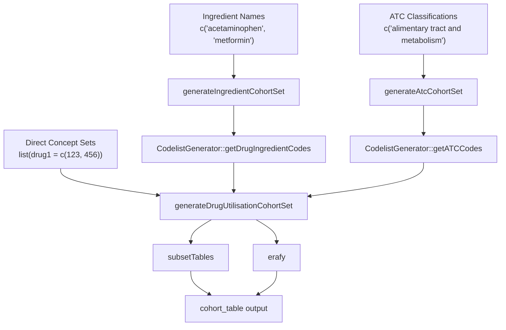
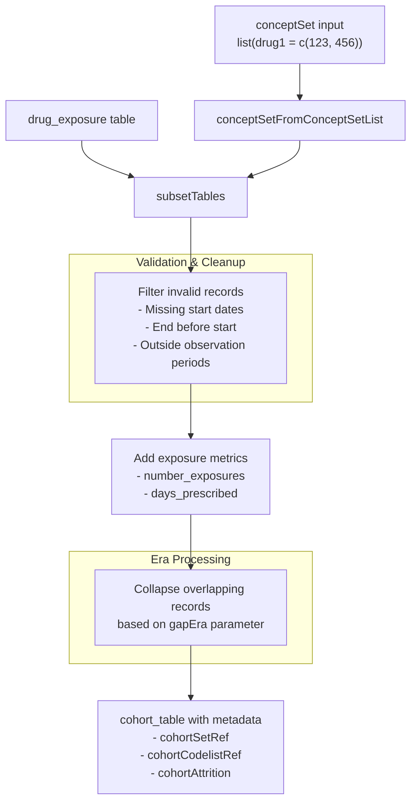
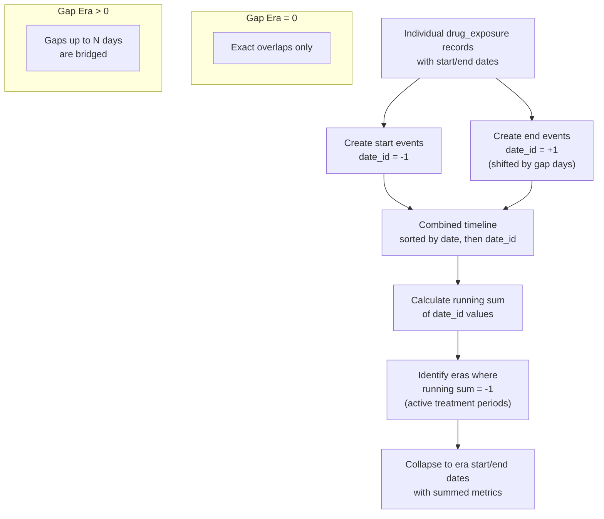

# Page: Cohort Generation

# Cohort Generation

<details>
<summary>Relevant source files</summary>

The following files were used as context for generating this wiki page:

- [R/cohortUtilities.R](R/cohortUtilities.R)
- [R/generateAtcCohortSet.R](R/generateAtcCohortSet.R)
- [R/generateDrugUtilisationCohortSet.R](R/generateDrugUtilisationCohortSet.R)
- [R/generateIngredientCohortSet.R](R/generateIngredientCohortSet.R)
- [man/generateAtcCohortSet.Rd](man/generateAtcCohortSet.Rd)
- [man/generateDrugUtilisationCohortSet.Rd](man/generateDrugUtilisationCohortSet.Rd)
- [man/generateIngredientCohortSet.Rd](man/generateIngredientCohortSet.Rd)
- [tests/testthat/test-generateDrugUtilisationCohortSet.R](tests/testthat/test-generateDrugUtilisationCohortSet.R)
- [tests/testthat/test-generatedAtcCohortSet.R](tests/testthat/test-generatedAtcCohortSet.R)
- [tests/testthat/test-generatedIngredientCohortSet.R](tests/testthat/test-generatedIngredientCohortSet.R)
- [tests/testthat/test-patterns.R](tests/testthat/test-patterns.R)
- [tests/testthat/test-plotProportionOfPatientsCovered.R](tests/testthat/test-plotProportionOfPatientsCovered.R)
- [tests/testthat/test-plots.R](tests/testthat/test-plots.R)

</details>


This document covers the cohort generation functions that create patient cohorts based on drug exposure records in the OMOP CDM. These functions form the foundation for all drug utilization analyses by identifying patients with exposure to specific drugs and defining their treatment periods.

For information about applying inclusion/exclusion criteria to existing cohorts, see [Cohort Filtering and Refinement](#4.2). For drug utilization analysis of generated cohorts, see [Drug Utilisation Analysis](#5).

## Overview

The DrugUtilisation package provides three main functions for generating drug cohorts, each tailored to different use cases:

| Function | Purpose | Input Type |
|----------|---------|------------|
| `generateDrugUtilisationCohortSet` | Core function using direct concept sets | Named list of concept IDs |
| `generateIngredientCohortSet` | Generate cohorts by drug ingredient names | Ingredient names (vector or named list) |
| `generateAtcCohortSet` | Generate cohorts by ATC classification | ATC class names |

All cohort generation functions create `cohort_table` objects with standardized columns and metadata, ensuring compatibility with downstream analysis functions.

## Function Hierarchy



Sources: [R/generateDrugUtilisationCohortSet.R:63-131](), [R/generateIngredientCohortSet.R:65-86](), [R/generateAtcCohortSet.R:58-79]()

## Core Generation Function

### generateDrugUtilisationCohortSet

The `generateDrugUtilisationCohortSet` function is the core cohort generation engine that all other functions ultimately call. It creates cohorts directly from concept sets representing drug concepts.

**Key Parameters:**
- `cdm`: CDM reference object
- `name`: Name for the new cohort table
- `conceptSet`: Named list where names become cohort names and values are concept ID vectors
- `gapEra`: Days between exposures to combine into single era (default: 1)
- `subsetCohort`/`subsetCohortId`: Optional subsetting to existing cohort
- `numberExposures`: Include count of exposure records (default: FALSE)
- `daysPrescribed`: Include total prescribed days (default: FALSE)

**Basic Usage:**
```r
conceptSet <- list(
  acetaminophen = c(1125360, 2905077),
  metformin = c(1503297, 1503328)
)

cdm <- generateDrugUtilisationCohortSet(
  cdm = cdm,
  name = "drug_cohorts", 
  conceptSet = conceptSet,
  gapEra = 30
)
```

Sources: [R/generateDrugUtilisationCohortSet.R:17-37](), [R/generateDrugUtilisationCohortSet.R:63-131]()

### Data Processing Pipeline



Sources: [R/generateDrugUtilisationCohortSet.R:85-131](), [R/cohortUtilities.R:26-145]()

## Specialized Wrapper Functions

### generateIngredientCohortSet

This function generates cohorts based on drug ingredient names, automatically retrieving all descendant concepts for each ingredient using `CodelistGenerator`.

**Input Formats:**
```r
# Vector input - creates separate cohort for each ingredient
ingredients <- c("acetaminophen", "metformin", "simvastatin")

# Named list input - creates combined cohorts 
ingredients <- list(
  "pain_medications" = c("acetaminophen", "ibuprofen"),
  "diabetes_drugs" = "metformin"
)
```

The function passes additional arguments to `CodelistGenerator::getDrugIngredientCodes()`, allowing customization of concept retrieval (dose units, routes, etc.).

Sources: [R/generateIngredientCohortSet.R:17-44](), [R/generateIngredientCohortSet.R:65-86]()

### generateAtcCohortSet  

This function generates cohorts based on Anatomical Therapeutic Chemical (ATC) classification names, using `CodelistGenerator::getATCCodes()` for concept retrieval.

**Usage:**
```r
cdm <- generateAtcCohortSet(
  cdm = cdm,
  atcName = "alimentary tract and metabolism",
  name = "atc_cohorts"
)
```

Sources: [R/generateAtcCohortSet.R:17-42](), [R/generateAtcCohortSet.R:58-79]()

## Gap Era Processing

The gap era mechanism is central to cohort generation, determining how overlapping or closely spaced drug exposures are combined into continuous treatment periods.

### Gap Era Logic



Sources: [R/cohortUtilities.R:183-234]()

### Gap Era Examples

| Gap Era | Behavior | Use Case |
|---------|----------|----------|
| 0 | Only exact overlaps combined | Distinct exposure episodes |
| 1 | Adjacent days combined | Continuous prescriptions |
| 30 | Gaps ≤30 days bridged | Treatment persistence |
| 365 | Annual treatment cycles | Chronic medications |

## Utility Functions

### subsetTables

The `subsetTables` function handles the core data processing:

1. **Drug Exposure Extraction**: Queries `drug_exposure` table for matching concepts
2. **Cohort Subsetting**: Optional filtering to existing cohort populations  
3. **Data Validation**: Removes records with invalid dates or outside observation periods
4. **Observation Period Alignment**: Clips cohort dates to observation period boundaries
5. **Initial Metrics**: Calculates exposure counts and prescribed days

Sources: [R/cohortUtilities.R:26-145]()

### Record Filtering

The function automatically handles common data quality issues:

- **Missing start dates**: Records dropped with informative message
- **End before start**: Invalid date sequences removed
- **Outside observation**: Records clipped to observation period boundaries  
- **Missing end dates**: Uses start date as end date with warning

Sources: [R/cohortUtilities.R:63-110](), [R/cohortUtilities.R:147-173]()

## Output Structure

All cohort generation functions produce `cohort_table` objects with:

**Standard Columns:**
- `cohort_definition_id`: Unique identifier for cohort type
- `subject_id`: Patient identifier  
- `cohort_start_date`: Treatment period start
- `cohort_end_date`: Treatment period end

**Optional Columns:**
- `number_exposures`: Count of drug exposure records in era
- `days_prescribed`: Total prescribed days in era

**Metadata:**
- `cohortSetRef`: Cohort definitions with gap era settings
- `cohortCodelistRef`: Concept mappings with codelist names
- `cohortAttrition`: Record of filtering steps applied

Sources: [R/generateDrugUtilisationCohortSet.R:92-128](), [tests/testthat/test-generateDrugUtilisationCohortSet.R:149-192]()