# Page: Cohort Management

# Cohort Management

Relevant source files

The following files were used as context for generating this wiki page:

- [R/cohortUtilities.R](R/cohortUtilities.R)
- [R/generateAtcCohortSet.R](R/generateAtcCohortSet.R)
- [R/generateDrugUtilisationCohortSet.R](R/generateDrugUtilisationCohortSet.R)
- [R/generateIngredientCohortSet.R](R/generateIngredientCohortSet.R)
- [man/generateAtcCohortSet.Rd](man/generateAtcCohortSet.Rd)
- [man/generateDrugUtilisationCohortSet.Rd](man/generateDrugUtilisationCohortSet.Rd)
- [man/generateIngredientCohortSet.Rd](man/generateIngredientCohortSet.Rd)
- [tests/testthat/test-generateDrugUtilisationCohortSet.R](tests/testthat/test-generateDrugUtilisationCohortSet.R)

This document covers the comprehensive cohort management system in DrugUtilisation, which serves as the foundation for all drug utilization analyses. Cohort management encompasses the generation, refinement, and processing of patient cohorts based on drug exposure records in the OMOP CDM.

For detailed documentation on specific cohort generation functions, see [Cohort Generation](#4.1). For information about applying inclusion/exclusion criteria and cohort refinement operations, see [Cohort Filtering and Refinement](#4.2).

## Overview

The cohort management system transforms raw OMOP drug exposure records into well-defined patient cohorts with standardized start and end dates, era-based grouping, and additional metrics. This system provides the foundation for all downstream analyses including drug utilization summaries, indication analysis, and treatment pattern studies.

## Core Cohort Generation Workflow

The cohort generation process follows a standardized workflow that processes drug exposure records through several key stages:

**Cohort Generation Workflow**

Sources: [R/generateDrugUtilisationCohortSet.R:63-131](), [R/cohortUtilities.R:26-145]()

The workflow begins with the `generateDrugUtilisationCohortSet()` function, which orchestrates the entire process through several key operations implemented in the utility functions.

## Core Data Processing Functions

The cohort generation system relies on several core functions that handle the transformation from raw drug exposure records to refined cohort tables:

**Core Function Architecture**

Sources: [R/cohortUtilities.R:17-234](), [R/generateDrugUtilisationCohortSet.R:63-131]()

### Data Extraction and Validation

The `subsetTables()` function handles the core data extraction and validation process. It performs several critical operations:

| Operation | Purpose | Implementation |
|-----------|---------|----------------|
| Concept Mapping | Links drug concepts to cohort definitions | [R/cohortUtilities.R:26-34]() |
| Record Extraction | Extracts relevant drug_exposure records | [R/cohortUtilities.R:37-44]() |
| Subset Filtering | Applies optional cohort-based filtering | [R/cohortUtilities.R:45-53]() |
| Data Validation | Checks for missing dates and invalid ranges | [R/cohortUtilities.R:65-110]() |
| Observation Period Alignment | Ensures records fall within observation periods | [R/cohortUtilities.R:78-108]() |

### Era-based Record Collapsing

The `erafy()` function implements the gap era logic that collapses overlapping or closely spaced drug exposure records into continuous treatment episodes:

```mermaid
graph TB
    subgraph "Input Records"
        R1["Record 1<br/>Start: 2020-01-01<br/>End: 2020-01-30"]
        R2["Record 2<br/>Start: 2020-02-05<br/>End: 2020-02-15"] 
        R3["Record 3<br/>Start: 2020-03-01<br/>End: 2020-03-20"]
    end
    
    subgraph "Gap Era Processing"
        GAP["gapEra = 7 days<br/>Collapse if gap ≤ 7"]
    end
    
    subgraph "Output Eras"
        E1["Era 1<br/>Start: 2020-01-01<br/>End: 2020-02-15<br/>number_exposures: 2"]
        E2["Era 2<br/>Start: 2020-03-01<br/>End: 2020-03-20<br/>number_exposures: 1"]
    end
    
    R1 --> GAP
    R2 --> GAP
    R3 --> GAP
    GAP --> E1
    GAP --> E2
```

Sources: [R/cohortUtilities.R:183-234]()

## Specialized Cohort Generation Functions

The system provides several specialized wrapper functions that simplify cohort generation for common use cases:

### Function Hierarchy

Sources: [R/generateIngredientCohortSet.R:65-86](), [R/generateAtcCohortSet.R:58-79](), [R/generateIngredientCohortSet.R:112-172]()

### Integration with CodelistGenerator

The specialized functions integrate with the CodelistGenerator package to automatically retrieve concept sets:

| Function | CodelistGenerator Integration | Purpose |
|----------|------------------------------|---------|
| `generateIngredientCohortSet()` | `getDrugIngredientCodes()` | Generate cohorts based on drug ingredients |
| `generateAtcCohortSet()` | `getATCCodes()` | Generate cohorts based on ATC classifications |

Sources: [R/generateIngredientCohortSet.R:123-124](), [R/generateAtcCohortSet.R:37]()

## Cohort Table Structure and Metadata

Generated cohort tables follow the OMOP cohort table standard with additional metadata and optional computed columns:

### Standard Cohort Columns

| Column | Type | Description |
|--------|------|-------------|
| `cohort_definition_id` | Integer | Unique identifier for cohort definition |
| `subject_id` | Integer | Patient identifier (person_id) |
| `cohort_start_date` | Date | Episode start date |
| `cohort_end_date` | Date | Episode end date |

### Optional Computed Columns

| Column | Purpose | Controlled By |
|--------|---------|---------------|
| `number_exposures` | Count of original drug exposures in each era | `numberExposures` parameter |
| `days_prescribed` | Total days prescribed within each era | `daysPrescribed` parameter |

Sources: [R/generateDrugUtilisationCohortSet.R:69-70](), [R/generateDrugUtilisationCohortSet.R:107-128]()

### Cohort Metadata Structure

Sources: [R/generateDrugUtilisationCohortSet.R:85-105](), [R/generateIngredientCohortSet.R:161-169]()

## Parameter Configuration

The cohort generation system supports several key parameters that control the generation process:

### Core Parameters

| Parameter | Default | Purpose | Example |
|-----------|---------|---------|---------|
| `gapEra` | 1 | Days between exposures to consider same era | `gapEra = 30` |
| `subsetCohort` | NULL | Existing cohort table to subset patients | `subsetCohort = "diabetes_patients"` |
| `subsetCohortId` | NULL | Specific cohort IDs to include | `subsetCohortId = c(1, 3)` |
| `numberExposures` | FALSE | Include exposure count in output | `numberExposures = TRUE` |
| `daysPrescribed` | FALSE | Include prescribed days in output | `daysPrescribed = TRUE` |

Sources: [R/generateDrugUtilisationCohortSet.R:63-70]()

### Gap Era Retrieval

The system provides functionality to retrieve the gap era used for specific cohorts through the `cohortGapEra()` function:

Sources: [R/generateDrugUtilisationCohortSet.R:161-183]()

## Integration with Analysis Pipeline

The cohort management system serves as the foundation for all downstream analyses in the DrugUtilisation package:

**Analysis Pipeline Integration**

Sources: Based on overall package architecture and the high-level system diagrams provided

The cohort tables generated by this system serve as the primary input for all analysis functions, ensuring consistent patient identification and episode definition across different types of drug utilization studies.