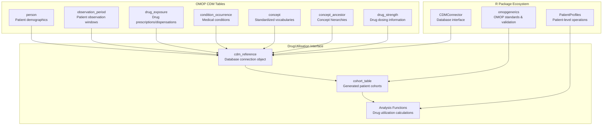
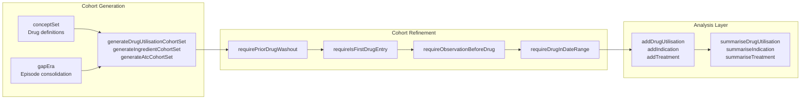
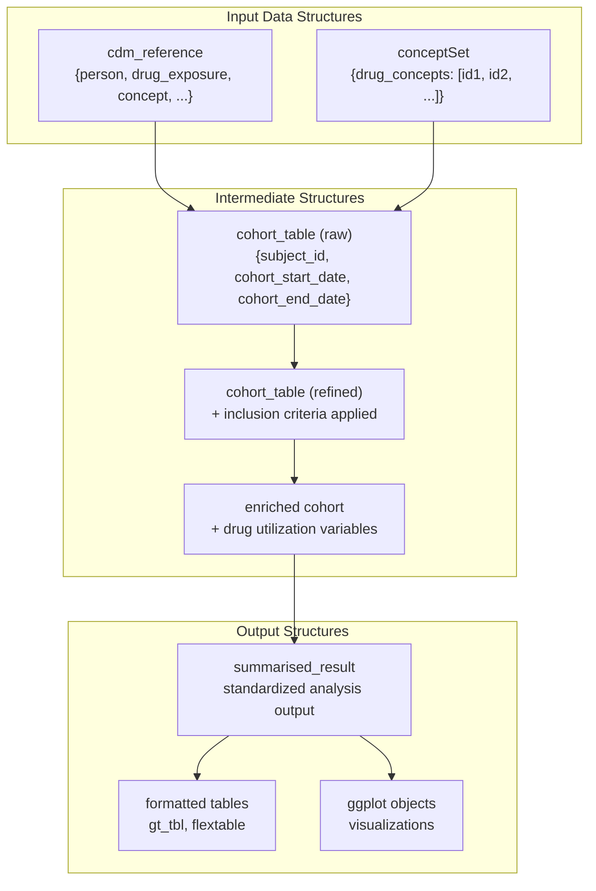
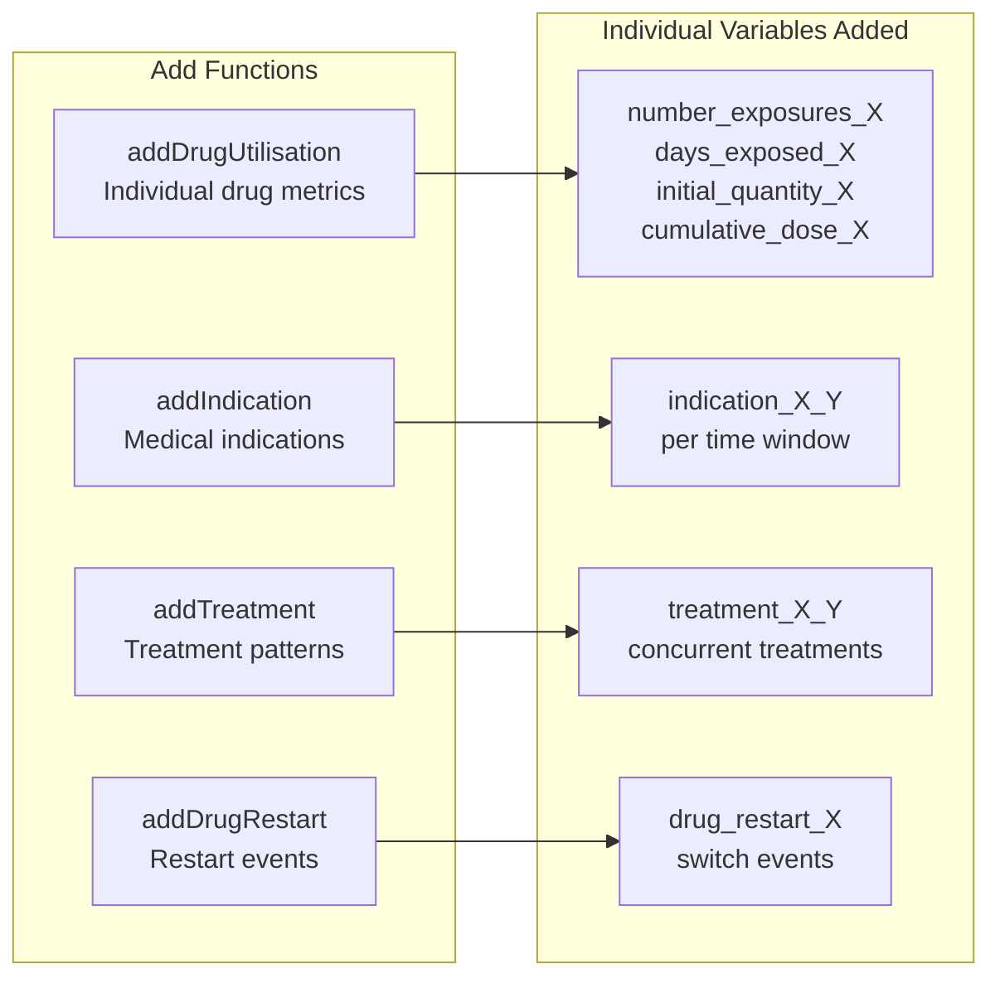
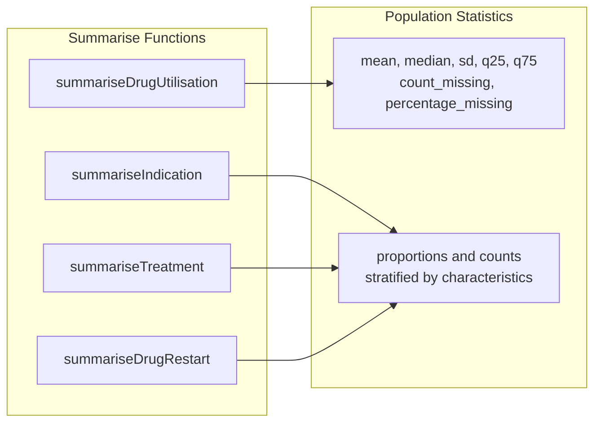
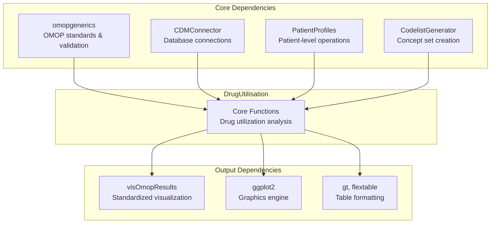

# Page: Core Concepts

# Core Concepts

Relevant source files

The following files were used as context for generating this wiki page:

- [.Rbuildignore](.Rbuildignore)
- [CRAN-SUBMISSION](CRAN-SUBMISSION)
- [DESCRIPTION](DESCRIPTION)
- [NAMESPACE](NAMESPACE)
- [NEWS.md](NEWS.md)
- [R/summariseDrugUtilisation.R](R/summariseDrugUtilisation.R)
- [_pkgdown.yml](_pkgdown.yml)
- [cran-comments.md](cran-comments.md)
- [inst/CITATION](inst/CITATION)
- [man/DrugUtilisation-package.Rd](man/DrugUtilisation-package.Rd)
- [man/reexports.Rd](man/reexports.Rd)
- [vignettes/.gitignore](vignettes/.gitignore)
- [vignettes/create_cohorts.Rmd](vignettes/create_cohorts.Rmd)
- [vignettes/mock_data.Rmd](vignettes/mock_data.Rmd)

This document explains the fundamental concepts and architectural patterns that underlie the DrugUtilisation package. It covers the OMOP CDM integration model, cohort-centric analysis approach, core data structures, and key terminology used throughout the package.

For specific guidance on cohort creation and management, see [Cohort Management](#4). For details on analysis functions and outputs, see [Drug Utilisation Analysis](#5) and [Output and Visualization](#8).

## OMOP CDM Foundation

The DrugUtilisation package is built around the **Observational Medical Outcomes Partnership (OMOP) Common Data Model**. All functionality assumes data is structured according to OMOP CDM specifications, with the package providing a high-level interface for drug utilization research.

The package operates on `cdm_reference` objects that provide access to OMOP CDM tables through database connections. All analysis begins with these standardized data structures.

**Sources:** [DESCRIPTION:1-93](), [vignettes/create_cohorts.Rmd:37-49]()

## Cohort-Centric Analysis Model

The core analytical paradigm is **cohort-centric**: all drug utilization analysis begins with defining patient cohorts that represent specific study populations. Cohorts are then refined through inclusion criteria and analyzed for drug utilization patterns.

### Key Cohort Concepts

- **conceptSet**: Defines which drug concepts to include using concept IDs, ATC codes, or ingredient names
- **gapEra**: Specifies maximum gap (in days) between drug exposures before treating them as separate episodes
- **cohort_table**: Standard OMOP cohort structure with `subject_id`, `cohort_start_date`, `cohort_end_date`

**Sources:** [vignettes/create_cohorts.Rmd:52-57](), [vignettes/create_cohorts.Rmd:108-221](), [NAMESPACE:26-28]()

## Core Data Structures

The package works with several key data structures that flow through the analysis pipeline:

### Primary Data Objects

| Structure | Purpose | Key Attributes |
|-----------|---------|----------------|
| `cdm_reference` | Database connection to OMOP CDM | Contains all OMOP tables |
| `cohort_table` | Patient cohorts with OMOP validation | `subject_id`, `cohort_start_date`, `cohort_end_date` |
| `conceptSet` | Drug concept definitions | Named list of concept IDs or expressions |
| `summarised_result` | Standardized analysis output | Results from all `summarise*` functions |

### Cohort Attributes

All cohort objects maintain standardized attributes accessible through `omopgenerics` functions:

- `settings()`: Parameters used in cohort generation
- `cohortCount()`: Number of subjects and records per cohort
- `attrition()`: Detailed inclusion/exclusion criteria tracking
- `cohortCodelist()`: Concept sets used for each cohort definition

**Sources:** [vignettes/create_cohorts.Rmd:267-273](), [man/reexports.Rd:6-18](), [R/summariseDrugUtilisation.R:102-112]()

## Analysis Patterns

The package implements a consistent **two-phase analysis pattern** across all functionality:

### Phase 1: Add Functions (Patient-Level)
Functions that add variables to individual patient records in cohorts:

### Phase 2: Summarise Functions (Population-Level)
Functions that aggregate patient-level data into population summaries:

All `summarise*` functions return standardized `summarised_result` objects that can be processed by table and plot generation functions.

**Sources:** [NAMESPACE:3-16](), [NAMESPACE:46-58](), [R/summariseDrugUtilisation.R:51-73]()

## Function Naming Conventions

The package follows consistent naming patterns that reflect functionality:

| Pattern | Purpose | Examples |
|---------|---------|----------|
| `generate*` | Create new cohorts | `generateDrugUtilisationCohortSet`, `generateIngredientCohortSet` |
| `require*` | Apply inclusion criteria | `requirePriorDrugWashout`, `requireIsFirstDrugEntry` |
| `add*` | Add patient-level variables | `addDrugUtilisation`, `addIndication` |
| `summarise*` | Create population summaries | `summariseDrugUtilisation`, `summariseIndication` |
| `table*` | Generate formatted tables | `tableDrugUtilisation`, `tableIndication` |
| `plot*` | Create visualizations | `plotDrugUtilisation`, `plotIndication` |

**Sources:** [NAMESPACE:26-58](), [_pkgdown.yml:19-92]()

## Package Ecosystem Integration

DrugUtilisation integrates deeply with the **DARWIN EU ecosystem** of R packages for OMOP CDM analysis:

### Key Integration Points

- **omopgenerics**: Provides `cohort_table` validation, `summarised_result` standards, and utility functions
- **CDMConnector**: Enables database connections and OMOP CDM table access
- **PatientProfiles**: Supplies patient-level data manipulation functions
- **CodelistGenerator**: Creates concept sets from ATC codes, ingredient names, and hierarchies
- **visOmopResults**: Handles standardized visualization of analysis results

**Sources:** [DESCRIPTION:73-85](), [NAMESPACE:60-78]()

## Key Terminology

| Term | Definition |
|------|------------|
| **Episode/Era** | Drug exposures collapsed by `gapEra` parameter to represent treatment periods |
| **Incident Use** | First drug exposure after washout period (new users) |
| **Prevalent Use** | Any drug exposure regardless of prior history |
| **Index Date** | Reference date for analysis, typically `cohort_start_date` |
| **Censor Date** | End date for follow-up, typically `cohort_end_date` |
| **Concept Set** | Collection of OMOP concept IDs defining drugs of interest |
| **Washout Period** | Required time without drug exposure before incident use |

**Sources:** [vignettes/create_cohorts.Rmd:108-221](), [R/summariseDrugUtilisation.R:28-31]()