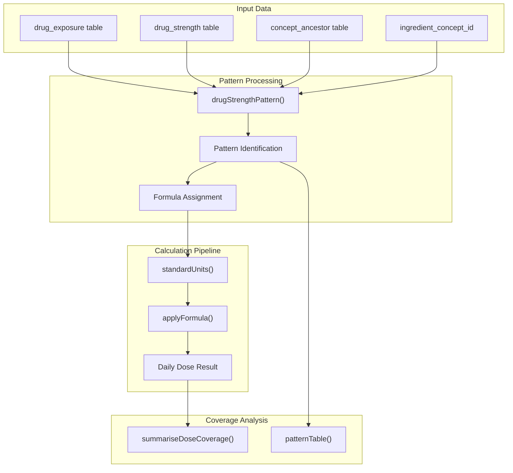
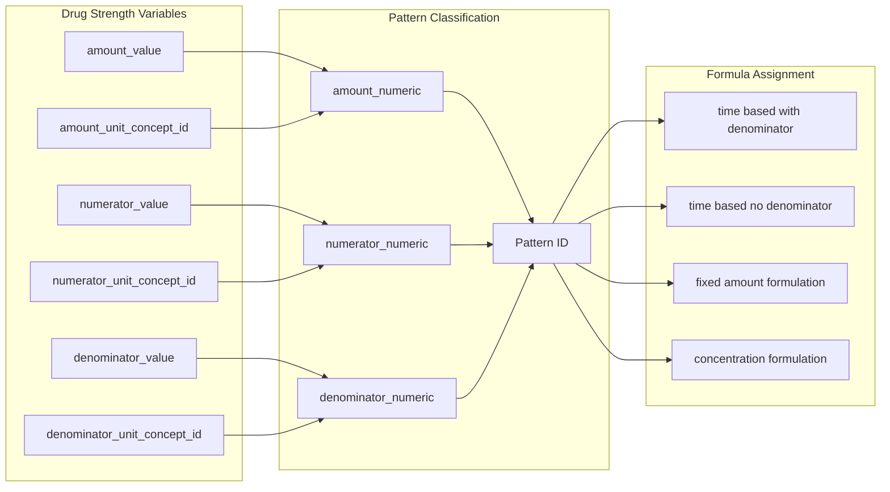
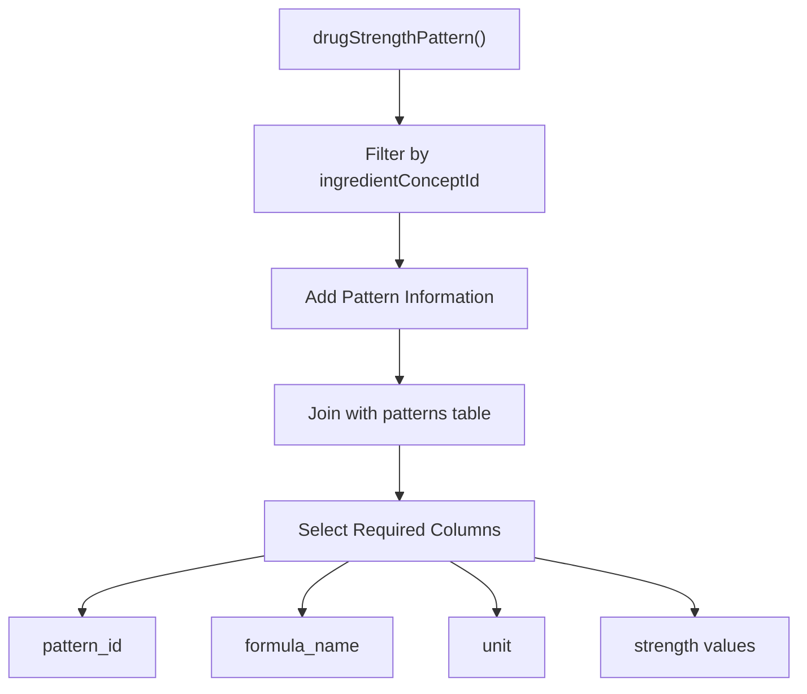
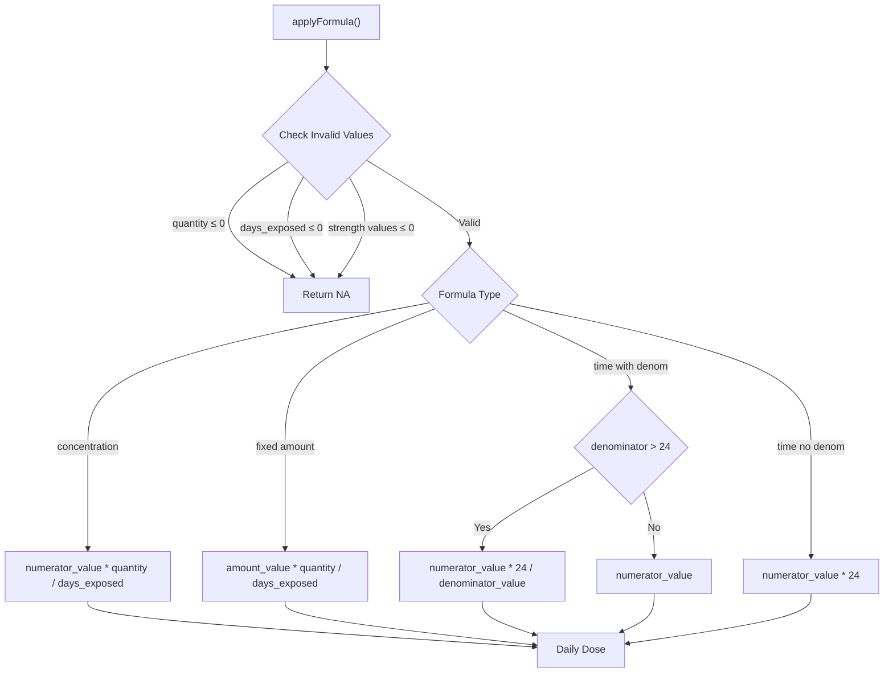
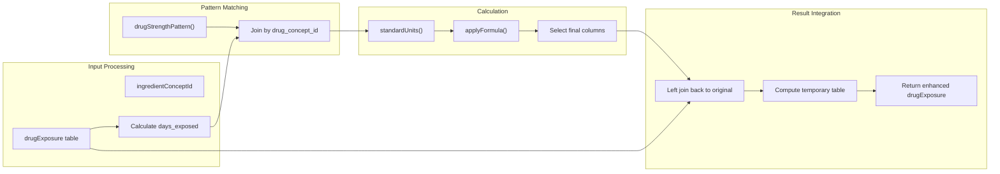
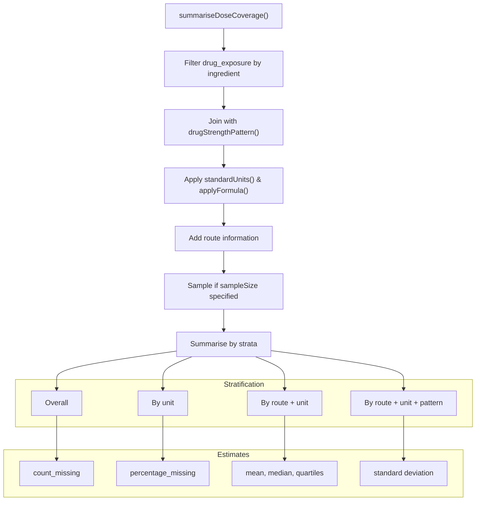
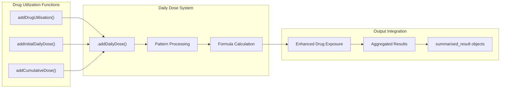

# Page: Daily Dose Calculation

# Daily Dose Calculation

Relevant source files

The following files were used as context for generating this wiki page:

- [R/dailyDose.R](R/dailyDose.R)
- [R/pattern.R](R/pattern.R)
- [R/sysdata.rda](R/sysdata.rda)
- [data-raw/internalData.R](data-raw/internalData.R)
- [extras/addInternalData.R](extras/addInternalData.R)
- [inst/pattern_assessment_for_dose_final.csv](inst/pattern_assessment_for_dose_final.csv)
- [man/patternTable.Rd](man/patternTable.Rd)
- [tests/testthat/test-dailyDose.R](tests/testthat/test-dailyDose.R)
- [vignettes/daily_dose_calculation.Rmd](vignettes/daily_dose_calculation.Rmd)
- [vignettes/drug_utilisation.Rmd](vignettes/drug_utilisation.Rmd)
- [vignettes/summarise_treatments.Rmd](vignettes/summarise_treatments.Rmd)

This section covers the comprehensive daily dose calculation system in the DrugUtilisation package. The system calculates standardized daily doses for drug ingredients using OMOP CDM drug strength patterns and formula-based approaches. For drug utilization analysis that incorporates daily dose, see [Drug Utilisation Analysis](#5). For general cohort management, see [Cohort Management](#4).

## System Overview

The daily dose calculation system operates at the ingredient level, transforming OMOP CDM drug exposure records into standardized daily dose measurements. The system uses a pattern-matching approach to identify appropriate calculation formulas based on drug strength table characteristics.

**Daily Dose Calculation Flow**

Sources: [R/dailyDose.R:17-61](), [R/pattern.R:18-88](), [vignettes/daily_dose_calculation.Rmd:23-142]()

## Pattern-Based Formula Selection

The system identifies 128 distinct patterns from combinations of six drug strength variables, with 41 viable patterns covering 84% of drug-ingredient relationships. These patterns map to four calculation formulas.

**Pattern to Formula Mapping Process**

| Pattern Type | Coverage | Formula | Key Variables |
|--------------|----------|---------|---------------|
| Time based with denominator | 8,044 (<1%) | `24 * numerator / denominator` (if >24h) or `numerator` (if ≤24h) | numerator_value, denominator_value |
| Time based no denominator | 5,611 (<1%) | `24 * numerator` | numerator_value |
| Fixed amount formulation | 1,102,435 (37%) | `quantity * amount / days_exposed` | amount_value, quantity |
| Concentration formulation | 1,398,518 (47%) | `quantity * numerator / days_exposed` | numerator_value, quantity |

Sources: [R/pattern.R:40-58](), [data-raw/internalData.R:94-99](), [inst/pattern_assessment_for_dose_final.csv:1-43]()

## Core Calculation Functions

### Pattern Identification

The `drugStrengthPattern()` function creates the foundation for dose calculations by linking drug concepts to their strength patterns and assigned formulas.

**Pattern Identification Process**

Sources: [R/pattern.R:18-88]()

### Unit Standardization

The `standardUnits()` function converts units to standard forms before formula application:

- Milligrams (9655) → Grams (÷1000)
- Liters (8519) → Milliliters (×1000)  
- Mega-international units (9439) → International units (÷1,000,000)

Sources: [R/dailyDose.R:182-202]()

### Formula Application

The `applyFormula()` function implements the four calculation formulas with comprehensive validation:

**Formula Application Logic**

Sources: [R/dailyDose.R:203-232]()

## Implementation Architecture

### Main Daily Dose Addition

The `.addDailyDose()` function integrates all components to add daily dose information to drug exposure data:

**Daily Dose Addition Workflow**

Sources: [R/dailyDose.R:17-61]()

### Pattern Analysis Functions

The system provides analysis tools for understanding pattern coverage:

| Function | Purpose | Key Output |
|----------|---------|------------|
| `patternTable()` | Analyze CDM pattern distribution | Pattern counts, validity assessment |
| `summariseDoseCoverage()` | Coverage statistics by ingredient | Missing dose rates, dose distributions |

Sources: [R/pattern.R:126-192](), [R/dailyDose.R:86-180]()

## Coverage Analysis System

### Dose Coverage Assessment

The `summariseDoseCoverage()` function provides comprehensive analysis of daily dose calculation coverage:

**Coverage Analysis Workflow**

The analysis includes route information through the `.addRoute()` function, which maps drug concepts to administration routes via dose form relationships.

Sources: [R/dailyDose.R:86-180](), [R/pattern.R:90-106]()

## Integration with Drug Utilization

Daily dose calculation integrates seamlessly with the broader drug utilization analysis system:

**Integration with Drug Utilization Analysis**

The daily dose system supports both patient-level dose addition and aggregate dose summarization within the broader drug utilization framework. Daily dose calculations feed into comprehensive drug utilization metrics including initial doses, cumulative doses, and dose-based treatment characterization.

Sources: [R/dailyDose.R:17-61](), [vignettes/drug_utilisation.Rmd:134-139]()