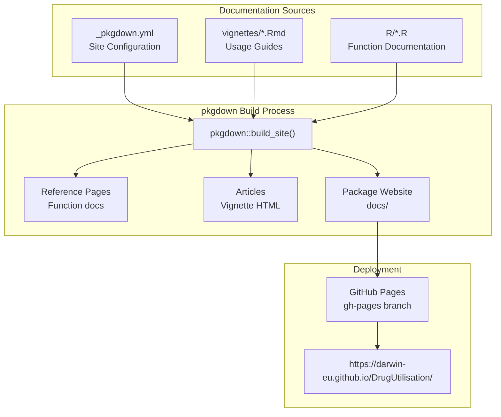
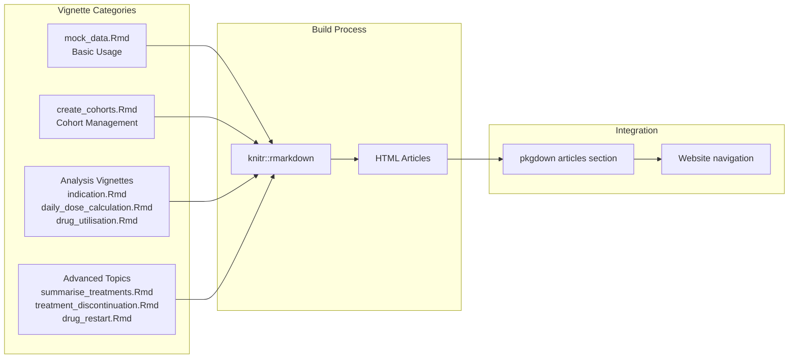
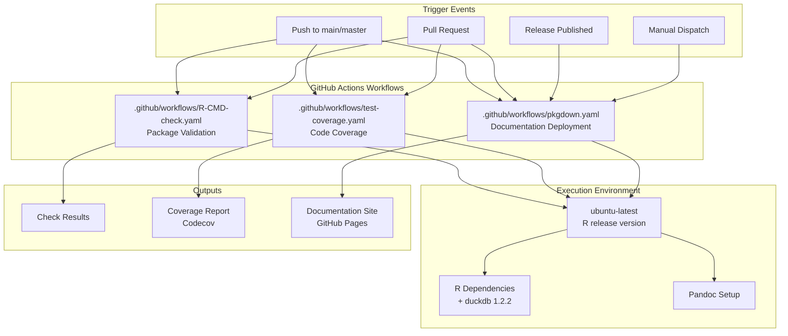
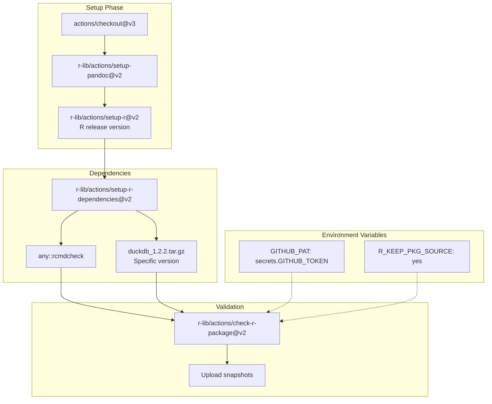
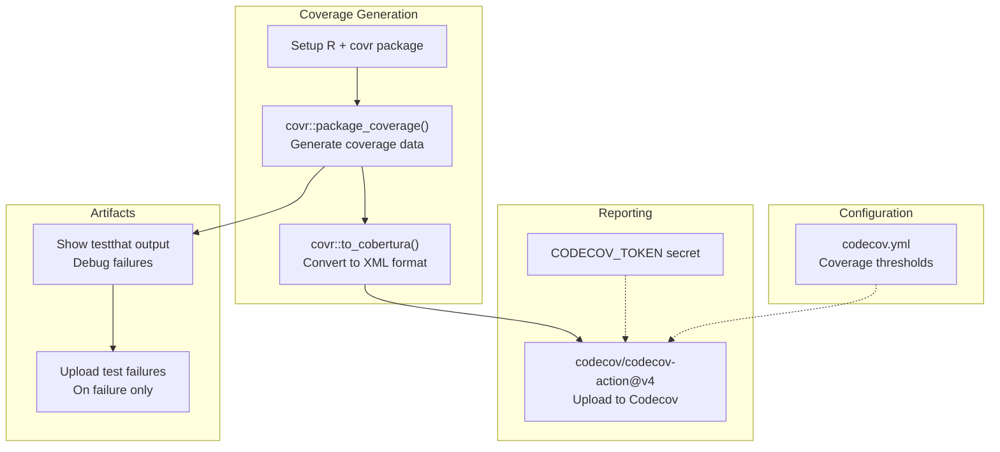
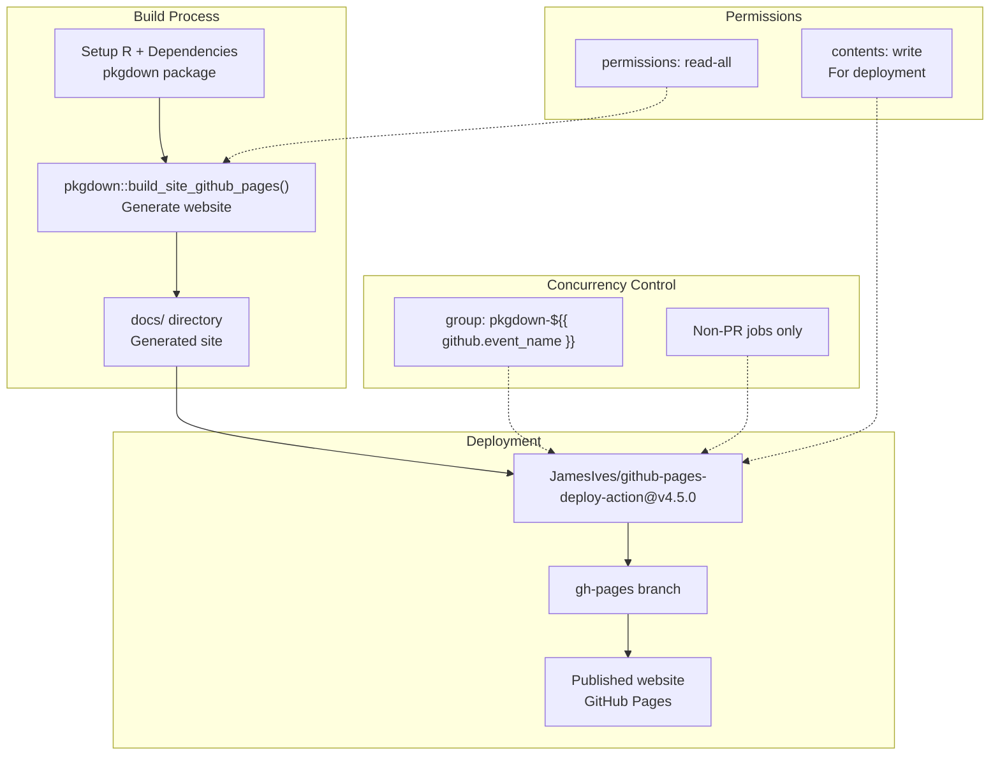
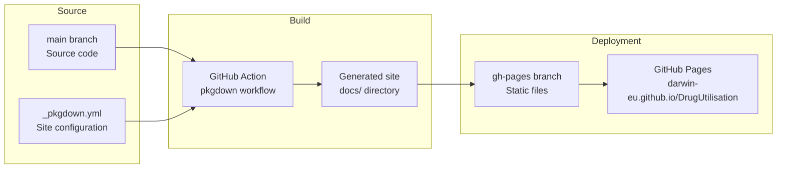

# Page: Documentation and CI/CD

# Documentation and CI/CD

<details>
<summary>Relevant source files</summary>

The following files were used as context for generating this wiki page:

- [.Rbuildignore](.Rbuildignore)
- [.github/.gitignore](.github/.gitignore)
- [.github/workflows/R-CMD-check.yaml](.github/workflows/R-CMD-check.yaml)
- [.github/workflows/pkgdown.yaml](.github/workflows/pkgdown.yaml)
- [.github/workflows/test-coverage.yaml](.github/workflows/test-coverage.yaml)
- [_pkgdown.yml](_pkgdown.yml)
- [codecov.yml](codecov.yml)
- [vignettes/.gitignore](vignettes/.gitignore)
- [vignettes/create_cohorts.Rmd](vignettes/create_cohorts.Rmd)
- [vignettes/mock_data.Rmd](vignettes/mock_data.Rmd)

</details>


This page documents the documentation generation system and continuous integration/continuous deployment (CI/CD) pipeline for the DrugUtilisation package. This covers the automated processes for building package documentation, running tests, checking code quality, and deploying the package website.

For information about the testing framework and mock data generation, see [Testing and Mock Data](#9.2). For details about the package's public API and exported functions, see [Function Exports and API](#9.1).

## Documentation System

The DrugUtilisation package uses a comprehensive documentation system built around `pkgdown` for website generation and R Markdown vignettes for detailed usage guides.

### pkgdown Configuration

The package website is configured through `_pkgdown.yml`, which defines the site structure, reference organization, and vignette grouping:



The site configuration organizes functions into logical groups and defines the vignette structure. Key organizational elements include:

| Section | Purpose | Functions |
|---------|---------|-----------|
| Generate drug cohorts | Cohort creation functions | `generateDrugUtilisationCohortSet`, `generateIngredientCohortSet` |
| Apply inclusion criteria | Cohort filtering functions | `requirePriorDrugWashout`, `requireIsFirstDrugEntry` |
| Drug use functions | Core analysis functions | `addDrugUtilisation`, `summariseDrugUtilisation` |
| Individual drug functions | Specific metric functions | `addNumberExposures`, `addDaysExposed` |

Sources: [_pkgdown.yml:1-93]()

### Vignette System

The package includes comprehensive vignettes that demonstrate package functionality:



Each vignette follows a consistent structure with YAML headers specifying metadata for both R Markdown processing and pkgdown integration.

Sources: [vignettes/create_cohorts.Rmd:1-12](), [vignettes/mock_data.Rmd:1-8](), [_pkgdown.yml:5-16]()

## CI/CD Pipeline

The package uses GitHub Actions for automated testing, documentation building, and deployment through three main workflows.

### Workflow Architecture



Sources: [.github/workflows/R-CMD-check.yaml:3-7](), [.github/workflows/test-coverage.yaml:3-7](), [.github/workflows/pkgdown.yaml:3-9]()

### R Package Check Workflow

The `R-CMD-check.yaml` workflow performs comprehensive package validation:



The workflow runs on Ubuntu with the R release version and includes a specific version of duckdb for consistent database testing.

Sources: [.github/workflows/R-CMD-check.yaml:11-48]()

### Test Coverage Workflow

The `test-coverage.yaml` workflow generates and reports code coverage metrics:



The coverage workflow includes artifact collection for debugging test failures and uploads results to Codecov for tracking coverage over time.

Sources: [.github/workflows/test-coverage.yaml:19-65](), [codecov.yml:1-15]()

### Documentation Deployment Workflow

The `pkgdown.yaml` workflow builds and deploys the package website:



The deployment only occurs for non-pull request events to prevent unauthorized deployments while still allowing testing of documentation builds.

Sources: [.github/workflows/pkgdown.yaml:15-49]()

## Build Configuration

### Package Build Settings

The `.Rbuildignore` file excludes development and documentation files from the package build:

| Pattern | Purpose |
|---------|---------|
| `^\.github$` | Exclude GitHub Actions workflows |
| `^_pkgdown\.yml$` | Exclude pkgdown configuration |
| `^docs$`, `^pkgdown$` | Exclude generated documentation |
| `^vignettes/.*\.Rmd$` | Exclude specific vignettes from build |
| `^extras/` | Exclude development scripts |

Sources: [.Rbuildignore:1-22]()

### Coverage Configuration

The `codecov.yml` file configures coverage reporting thresholds:

```yaml
coverage:
  status:
    project:
      target: auto
      threshold: 1%
      informational: true
    patch:
      target: auto  
      threshold: 1%
      informational: true
```

Both project and patch coverage use automatic targets with 1% thresholds set to informational mode, allowing flexibility while maintaining visibility into coverage trends.

Sources: [codecov.yml:3-15]()

## Deployment Process

### Website Publishing

The documentation website follows this deployment flow:



The site is automatically updated on pushes to main and releases, ensuring documentation stays current with code changes.

### Integration Points

The CI/CD system integrates with several external services:

| Service | Purpose | Configuration |
|---------|---------|---------------|
| GitHub Pages | Website hosting | Automatic deployment from gh-pages branch |
| Codecov | Coverage reporting | Token-based authentication via secrets |
| CRAN | Package repository | R-CMD-check validation for submission |
| R-universe | Development builds | Automatic from GitHub releases |

Sources: [_pkgdown.yml:1](), [.github/workflows/pkgdown.yaml:43-49](), [.github/workflows/test-coverage.yaml:44-50]()