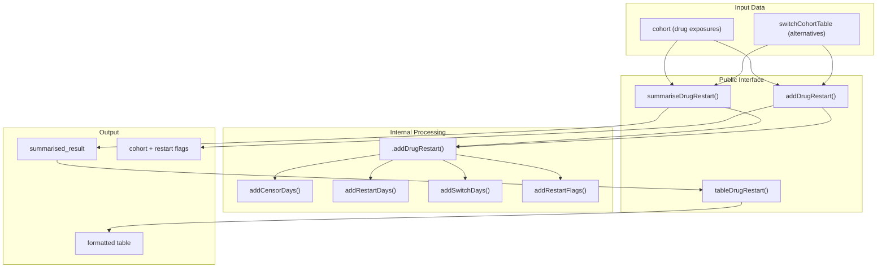
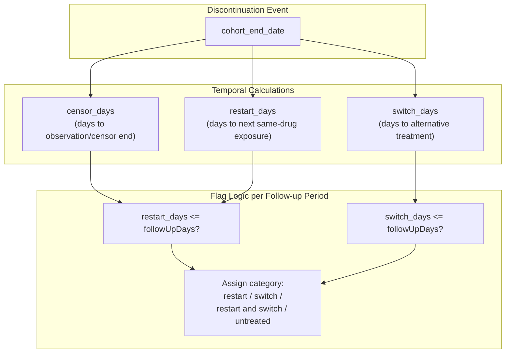
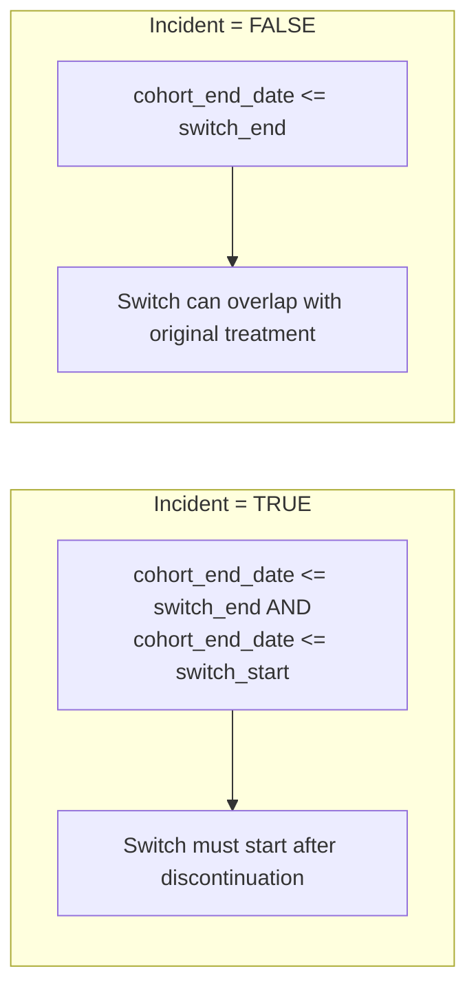

# Page: Drug Restart Analysis

# Drug Restart Analysis

<details>
<summary>Relevant source files</summary>

The following files were used as context for generating this wiki page:

- [R/documentationHelpers.R](R/documentationHelpers.R)
- [R/summariseDrugRestart.R](R/summariseDrugRestart.R)
- [R/summariseIntersect.R](R/summariseIntersect.R)
- [man/summariseDrugRestart.Rd](man/summariseDrugRestart.Rd)
- [man/tableDoc.Rd](man/tableDoc.Rd)
- [man/tableProportionOfPatientsCovered.Rd](man/tableProportionOfPatientsCovered.Rd)
- [tests/testthat/test-summariseDrugRestart.R](tests/testthat/test-summariseDrugRestart.R)
- [tests/testthat/test-tables.R](tests/testthat/test-tables.R)

</details>


## Purpose and Scope

The Drug Restart Analysis system analyzes patterns of drug discontinuation, restart, and treatment switching in patient cohorts. It tracks what happens to patients after they discontinue a drug treatment within specified follow-up periods, categorizing outcomes as restart (same drug), switch (alternative treatment), both, or untreated.

For general drug utilization metrics, see [Drug Utilisation Analysis](#5). For treatment pattern analysis without restart focus, see [Treatment Analysis](#6.2).

## Core Concepts

Drug restart analysis operates on the concept of **discontinuation events** - when a patient's drug exposure ends. The system then tracks subsequent events within defined follow-up windows:

| Outcome Category | Description |
|------------------|-------------|
| **Restart** | Patient restarts the same drug from the original cohort |
| **Switch** | Patient starts an alternative treatment from the switch cohort table |
| **Restart and Switch** | Both restart and switch occur within the follow-up period |
| **Untreated** | Neither restart nor switch occurs within the follow-up period |

**Key temporal concepts:**
- **Follow-up periods**: Time windows after discontinuation to track events (e.g., 30, 90, 365 days, or infinite)
- **Incident requirement**: Whether switch treatments must start after discontinuation (`incident = TRUE`) or can overlap with the original treatment
- **Censoring**: Limiting analysis to specific dates (e.g., end of observation period)

Sources: [R/summariseDrugRestart.R:17-36](), [tests/testthat/test-summariseDrugRestart.R:53-84]()

## Function Architecture

### Core Function Relationships



Sources: [R/summariseDrugRestart.R:56-212](), [R/summariseDrugRestart.R:248-281](), [R/summariseDrugRestart.R:283-328]()

### Analysis Processing Pipeline

```mermaid
graph LR
    subgraph "Input Validation"
        validateCohort["validateCohort()"]
        validateParams["Parameter validation"]
    end
    
    subgraph "Temporal Calculations" 
        calcCensorDays["Calculate censor_days"]
        calcRestartDays["Calculate restart_days"]
        calcSwitchDays["Calculate switch_days"]
    end
    
    subgraph "Flag Generation"
        generateFlags["Generate restart flags per follow-up period"]
    end
    
    subgraph "Summarization"
        filterFirst["Filter to first discontinuation (optional)"]
        applyCensor["Apply censoring rules"]
        summariseResult["PatientProfiles::summariseResult()"]
    end
    
    rawCohort["Raw Cohort"] --> validateCohort
    validateCohort --> calcCensorDays
    calcCensorDays --> calcRestartDays
    calcRestartDays --> calcSwitchDays
    calcSwitchDays --> generateFlags
    generateFlags --> filterFirst
    filterFirst --> applyCensor
    applyCensor --> summariseResult
    summariseResult --> finalResult["summarised_result"]
```



Sources: [R/summariseDrugRestart.R:86-97](), [R/summariseDrugRestart.R:330-451]()

## Key Parameters and Configuration

### Essential Parameters

| Parameter | Type | Description |
|-----------|------|-------------|
| `cohort` | `cohort_table` | Source cohort containing drug exposures to analyze |
| `switchCohortTable` | `character` | Name of cohort table containing alternative treatments |
| `followUpDays` | `numeric vector` | Follow-up periods in days (can include `Inf` for unlimited) |

### Control Parameters

| Parameter | Default | Impact |
|-----------|---------|---------|
| `incident` | `TRUE` | `TRUE`: Switch must start after discontinuation<br>`FALSE`: Switch can overlap with original treatment |
| `restrictToFirstDiscontinuation` | `TRUE` | `TRUE`: Only consider first discontinuation per patient<br>`FALSE`: Include all discontinuation episodes |
| `censorDate` | `NULL` | Column name for custom censoring date (defaults to observation end) |
| `switchCohortId` | `NULL` | Specific cohort IDs from switch table (defaults to all) |

Sources: [R/summariseDrugRestart.R:56-64](), [man/summariseDrugRestart.Rd:6-46]()

## Data Processing Logic

### Temporal Window Calculations

The system calculates three key temporal measures for each discontinuation event:



Sources: [R/summariseDrugRestart.R:330-451](), [R/summariseDrugRestart.R:436-451]()

### Incident vs Non-Incident Switch Logic

The `incident` parameter controls how switch treatments are identified:



Sources: [R/summariseDrugRestart.R:412-419]()

## Output Structure

### Summarised Result Format

The `summariseDrugRestart()` function returns a `summarised_result` object with the following structure:

| Column | Description |
|--------|-------------|
| `group_level` | Cohort name from original cohort |
| `variable_name` | Follow-up period description (e.g., "Drug restart in 100 days") |
| `variable_level` | Outcome category: "restart", "switch", "restart and switch", "untreated" |
| `estimate_name` | "count" or "percentage" |
| `estimate_value` | Numeric value for the estimate |

### Settings Metadata

The result includes settings documenting the analysis parameters:

| Setting | Description |
|---------|-------------|
| `result_type` | "summarise_drug_restart" |
| `switch_cohort_table` | Name of the switch cohort table used |
| `incident` | Whether incident requirement was applied |
| `restrict_to_first_discontinuation` | Whether restricted to first discontinuation |
| `censor_date` | Censoring approach used |

Sources: [R/summariseDrugRestart.R:194-207](), [tests/testthat/test-summariseDrugRestart.R:58-76]()

## Usage Examples

### Basic Drug Restart Analysis

```r
# Generate switch cohort containing alternative treatments
conceptlist <- list(acetaminophen = 1125360, metformin = c(1503297, 1503327))
cdm <- generateDrugUtilisationCohortSet(
  cdm = cdm,
  name = "switch_cohort", 
  conceptSet = conceptlist
)

# Analyze drug restart patterns
result <- cdm$cohort1 |>
  summariseDrugRestart(
    switchCohortTable = "switch_cohort",
    followUpDays = c(30, 90, 365, Inf)
  )
```

### Advanced Configuration with Stratification

```r
# With demographic stratification and custom settings
result <- cdm$drug_cohort |>
  PatientProfiles::addDemographics(
    ageGroup = list(c(0, 50), c(51, 100))
  ) |>
  summariseDrugRestart(
    switchCohortTable = "alternatives",
    switchCohortId = c(1, 2),  # Only specific alternatives
    followUpDays = c(100, 300),
    strata = list("age_group", "sex"),
    incident = FALSE,  # Allow overlapping switches
    restrictToFirstDiscontinuation = FALSE,  # All episodes
    censorDate = "study_end_date"
  )
```

Sources: [man/summariseDrugRestart.Rd:54-69](), [tests/testthat/test-summariseDrugRestart.R:87-96]()

## Table Generation

The `tableDrugRestart()` function creates formatted tables from restart analysis results, supporting both gt and flextable formats with customizable headers and grouping options.

Sources: [tests/testthat/test-tables.R:305-395]()