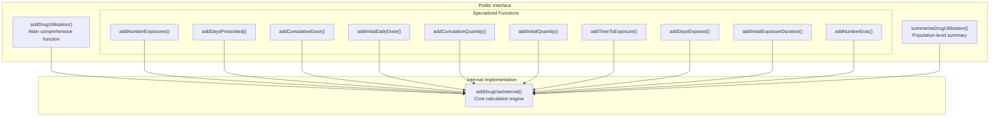
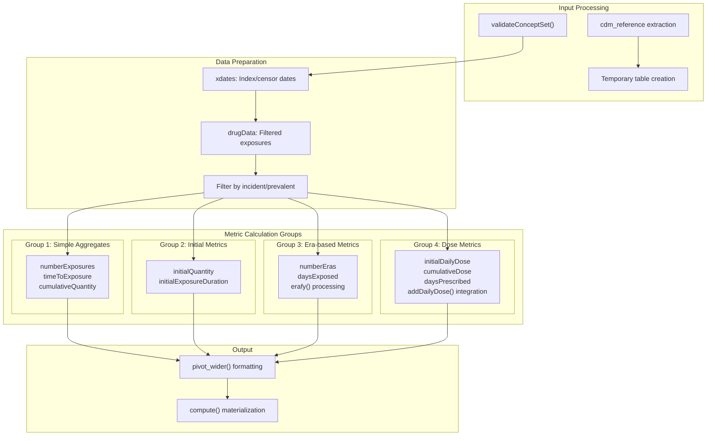

# Page: Drug Utilisation Analysis

# Drug Utilisation Analysis

<details>
<summary>Relevant source files</summary>

The following files were used as context for generating this wiki page:

- [CRAN-SUBMISSION](CRAN-SUBMISSION)
- [DESCRIPTION](DESCRIPTION)
- [NEWS.md](NEWS.md)
- [R/addDrugUtilisation.R](R/addDrugUtilisation.R)
- [R/summariseDrugUtilisation.R](R/summariseDrugUtilisation.R)
- [cran-comments.md](cran-comments.md)
- [inst/CITATION](inst/CITATION)
- [man/DrugUtilisation-package.Rd](man/DrugUtilisation-package.Rd)
- [man/addDrugUtilisation.Rd](man/addDrugUtilisation.Rd)
- [man/addNumberEras.Rd](man/addNumberEras.Rd)
- [tests/testthat/test-addDrugUtilisation.R](tests/testthat/test-addDrugUtilisation.R)

</details>


This page covers the core functionality for calculating and summarizing drug utilization metrics in the DrugUtilisation package. The system provides comprehensive analysis of patient-level drug exposure data including exposures, eras, doses, and quantities. For cohort generation and management, see [Cohort Management](#4). For specialized analysis functions like indication analysis, see [Specialized Analysis Functions](#6). For daily dose calculation details, see [Daily Dose Calculation](#7).

## Overview and Core Metrics

The drug utilisation analysis system calculates various metrics that characterize how patients use medications within specified time windows. The analysis operates on cohort tables and enriches them with drug utilization information derived from the `drug_exposure` table in the OMOP CDM.

### Available Metrics

The system calculates ten core drug utilization metrics:

| Metric | Description | Data Type |
|--------|-------------|-----------|
| `numberExposures` | Count of drug exposure records | Integer |
| `numberEras` | Count of continuous exposure episodes (with gap tolerance) | Integer |
| `daysExposed` | Total days in continuous exposure episodes | Integer |
| `daysPrescribed` | Sum of prescribed days across all exposures | Integer |
| `timeToExposure` | Days from index date to first exposure | Integer |
| `initialExposureDuration` | Duration of first exposure record | Integer |
| `initialQuantity` | Quantity of first exposure record | Numeric |
| `cumulativeQuantity` | Sum of quantities across all exposures | Numeric |
| `initialDailyDose` | Daily dose of first exposure (requires ingredient) | Numeric |
| `cumulativeDose` | Sum of doses across all exposures (requires ingredient) | Numeric |

**Diagram: Drug Utilisation Metrics Calculation**

```mermaid
graph TD
    subgraph "Input Data"
        DE["drug_exposure table"]
        COH["cohort_table"]
        CS["conceptSet / ingredientConceptId"]
    end
    
    subgraph "Core Metrics"
        subgraph "Count Metrics"
            NE["numberExposures<br/>Count of records"]
            NERA["numberEras<br/>Count of episodes"]
        end
        
        subgraph "Time Metrics"
            TTE["timeToExposure<br/>Days to first exposure"]
            DEXP["daysExposed<br/>Days in episodes"]
            DPRES["daysPrescribed<br/>Days prescribed"]
            IED["initialExposureDuration<br/>First exposure duration"]
        end
        
        subgraph "Quantity Metrics"
            IQ["initialQuantity<br/>First exposure quantity"]
            CQ["cumulativeQuantity<br/>Sum of quantities"]
        end
        
        subgraph "Dose Metrics"
            IDD["initialDailyDose<br/>First exposure dose"]
            CD["cumulativeDose<br/>Sum of doses"]
        end
    end
    
    DE --> NE
    DE --> NERA
    DE --> TTE
    DE --> DEXP
    DE --> DPRES
    DE --> IED
    DE --> IQ
    DE --> CQ
    DE --> IDD
    DE --> CD
    
    COH --> NE
    COH --> NERA
    COH --> TTE
    COH --> DEXP
    COH --> DPRES
    COH --> IED
    COH --> IQ
    COH --> CQ
    COH --> IDD
    COH --> CD
    
    CS --> NE
    CS --> NERA
    CS --> TTE
    CS --> DEXP
    CS --> DPRES
    CS --> IED
    CS --> IQ
    CS --> CQ
    CS --> IDD
    CS --> CD
```


Sources: [R/addDrugUtilisation.R:51-91](), [R/addDrugUtilisation.R:147-152]()

## Main Functions

The drug utilisation analysis provides two primary interfaces: patient-level enrichment and population-level summarization.

### Patient-Level Analysis: `addDrugUtilisation()`

The `addDrugUtilisation()` function adds drug utilization columns to a cohort table. It serves as the main entry point for enriching patient-level data with comprehensive drug use metrics.

**Function Signature and Key Parameters:**
```r
addDrugUtilisation(
  cohort,
  gapEra,
  conceptSet = NULL,
  ingredientConceptId = NULL,
  indexDate = "cohort_start_date",
  censorDate = "cohort_end_date",
  restrictIncident = TRUE,
  # Metric flags (all TRUE by default)
  numberExposures = TRUE,
  numberEras = TRUE,
  daysExposed = TRUE,
  daysPrescribed = TRUE,
  timeToExposure = TRUE,
  initialExposureDuration = TRUE,
  initialQuantity = TRUE,
  cumulativeQuantity = TRUE,
  initialDailyDose = TRUE,
  cumulativeDose = TRUE,
  nameStyle = "{value}_{concept_name}_{ingredient}",
  name = NULL
)
```

### Population-Level Analysis: `summariseDrugUtilisation()`

The `summariseDrugUtilisation()` function aggregates drug utilization metrics across cohort members, producing a `summarised_result` object compatible with the omopgenerics framework.

**Function Signature:**
```r
summariseDrugUtilisation(
  cohort,
  cohortId = NULL,
  strata = list(),
  estimates = c("q25", "median", "q75", "mean", "sd", "count_missing", "percentage_missing"),
  ingredientConceptId = NULL,
  conceptSet = NULL,
  indexDate = "cohort_start_date",
  censorDate = "cohort_end_date",
  restrictIncident = TRUE,
  gapEra = 1,
  # Same metric flags as addDrugUtilisation
  ...
)
```

Sources: [R/addDrugUtilisation.R:51-91](), [R/summariseDrugUtilisation.R:51-73]()

## Specialized Functions

The package provides individual functions for calculating specific metrics when only one type of analysis is needed. These functions are more efficient when calculating single metrics but use the same underlying `addDrugUseInternal()` function.

**Diagram: Function Hierarchy**


Sources: [R/addDrugUtilisation.R:125-154](), [R/addDrugUtilisation.R:188-217](), [R/addDrugUtilisation.R:252-281]()

## Core Implementation: `addDrugUseInternal()`

The `addDrugUseInternal()` function implements the core logic for all drug utilization calculations. It handles the complex database operations required to process drug exposure data efficiently.

### Key Processing Steps

1. **Input Validation and Setup**: Validates parameters and prepares concept sets
2. **Date Window Calculation**: Establishes analysis windows using index and censor dates
3. **Drug Data Retrieval**: Joins cohort with drug_exposure table filtered by concept sets
4. **Metric Calculation**: Processes different metric groups with optimized queries
5. **Era Construction**: Uses `erafy()` function to create continuous exposure episodes
6. **Dose Calculation**: Integrates with daily dose calculation system for dose metrics

**Diagram: Internal Processing Flow**


Sources: [R/addDrugUtilisation.R:729-748](), [R/addDrugUtilisation.R:872-910](), [R/addDrugUtilisation.R:942-992]()

## Key Parameters and Configuration

### Temporal Parameters

- **`indexDate`**: Column name specifying analysis start date (default: "cohort_start_date")
- **`censorDate`**: Column name specifying analysis end date (default: "cohort_end_date")
- **`gapEra`**: Days allowed between exposures to remain in same era (required for era-based metrics)

### Drug Selection Parameters

- **`conceptSet`**: Named list of concept IDs for drug selection
- **`ingredientConceptId`**: Specific ingredient concept IDs (required for dose calculations)

### Analysis Scope Parameters

- **`restrictIncident`**: When TRUE, includes only exposures starting after index date; when FALSE, includes all exposures overlapping the analysis window

### Column Naming

The `nameStyle` parameter controls output column naming using placeholders:
- `{value}`: Metric name (e.g., "number_exposures")
- `{concept_name}`: Concept set name
- `{ingredient}`: Ingredient concept ID (for dose metrics)

Default pattern: `"{value}_{concept_name}_{ingredient}"`

Sources: [R/addDrugUtilisation.R:51-68](), [R/addDrugUtilisation.R:792-796]()

## Integration with Daily Dose System

For dose-related metrics (`initialDailyDose` and `cumulativeDose`), the system integrates with the daily dose calculation framework. This requires:

1. **Ingredient Specification**: Must provide `ingredientConceptId` parameter
2. **Drug Strength Integration**: Uses `.addDailyDose()` method to calculate doses
3. **Unit Handling**: Manages different dose units and conversions

The dose calculation process:
1. Filters drug data to specified ingredient descendants
2. Joins with drug strength patterns
3. Applies dose calculation formulas
4. Aggregates doses across exposure periods

Sources: [R/addDrugUtilisation.R:1051-1088](), [R/addDrugUtilisation.R:798-801]()

## Output Formats

### Patient-Level Output

`addDrugUtilisation()` and related functions return the original cohort table with additional columns following the specified naming pattern. Missing values are handled consistently:
- Count metrics default to 0 for patients with no exposures
- Time and dose metrics return NA for patients with no exposures

### Population-Level Output

`summariseDrugUtilisation()` returns a `summarised_result` object containing:
- Statistical estimates for each metric
- Grouping by cohort and optional strata
- Metadata including analysis parameters
- Compatible with visualization and table generation functions

Sources: [R/summariseDrugUtilisation.R:155-203](), [R/addDrugUtilisation.R:906-910]()