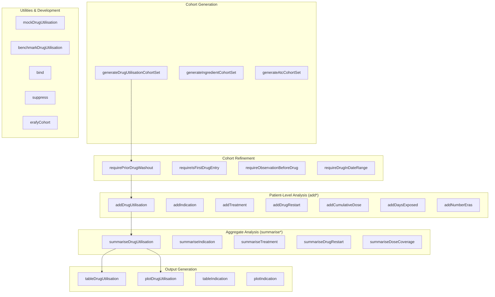
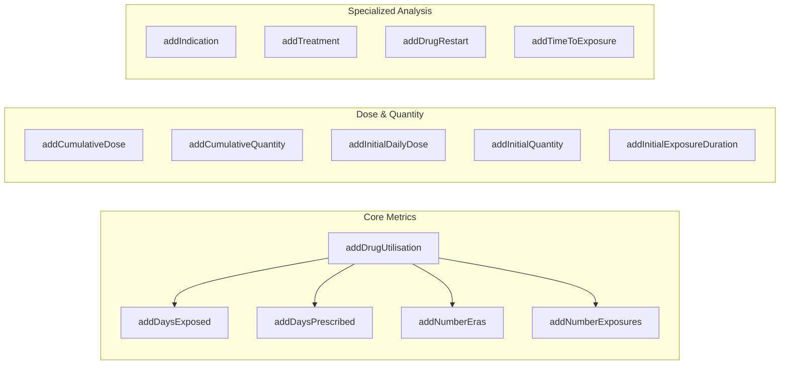
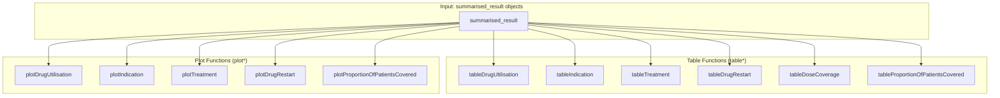
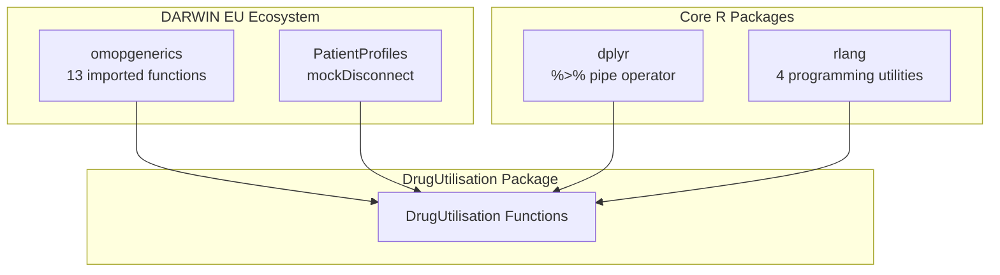
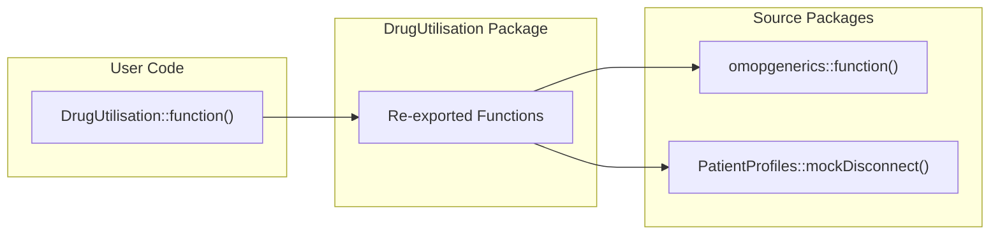
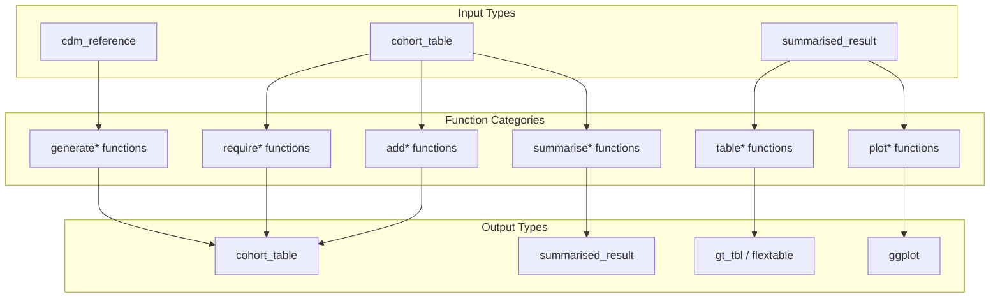

# Page: Function Exports and API

# Function Exports and API

Relevant source files

The following files were used as context for generating this wiki page:

- [NAMESPACE](NAMESPACE)
- [man/reexports.Rd](man/reexports.Rd)

This document provides a comprehensive reference for the DrugUtilisation package's public API, including all exported functions, package dependencies, and the overall interface structure. This serves as a technical reference for developers integrating with the package and understanding its external interface.

For information about specific analysis workflows, see [Drug Utilisation Analysis](#5), [Specialized Analysis Functions](#6), and [Output and Visualization](#8). For details about the internal package structure and development tools, see [Testing and Mock Data](#9.2) and [Documentation and CI/CD](#9.3).

## Package Exports Overview

The DrugUtilisation package exports 57 functions organized into distinct functional categories that follow a consistent naming pattern and workflow design. The API is built around a cohort-centric approach where functions are categorized by their primary purpose in the drug utilization analysis pipeline.

### Function Categories

Sources: [NAMESPACE:3-59]()

## Core Function Categories

### Cohort Generation Functions

The package exports four primary cohort generation functions that create the foundation for all downstream analysis:

| Function | Purpose | Primary Use Case |
|----------|---------|------------------|
| `generateDrugUtilisationCohortSet` | Creates cohorts from drug concept sets | Main entry point for drug cohort creation |
| `generateIngredientCohortSet` | Creates ingredient-based cohorts | Analysis by drug ingredient |
| `generateAtcCohortSet` | Creates ATC code-based cohorts | Therapeutic class analysis |

Sources: [NAMESPACE:26-28]()

### Patient-Level Analysis Functions (add*)

The `add*` family of functions enriches cohort tables with patient-level drug utilization metrics:

Sources: [NAMESPACE:3-16]()

### Aggregate Analysis Functions (summarise*)

The `summarise*` family produces `summarised_result` objects with population-level statistics:

| Function | Output Type | Key Metrics |
|----------|-------------|-------------|
| `summariseDrugUtilisation` | summarised_result | Exposure counts, duration statistics |
| `summariseIndication` | summarised_result | Indication prevalence, unknown indications |
| `summariseTreatment` | summarised_result | Treatment patterns, concurrent use |
| `summariseDrugRestart` | summarised_result | Restart rates, time to restart |
| `summariseDoseCoverage` | summarised_result | Dose calculation coverage |
| `summariseProportionOfPatientsCovered` | summarised_result | Patient coverage over time |

Sources: [NAMESPACE:46-51]()

### Output Generation Functions

Table and plot generation functions follow consistent naming patterns:

Sources: [NAMESPACE:34-38, 53-58]()

## Package Dependencies and Imports

### External Package Dependencies

The DrugUtilisation package imports functions from several key packages in the DARWIN EU ecosystem and broader R ecosystem:

Sources: [NAMESPACE:60-78]()

### Imported Functions by Package

#### omopgenerics Imports

The package heavily relies on `omopgenerics` for standardized OMOP operations:

| Function | Purpose |
|----------|---------|
| `additionalColumns`, `groupColumns`, `strataColumns`, `settingsColumns` | Column management utilities |
| `cohortCodelist`, `cohortCount`, `attrition`, `settings` | Cohort metadata functions |
| `bind`, `suppress`, `tidy` | Result manipulation |
| `exportSummarisedResult`, `importSummarisedResult` | Result serialization |

Sources: [NAMESPACE:62-74]()

#### rlang Programming Utilities

Essential programming utilities from `rlang`:

| Symbol | Purpose |
|--------|---------|
| `%||%` | Null-coalescing operator |
| `:=` | Dynamic name assignment |
| `.data`, `.env` | Data masking utilities |

Sources: [NAMESPACE:75-78]()

## Re-exported Functions

The package re-exports 13 functions from other packages to provide a unified interface without requiring users to load multiple packages:

### omopgenerics Re-exports

The re-exported functions include:
- **Metadata access**: `cohortCount`, `settings`, `attrition`, `cohortCodelist`
- **Result manipulation**: `bind`, `suppress`, `tidy` 
- **Column utilities**: `groupColumns`, `strataColumns`, `additionalColumns`, `settingsColumns`
- **Data exchange**: `exportSummarisedResult`, `importSummarisedResult`
- **Development utilities**: `mockDisconnect`

Sources: [NAMESPACE:17-18, 20-25, 31, 43-45, 52, 59](), [man/reexports.Rd:6-19, 27-30]()

## API Design Patterns

### Naming Conventions

The package follows consistent naming patterns that reflect the function's role in the analysis pipeline:

| Pattern | Purpose | Examples |
|---------|---------|----------|
| `generate*` | Create cohorts from concept sets | `generateDrugUtilisationCohortSet` |
| `require*` | Apply inclusion/exclusion criteria | `requirePriorDrugWashout` |
| `add*` | Add patient-level metrics to cohorts | `addDrugUtilisation` |
| `summarise*` | Create population-level summaries | `summariseDrugUtilisation` |
| `table*` | Generate formatted tables | `tableDrugUtilisation` |
| `plot*` | Generate visualizations | `plotDrugUtilisation` |

### Function Return Types

The package API follows a consistent pattern for return types:

Sources: [NAMESPACE:3-59]()

## Utility and Development Functions

### Development and Testing Functions

| Function | Purpose |
|----------|---------|
| `mockDrugUtilisation` | Generate mock CDM database for testing |
| `benchmarkDrugUtilisation` | Performance benchmarking utilities |
| `patternTable` | Drug strength pattern reference |

### Data Processing Utilities

| Function | Purpose |
|----------|---------|
| `erafyCohort` | Convert cohort exposures to eras |
| `cohortGapEra` | Handle gap calculations in eras |

Sources: [NAMESPACE:19, 24, 32-33]()