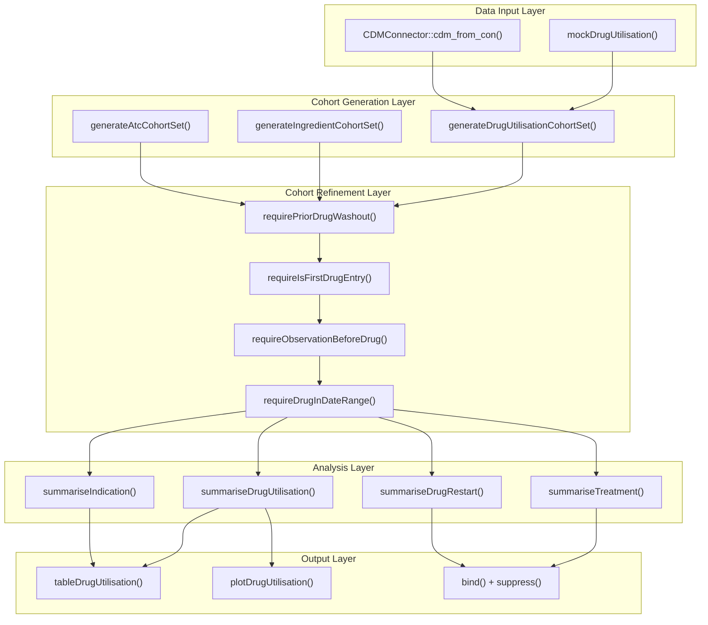
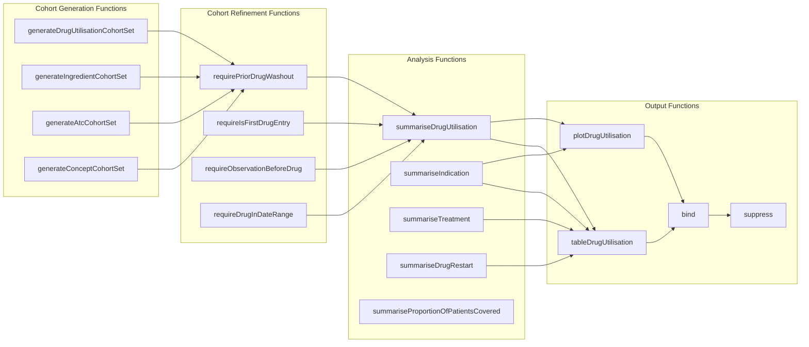

# Page: Getting Started

# Getting Started

<details>
<summary>Relevant source files</summary>

The following files were used as context for generating this wiki page:

- [.Rbuildignore](.Rbuildignore)
- [R/mockDrugUtilisation.R](R/mockDrugUtilisation.R)
- [README.Rmd](README.Rmd)
- [README.md](README.md)
- [_pkgdown.yml](_pkgdown.yml)
- [man/mockDrugUtilisation.Rd](man/mockDrugUtilisation.Rd)
- [man/plotProportionOfPatientsCovered.Rd](man/plotProportionOfPatientsCovered.Rd)
- [tests/testthat/setup.R](tests/testthat/setup.R)
- [vignettes/.gitignore](vignettes/.gitignore)
- [vignettes/create_cohorts.Rmd](vignettes/create_cohorts.Rmd)
- [vignettes/mock_data.Rmd](vignettes/mock_data.Rmd)

</details>


This document provides a practical introduction to the DrugUtilisation R package, covering installation, basic usage patterns, and working with mock data to understand the core package workflow. The focus is on getting users up and running quickly with their first drug utilization analysis.

For detailed information about specific analysis types, see [Specialized Analysis Functions](#6). For comprehensive cohort management techniques, see [Cohort Management](#4). For production deployment considerations, see [Package Development](#9).

## Installation

Install the DrugUtilisation package from CRAN or the development version from GitHub:

```r
# From CRAN (stable version)
install.packages("DrugUtilisation")

# From GitHub (development version)
# install.packages("devtools")
devtools::install_github("darwin-eu/DrugUtilisation")
```

Load the package along with required dependencies:

```r
library(DrugUtilisation)
library(CDMConnector)
library(omopgenerics)
library(dplyr)
```

Sources: [README.Rmd:41-45]()

## Quick Start with Mock Data

The fastest way to explore DrugUtilisation functionality is using the built-in mock data generator. The `mockDrugUtilisation()` function creates a complete OMOP CDM environment with synthetic drug exposure data.

```r
# Create mock CDM with default settings (10 individuals)
cdm <- mockDrugUtilisation()

# Create larger mock dataset for more realistic analysis
cdm <- mockDrugUtilisation(numberIndividuals = 100, seed = 1)
```

This generates a `cdm_reference` object containing all necessary OMOP CDM tables including `person`, `drug_exposure`, `condition_occurrence`, `concept`, and `drug_strength`, plus vocabulary tables and two default cohort tables.

Sources: [R/mockDrugUtilisation.R:41-45](), [README.Rmd:47](), [vignettes/mock_data.Rmd:27-28]()

## Core Workflow Overview

The DrugUtilisation package follows a systematic workflow from data input through analysis to visualization. Understanding this workflow is essential for effective usage.

**DrugUtilisation Core Workflow**


Sources: [_pkgdown.yml:19-92](), [README.Rmd:50-115]()

## Key Function Categories

The package organizes functions into distinct categories that correspond to the workflow stages:

**Function Categories and Core APIs**


Sources: [_pkgdown.yml:18-92]()

## Step-by-Step Example

Here is a complete example demonstrating the typical DrugUtilisation workflow:

### 1. Create CDM Reference
```r
# Start with mock data for learning
cdm <- mockDrugUtilisation(numberIndividuals = 100, seed = 1)
```

### 2. Generate Drug Cohort
```r
# Create acetaminophen users cohort
cdm <- generateIngredientCohortSet(
  cdm = cdm,
  name = "acetaminophen_users",
  ingredient = "acetaminophen",
  gapEra = 7
)
```

### 3. Apply Inclusion Criteria
```r
# Refine cohort with inclusion criteria
cdm$acetaminophen_users <- cdm$acetaminophen_users |>
  requireIsFirstDrugEntry() |>
  requireObservationBeforeDrug(days = 30)
```

### 4. Perform Analysis
```r
# Analyze drug utilization patterns
drug_results <- cdm$acetaminophen_users |>
  summariseDrugUtilisation(
    ingredientConceptId = 1125315,
    gapEra = 7
  )

# Analyze indications
indication_results <- cdm$acetaminophen_users |>
  summariseIndication(
    indicationCohortName = "condition_cohorts",
    indicationWindow = list(c(-30, 0))
  )
```

### 5. Generate Output
```r
# Combine results and suppress small counts
final_results <- bind(drug_results, indication_results) |>
  suppress(minCellCount = 5)

# Create formatted table
tableDrugUtilisation(drug_results)

# Create visualization  
plotDrugUtilisation(drug_results)
```

Sources: [README.Rmd:54-98](), [vignettes/create_cohorts.Rmd:226-244]()

## Understanding Mock Data Structure

The `mockDrugUtilisation()` function creates a comprehensive OMOP CDM environment. Understanding this structure helps users transition to real data.

| Table | Purpose | Key Fields |
|-------|---------|------------|
| `person` | Patient demographics | `person_id`, `year_of_birth`, `gender_concept_id` |
| `observation_period` | Time patients are observable | `person_id`, `observation_period_start_date`, `observation_period_end_date` |
| `drug_exposure` | Drug prescription/dispensing records | `person_id`, `drug_concept_id`, `drug_exposure_start_date`, `quantity` |
| `condition_occurrence` | Medical conditions | `person_id`, `condition_concept_id`, `condition_start_date` |
| `concept` | Vocabulary definitions | `concept_id`, `concept_name`, `domain_id`, `concept_class_id` |
| `drug_strength` | Drug dosing information | `drug_concept_id`, `ingredient_concept_id`, `amount_value`, `amount_unit_concept_id` |

The mock data generator automatically ensures referential integrity between tables and generates realistic temporal relationships.

Sources: [R/mockDrugUtilisation.R:162-202](), [vignettes/mock_data.Rmd:32-71]()

## Key Parameters and Concepts

### GapEra Parameter
The `gapEra` parameter controls how drug exposures are combined into treatment episodes. A `gapEra` of 7 means exposures separated by 7 days or less are combined into a single episode.

### Concept Sets
Drug cohorts are defined using concept sets - collections of OMOP concept IDs representing drugs of interest. These can be:
- Named lists: `list(acetaminophen = c(1125315, 1127433))`
- `codelist` objects from `omopgenerics`
- `conceptSetExpression` objects with inclusion/exclusion rules

### Cohort Refinement Order
The order of applying cohort refinement functions matters. Recommended sequence:
1. `requirePriorDrugWashout()` or `requireIsFirstDrugEntry()`
2. `requireObservationBeforeDrug()`
3. `requireDrugInDateRange()`

Sources: [vignettes/create_cohorts.Rmd:108-220](), [vignettes/create_cohorts.Rmd:480-675]()

## Working with Real Data

To transition from mock data to real OMOP CDM data:

```r
# Connect to actual database (example for DuckDB)
con <- DBI::dbConnect(duckdb::duckdb(), "path/to/database.duckdb")
cdm <- CDMConnector::cdm_from_con(
  con = con,
  cdm_schema = "main",
  write_schema = "results"
)

# Verify CDM structure
omopgenerics::validateCdmArgument(cdm)
```

The same functions work identically with real data, but performance and result interpretation will differ based on data size and quality.

## Common Patterns and Best Practices

### Pattern 1: Incident Drug Users
```r
cdm$drug_cohort |>
  requirePriorDrugWashout(days = 365) |>
  requireObservationBeforeDrug(days = 365)
```

### Pattern 2: First Treatment Episodes
```r
cdm$drug_cohort |>
  requireIsFirstDrugEntry() |>
  requireObservationBeforeDrug(days = 30)
```

### Pattern 3: Period-Restricted Analysis
```r
cdm$drug_cohort |>
  requireDrugInDateRange(dateRange = as.Date(c("2018-01-01", "2022-12-31")))
```

## Next Steps

After completing this getting started guide:

- Explore specific analysis types in [Specialized Analysis Functions](#6)
- Learn advanced cohort creation techniques in [Cohort Management](#4) 
- Understand daily dose calculations in [Daily Dose Calculation](#7)
- Review output formatting options in [Output and Visualization](#8)

For package development and testing workflows, see [Testing and Mock Data](#9.2).

Sources: [_pkgdown.yml:5-17](), [README.Rmd:114-115]()