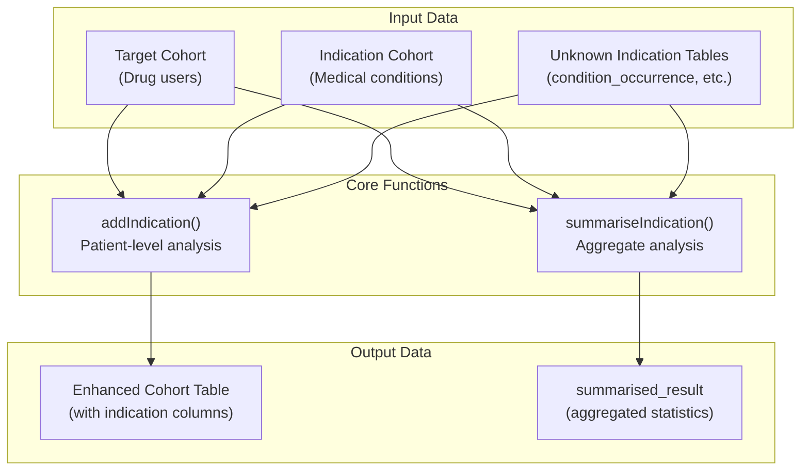
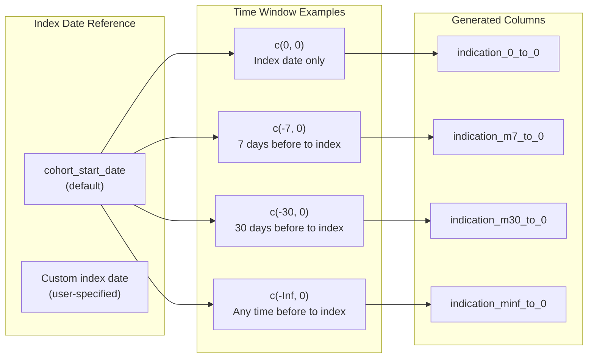
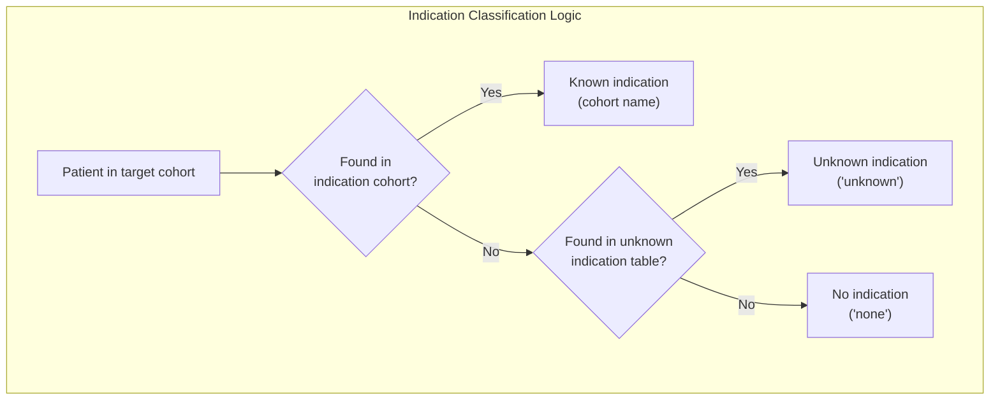
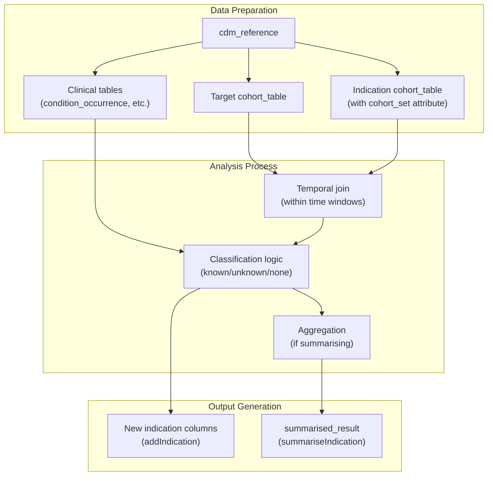
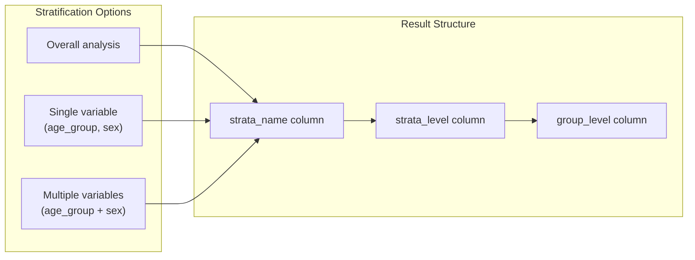

# Page: Indication Analysis

# Indication Analysis

Relevant source files

The following files were used as context for generating this wiki page:

- [man/addIndication.Rd](man/addIndication.Rd)
- [man/summariseIndication.Rd](man/summariseIndication.Rd)
- [tests/testthat/test-indication.R](tests/testthat/test-indication.R)

## Purpose and Scope

The Indication Analysis system provides functionality to analyze medical indications for drug use within the DrugUtilisation package. This system identifies why patients are prescribed medications by matching drug cohorts against indication cohorts within specified time windows. The analysis can distinguish between known indications (from predefined indication cohorts), unknown indications (from OMOP CDM clinical tables), and cases with no observed indication.

For general drug utilization metrics, see [Drug Utilisation Analysis](#5). For treatment pattern analysis, see [Treatment Analysis](#6.2).

## Core Functions and Architecture

The indication analysis system centers around two primary functions that work with cohort data to identify medical indications:

**Sources:** [tests/testthat/test-indication.R:65-69](), [man/addIndication.Rd:7-18](), [man/summariseIndication.Rd:7-18]()

### Patient-Level Analysis: `addIndication()`

The `addIndication()` function enhances cohort tables by adding indication columns for each specified time window. It operates at the patient level, creating new columns that identify the specific indication for each cohort entry.

| Parameter | Purpose | Example |
|-----------|---------|---------|
| `cohort` | Target drug cohort | Drug utilization cohort |
| `indicationCohortName` | Source of known indications | "indication_cohorts" |
| `indicationWindow` | Time windows to analyze | `list(c(0,0), c(-30,0))` |
| `unknownIndicationTable` | Tables for unknown indications | "condition_occurrence" |
| `indexDate` | Reference date for analysis | "cohort_start_date" |
| `mutuallyExclusive` | Single vs multiple indications | `TRUE` |

**Sources:** [man/addIndication.Rd:20-46](), [tests/testthat/test-indication.R:95-100]()

### Aggregate Analysis: `summariseIndication()`

The `summariseIndication()` function produces summary statistics about indication patterns across the entire cohort, generating `summarised_result` objects compatible with the broader OMOP analysis ecosystem.

| Parameter | Purpose | Example |
|-----------|---------|---------|
| `strata` | Stratification variables | `list("age_group", "sex")` |
| `cohortId` | Restrict to specific cohorts | `c(1, 2)` |
| `indicationCohortId` | Restrict indication cohorts | `c(1, 3)` |

**Sources:** [man/summariseIndication.Rd:20-48](), [tests/testthat/test-indication.R:606-611]()

## Time Window Analysis

The indication analysis system uses flexible time windows to determine temporal relationships between drug initiation and indication occurrence:

**Sources:** [tests/testthat/test-indication.R:119-141](), [tests/testthat/test-indication.R:169-174]()

### Window Naming Convention

The system generates column names based on time window specifications:
- `c(0, 0)` → `indication_0_to_0`
- `c(-1, 0)` → `indication_m1_to_0`
- `c(-Inf, 0)` → `indication_minf_to_0`

**Sources:** [tests/testthat/test-indication.R:126-129](), [tests/testthat/test-indication.R:175-179]()

## Unknown Indication Detection

When patients are not found in predefined indication cohorts, the system can search OMOP CDM clinical tables to identify unknown indications:

**Sources:** [tests/testthat/test-indication.R:252-269](), [tests/testthat/test-indication.R:284-289]()

### Supported Unknown Indication Tables

The system can search multiple OMOP CDM tables for unknown indications:
- `condition_occurrence` - Medical conditions
- `drug_exposure` - Other medications
- `observation` - Clinical observations

**Sources:** [tests/testthat/test-indication.R:353-360](), [man/addIndication.Rd:29]()

## Data Flow and Implementation

The indication analysis follows a structured data flow that integrates with the broader DrugUtilisation analysis pipeline:

**Sources:** [tests/testthat/test-indication.R:55-62](), [tests/testthat/test-indication.R:596-604]()

### Key Implementation Details

1. **Cohort Set Attributes**: Indication cohorts must have `cohort_set` attributes containing `cohort_definition_id` and `cohort_name` mappings.

2. **Multiple Indications**: When `mutuallyExclusive = FALSE`, patients can have multiple indications reported separately. When `TRUE`, indications are concatenated (e.g., "asthma and covid").

3. **Index Date Flexibility**: Analysis can use any date column as the index date, not just `cohort_start_date`.

**Sources:** [tests/testthat/test-indication.R:33-36](), [tests/testthat/test-indication.R:183-195](), [tests/testthat/test-indication.R:435-441]()

## Advanced Features

### Stratified Analysis

The `summariseIndication()` function supports stratification by patient characteristics:

**Sources:** [tests/testthat/test-indication.R:625-635](), [tests/testthat/test-indication.R:639-665]()

### Cohort Filtering

Both functions support filtering by specific cohort IDs to focus analysis on subsets of the target or indication cohorts.

**Sources:** [man/addIndication.Rd:25](), [man/summariseIndication.Rd:29-33]()

## Integration with Package Ecosystem

The indication analysis integrates seamlessly with other DrugUtilisation components and the broader DARWIN EU ecosystem:

- **Input**: Works with cohorts generated by cohort generation functions (see [Cohort Generation](#4.1))
- **Output**: Produces `summarised_result` objects compatible with visualization functions (see [Output and Visualization](#8))
- **Dependencies**: Uses PatientProfiles for demographic enrichment and omopgenerics for result standardization

**Sources:** [tests/testthat/test-indication.R:620-624](), [tests/testthat/test-indication.R:671-673]()