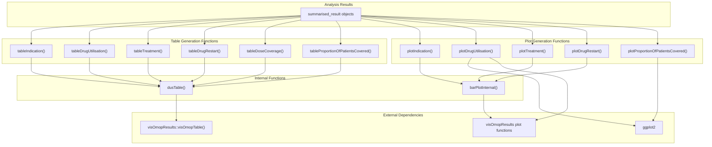
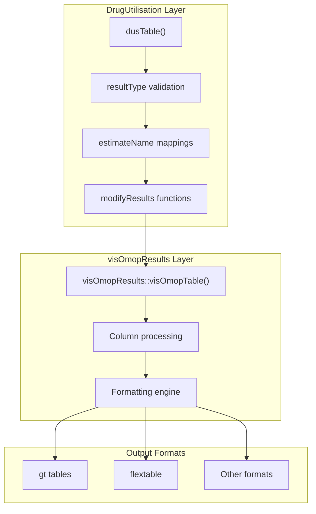

# Page: Output and Visualization

# Output and Visualization

Relevant source files

The following files were used as context for generating this wiki page:

- [R/plots.R](R/plots.R)
- [R/tables.R](R/tables.R)
- [man/plotDrugRestart.Rd](man/plotDrugRestart.Rd)
- [man/plotIndication.Rd](man/plotIndication.Rd)
- [man/plotTreatment.Rd](man/plotTreatment.Rd)
- [man/summariseTreatment.Rd](man/summariseTreatment.Rd)
- [man/tableDoseCoverage.Rd](man/tableDoseCoverage.Rd)
- [man/tableDrugRestart.Rd](man/tableDrugRestart.Rd)
- [man/tableDrugUtilisation.Rd](man/tableDrugUtilisation.Rd)
- [man/tableIndication.Rd](man/tableIndication.Rd)
- [man/tableTreatment.Rd](man/tableTreatment.Rd)

This section covers the generation of formatted tables and plots from analysis results within the DrugUtilisation package. The output system provides standardized visualization capabilities for all analysis functions, producing publication-ready tables and plots from `summarised_result` objects.

For detailed information about specific table generation functions, see [Table Generation](#8.1). For plot creation and customization options, see [Plot Generation](#8.2).

## Purpose and Scope

The output and visualization system serves as the final layer in the DrugUtilisation analysis pipeline, transforming standardized `summarised_result` objects into human-readable formats. This system ensures consistent formatting across all analysis types while providing flexibility for customization through the `visOmopResults` package integration.

The system handles output for all major analysis types including drug utilization metrics, indication analysis, treatment patterns, drug restarts, dose coverage, and patient coverage analysis.

## System Architecture

The output system follows a standardized architecture where analysis-specific formatting functions delegate to common internal functions that handle the underlying visualization logic.

### Output Function Organization

Sources: [R/tables.R:1-436](), [R/plots.R:1-548]()

### Data Flow Pipeline

The visualization pipeline transforms analysis results through several stages of processing before generating the final output.

```mermaid
graph LR
    subgraph "Input Processing"
        VAL["validateResultArgument()"]
        FILT["filterSettings()"]
        VER["checkVersion()"]
    end
    
    subgraph "Data Transformation"
        MOD["modifyResults()"]
        EST["estimateName mapping"]
        COL["Column selection"]
        REN["rename operations"]
    end
    
    subgraph "Layout Configuration"
        HEAD["header columns"]
        GROUP["groupColumn"]
        HIDE["hide columns"]
        FACET["facet configuration"]
    end
    
    subgraph "Output Generation"
        TABLE["visOmopTable()"]
        PLOT["ggplot2 objects"]
    end
    
    VAL --> FILT
    FILT --> VER
    VER --> MOD
    MOD --> EST
    EST --> COL
    COL --> REN
    REN --> HEAD
    HEAD --> GROUP
    GROUP --> HIDE
    HIDE --> FACET
    FACET --> TABLE
    FACET --> PLOT
```

Sources: [R/tables.R:321-392](), [R/plots.R:465-531]()

## Common Patterns and Standardization

### Table Function Structure

All table generation functions follow a consistent pattern implemented through the `dusTable()` internal function. This ensures uniform behavior across different analysis types.

**Standard Parameters:**
- `result`: A `summarised_result` object from analysis functions
- `header`: Columns to use as table headers
- `groupColumn`: Columns for grouping rows
- `hide`: Columns to exclude from display
- `type`: Output format (gt, flextable, etc.)
- `.options`: Additional formatting options

**Common Processing Steps:**
1. Input validation using `omopgenerics::validateResultArgument()`
2. Result type filtering using `omopgenerics::filterSettings()`
3. Version compatibility checking with `checkVersion()`
4. Optional result modification through `modifyResults` parameter
5. Estimate name formatting through `estimateName` mappings

Sources: [R/tables.R:321-392]()

### Plot Function Structure

Plot functions use either the internal `barPlotInternal()` function for categorical data or direct `ggplot2`/`visOmopResults` integration for more complex visualizations.

**Bar Plot Pattern (Indication, Treatment, Drug Restart):**
- Filter to percentage estimates using `dplyr::filter(.data$estimate_name == "percentage")`
- Apply factor ordering for consistent display
- Use `visOmopResults::barPlot()` with coordinate flip
- Include standardized theming and labels

**Drug Utilization Plots:**
- Support multiple plot types: barplot, boxplot, densityplot, scatterplot
- Dynamic estimate requirement checking based on plot type
- Flexible variable and faceting configuration

Sources: [R/plots.R:465-531](), [R/plots.R:198-321]()

## Integration with visOmopResults

The DrugUtilisation package leverages the `visOmopResults` package for standardized OMOP result visualization. This integration provides:

### Table Integration

The `dusTable()` function serves as a wrapper around `visOmopResults::visOmopTable()`, adding DrugUtilisation-specific configurations:

Sources: [R/tables.R:380-391]()

### Plot Integration

Plot functions combine direct `ggplot2` usage with `visOmopResults` plotting functions for enhanced functionality:

- `visOmopResults::barPlot()` for categorical comparisons
- `visOmopResults::scatterPlot()` for continuous data relationships  
- `visOmopResults::boxPlot()` for distribution visualization
- Direct `ggplot2` for specialized plots like proportion of patients covered

Sources: [R/plots.R:236-313](), [R/plots.R:519-530]()

## Result Type Mapping

Each analysis function produces results with specific `result_type` values that are processed by corresponding output functions.

| Analysis Function | Result Type | Table Function | Plot Function |
|------------------|-------------|----------------|---------------|
| `summariseIndication()` | `"summarise_indication"` | `tableIndication()` | `plotIndication()` |
| `summariseDrugUtilisation()` | `"summarise_drug_utilisation"` | `tableDrugUtilisation()` | `plotDrugUtilisation()` |
| `summariseTreatment()` | `"summarise_treatment"` | `tableTreatment()` | `plotTreatment()` |
| `summariseDrugRestart()` | `"summarise_drug_restart"` | `tableDrugRestart()` | `plotDrugRestart()` |
| `summariseDoseCoverage()` | `"summarise_dose_coverage"` | `tableDoseCoverage()` | - |
| `summariseProportionOfPatientsCovered()` | `"summarise_proportion_of_patients_covered"` | `tableProportionOfPatientsCovered()` | `plotProportionOfPatientsCovered()` |

Sources: [R/tables.R:42-319](), [R/plots.R:41-445]()

## Version Compatibility and Validation

The output system includes robust validation to ensure compatibility between analysis results and visualization functions:

### Version Checking

The `checkVersion()` function compares the DrugUtilisation version used to generate results with the currently installed version, providing warnings for potential compatibility issues.

### Input Validation

All output functions validate their inputs using:
- `omopgenerics::validateResultArgument()` for result object validation
- Parameter-specific validation for formatting options
- `checkIntersection()` to prevent conflicting column assignments

Sources: [R/tables.R:420-432](), [R/tables.R:398-419]()

## Error Handling and Empty Results

The system gracefully handles edge cases such as empty results or missing data:

### Empty Result Handling

When no results are found for the specified `result_type`, functions return appropriate empty outputs:
- Tables: `emptyTable()` returns a properly formatted empty table
- Plots: `emptyPlot()` returns a minimal `ggplot2` object with void theme

### Missing Estimate Handling

Plot functions validate required estimates and provide clear error messages when necessary estimates are missing for specific plot types.

Sources: [R/tables.R:394-397](), [R/plots.R:544-547](), [R/plots.R:219-287]()