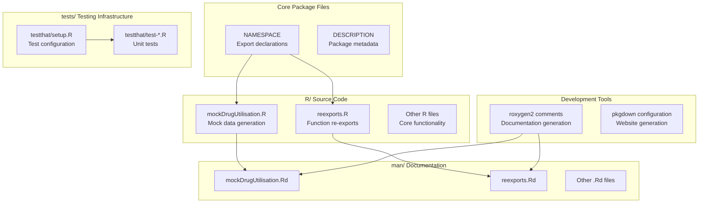
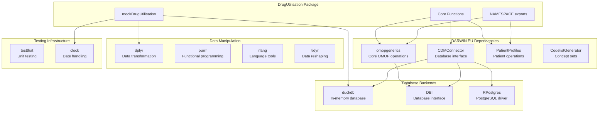
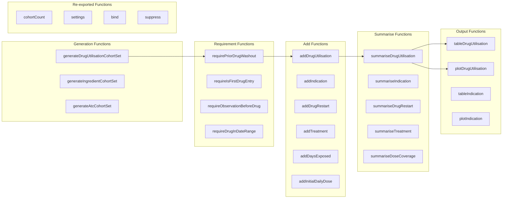
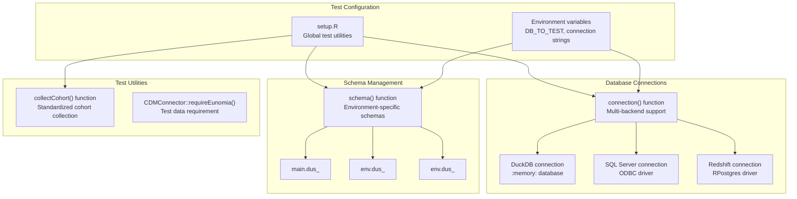
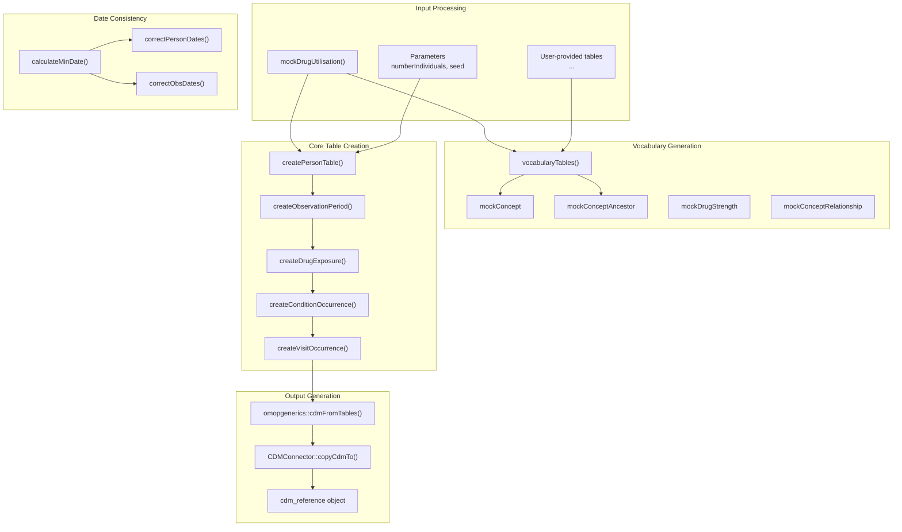
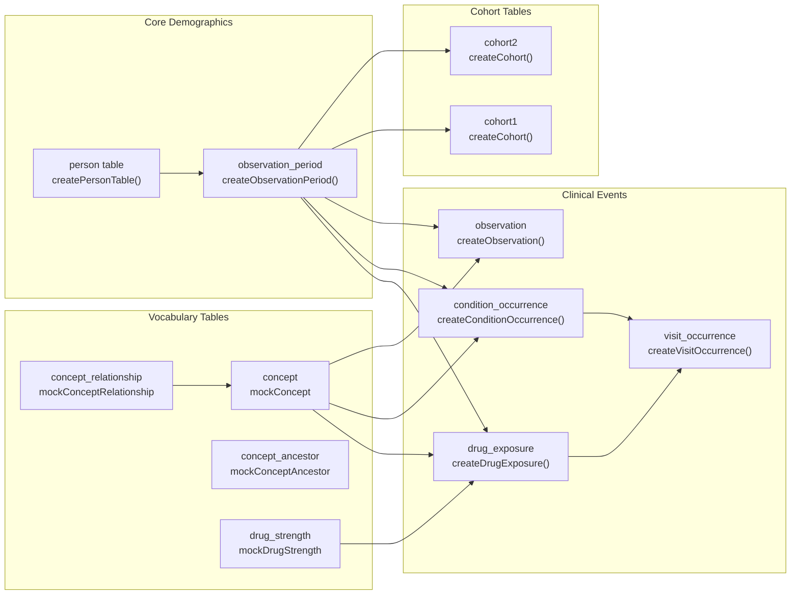

# Page: Package Development

# Package Development

Relevant source files

The following files were used as context for generating this wiki page:

- [NAMESPACE](NAMESPACE)
- [R/mockDrugUtilisation.R](R/mockDrugUtilisation.R)
- [man/mockDrugUtilisation.Rd](man/mockDrugUtilisation.Rd)
- [man/plotProportionOfPatientsCovered.Rd](man/plotProportionOfPatientsCovered.Rd)
- [man/reexports.Rd](man/reexports.Rd)
- [tests/testthat/setup.R](tests/testthat/setup.R)

This document covers the internal structure, development tools, testing framework, and contribution guidelines for the DrugUtilisation R package. It provides technical details for package maintainers and contributors who need to understand the codebase architecture, dependency management, and development workflows.

For information about using the package's exported functions, see [Function Exports and API](#9.1). For details about the testing framework and mock data systems, see [Testing and Mock Data](#9.2). For documentation generation and CI/CD processes, see [Documentation and CI/CD](#9.3).

## Package Architecture Overview

The DrugUtilisation package follows standard R package conventions with additional integration into the DARWIN EU ecosystem. The package is structured around a clear separation between exported public functions and internal development utilities.

### Package File Structure

Sources: [NAMESPACE:1-79](), [R/mockDrugUtilisation.R:1-573](), [man/mockDrugUtilisation.Rd:1-45](), [man/reexports.Rd:1-32](), [tests/testthat/setup.R:1-45]()

## Development Ecosystem Integration

The package integrates deeply with the DARWIN EU ecosystem and external R package dependencies. The dependency structure is designed to leverage existing OMOP CDM tools while providing specialized drug utilization functionality.

### Dependency Architecture

Sources: [NAMESPACE:60-78](), [R/mockDrugUtilisation.R:41-160]()

## Export System and Function Organization

The package uses roxygen2 for automatic generation of the `NAMESPACE` file, which defines 58 exported functions organized into functional categories. The export system follows a clear pattern based on function purpose and user workflow.

### Function Export Categories

Sources: [NAMESPACE:3-58](), [man/reexports.Rd:6-19]()

## Testing Infrastructure

The testing system uses `testthat` with a comprehensive setup that supports multiple database backends and mock data generation. The setup provides utilities for database connections, schema management, and cohort collection that are used across all test files.

### Test Setup Architecture

Sources: [tests/testthat/setup.R:1-44]()

## Mock Data Generation System

The `mockDrugUtilisation` function provides a comprehensive mock data generation system for testing and development. It creates a complete OMOP CDM database with realistic drug utilization data patterns, supporting both in-memory testing and development workflows.

### Mock Data Generation Flow

Sources: [R/mockDrugUtilisation.R:41-160](), [R/mockDrugUtilisation.R:163-202](), [R/mockDrugUtilisation.R:205-244](), [R/mockDrugUtilisation.R:269-310]()

### Mock Data Table Relationships

The mock data system creates a complete OMOP CDM with proper referential integrity and realistic data patterns. Each table creation function includes logic for generating appropriate sample sizes and maintaining temporal consistency.

Sources: [R/mockDrugUtilisation.R:367-412](), [R/mockDrugUtilisation.R:414-468](), [R/mockDrugUtilisation.R:470-495](), [R/mockDrugUtilisation.R:312-350]()