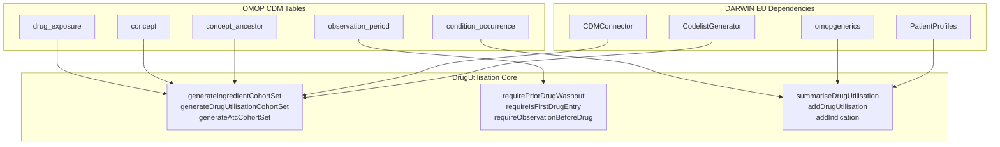
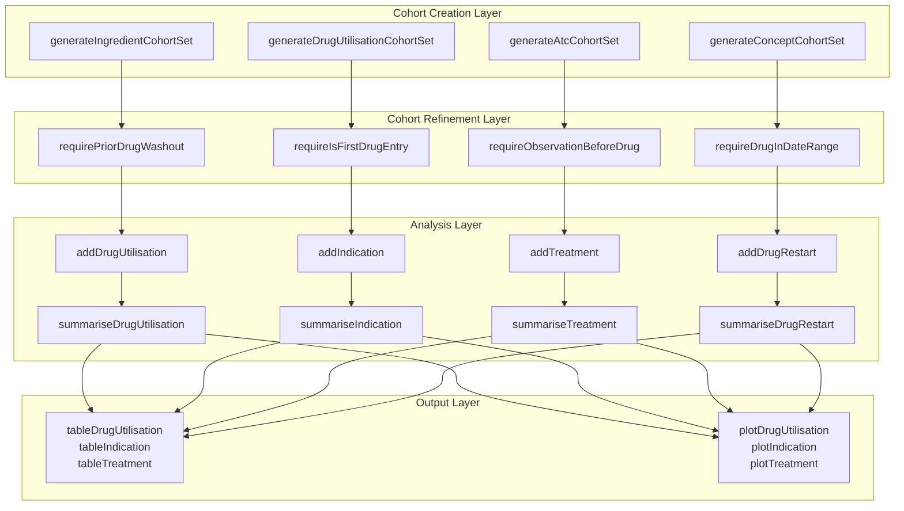
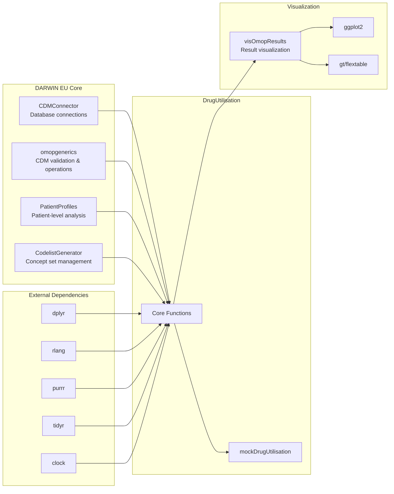
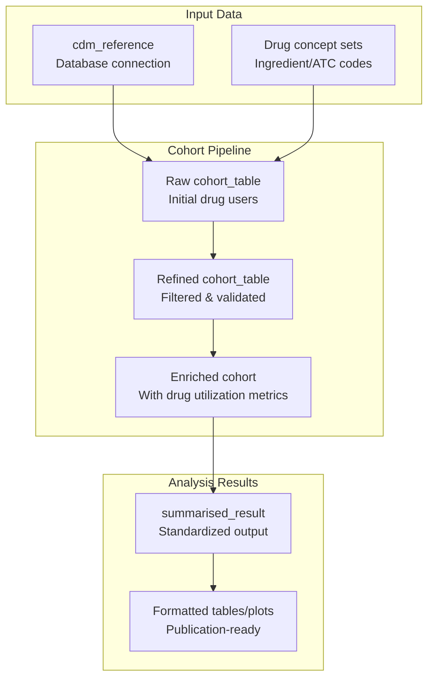

# Page: Package Overview

# Package Overview

<details>
<summary>Relevant source files</summary>

The following files were used as context for generating this wiki page:

- [CRAN-SUBMISSION](CRAN-SUBMISSION)
- [DESCRIPTION](DESCRIPTION)
- [NEWS.md](NEWS.md)
- [R/summariseDrugUtilisation.R](R/summariseDrugUtilisation.R)
- [README.Rmd](README.Rmd)
- [README.md](README.md)
- [cran-comments.md](cran-comments.md)
- [inst/CITATION](inst/CITATION)
- [man/DrugUtilisation-package.Rd](man/DrugUtilisation-package.Rd)

</details>


This document provides an overview of the DrugUtilisation R package, its purpose within the OMOP Common Data Model (CDM) ecosystem, and its core capabilities for conducting comprehensive drug utilization analyses. The package enables researchers to generate drug cohorts, analyze utilization patterns, identify indications, and calculate metrics such as daily doses and treatment persistence using standardized OMOP CDM data.

For detailed information about specific analysis types, see [Specialized Analysis Functions](#6). For implementation guidance, see [Getting Started](#2). For core concepts and terminology, see [Core Concepts](#3).

## Purpose and Scope

The DrugUtilisation package is designed to summarize patient-level drug utilization cohorts using data mapped to the Observational Medical Outcomes Partnership (OMOP) Common Data Model. The package supports creation of both new user and prevalent user cohorts, enabling comprehensive characterization of drug use patterns, indications, and treatment outcomes.

**Core Objectives:**
- Generate and refine drug utilization cohorts from OMOP CDM data
- Calculate standardized drug utilization metrics (exposures, eras, doses, quantities)
- Analyze treatment patterns, persistence, and discontinuation
- Identify medical indications for drug use
- Provide standardized output formats for reproducible research

Sources: [DESCRIPTION:1-48](), [README.md:11-36]()

## OMOP CDM Integration

DrugUtilisation is built specifically for the OMOP Common Data Model and integrates deeply with the DARWIN EU ecosystem of R packages. The package operates on standardized OMOP tables and produces results that conform to OMOP analytical standards.

### OMOP CDM Integration Architecture



The package uses `cdm_reference` objects created by CDMConnector to access OMOP tables and produces `summarised_result` objects that conform to omopgenerics standards for interoperability with other DARWIN EU tools.

Sources: [DESCRIPTION:73-85](), [R/summariseDrugUtilisation.R:79-80]()

## Core Capabilities Overview

DrugUtilisation provides five main categories of functionality:

| Capability | Key Functions | Purpose |
|------------|---------------|---------|
| **Cohort Generation** | `generateIngredientCohortSet`, `generateDrugUtilisationCohortSet`, `generateAtcCohortSet` | Create drug user cohorts based on ingredients, ATC codes, or custom concept sets |
| **Cohort Refinement** | `requirePriorDrugWashout`, `requireIsFirstDrugEntry`, `requireObservationBeforeDrug` | Apply inclusion/exclusion criteria and washout periods |
| **Drug Utilization Analysis** | `summariseDrugUtilisation`, `addDrugUtilisation` | Calculate exposures, eras, doses, quantities, and durations |
| **Specialized Analysis** | `summariseIndication`, `summariseTreatment`, `summariseDrugRestart` | Analyze indications, treatment patterns, and restart behavior |
| **Output Generation** | `tableDrugUtilisation`, `plotDrugUtilisation`, table/plot functions | Create formatted tables and visualizations |

Sources: [README.md:17-35](), [DESCRIPTION:45-48]()

## Package Architecture

### Function Category Structure



The architecture follows a layered approach where each layer builds upon the previous one, enabling modular and composable analyses.

Sources: [R/summariseDrugUtilisation.R:51-73](), [README.md:38-204]()

## Key Dependencies and Integration

### DARWIN EU Ecosystem Integration



The package integrates tightly with the DARWIN EU ecosystem, particularly relying on omopgenerics for standardized result structures and PatientProfiles for patient-level analytical operations.

Sources: [DESCRIPTION:73-85](), [DESCRIPTION:53-71]()

## Data Flow Pipeline

### Core Analysis Workflow



All analyses follow this standardized pipeline: data input → cohort generation → refinement → enrichment → standardized results → formatted output.

Sources: [README.md:44-112](), [R/summariseDrugUtilisation.R:102-203]()

## Function Export Structure

The package exports functions organized into logical categories:

### Primary Analysis Functions
- **Cohort Generation**: `generateIngredientCohortSet()`, `generateDrugUtilisationCohortSet()`, `generateAtcCohortSet()`
- **Drug Utilization**: `summariseDrugUtilisation()`, `addDrugUtilisation()` 
- **Specialized Analysis**: `summariseIndication()`, `summariseTreatment()`, `summariseDrugRestart()`
- **Daily Dose**: `dailyDose()`, `summariseDoseCoverage()`

### Support Functions  
- **Cohort Refinement**: `requirePriorDrugWashout()`, `requireIsFirstDrugEntry()`
- **Output Generation**: `tableDrugUtilisation()`, `plotDrugUtilisation()`
- **Mock Data**: `mockDrugUtilisation()`
- **Utilities**: `bind()`, `suppress()`

For complete function reference, see [Function Exports and API](#9.1).

Sources: [man/DrugUtilisation-package.Rd:1-42](), [README.md:38-204]()

## Getting Started

The typical DrugUtilisation workflow involves:

1. **Setup**: Create `cdm_reference` using CDMConnector
2. **Cohort Generation**: Use `generateIngredientCohortSet()` or related functions
3. **Refinement**: Apply `require*()` functions for inclusion/exclusion criteria
4. **Analysis**: Use `summarise*()` functions for specific research questions
5. **Output**: Generate tables and plots using formatting functions

```r
# Basic workflow example
cdm <- mockDrugUtilisation()
cdm <- generateIngredientCohortSet(cdm, name = "drug_cohort", ingredient = "acetaminophen")
results <- cdm$drug_cohort |> 
  requireIsFirstDrugEntry() |>
  summariseDrugUtilisation(ingredientConceptId = 1125315)
```

For detailed implementation guidance, see [Getting Started](#2). For working with mock data during development, see [Testing and Mock Data](#9.2).

Sources: [README.md:38-64](), [README.md:93-112]()