# Page: Patient Coverage Analysis

# Patient Coverage Analysis

<details>
<summary>Relevant source files</summary>

The following files were used as context for generating this wiki page:

- [R/summariseProportionOfPatientsCovered.R](R/summariseProportionOfPatientsCovered.R)
- [man/summariseProportionOfPatientsCovered.Rd](man/summariseProportionOfPatientsCovered.Rd)
- [tests/testthat/test-summariseProportionOfPatientsCovered.R](tests/testthat/test-summariseProportionOfPatientsCovered.R)

</details>


This document covers the patient coverage analysis functionality in DrugUtilisation, specifically the "proportion of patients covered" (PPC) method for assessing treatment persistence and adherence patterns over time.

The PPC method calculates the proportion of patients still in observation who remain in their cohort on any given day following their first cohort entry. This provides insights into treatment persistence, discontinuation patterns, and adherence over specified follow-up periods.

For information about other treatment analysis methods, see [Treatment Analysis](#6.2) and [Drug Restart Analysis](#6.3).

## Overview and Purpose

Patient coverage analysis addresses the fundamental question: "What proportion of patients continue their treatment over time?" This is accomplished through the `summariseProportionOfPatientsCovered()` function, which implements a longitudinal analysis tracking patient cohort membership day-by-day.

The analysis produces time-series data showing how treatment coverage changes over the follow-up period, accounting for patients leaving observation and treatment discontinuation events.

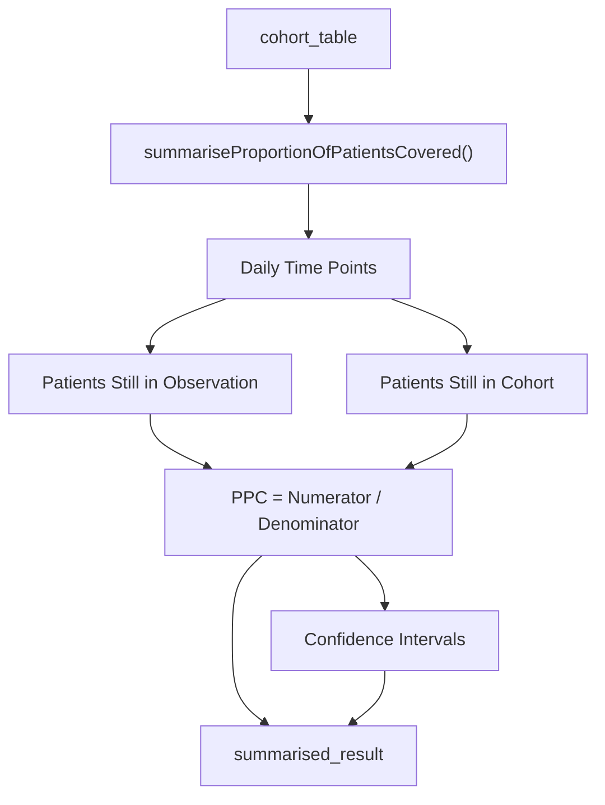

**Primary Function Analysis**
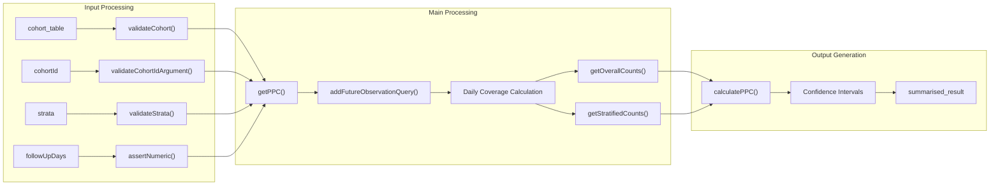

Sources: [R/summariseProportionOfPatientsCovered.R:46-143](), [tests/testthat/test-summariseProportionOfPatientsCovered.R:1-91]()

## Core Function Architecture

The patient coverage analysis system is built around the main exported function `summariseProportionOfPatientsCovered()` with several supporting internal functions that handle different aspects of the calculation.

### Main Function Structure

| Component | Function | Purpose |
|-----------|----------|---------|
| Entry Point | `summariseProportionOfPatientsCovered()` | Main exported function, validates inputs and orchestrates analysis |
| Cohort Processing | `getPPC()` | Processes individual cohorts and manages day-by-day calculations |
| Overall Metrics | `getOverallCounts()`, `getOverallStartingCount()` | Calculates non-stratified coverage metrics |
| Stratified Metrics | `getStratifiedCounts()`, `getStratifiedStartingCount()` | Calculates stratified coverage metrics |
| Statistical Calculations | `calculatePPC()` | Computes PPC percentages with confidence intervals |

### Function Call Flow

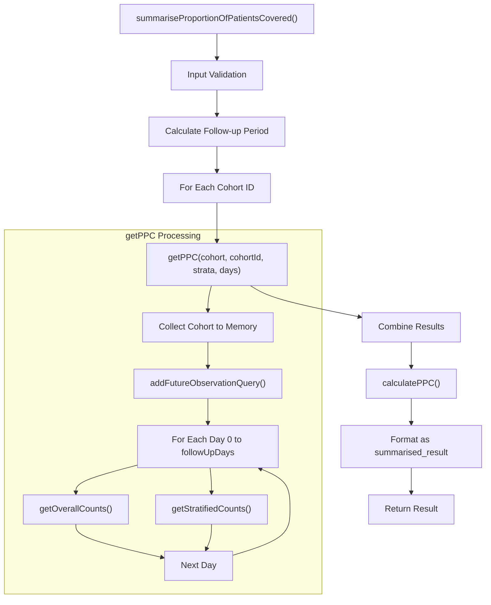

Sources: [R/summariseProportionOfPatientsCovered.R:46-143](), [R/summariseProportionOfPatientsCovered.R:145-230]()

## Input Parameters and Validation

The function accepts several key parameters that control the analysis scope and methodology:

### Parameter Specifications

| Parameter | Type | Description | Validation |
|-----------|------|-------------|------------|
| `cohort` | `cohort_table` | Source cohort data | `validateCohort()` |
| `cohortId` | `integer` or `NULL` | Specific cohort(s) to analyze | `validateCohortIdArgument()` |
| `strata` | `list` | Stratification variables | `validateStrata()` |
| `followUpDays` | `integer` or `NULL` | Follow-up duration | `assertNumeric(min=1, length=1)` |

### Follow-up Period Determination

When `followUpDays` is `NULL`, the function automatically calculates the maximum follow-up period based on cohort data:

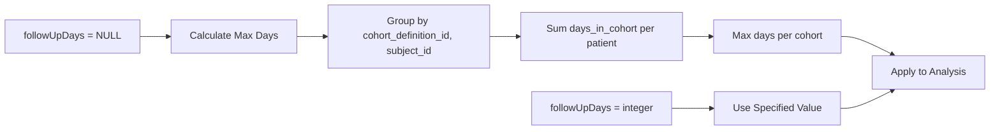

The calculation involves computing `datediff()` between cohort start and end dates for each patient, summing multiple cohort episodes per patient, and taking the maximum across all patients in each cohort.

Sources: [R/summariseProportionOfPatientsCovered.R:73-92](), [tests/testthat/test-summariseProportionOfPatientsCovered.R:38-48]()

## Daily Coverage Calculation Process

The core analysis performs day-by-day calculations to track patient coverage over the follow-up period. This process is implemented in the `getPPC()` function and its supporting calculation functions.

### Data Preparation

Before daily calculations begin, the function:

1. **Collects cohort data**: Brings relevant cohort records into memory using `dplyr::collect()`
2. **Adds observation periods**: Uses `PatientProfiles::addFutureObservationQuery()` to determine when patients leave observation
3. **Calculates reference dates**: Determines each patient's first cohort entry date as the reference point

### Daily Calculation Logic

For each day from 0 to `followUpDays`, the analysis determines:

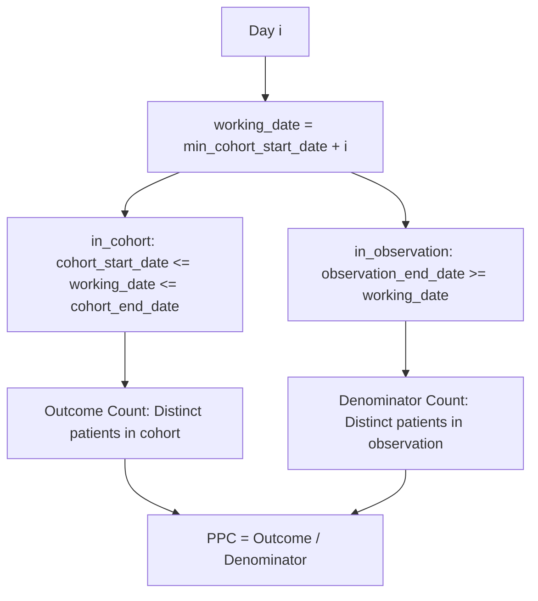

### Stratification Handling

When stratification variables are provided, the analysis calculates separate metrics for each stratum combination:

| Calculation Type | Function | Purpose |
|-----------------|----------|---------|
| Overall (Day 0) | `getOverallStartingCount()` | Baseline patient counts |
| Stratified (Day 0) | `getStratifiedStartingCount()` | Baseline counts by strata |
| Overall (Day i) | `getOverallCounts()` | Daily counts overall |
| Stratified (Day i) | `getStratifiedCounts()` | Daily counts by strata |

Sources: [R/summariseProportionOfPatientsCovered.R:145-230](), [R/summariseProportionOfPatientsCovered.R:192-217](), [tests/testthat/test-summariseProportionOfPatientsCovered.R:276-496]()

## Statistical Calculations and Confidence Intervals

The PPC calculation includes statistical measures to provide confidence intervals around the proportion estimates. This is handled by the `calculatePPC()` function.

### Confidence Interval Method

The function uses the Wilson score interval method for calculating confidence intervals around proportions:

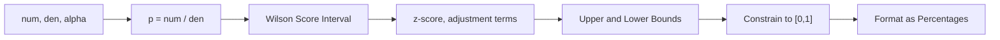

The implementation applies several mathematical transformations:
- Calculate base proportion `p = num / den`
- Apply z-score for specified alpha level (default 0.05 for 95% CI)
- Use Wilson method adjustments for small sample robustness
- Constrain bounds to valid [0,1] range
- Format as percentages with two decimal places

### Output Estimates

Each time point produces multiple estimate types:

| Estimate Name | Type | Description |
|---------------|------|-------------|
| `outcome_count` | integer | Number of patients in cohort |
| `denominator_count` | integer | Number of patients in observation |
| `ppc` | percentage | Proportion of patients covered |
| `ppc_lower` | percentage | Lower confidence bound |
| `ppc_upper` | percentage | Upper confidence bound |

Sources: [R/summariseProportionOfPatientsCovered.R:314-326](), [R/summariseProportionOfPatientsCovered.R:111-125]()

## Usage Patterns and Examples

The function supports various analysis scenarios through its flexible parameter system. The test suite demonstrates key usage patterns.

### Basic Single Cohort Analysis

The simplest usage involves analyzing a single cohort over a specified follow-up period:

```r
result <- cohort |>
  summariseProportionOfPatientsCovered(followUpDays = 365)
```

This produces daily PPC values from day 0 to day 365, showing how treatment coverage changes over one year.

### Multiple Cohort Entries

The function handles patients with multiple cohort entries (treatment episodes) correctly:

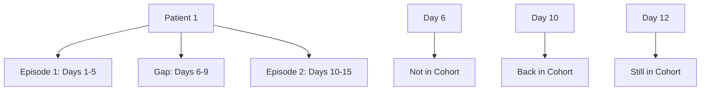

### Stratified Analysis

Stratification allows analysis by patient subgroups:

| Strata Configuration | Result |
|---------------------|--------|
| `strata = list()` | Overall analysis only |
| `strata = list("age_group")` | Separate PPC by age group |
| `strata = list(c("age_group", "sex"))` | Combined age and sex strata |
| `strata = list("age_group", "sex", c("age_group", "sex"))` | Multiple stratification levels |

### Automatic Follow-up Period

When `followUpDays = NULL`, the function calculates follow-up based on data:

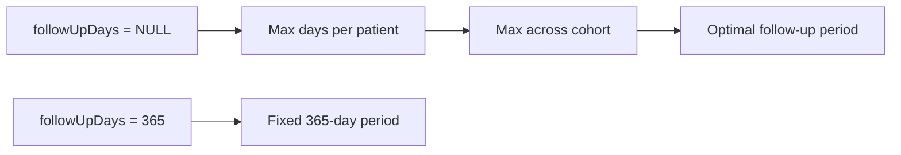

Sources: [tests/testthat/test-summariseProportionOfPatientsCovered.R:1-91](), [tests/testthat/test-summariseProportionOfPatientsCovered.R:93-167](), [tests/testthat/test-summariseProportionOfPatientsCovered.R:169-274]()

## Output Structure and Integration

The function returns a `summarised_result` object following the standardized result format used throughout the DrugUtilisation package. This ensures compatibility with downstream table and plotting functions.

### Result Structure

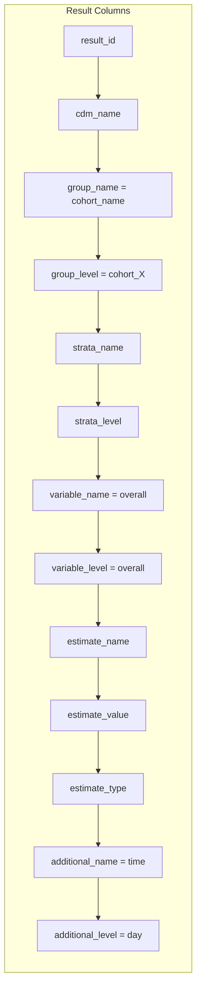

### Analysis Settings

The result includes metadata in the settings attribute:

| Setting | Value |
|---------|-------|
| `result_type` | "summarise_proportion_of_patients_covered" |
| `package_name` | "DrugUtilisation" |
| `package_version` | Current package version |
| `cohort_table_name` | Source table name |

### Integration with Visualization

The standardized output enables direct use with visualization functions:

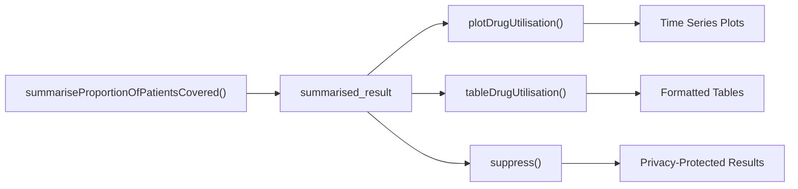

Sources: [R/summariseProportionOfPatientsCovered.R:127-142](), [R/summariseProportionOfPatientsCovered.R:61-67](), [tests/testthat/test-summariseProportionOfPatientsCovered.R:584-602]()

## Error Handling and Edge Cases

The function includes comprehensive error handling and validation to ensure robust operation across different data scenarios.

### Input Validation Errors

| Condition | Error Message |
|-----------|---------------|
| Invalid `followUpDays` | Must be single number above zero |
| Invalid `cohortId` | Cohort ID not in settings |
| Missing strata columns | Strata variable must exist |
| Invalid cohort | Must be cohort_table object |

### Data Quality Handling

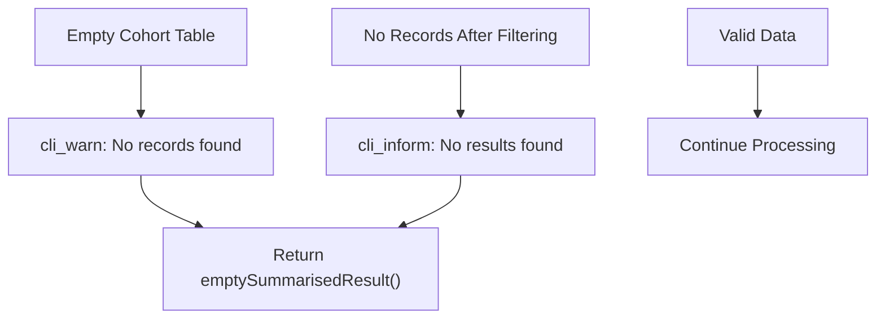

### Special Cases

The function handles several edge cases gracefully:

1. **Empty cohorts**: Returns empty result with appropriate warning
2. **Single-day exposures**: Correctly handles patients with same start/end dates  
3. **Observation period boundaries**: Respects observation_period_end_date limits
4. **Multiple cohort definitions**: Processes each cohort separately
5. **Missing strata combinations**: Returns empty results for non-existent combinations

### Suppression Integration

The result supports the standard `suppress()` function for privacy protection:

```r
ppc_suppressed <- result |> suppress(minCellCount = 5)
```

Sources: [tests/testthat/test-summariseProportionOfPatientsCovered.R:498-549](), [R/summariseProportionOfPatientsCovered.R:68-71](), [R/summariseProportionOfPatientsCovered.R:102-108]()