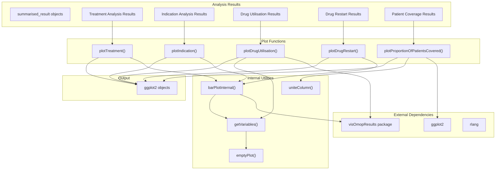
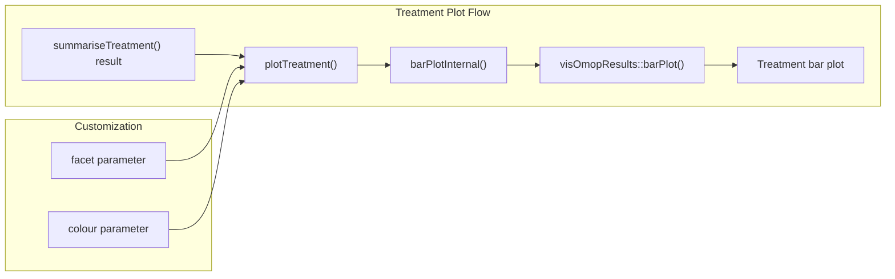
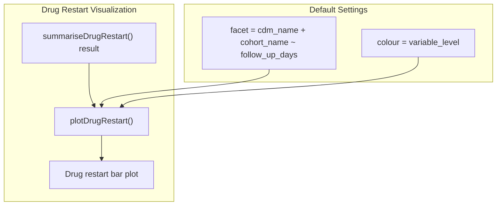
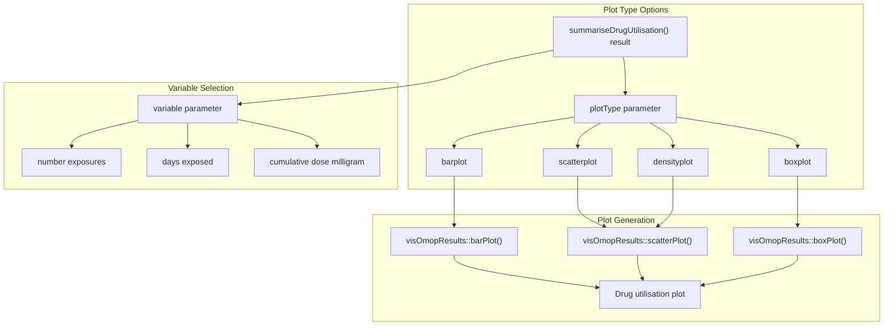
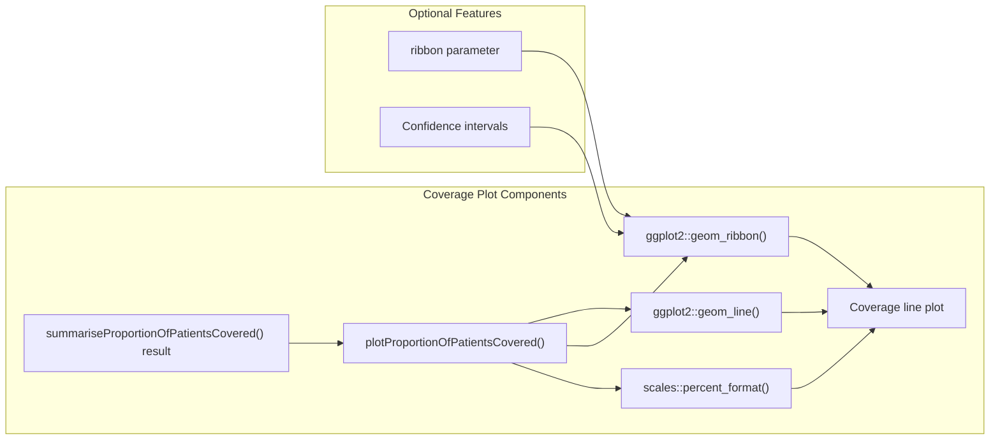
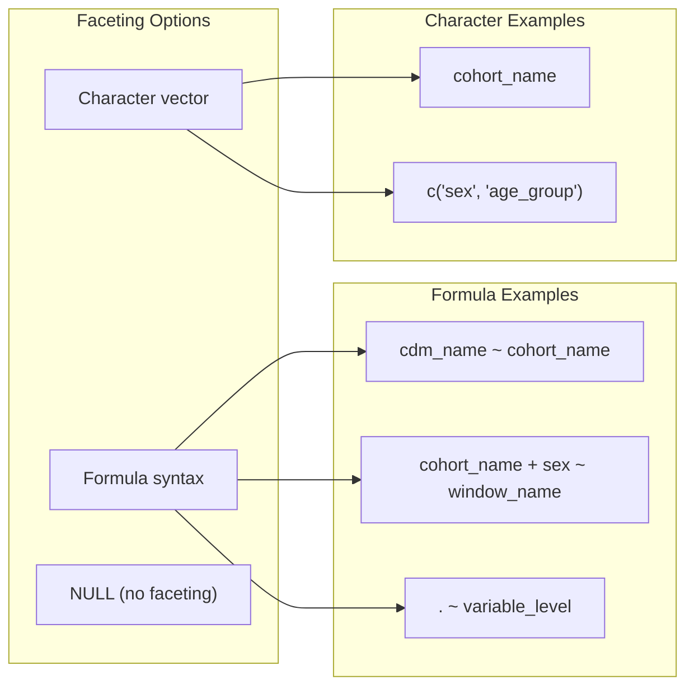
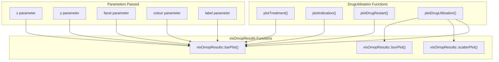

# Page: Plot Generation

# Plot Generation

Relevant source files

The following files were used as context for generating this wiki page:

- [R/plots.R](R/plots.R)
- [man/plotDrugRestart.Rd](man/plotDrugRestart.Rd)
- [man/plotIndication.Rd](man/plotIndication.Rd)
- [man/plotTreatment.Rd](man/plotTreatment.Rd)
- [man/summariseTreatment.Rd](man/summariseTreatment.Rd)
- [tests/testthat/test-generatedAtcCohortSet.R](tests/testthat/test-generatedAtcCohortSet.R)
- [tests/testthat/test-generatedIngredientCohortSet.R](tests/testthat/test-generatedIngredientCohortSet.R)
- [tests/testthat/test-patterns.R](tests/testthat/test-patterns.R)
- [tests/testthat/test-plotProportionOfPatientsCovered.R](tests/testthat/test-plotProportionOfPatientsCovered.R)
- [tests/testthat/test-plots.R](tests/testthat/test-plots.R)

This document covers the visualization system for generating plots from analysis results within the DrugUtilisation package. The plot generation functions create standardized visualizations using ggplot2 from `summarised_result` objects produced by various analysis functions. For table generation from the same analysis results, see [Table Generation](#8.1).

## Purpose and Architecture

The plot generation system provides specialized plotting functions for each analysis type supported by the package. All plotting functions follow a consistent pattern: they accept `summarised_result` objects as input and return customizable ggplot2 objects for visualization.

### Plot Generation System Architecture

Sources: [R/plots.R:1-548]()

## Core Plotting Functions

### Treatment Analysis Plots

The `plotTreatment()` function creates bar plots for treatment analysis results from `summariseTreatment()`. It visualizes the percentage of patients receiving different treatments within specified time windows.

The function accepts parameters for customizing faceting and coloring:
- `facet`: Controls plot faceting, defaults to `cdm_name + cohort_name ~ window_name`
- `colour`: Controls color mapping, defaults to `"variable_level"`

Sources: [R/plots.R:41-51](), [man/plotTreatment.Rd:1-46]()

### Drug Restart Analysis Plots

The `plotDrugRestart()` function visualizes drug restart patterns from `summariseDrugRestart()` results, showing events like discontinuation, switches, and restarts across different follow-up periods.

Sources: [R/plots.R:80-90](), [man/plotDrugRestart.Rd:1-49]()

### Indication Analysis Plots

The `plotIndication()` function creates visualizations for indication analysis results, displaying the distribution of known and unknown indications across different time windows.

Sources: [R/plots.R:128-138](), [man/plotIndication.Rd:1-58]()

### Drug Utilisation Analysis Plots

The `plotDrugUtilisation()` function provides flexible visualization options for drug utilization metrics, supporting multiple plot types and variables.

The function supports four distinct plot types, each with specific requirements:
- **Barplot/Scatterplot**: Requires single estimate, uses `visOmopResults::barPlot()` or `visOmopResults::scatterPlot()`
- **Densityplot**: Requires `density_x` and `density_y` estimates, uses line plotting
- **Boxplot**: Requires five-number summary estimates (`min`, `q25`, `median`, `q75`, `max`)

Sources: [R/plots.R:198-321]()

### Patient Coverage Over Time Plots

The `plotProportionOfPatientsCovered()` function creates line plots showing the proportion of patients covered over time, with optional confidence interval ribbons.

This function includes specialized features:
- Time-based x-axis with days as the unit
- Y-axis formatted as percentages with 0.1% accuracy
- Optional confidence interval ribbons controlled by the `ribbon` parameter
- Automatic handling of proportion data conversion from percentages

Sources: [R/plots.R:358-446]()

## Internal Plotting Utilities

### Bar Plot Internal Function

The `barPlotInternal()` function provides shared functionality for treatment, indication, and drug restart plotting functions.

The function handles common bar plot requirements:
- Result validation and filtering for percentage estimates
- Proper ordering of categorical variables with `rev()` for display
- Window name ordering based on numeric ranges
- Consistent theming with flipped coordinates and top legend positioning

Sources: [R/plots.R:465-531]()

### Helper Functions

The plotting system includes several utility functions:

| Function | Purpose | Usage |
|----------|---------|-------|
| `getVariables()` | Extract variable columns with multiple values | Used for determining plot variables |
| `asCharacterFacet()` | Parse facet formulas into character vectors | Facet handling in drug utilization plots |
| `correctX()` | Handle empty x variable lists | X-axis correction for visOmopResults |
| `uniteColumn()` | Combine multiple columns for grouping | Used in coverage plots for grouping |
| `emptyPlot()` | Create empty ggplot when no data | Fallback for empty results |

Sources: [R/plots.R:322-331](), [R/plots.R:448-463](), [R/plots.R:532-547]()

## Plot Customization Options

### Faceting Options

All plotting functions support flexible faceting through the `facet` parameter:

Sources: [R/plots.R:423-443]()

### Color Mapping

The `colour` parameter controls aesthetic mapping across all plot functions, supporting both single variables and combinations:

- Single variable: `"cohort_name"`, `"sex"`, `"variable_level"`
- Multiple variables: `c("sex", "age_group")` (automatically combined with separator)
- Function-specific defaults optimize for each analysis type

Sources: [R/plots.R:388-394]()

## Integration with External Packages

### visOmopResults Integration

Most plotting functions leverage `visOmopResults` for standardized OMOP result visualization:

The integration ensures consistent styling and behavior across the DARWIN EU ecosystem while allowing function-specific customizations.

Sources: [R/plots.R:203-204](), [R/plots.R:471-472]()