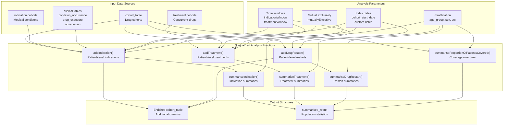
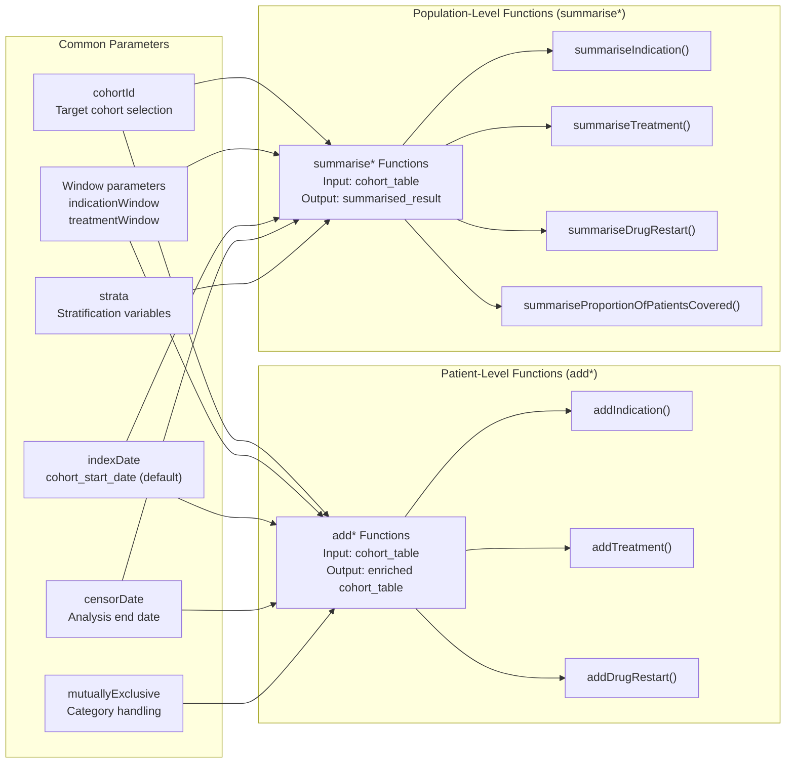
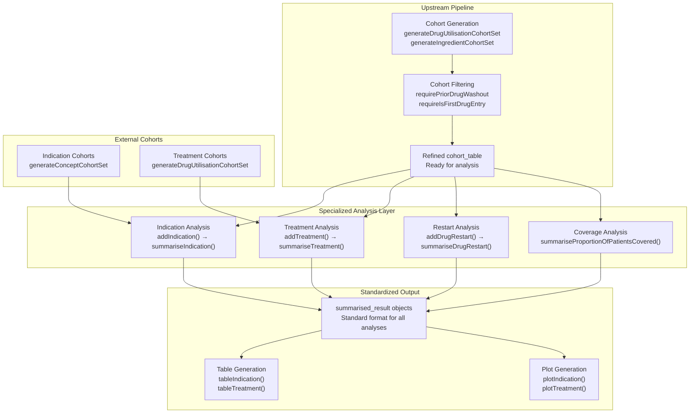

# Page: Specialized Analysis Functions

# Specialized Analysis Functions

Relevant source files

The following files were used as context for generating this wiki page:

- [man/addIndication.Rd](man/addIndication.Rd)
- [man/summariseIndication.Rd](man/summariseIndication.Rd)
- [tests/testthat/test-indication.R](tests/testthat/test-indication.R)
- [tests/testthat/test-summariseTreatment.R](tests/testthat/test-summariseTreatment.R)

This document covers advanced analysis capabilities in the DrugUtilisation package for specific research questions beyond basic drug utilization metrics. These specialized functions enable investigation of drug indications, treatment patterns, restart behaviors, and patient coverage over time.

For basic drug utilization analysis (exposures, eras, doses), see [Drug Utilisation Analysis](#5). For cohort generation and filtering, see [Cohort Management](#4).

## Purpose and Scope

The specialized analysis functions extend the core drug utilization capabilities to address complex research questions:

- **Indication Analysis**: Determine medical reasons for drug use by linking to indication cohorts or clinical events
- **Treatment Analysis**: Analyze concurrent treatments and treatment sequences within specified time windows  
- **Drug Restart Analysis**: Track discontinuation and restart patterns with detailed follow-up
- **Patient Coverage Analysis**: Calculate proportion of patients covered over time for adherence assessment

These functions follow consistent patterns with `add*` functions for patient-level data enrichment and `summarise*` functions for population-level aggregation.

## Core Analysis Components

The specialized analysis system operates on refined cohorts and produces standardized results through modular analysis components:

Sources: [tests/testthat/test-indication.R:1-677](), [tests/testthat/test-summariseTreatment.R:1-71](), [man/addIndication.Rd:1-86](), [man/summariseIndication.Rd:1-88]()

## Function Pattern Architecture

All specialized analysis functions follow a consistent dual-pattern architecture with patient-level and population-level functions:

Sources: [man/addIndication.Rd:6-18](), [man/summariseIndication.Rd:6-18](), [tests/testthat/test-indication.R:65-100](), [tests/testthat/test-summariseTreatment.R:4-13]()

## Integration with Analysis Pipeline

The specialized analysis functions integrate seamlessly with the core DrugUtilisation pipeline, operating on refined cohorts and producing standardized outputs:

Sources: [tests/testthat/test-indication.R:606-612](), [tests/testthat/test-summariseTreatment.R:15-26](), [man/summariseIndication.Rd:49-60]()

## Key Analysis Parameters

The specialized analysis functions share common parameter patterns that control their behavior:

| Parameter | Description | Functions | Example Values |
|-----------|-------------|-----------|----------------|
| `indicationWindow` | Time window for indication search | `addIndication`, `summariseIndication` | `list(c(0, 0), c(-30, 0), c(-Inf, 0))` |
| `treatmentWindow` | Time window for treatment analysis | `addTreatment`, `summariseTreatment` | `list(c(0, 30), c(31, 365))` |
| `unknownIndicationTable` | Clinical tables for unknown indications | `addIndication`, `summariseIndication` | `"condition_occurrence"` |
| `mutuallyExclusive` | Category exclusivity handling | `addIndication`, `addTreatment` | `TRUE` (default), `FALSE` |
| `indexDate` | Reference date for analysis | All functions | `"cohort_start_date"` (default) |
| `censorDate` | Analysis end date | All functions | `"cohort_end_date"`, custom column |
| `strata` | Stratification variables | `summarise*` functions | `list("age_group", "sex")` |

Sources: [man/addIndication.Rd:20-47](), [man/summariseIndication.Rd:20-47](), [tests/testthat/test-indication.R:313-325](), [tests/testthat/test-summariseTreatment.R:35-45]()

## Detailed Analysis Documentation

For comprehensive documentation of each specialized analysis type:

- **[Indication Analysis](#6.1)**: Medical indication identification using cohorts and clinical tables
- **[Treatment Analysis](#6.2)**: Concurrent treatment patterns and sequences  
- **[Drug Restart Analysis](#6.3)**: Discontinuation and restart pattern tracking
- **[Patient Coverage Analysis](#6.4)**: Treatment persistence and adherence assessment

Each subsection provides detailed parameter explanations, usage examples, and interpretation guidelines for the respective analysis type.