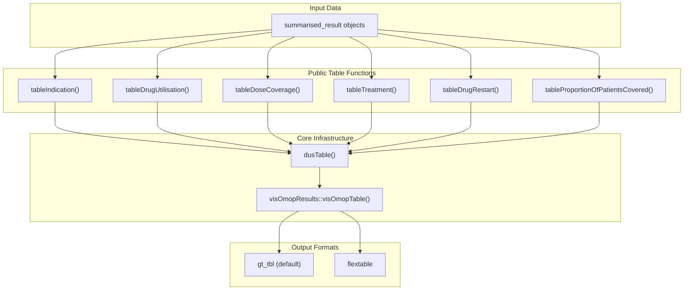
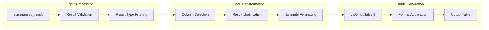

# Page: Table Generation

# Table Generation

<details>
<summary>Relevant source files</summary>

The following files were used as context for generating this wiki page:

- [R/documentationHelpers.R](R/documentationHelpers.R)
- [R/tables.R](R/tables.R)
- [man/tableDoc.Rd](man/tableDoc.Rd)
- [man/tableDoseCoverage.Rd](man/tableDoseCoverage.Rd)
- [man/tableDrugRestart.Rd](man/tableDrugRestart.Rd)
- [man/tableDrugUtilisation.Rd](man/tableDrugUtilisation.Rd)
- [man/tableIndication.Rd](man/tableIndication.Rd)
- [man/tableProportionOfPatientsCovered.Rd](man/tableProportionOfPatientsCovered.Rd)
- [man/tableTreatment.Rd](man/tableTreatment.Rd)
- [tests/testthat/test-summariseDrugRestart.R](tests/testthat/test-summariseDrugRestart.R)
- [tests/testthat/test-tables.R](tests/testthat/test-tables.R)

</details>


## Purpose and Scope

The table generation system provides formatted, publication-ready tables from drug utilization analysis results. This system converts `summarised_result` objects produced by analysis functions into visual tables using standardized formatting and customization options. All table functions integrate with the `visOmopResults` package to ensure consistent formatting across the DARWIN EU ecosystem.

For information about generating plots from analysis results, see [Plot Generation](#8.2). For details about the analysis functions that produce the input data, see [Drug Utilisation Analysis](#5) and [Specialized Analysis Functions](#6).

## System Architecture

The table generation system is built around a common internal function `dusTable()` that standardizes the formatting process for different result types. Each public table function handles a specific type of analysis result while delegating the core formatting logic to this shared infrastructure.

### Table Generation Functions



**Sources:** [R/tables.R:321-392]()

### Common Table Generation Workflow



**Sources:** [R/tables.R:331-392]()

## Core Table Infrastructure

### The `dusTable()` Function

The `dusTable()` function serves as the central table generation engine, providing common functionality used by all public table functions:

**Key Responsibilities:**
- Input validation and result filtering by `result_type`
- Column management (header, grouping, hiding)
- Result modification through custom functions
- Estimate name formatting and templates
- Integration with `visOmopResults::visOmopTable()`

**Function Signature:**
```r
dusTable(result, resultType, header, groupColumn, hide, rename, 
         .options, modifyResults, estimateName, type)
```

**Core Validation Steps:**
1. Validates `summarised_result` input using `omopgenerics::validateResultArgument()`
2. Filters results to specified `result_type` 
3. Checks for overlapping columns in header, groupColumn, and hide parameters
4. Verifies package version compatibility

**Sources:** [R/tables.R:321-392](), [R/tables.R:420-432]()

### Result Type Filtering

Each table function targets a specific `result_type` from analysis functions:

| Table Function | Result Type | Source Analysis |
|---|---|---|
| `tableIndication()` | "summarise_indication" | `summariseIndication()` |
| `tableDrugUtilisation()` | "summarise_drug_utilisation" | `summariseDrugUtilisation()` |
| `tableDoseCoverage()` | "summarise_dose_coverage" | `summariseDoseCoverage()` |
| `tableTreatment()` | "summarise_treatment" | `summariseTreatment()` |
| `tableDrugRestart()` | "summarise_drug_restart" | `summariseDrugRestart()` |
| `tableProportionOfPatientsCovered()` | "summarise_proportion_of_patients_covered" | `summariseProportionOfPatientsCovered()` |

**Sources:** [R/tables.R:42-68](), [R/tables.R:90-113](), [R/tables.R:141-168]()

## Individual Table Functions

### Indication Tables

The `tableIndication()` function formats indication analysis results into tables showing the distribution of medical indications for drug use.

**Key Features:**
- Filters out "number" variables from display using `modifyResults`
- Renames "variable_level" to "Indication" for clarity
- Uses "N (%)" estimate formatting for count and percentage display
- Hides technical columns like window_name, indication_cohort_name

**Default Configuration:**
```r
tableIndication(result,
  header = c("cdm_name", "cohort_name", strataColumns(result)),
  groupColumn = "variable_name",
  hide = c("window_name", "mutually_exclusive", "unknown_indication_table", 
           "censor_date", "cohort_table_name", "index_date", "indication_cohort_name"))
```

**Sources:** [R/tables.R:42-68]()

### Drug Utilisation Tables

The `tableDrugUtilisation()` function creates comprehensive tables for drug utilization metrics including exposures, eras, doses, and quantities.

**Estimate Formats:**
- "missing N (%)" - Missing count and percentage
- "N" - Simple counts
- "Mean (SD)" - Continuous variable summaries  
- "Median (Q25 - Q75)" - Distribution summaries

**Default Configuration:**
```r
tableDrugUtilisation(result,
  header = c("cdm_name"),
  groupColumn = c("cohort_name", strataColumns(result)),
  hide = c("variable_level", "censor_date", "cohort_table_name", 
           "gap_era", "index_date", "restrict_incident"))
```

**Sources:** [R/tables.R:141-168]()

### Dose Coverage Tables

The `tableDoseCoverage()` function formats dose coverage analysis results, showing completeness and distribution of dose information.

**Unique Features:**
- Groups by both "cdm_name" and "ingredient_name"
- Displays multiple estimate types including missing counts and statistical summaries
- Focuses on ingredient-specific dose coverage metrics

**Sources:** [R/tables.R:90-113]()

### Treatment and Restart Tables

Both `tableTreatment()` and `tableDrugRestart()` functions follow similar patterns:

**Common Features:**
- Use "Treatment" as the display name for "variable_level"
- Format estimates as "N (%)" for count and percentage
- Group results by "variable_name" (treatment/restart categories)
- Hide technical parameters from display

**Sources:** [R/tables.R:194-216](), [R/tables.R:244-267]()

### Patient Coverage Tables

The `tableProportionOfPatientsCovered()` function creates specialized tables for patient coverage over time.

**Unique Features:**
- Filters estimates to only show "ppc" (proportion of patients covered) metrics
- Provides multiple PPC estimate formats including confidence intervals
- Uses time-based grouping and stratification

**Estimate Templates:**
```r
estimateName = c(
  "PPC (95%CI)" = "<ppc>% [<ppc_lower>% - <ppc_upper>%]",
  "PPC" = "<ppc>%",
  "PPC lower" = "<ppc_lower>%", 
  "PPC upper" = "<ppc_upper>%"
)
```

**Sources:** [R/tables.R:293-319]()

## Customization and Configuration

### Common Parameters

All table functions support the same core customization parameters:

**Layout Control:**
- `header`: Columns to use as table headers
- `groupColumn`: Columns for row grouping
- `hide`: Columns to exclude from display

**Output Control:**
- `type`: Output format ("gt" or "flextable")
- `.options`: Additional formatting options for `visOmopResults`

### Dynamic Column Discovery

Table functions use helper functions to discover available columns:
- `strataColumns(result)`: Identifies stratification columns
- Column availability can be checked with `availableTableColumns(result)`

**Sources:** [R/tables.R:42-52](), [R/documentationHelpers.R:10-26]()

### Estimate Name Templates

Each table function defines estimate name templates that control how statistical estimates are displayed:

```r
# Example from tableDrugUtilisation
estimateName = c(
  "missing N (%)" = "<count_missing> (<percentage_missing> %)",
  "N" = "<count>",
  "Mean (SD)" = "<mean> (<sd>)",
  "Median (Q25 - Q75)" = "<median> (<q25> - <q75>)"
)
```

These templates use placeholder syntax where `<estimate_name>` values from the result are substituted into the display format.

**Sources:** [R/tables.R:159-164](), [R/tables.R:310-315]()

## Integration with visOmopResults

### Dependency and Validation

The table system has a hard dependency on `visOmopResults` and checks for its availability:

```r
rlang::check_installed("visOmopResults")
```

### Table Type Support

Output formats are validated against `visOmopResults::tableType()`:
- "gt" (default): Creates `gt_tbl` objects for HTML/print output
- "flextable": Creates `flextable` objects for Word/PowerPoint compatibility

### Version Compatibility

The system includes version checking to warn when results were generated with different package versions:

```r
checkVersion(result)  # Warns if package versions differ
```

**Sources:** [R/tables.R:332](), [R/tables.R:420-432]()

## Error Handling and Edge Cases

### Empty Results

When no results match the specified `result_type`, functions return empty tables:

```r
if (nrow(result) == 0) {
  cli::cli_warn("There are no results with `result_type = {resultType}`")
  return(emptyTable(type))
}
```

### Parameter Validation

The system validates parameter intersections to prevent conflicts:

```r
checkIntersection(cols, call)  # Ensures no column appears in multiple parameters
```

### Result Modification

Some table functions apply custom filters or transformations:
- `tableIndication()`: Filters out "number" variables
- `tableProportionOfPatientsCovered()`: Filters to "ppc" estimates only

**Sources:** [R/tables.R:347-351](), [R/tables.R:398-419](), [R/tables.R:306-309]()