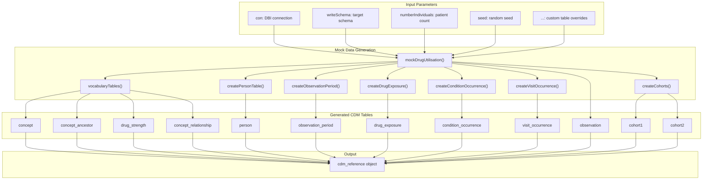
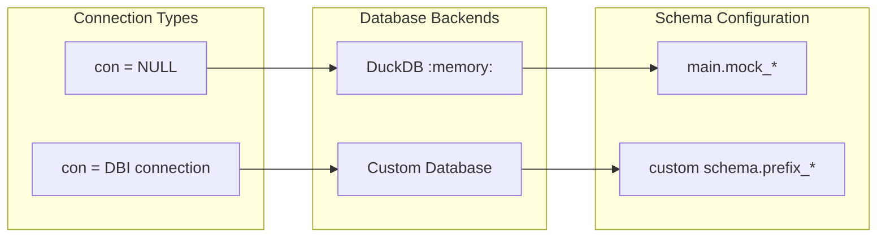
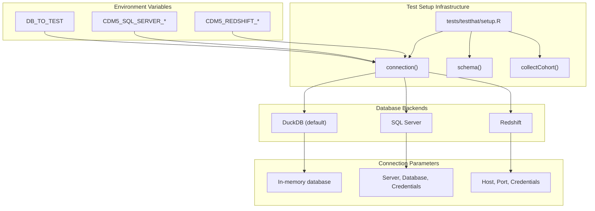
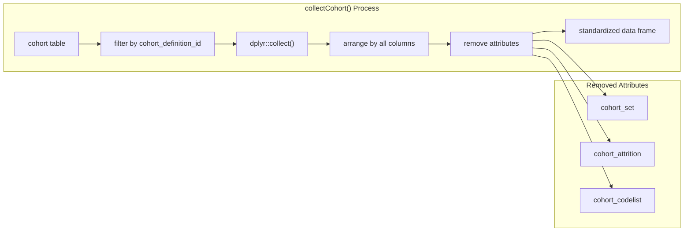
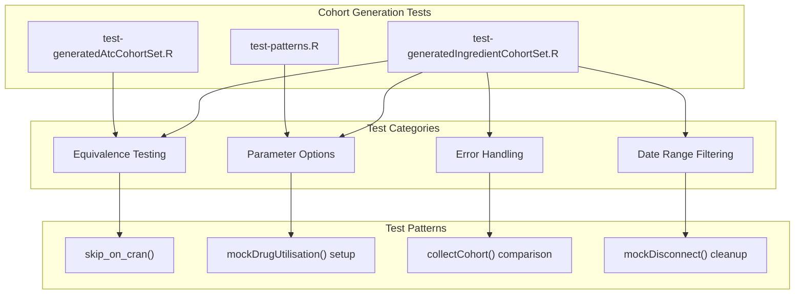
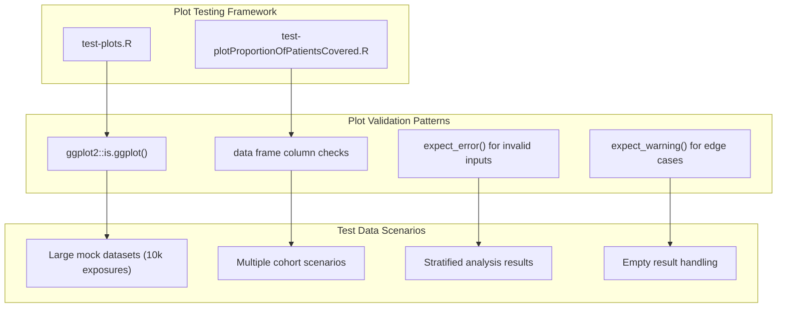

# Page: Testing and Mock Data

# Testing and Mock Data

Relevant source files

The following files were used as context for generating this wiki page:

- [R/mockDrugUtilisation.R](R/mockDrugUtilisation.R)
- [man/mockDrugUtilisation.Rd](man/mockDrugUtilisation.Rd)
- [man/plotProportionOfPatientsCovered.Rd](man/plotProportionOfPatientsCovered.Rd)
- [tests/testthat/setup.R](tests/testthat/setup.R)
- [tests/testthat/test-generatedAtcCohortSet.R](tests/testthat/test-generatedAtcCohortSet.R)
- [tests/testthat/test-generatedIngredientCohortSet.R](tests/testthat/test-generatedIngredientCohortSet.R)
- [tests/testthat/test-patterns.R](tests/testthat/test-patterns.R)
- [tests/testthat/test-plotProportionOfPatientsCovered.R](tests/testthat/test-plotProportionOfPatientsCovered.R)
- [tests/testthat/test-plots.R](tests/testthat/test-plots.R)

This document covers the testing framework and mock data generation systems used for developing and validating the DrugUtilisation package. The testing infrastructure supports multiple database backends and provides comprehensive mock OMOP CDM data for reproducible testing scenarios.

For information about the package's exported functions and public API, see [Function Exports and API](#9.1). For details about documentation generation and CI/CD processes, see [Documentation and CI/CD](#9.3).

## Mock Data Generation System

The DrugUtilisation package provides a comprehensive mock data generation system through the `mockDrugUtilisation()` function, which creates complete OMOP CDM databases for testing purposes.

### Core Mock Data Architecture

**Sources:** [R/mockDrugUtilisation.R:17-160]()

### Mock Data Generation Process

The `mockDrugUtilisation()` function follows a systematic approach to create comprehensive mock CDM databases:

| Component | Function | Purpose | Default Behavior |
|-----------|----------|---------|------------------|
| **Vocabulary Tables** | `vocabularyTables()` | Creates concept, concept_ancestor, drug_strength, concept_relationship | Uses predefined mock vocabulary data |
| **Person Demographics** | `createPersonTable()` | Generates person records with demographics | Creates random demographics for specified number of individuals |
| **Observation Periods** | `createObservationPeriod()` | Defines patient observation windows | Random periods between birth and 2023-01-01 |
| **Drug Exposures** | `createDrugExposure()` | Generates drug exposure records | Poisson-distributed exposures using drug concepts |
| **Conditions** | `createConditionOccurrence()` | Creates condition occurrence records | Random conditions during observation periods |
| **Cohorts** | `createCohorts()` | Generates cohort membership data | Two default cohorts with random membership |

**Sources:** [R/mockDrugUtilisation.R:163-573]()

### Database Connection Management

**Sources:** [R/mockDrugUtilisation.R:51-52]()

## Testing Framework Structure

The package uses the `testthat` framework with specialized utilities for multi-database testing and cohort comparison.

### Test Environment Setup

**Sources:** [tests/testthat/setup.R:1-44]()

### Database Backend Configuration

The testing framework supports multiple database backends through environment-driven configuration:

| Backend | Environment Variable | Connection Parameters |
|---------|---------------------|----------------------|
| **DuckDB** | `DB_TO_TEST="duckdb"` | In-memory connection |
| **SQL Server** | `DB_TO_TEST="sql server"` | Server, Database, UID, PWD from environment |
| **Redshift** | `DB_TO_TEST="redshift"` | Host, Port, Database, User, Password from environment |

**Schema Configuration:**
- **DuckDB:** `c(schema = "main", prefix = "dus_")`
- **SQL Server:** Uses `CDM5_SQL_SERVER_OHDSI_SCHEMA` environment variable
- **Redshift:** Uses `CDM5_REDSHIFT_SCRATCH_SCHEMA` environment variable

**Sources:** [tests/testthat/setup.R:2-31]()

## Testing Utilities

### Cohort Data Collection and Comparison

The `collectCohort()` utility function standardizes cohort data extraction for testing:

**Sources:** [tests/testthat/setup.R:32-44]()

### Mock Database Lifecycle Management

Testing follows a consistent pattern for database setup and teardown:

1. **Setup:** `cdm <- mockDrugUtilisation(con = connection(), writeSchema = schema())`
2. **Test Operations:** Generate cohorts, run analyses, collect results
3. **Assertions:** Compare expected vs actual results using `expect_equal()`
4. **Teardown:** `mockDisconnect(cdm = cdm)`

**Sources:** [tests/testthat/test-generatedIngredientCohortSet.R:3-28]()

## Test Organization Patterns

### Cohort Generation Testing

**Sources:** [tests/testthat/test-generatedIngredientCohortSet.R:1-128](), [tests/testthat/test-generatedAtcCohortSet.R:1-33](), [tests/testthat/test-patterns.R:1-65]()

### Visualization Testing

Visualization tests focus on plot generation and data structure validation:

**Sources:** [tests/testthat/test-plots.R:1-263](), [tests/testthat/test-plotProportionOfPatientsCovered.R:1-154]()

### Mock Data Customization Testing

Tests demonstrate how to customize mock data for specific scenarios:

| Test Scenario | Custom Tables | Purpose |
|---------------|---------------|---------|
| **Drug Restart Analysis** | `drug_exposure`, `dus_cohort`, `observation_period`, `person` | Complex temporal patterns |
| **Indication Analysis** | `targetCohortName`, `indicationCohortName`, `condition_occurrence` | Medical indication testing |
| **Large Scale Testing** | 10,000 exposures, 1,000 persons | Performance and scalability |
| **Pattern Testing** | Custom `drug_strength`, `concept`, `concept_relationship` | Dose calculation validation |

**Sources:** [tests/testthat/test-plots.R:6-64](), [tests/testthat/test-plots.R:94-154](), [tests/testthat/test-patterns.R:3-42]()