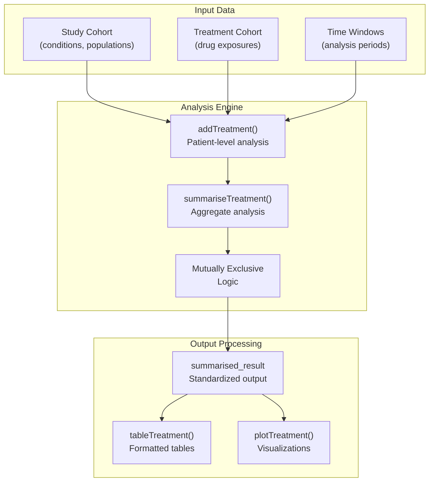
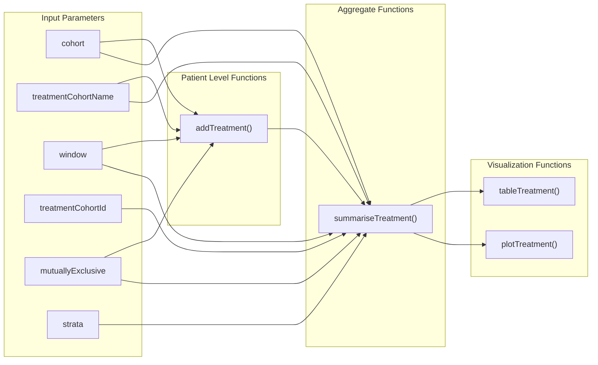
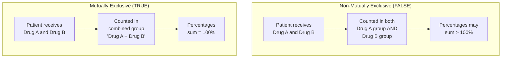
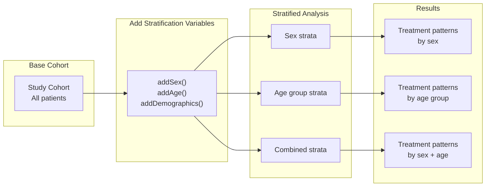
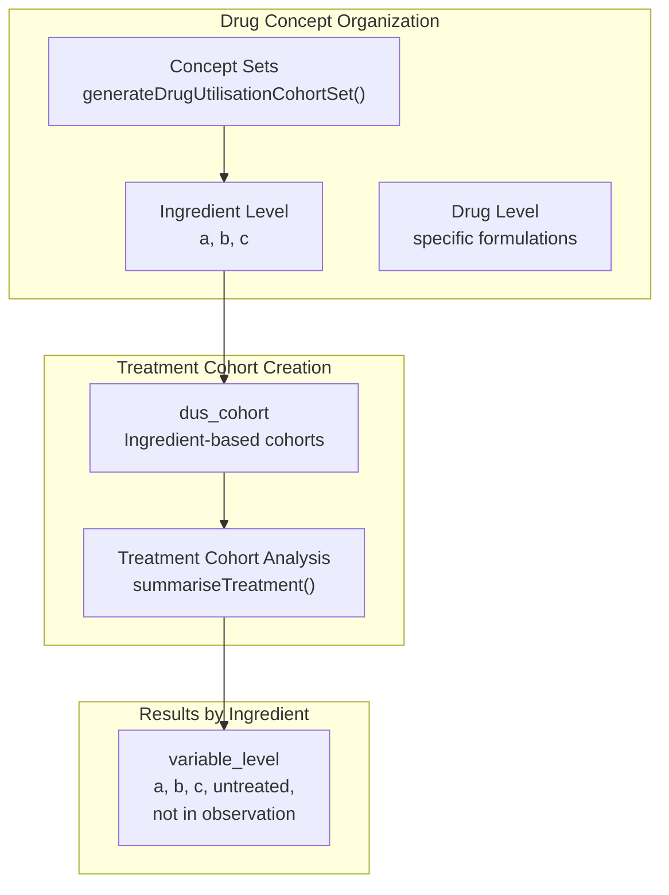
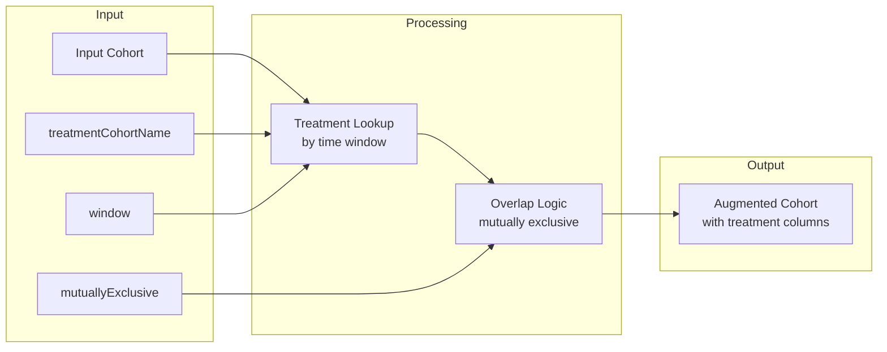

# Page: Treatment Analysis

# Treatment Analysis

Relevant source files

The following files were used as context for generating this wiki page:

- [tests/testthat/test-summariseTreatment.R](tests/testthat/test-summariseTreatment.R)
- [vignettes/daily_dose_calculation.Rmd](vignettes/daily_dose_calculation.Rmd)
- [vignettes/drug_utilisation.Rmd](vignettes/drug_utilisation.Rmd)
- [vignettes/summarise_treatments.Rmd](vignettes/summarise_treatments.Rmd)

## Purpose and Scope

Treatment analysis in the DrugUtilisation package enables researchers to characterize the treatments received by patients within study cohorts. This functionality analyzes which treatments patients receive during specified time windows following their entry into a study cohort, providing insights into treatment patterns, concurrent medication use, and treatment coverage across different patient populations.

For analysis of drug utilization metrics (exposures, eras, doses), see [Drug Utilisation Analysis](#5). For analysis of medical indications for drug use, see [Indication Analysis](#6.1). For analysis of drug restart patterns after discontinuation, see [Drug Restart Analysis](#6.3).

## Treatment Analysis Workflow

Treatment analysis follows a structured workflow that connects study cohorts with treatment cohorts to produce aggregate summaries:

**Core Treatment Analysis Flow**
Sources: [vignettes/summarise_treatments.Rmd:65-81](), [tests/testthat/test-summariseTreatment.R:1-56]()

## Core Functions and Relationships

The treatment analysis system centers around two primary functions that work at different aggregation levels:

**Function Relationships and Parameter Flow**
Sources: [vignettes/summarise_treatments.Rmd:65-131](), [tests/testthat/test-summariseTreatment.R:58-69]()

## Treatment Analysis Parameters

### Core Parameters

| Parameter | Type | Description | Example |
|-----------|------|-------------|---------|
| `cohort` | cohort_table | Study cohort with patients of interest | `cdm$cohort1` |
| `treatmentCohortName` | character | Name of treatment cohort table | `"cohort2"` |
| `window` | list | Time windows for analysis | `list(c(0, 30), c(31, 365))` |
| `treatmentCohortId` | numeric | Specific treatment cohorts to include | `c(1, 2, 3)` |
| `mutuallyExclusive` | logical | Whether to create non-overlapping treatment groups | `FALSE` |
| `strata` | list | Stratification variables | `list("sex", "age_group")` |

Sources: [vignettes/summarise_treatments.Rmd:65-114]()

### Date and Temporal Parameters

| Parameter | Type | Description | Default |
|-----------|------|-------------|---------|
| `indexDate` | character | Column name for analysis start date | `"cohort_start_date"` |
| `censorDate` | character | Column name for analysis end date | `"cohort_end_date"` |

Sources: [vignettes/summarise_treatments.Rmd:110-113]()

## Treatment Analysis Patterns

### Mutually Exclusive vs Non-Mutually Exclusive Analysis

The `mutuallyExclusive` parameter fundamentally changes how treatment overlap is handled:

**Treatment Overlap Handling Strategies**
Sources: [vignettes/summarise_treatments.Rmd:113-133]()

### Treatment Categories

The analysis produces standardized treatment categories for each patient within each time window:

| Category | Description | Condition |
|----------|-------------|-----------|
| Treatment cohort names | Specific treatments received | Patient in treatment cohort during window |
| `"untreated"` | No treatment received | Patient observable but not in any treatment cohort |
| `"not in observation"` | Patient not observable | Patient outside observation period during window |

Sources: [tests/testthat/test-summariseTreatment.R:11-12](), [tests/testthat/test-summariseTreatment.R:28-31]()

## Stratification and Analysis Customization

### Stratified Analysis

Treatment analysis supports stratification by patient characteristics:

**Stratified Treatment Analysis Workflow**
Sources: [vignettes/summarise_treatments.Rmd:83-105]()

### Concept Set Integration

Treatment analysis integrates with drug concept sets for ingredient-level analysis:

**Concept Set to Treatment Analysis Integration**
Sources: [tests/testthat/test-summariseTreatment.R:14-32]()

## Output Structure and Visualization

### summarised_result Structure

Treatment analysis functions return standardized `summarised_result` objects with specific column structures:

| Column | Content | Example Values |
|--------|---------|----------------|
| `variable_level` | Treatment categories | `"cohort_1"`, `"cohort_2"`, `"untreated"` |
| `additional_level` | Time windows | `"0 to 30"`, `"31 to 365"` |
| `group_level` | Study cohort | `"cohort_1"`, `"cohort_2"` |
| `strata_level` | Stratification groups | `"sex &&& age_group"` |

Sources: [tests/testthat/test-summariseTreatment.R:10-12](), [tests/testthat/test-summariseTreatment.R:32]()

### Table and Plot Generation

The package provides specialized visualization functions for treatment analysis results:

- `tableTreatment()` - Generates formatted tables using gt, flextable, or tibble formats
- `plotTreatment()` - Creates bar plots showing treatment percentages with customizable faceting and colors

Sources: [vignettes/summarise_treatments.Rmd:141-157]()

## Function Implementation Details

### addTreatment Function

The `addTreatment()` function adds patient-level treatment information to cohort tables:

**addTreatment Function Architecture**
Sources: [tests/testthat/test-summariseTreatment.R:58-69]()

### summariseTreatment Function

The `summariseTreatment()` function aggregates treatment patterns across cohorts:

Key parameters validation and testing patterns include:
- Support for multiple time windows simultaneously
- Cohort ID ordering and filtering capabilities  
- Integration with suppression for small cell counts
- Concept set compatibility for ingredient-level analysis

Sources: [tests/testthat/test-summariseTreatment.R:1-56](), [vignettes/summarise_treatments.Rmd:75-81]()