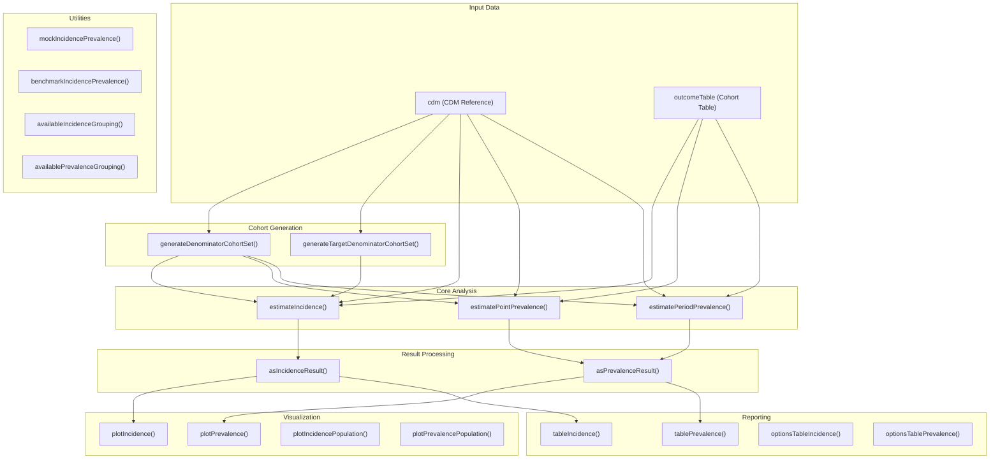
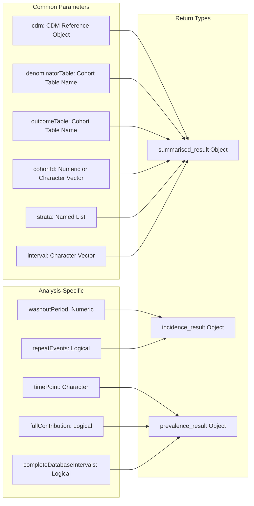
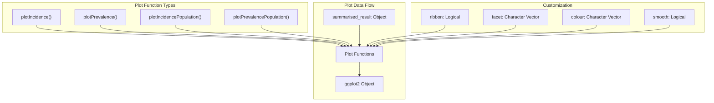
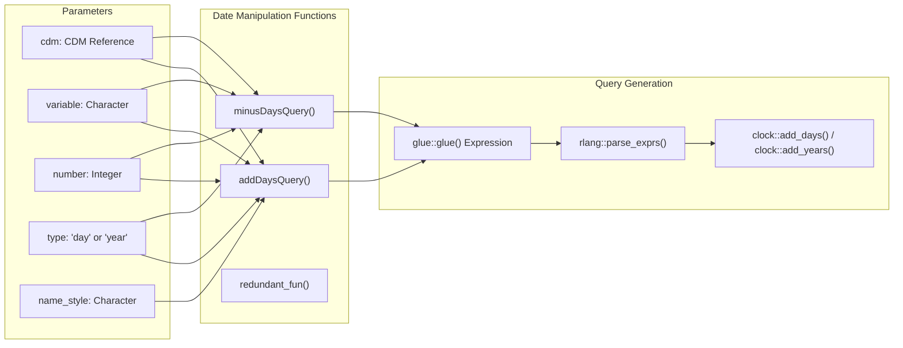

# Page: API Reference

# API Reference

Relevant source files

The following files were used as context for generating this wiki page:

- [.gitignore](.gitignore)
- [R/dateUtilities.R](R/dateUtilities.R)
- [_pkgdown.yml](_pkgdown.yml)
- [man/estimatePeriodPrevalence.Rd](man/estimatePeriodPrevalence.Rd)
- [man/estimatePointPrevalence.Rd](man/estimatePointPrevalence.Rd)

This page provides comprehensive documentation of all public functions, data structures, and interfaces provided by the IncidencePrevalence package. The API is organized into three main categories: core analysis functions for estimating incidence and prevalence, visualization and reporting functions, and utility functions for data management and validation.

For detailed implementation guides and usage examples, see [Getting Started](#2), [Incidence Analysis](#5), and [Prevalence Analysis](#6). For information about the underlying concepts and data structures, see [Core Concepts](#3).

## Function Categories Overview

The IncidencePrevalence package API is structured around epidemiological analysis workflows, with functions grouped by their role in the analysis pipeline:

*Sources: [_pkgdown.yml:6-30]()*

## Function Signature Patterns

IncidencePrevalence functions follow consistent parameter patterns based on OMOP CDM conventions:

*Sources: [man/estimatePointPrevalence.Rd:6-18](), [man/estimatePeriodPrevalence.Rd:6-19]()*

## Core Analysis Functions

### Cohort Generation Functions

| Function | Purpose | Key Parameters | Return Type |
|----------|---------|----------------|-------------|
| `generateDenominatorCohortSet()` | Create denominator population cohorts | `cdm`, `cohortDateRange`, `ageGroup`, `sex` | CDM with denominator table |
| `generateTargetDenominatorCohortSet()` | Create target-specific denominator cohorts | `cdm`, `targetCohortTable`, `targetCohortId` | CDM with target denominator table |

### Incidence Estimation Functions

| Function | Purpose | Key Parameters | Return Type |
|----------|---------|----------------|-------------|
| `estimateIncidence()` | Calculate incidence rates | `washoutPeriod`, `repeatEvents`, `censorOnOutcome` | `incidence_result` |

### Prevalence Estimation Functions

| Function | Purpose | Key Parameters | Return Type |
|----------|---------|----------------|-------------|
| `estimatePointPrevalence()` | Calculate point prevalence | `timePoint`, `interval` | `prevalence_result` |
| `estimatePeriodPrevalence()` | Calculate period prevalence | `fullContribution`, `completeDatabaseIntervals` | `prevalence_result` |

*Sources: [_pkgdown.yml:7-15]()*

## Visualization and Reporting Functions

### Plotting Functions

The plotting system provides consistent visualization across analysis types:

### Table Generation Functions

| Function | Purpose | Key Parameters | Return Type |
|----------|---------|----------------|-------------|
| `tableIncidence()` | Format incidence results as tables | `type`, `header`, `splitStrata` | Formatted table object |
| `tablePrevalence()` | Format prevalence results as tables | `type`, `header`, `splitStrata` | Formatted table object |
| `optionsTableIncidence()` | Get table formatting options for incidence | None | List of options |
| `optionsTablePrevalence()` | Get table formatting options for prevalence | None | List of options |

*Sources: [_pkgdown.yml:19-24]()*

## Utility Functions

### Data Management

| Function | Purpose | Parameters | Return Type |
|----------|---------|------------|-------------|
| `mockIncidencePrevalence()` | Generate mock OMOP CDM data | `sampleSize`, `seed`, `earliestObservationStartDate` | CDM reference object |
| `asIncidenceResult()` | Convert to incidence result format | `x` | `incidence_result` |
| `asPrevalenceResult()` | Convert to prevalence result format | `x` | `prevalence_result` |

### Analysis Support

| Function | Purpose | Parameters | Return Type |
|----------|---------|------------|-------------|
| `availableIncidenceGrouping()` | Get available grouping variables for incidence | `result` | Character vector |
| `availablePrevalenceGrouping()` | Get available grouping variables for prevalence | `result` | Character vector |
| `benchmarkIncidencePrevalence()` | Performance benchmarking | `cdm`, `config` | Benchmark results |

*Sources: [_pkgdown.yml:25-30]()*

## Internal Utility Functions

The package includes several internal utility functions for date manipulation and query generation:

### Date Utilities

The `addDaysQuery()` and `minusDaysQuery()` functions generate database-specific SQL expressions for date arithmetic, handling differences between database backends like Spark which requires special handling for year arithmetic.

*Sources: [R/dateUtilities.R:16-95]()*

## Parameter Validation

All public functions include comprehensive parameter validation following omopgenerics standards. Common validation patterns include:

- CDM reference object validation
- Cohort table existence checks  
- Parameter type and range validation
- Database compatibility checks
- Strata variable validation

The validation system ensures early error detection and provides clear error messages to guide users toward correct parameter usage.

For detailed information about specific function parameters and validation rules, see [Input Validation System](#8.1). For implementation details of individual functions, see [Main Analysis Functions](#9.1), [Visualization and Table Functions](#9.2), and [Utility and Helper Functions](#9.3).

*Sources: [_pkgdown.yml:1-31](), [man/estimatePointPrevalence.Rd:1-72](), [man/estimatePeriodPrevalence.Rd:1-88]()*