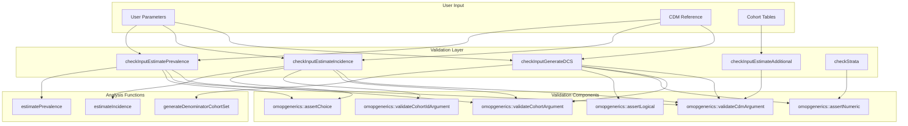
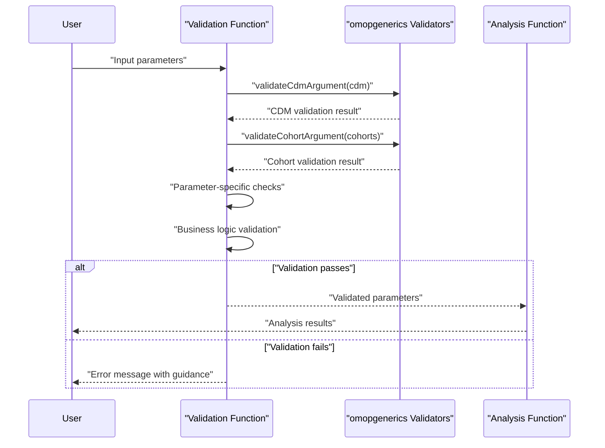
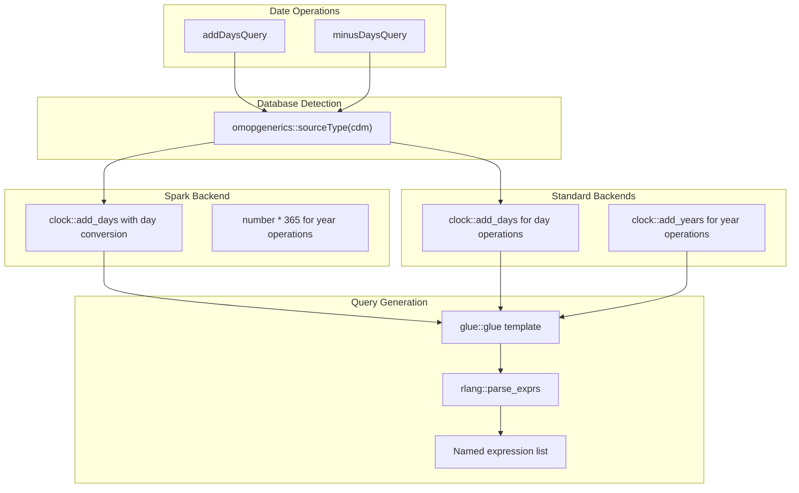
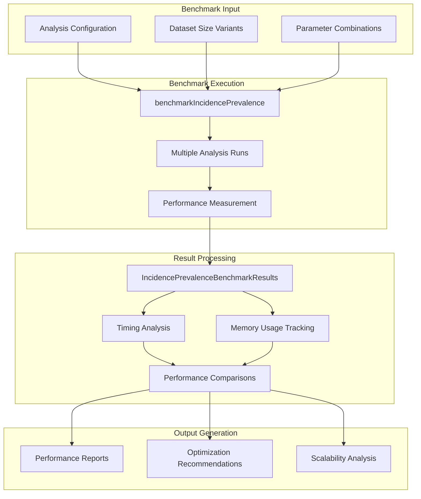

# Page: Advanced Topics

# Advanced Topics

Relevant source files

The following files were used as context for generating this wiki page:

- [.gitignore](.gitignore)
- [R/dateUtilities.R](R/dateUtilities.R)
- [R/inputValidation.R](R/inputValidation.R)
- [_pkgdown.yml](_pkgdown.yml)

This document covers advanced features, utilities, and technical implementation details for power users of the IncidencePrevalence package. The topics include the comprehensive input validation system, date and time manipulation utilities, and performance benchmarking tools. These components provide the foundation for robust, error-free epidemiological analyses while handling complex temporal calculations across different database backends.

For basic usage patterns, see [Getting Started](#2). For core analysis functions, see [API Reference](#9).

## Input Validation System

The IncidencePrevalence package implements a comprehensive input validation system that ensures data integrity and parameter correctness before expensive computations begin. This validation layer acts as a critical safeguard, preventing invalid analyses and providing clear error messages to guide users toward correct usage.

### Validation Architecture

The validation system consists of specialized functions that validate different analysis workflows:

### Core Validation Functions

The validation system provides specific functions for different analysis contexts:

| Function | Purpose | Key Validations |
|----------|---------|-----------------|
| `checkInputGenerateDCS` | Denominator cohort generation | CDM validity, date ranges, time-at-risk windows, age groups |
| `checkInputEstimateIncidence` | Incidence estimation | Cohort tables, outcome washout, repeated events, intervals |
| `checkInputEstimatePrevalence` | Prevalence estimation | Analysis type, time points, contribution requirements |
| `checkInputEstimateAdditional` | Cross-cutting checks | Non-empty denominator populations |
| `checkStrata` | Stratification parameters | Column existence, list structure validation |

### Validation Workflow

### Key Validation Patterns

The validation functions implement several important patterns:

**Time-at-Risk Validation** [R/inputValidation.R:39-47]():
- Ensures upper bound is greater than or equal to lower bound
- Validates numeric ranges for time windows
- Provides clear error messages for invalid ranges

**Cohort ID Validation** [R/inputValidation.R:77-87]():
- Validates cohort IDs exist in specified tables
- Handles null values appropriately
- Returns validated cohort ID lists for downstream use

**Censor Cohort Constraints** [R/inputValidation.R:88-103]():
- Enforces single censor cohort limitation
- Validates one record per person constraint
- Provides specific error messages for violations

**Sources:** [R/inputValidation.R:17-203]()

## Date and Time Utilities

The date and time utilities provide database-agnostic temporal calculations essential for epidemiological analyses. These functions handle the complexity of date arithmetic across different database backends while maintaining consistent behavior.

### Database-Specific Date Handling

The package implements database-specific optimizations for temporal operations:

### Core Date Functions

**`addDaysQuery`** [R/dateUtilities.R:16-45]():
- Adds specified days or years to date variables
- Handles Spark database limitations with day-based year calculations
- Returns parsed expressions ready for dplyr operations

**`minusDaysQuery`** [R/dateUtilities.R:47-88]():
- Subtracts days or years from date variables  
- Supports flexible naming through `name_style` or `names` parameters
- Implements same Spark workarounds as `addDaysQuery`

### Temporal Calculation Patterns

The date utilities implement several key patterns for temporal calculations:

| Operation Type | Function | Spark Handling | Standard Handling |
|----------------|----------|----------------|-------------------|
| Add days | `addDaysQuery` | `clock::add_days(var, days)` | `clock::add_days(var, days)` |
| Add years | `addDaysQuery` | `clock::add_days(var, years*365)` | `clock::add_years(var, years)` |
| Subtract days | `minusDaysQuery` | `clock::add_days(var, -days)` | `clock::add_days(var, -days)` |
| Subtract years | `minusDaysQuery` | `clock::add_days(var, -years*365)` | `clock::add_years(var, -years)` |

### Database Backend Compatibility

The utilities handle Spark database limitations through specific workarounds:

**Spark Year Calculations** [R/dateUtilities.R:33-39]():
- Converts years to days using 365-day approximation
- Uses `clock::add_days` instead of `clock::add_years`
- Maintains consistency across database backends

**Query Expression Generation** [R/dateUtilities.R:42-44]():
- Uses `glue::glue` for template-based query construction
- Parses expressions with `rlang::parse_exprs`
- Supports flexible naming conventions through templates

**Sources:** [R/dateUtilities.R:16-96]()

## Performance Benchmarking

The package includes comprehensive benchmarking tools to measure and optimize analysis performance across different configurations and datasets.

### Benchmarking Functions

The benchmarking system provides tools for performance analysis:

| Function | Purpose | Scope |
|----------|---------|-------|
| `benchmarkIncidencePrevalence` | Execute performance benchmarks | Complete analysis workflows |
| `IncidencePrevalenceBenchmarkResults` | Benchmark result processing | Result aggregation and reporting |

### Benchmarking Architecture

The benchmarking system enables performance optimization by measuring execution times, memory usage, and scalability characteristics across different analysis configurations. This supports identification of performance bottlenecks and guides optimization efforts for large-scale epidemiological studies.

**Sources:** [_pkgdown.yml:28-30]()