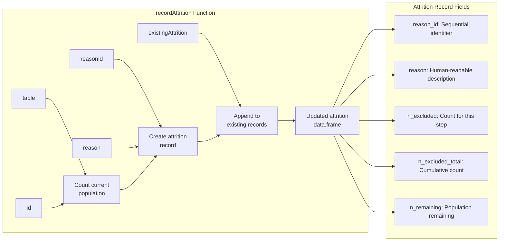
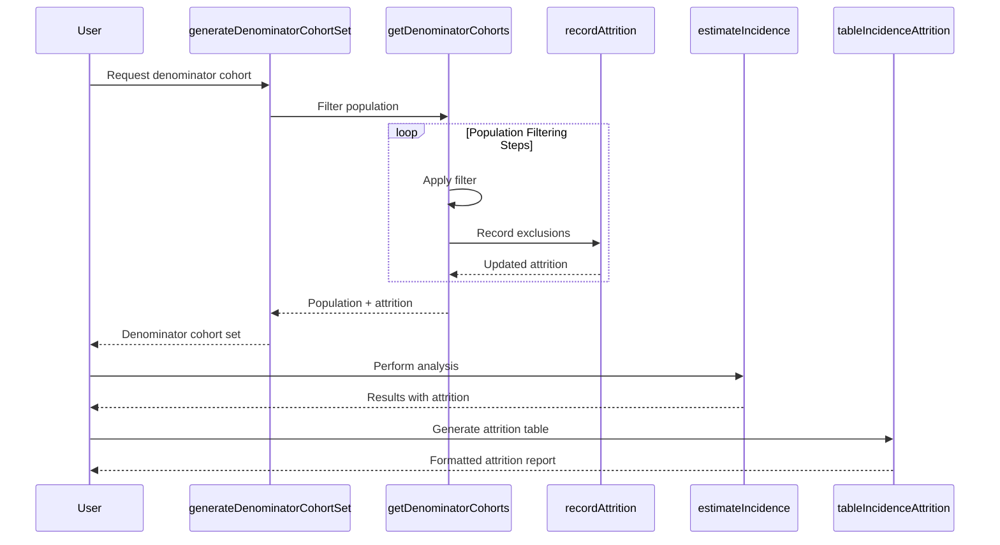
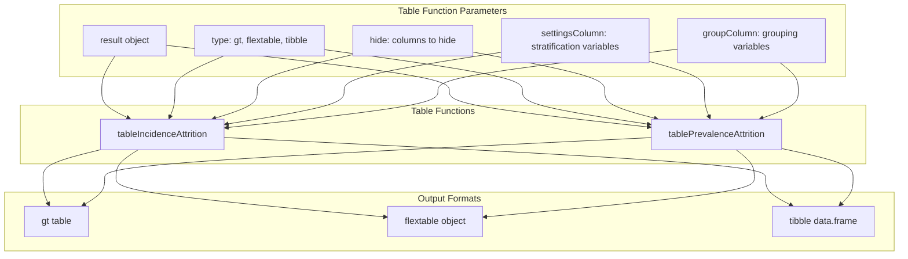
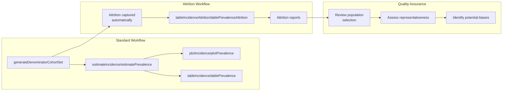

# Page: Attrition Reporting

# Attrition Reporting

<details>
<summary>Relevant source files</summary>

The following files were used as context for generating this wiki page:

- [R/getDenominatorCohorts.R](R/getDenominatorCohorts.R)
- [tests/testthat/test-tables.R](tests/testthat/test-tables.R)

</details>


This document covers the attrition reporting functionality in the IncidencePrevalence package, which tracks and reports population exclusions during denominator cohort generation and analysis execution. Attrition reporting provides transparency into how the study population is filtered and helps identify potential issues with population selection criteria.

For information about creating general result tables, see [Creating Tables](#7.2). For details about cohort generation processes, see [Denominator Cohort Creation](#4.1) and [Population Filtering and Attrition](#4.3).

## Overview

Attrition reporting systematically tracks the step-by-step exclusion of individuals during population filtering operations. Each filtering step records the number of people excluded and the reason for exclusion, creating a detailed audit trail of population selection. This information is essential for understanding the representativeness of the final study population and for identifying potential selection biases.

The attrition tracking system operates automatically during cohort generation and can be accessed through specialized table functions for visualization and reporting.

## Attrition Tracking Architecture

The attrition tracking system integrates with the core cohort generation pipeline to capture population changes at each filtering step:

```mermaid
flowchart TD
    subgraph "Cohort Generation Pipeline"
        A[getDenominatorCohorts] --> B["Initial Population<br/>(person + observation_period)"]
        B --> C[recordAttrition<br/>"Starting population"]
        C --> D["Filter: Missing year_of_birth"]
        D --> E[recordAttrition<br/>"Missing year of birth"]
        E --> F["Filter: Missing/Invalid sex"]
        F --> G[recordAttrition<br/>"Missing sex"]
        G --> H["Filter: Age criteria"]
        H --> I[recordAttrition<br/>"Cannot satisfy age criteria"]
        I --> J["Filter: Observation time"]
        J --> K[recordAttrition<br/>"No observation time available"]
        K --> L["Filter: Age validation"]
        L --> M[recordAttrition<br/>"Age criteria during study period"]
        M --> N["Filter: Prior history"]
        N --> O[recordAttrition<br/>"Prior history requirement"]
        O --> P["Final Population"]
    end
    
    subgraph "Attrition Data Structure"
        Q["attrition data.frame"]
        R["reason_id (integer)"]
        S["reason (character)"]
        T["n_excluded (integer)"]
        U["n_excluded_total (integer)"]
        V["n_remaining (integer)"]
    end
    
    subgraph "Reporting Functions"
        W[tableIncidenceAttrition]
        X[tablePrevalenceAttrition]
        Y["Formatted attrition tables"]
    end
    
    C --> Q
    E --> Q
    G --> Q
    I --> Q
    K --> Q
    M --> Q
    O --> Q
    
    Q --> R
    Q --> S
    Q --> T
    Q --> U
    Q --> V
    
    Q --> W
    Q --> X
    W --> Y
    X --> Y
```

Sources: [R/getDenominatorCohorts.R:134-364](), [tests/testthat/test-tables.R:27-119]()

## Attrition Recording System

The `recordAttrition` function captures population changes at each filtering step. The function is called after each population filter is applied:



The system tracks seven standard exclusion reasons during denominator cohort generation:

| Reason ID | Reason Description |
|-----------|------------------|
| 1 | Starting population |
| 2 | Missing year of birth |
| 3 | Missing sex |
| 4 | Cannot satisfy age criteria during the study period based on year of birth |
| 5 | No observation time available during study period |
| 6 | Doesn't satisfy age criteria during the study period |
| 7 | Prior history requirement not fulfilled during study period |

Sources: [R/getDenominatorCohorts.R:134-364]()

## Attrition Data Flow

The attrition tracking system operates as an integral part of the analysis pipeline, connecting cohort generation to result reporting:



Sources: [R/getDenominatorCohorts.R:449-454](), [tests/testthat/test-tables.R:68-119]()

## Accessing Attrition Information

Attrition data is automatically captured during analysis and can be accessed through the result objects. The analysis functions (`estimateIncidence`, `estimatePrevalence`) include attrition information in their output.

### Attrition Table Functions

Two specialized functions create formatted attrition tables:

- `tableIncidenceAttrition()`: Creates formatted attrition tables for incidence analysis results
- `tablePrevalenceAttrition()`: Creates formatted attrition tables for prevalence analysis results

These functions support the same formatting options as other table functions:



Sources: [tests/testthat/test-tables.R:27-46](), [tests/testthat/test-tables.R:96-119]()

## Interpreting Attrition Reports

Attrition tables provide essential information for understanding population selection:

### Column Definitions

| Column | Description |
|--------|-------------|
| `reason_id` | Sequential identifier for exclusion step |
| `reason` | Human-readable description of exclusion criteria |
| `n_excluded` | Number of people excluded at this specific step |
| `n_excluded_total` | Cumulative number excluded up to this step |
| `n_remaining` | Number of people remaining after this step |

### Key Patterns to Monitor

1. **Large single-step exclusions**: May indicate overly restrictive criteria
2. **Cumulative exclusion rates**: Should be reasonable for the study design
3. **Zero remaining population**: Indicates criteria are too restrictive
4. **Missing data patterns**: High exclusions for missing data may indicate data quality issues

### Stratified Analyses

When analyses include stratification variables (age groups, sex, prior observation periods), attrition is tracked separately for each stratum combination. The `settingsColumn` parameter controls which stratification variables are displayed in the attrition table.

Sources: [tests/testthat/test-tables.R:96-119]()

## Integration with Analysis Workflow

Attrition reporting integrates seamlessly with the standard analysis workflow:



Sources: [tests/testthat/test-tables.R:1-123]()