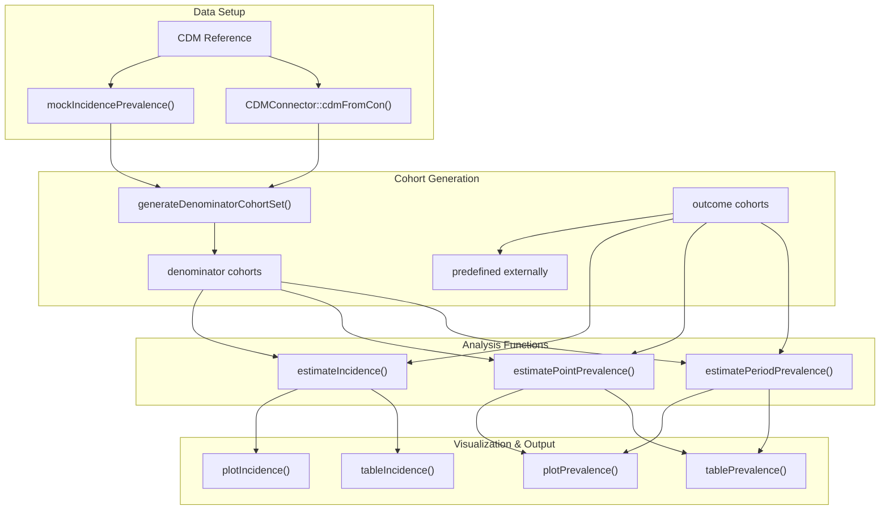
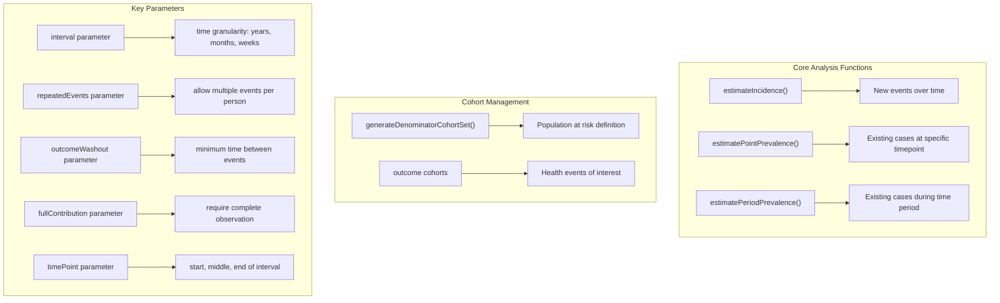
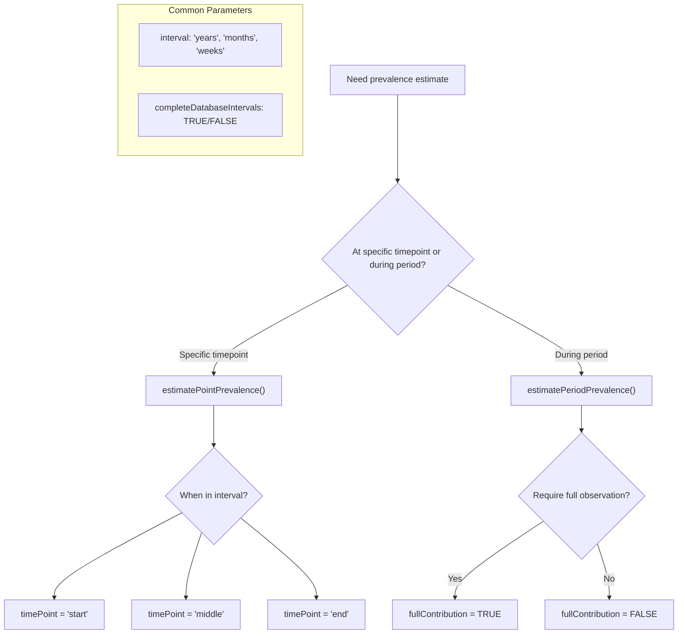
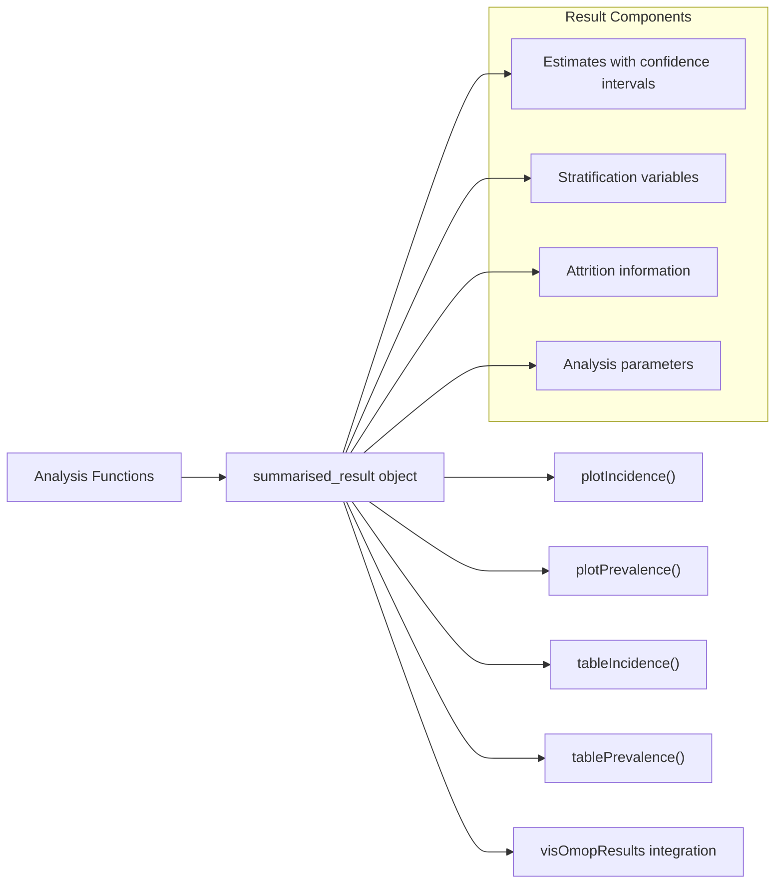

# Page: Basic Usage Examples

# Basic Usage Examples

<details>
<summary>Relevant source files</summary>

The following files were used as context for generating this wiki page:

- [README.Rmd](README.Rmd)
- [README.md](README.md)
- [vignettes/a04_Calculating_prevalence.Rmd](vignettes/a04_Calculating_prevalence.Rmd)

</details>


This page demonstrates the fundamental workflows for conducting epidemiological analyses using the IncidencePrevalence package. It covers the essential steps from data setup through result visualization, providing practical examples of the most common analysis patterns.

For detailed installation instructions, see [Installation and Setup](#2.1). For advanced analysis configurations and parameters, see [Incidence Analysis](#5) and [Prevalence Analysis](#6).

## Overview of Basic Analysis Workflow

The IncidencePrevalence package follows a structured analysis pipeline that moves from data preparation through result generation and visualization.



**Function-to-Concept Mapping**



Sources: [README.md:39-232](), [README.Rmd:45-163]()

## Setting Up CDM Data Reference

The first step in any analysis is establishing a connection to OMOP CDM-formatted data. The package supports both real database connections and simulated data for testing and examples.

### Using Mock Data for Examples

For demonstration purposes, the `mockIncidencePrevalence()` function creates simulated CDM data:

```r
library(IncidencePrevalence)
library(CDMConnector)

cdm <- mockIncidencePrevalence(
  sampleSize = 10000,
  outPre = 0.3,
  minOutcomeDays = 365,
  maxOutcomeDays = 3650
)
```

### Real Database Connections

For production analyses, connect to actual OMOP CDM databases using `CDMConnector`:

```r
con <- DBI::dbConnect(RPostgres::Postgres(),
  dbname = Sys.getenv("CDM5_POSTGRESQL_DBNAME"),
  host = Sys.getenv("CDM5_POSTGRESQL_HOST"),
  user = Sys.getenv("CDM5_POSTGRESQL_USER"),
  password = Sys.getenv("CDM5_POSTGRESQL_PASSWORD")
)

cdm <- CDMConnector::cdmFromCon(con,
  cdmSchema = Sys.getenv("CDM5_POSTGRESQL_CDM_SCHEMA"),
  writeSchema = Sys.getenv("CDM5_POSTGRESQL_RESULT_SCHEMA")
)
```

Sources: [README.md:41-81](), [README.Rmd:47-81]()

## Creating Denominator Cohorts

Denominator cohorts define the population at risk for the analysis. The `generateDenominatorCohortSet()` function creates multiple cohorts based on specified criteria.

### Basic Denominator Cohort Creation

```r
cdm <- generateDenominatorCohortSet(
  cdm = cdm,
  name = "denominator",
  cohortDateRange = as.Date(c("2008-01-01", "2018-01-01")),
  ageGroup = list(
    c(0, 64),
    c(65, 100)
  ),
  sex = c("Male", "Female", "Both"),
  daysPriorObservation = 180
)
```

This creates six denominator cohorts covering different combinations of age groups and sex criteria. Each cohort represents a distinct population at risk.

### Examining Cohort Settings

The generated cohorts can be inspected to understand their configuration:

```r
settings(cdm$denominator)
# Returns tibble showing:
# - cohort_definition_id
# - cohort_name
# - age_group
# - sex
# - days_prior_observation
# - start_date, end_date
```

Sources: [README.md:83-123](), [README.Rmd:85-105]()

## Incidence Analysis Example

Incidence analysis estimates the rate of new events occurring in the population over time. The `estimateIncidence()` function provides comprehensive incidence rate calculations.

### Basic Incidence Estimation

```r
inc <- estimateIncidence(
  cdm = cdm,
  denominatorTable = "denominator",
  outcomeTable = "outcome",
  interval = "years",
  repeatedEvents = TRUE,
  outcomeWashout = 180,
  completeDatabaseIntervals = TRUE
)
```

### Key Incidence Parameters

| Parameter | Purpose | Example Values |
|-----------|---------|----------------|
| `interval` | Time granularity | "years", "months", "weeks" |
| `repeatedEvents` | Allow multiple events per person | TRUE/FALSE |
| `outcomeWashout` | Minimum days between events | 180, 365 |
| `completeDatabaseIntervals` | Require complete data coverage | TRUE/FALSE |

### Visualizing Incidence Results

```r
plotIncidence(inc, facet = c("denominator_age_group", "denominator_sex"))
```

Sources: [README.md:184-194](), [README.Rmd:125-135]()

## Prevalence Analysis Examples

Prevalence analysis estimates the proportion of the population with existing conditions at specific times or during periods.

### Point Prevalence

Point prevalence measures the proportion of people with the condition at a specific time point:

```r
prev_point <- estimatePointPrevalence(
  cdm = cdm,
  denominatorTable = "denominator",
  outcomeTable = "outcome",
  interval = "years",
  timePoint = "start"
)
```

The `timePoint` parameter determines when within each interval to assess prevalence:
- `"start"`: Beginning of interval
- `"middle"`: Middle of interval  
- `"end"`: End of interval

### Period Prevalence

Period prevalence measures the proportion of people with the condition at any time during a period:

```r
prev_period <- estimatePeriodPrevalence(
  cdm = cdm,
  denominatorTable = "denominator",
  outcomeTable = "outcome",
  interval = "years",
  completeDatabaseIntervals = TRUE,
  fullContribution = TRUE
)
```

The `fullContribution` parameter controls whether people must be observed for the entire period to contribute to the calculation.

### Prevalence Analysis Decision Tree



Sources: [README.md:199-228](), [README.Rmd:138-162](), [vignettes/a04_Calculating_prevalence.Rmd:73-178]()

## Basic Visualization and Output

The package provides built-in visualization functions for both incidence and prevalence results.

### Plotting Functions

```r
# Plot incidence results
plotIncidence(inc, facet = c("denominator_age_group", "denominator_sex"))

# Plot prevalence results  
plotPrevalence(prev_point, facet = c("denominator_age_group", "denominator_sex"))
plotPrevalence(prev_period, facet = c("denominator_age_group", "denominator_sex"))
```

### Result Structure

All analysis functions return standardized `summarised_result` objects that integrate with the broader OMOP ecosystem:



### Analysis Workflow Summary

The typical analysis workflow follows this pattern:

1. **Data Setup**: Create CDM reference using `mockIncidencePrevalence()` or database connection
2. **Cohort Generation**: Use `generateDenominatorCohortSet()` to define populations at risk
3. **Analysis**: Apply `estimateIncidence()`, `estimatePointPrevalence()`, or `estimatePeriodPrevalence()`
4. **Visualization**: Generate plots using `plotIncidence()` or `plotPrevalence()`
5. **Reporting**: Create tables and examine attrition using table functions

Sources: [README.md:194-228](), [README.Rmd:135-162](), [vignettes/a04_Calculating_prevalence.Rmd:86-96]()