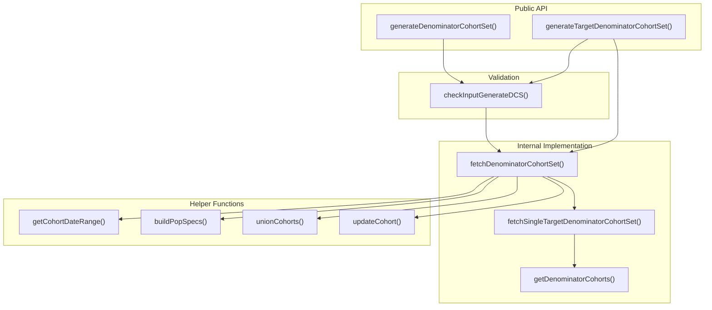
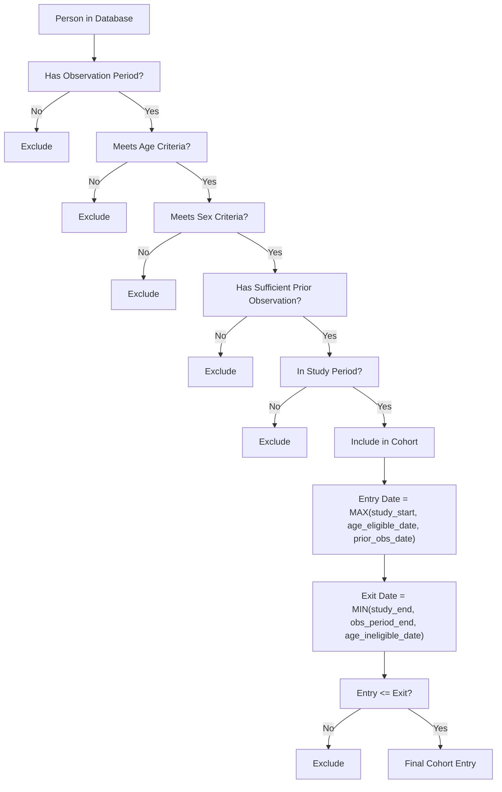
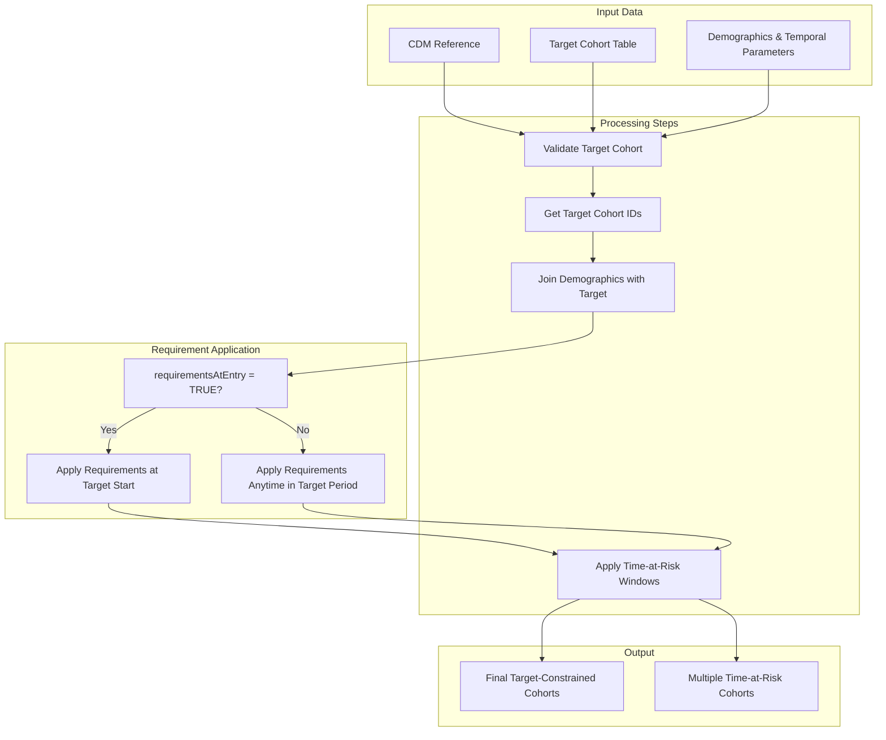
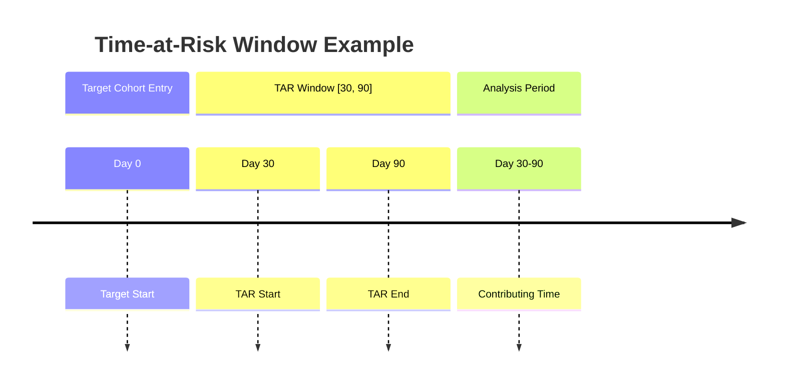
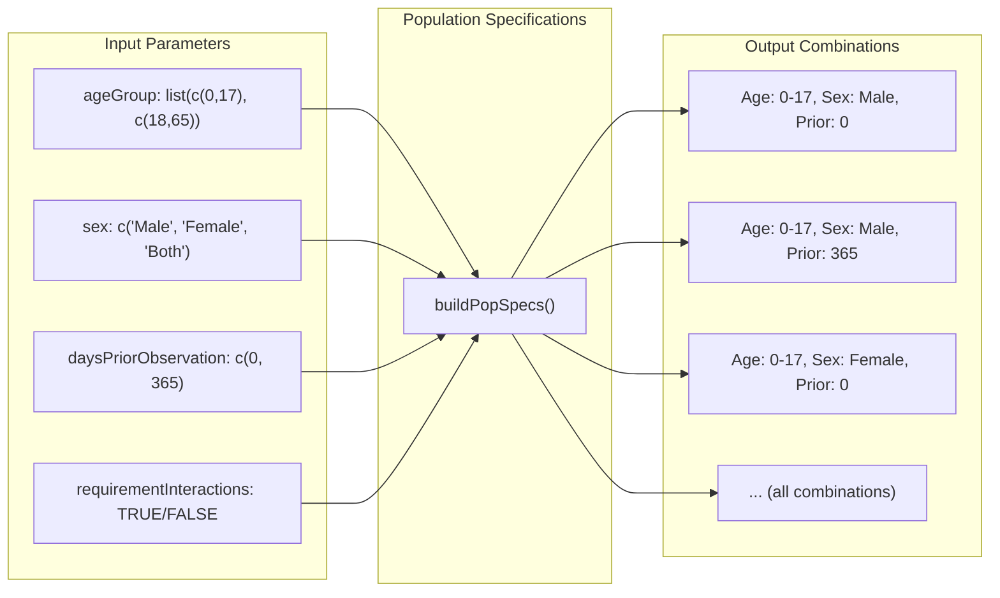
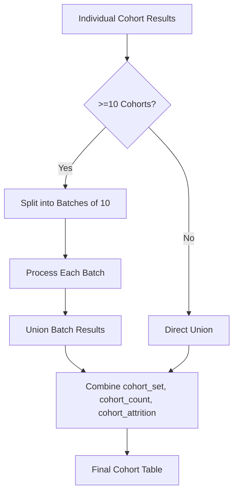
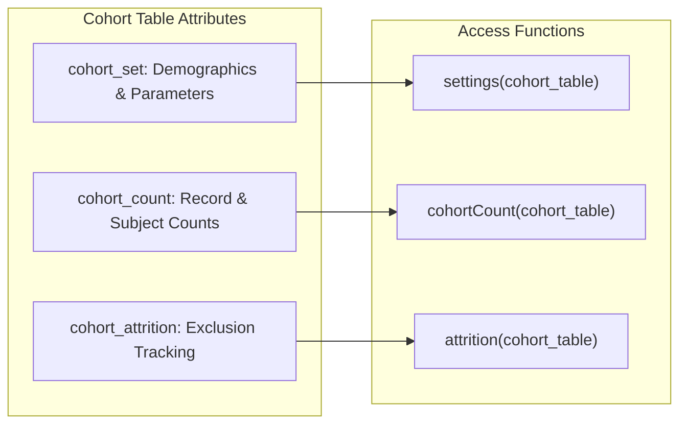

# Page: Cohort Generation

# Cohort Generation

Relevant source files

The following files were used as context for generating this wiki page:

- [R/generateDenominatorCohortSet.R](R/generateDenominatorCohortSet.R)
- [tests/testthat/test-generateDenominatorCohortSet.R](tests/testthat/test-generateDenominatorCohortSet.R)
- [vignettes/a02_Creating_denominator_populations.Rmd](vignettes/a02_Creating_denominator_populations.Rmd)

## Purpose and Scope

Cohort generation is the foundational step for all incidence and prevalence analyses in the IncidencePrevalence package. This system creates denominator populations that define the eligible study population and time-at-risk periods for epidemiological analyses. The cohort generation system handles demographic filtering, temporal constraints, observation requirements, and optional target cohort restrictions.

For information about using generated cohorts in analyses, see [Incidence Analysis](#5) and [Prevalence Analysis](#6). For details about input validation and error handling, see [Input Validation System](#8.1).

## System Overview

The cohort generation system provides two primary functions for creating denominator cohorts:

### Core Functions Architecture

Sources: [R/generateDenominatorCohortSet.R:65-85](), [R/generateDenominatorCohortSet.R:148-175](), [R/generateDenominatorCohortSet.R:309-472]()

## Denominator Cohort Creation

### Basic Denominator Cohorts

The `generateDenominatorCohortSet()` function creates cohorts based on demographic and temporal criteria without target cohort constraints. Individuals enter cohorts on the latest of: study start date, age eligibility date, or sufficient prior observation date. They exit on the earliest of: study end date, observation period end, or age ineligibility date.

### Cohort Entry and Exit Logic

Sources: [R/generateDenominatorCohortSet.R:590-694](), [vignettes/a02_Creating_denominator_populations.Rmd:25-36]()

### Function Parameters

| Parameter | Type | Description |
|-----------|------|-------------|
| `cdm` | CDM reference | OMOP CDM database connection |
| `name` | character | Name for cohort table (must be snake_case) |
| `cohortDateRange` | Date vector | Study start and end dates |
| `ageGroup` | list | Age ranges as list of c(min, max) pairs |
| `sex` | character | "Male", "Female", "Both", or combinations |
| `daysPriorObservation` | numeric | Required prior observation days |
| `requirementInteractions` | logical | Create all combinations vs. sequential |

Sources: [R/generateDenominatorCohortSet.R:25-50]()

## Target-Based Cohort Creation  

### Target Cohort Integration

The `generateTargetDenominatorCohortSet()` function creates cohorts constrained by an existing target cohort. Individuals can only contribute time when they are active members of the specified target cohort.

### Target Cohort Data Flow

Sources: [R/generateDenominatorCohortSet.R:148-175](), [R/generateDenominatorCohortSet.R:622-653]()

### Time-at-Risk Windows

Target cohorts support time-at-risk (TAR) windows that define specific periods relative to target cohort entry for analysis:

Sources: [R/generateDenominatorCohortSet.R:177-304](), [tests/testthat/test-generateDenominatorCohortSet.R:1788-2015]()

## Internal Architecture

### Population Specification Building

The system uses `buildPopSpecs()` to create combinations of demographic criteria:

Sources: [R/generateDenominatorCohortSet.R:761-799](), [R/generateDenominatorCohortSet.R:351-392]()

### Cohort Union Process

For large numbers of cohorts, the system implements batched processing via `unionCohorts()`:

Sources: [R/generateDenominatorCohortSet.R:804-947](), [R/generateDenominatorCohortSet.R:820-842]()

## Configuration Options

### Requirement Interactions

The `requirementInteractions` parameter controls how demographic criteria combinations are generated:

| Setting | Behavior | Example Output |
|---------|----------|----------------|
| `TRUE` | All combinations | 2 ages × 2 sexes × 2 prior obs = 8 cohorts |
| `FALSE` | Sequential addition | 2 ages + 2 sexes + 2 prior obs = 6 cohorts |

### Requirements at Entry

For target cohorts, `requirementsAtEntry` determines when demographic criteria must be satisfied:

| Setting | Behavior |
|---------|----------|
| `TRUE` | Must satisfy all criteria at target cohort start date |
| `FALSE` | Can satisfy criteria anytime during target cohort period |

Sources: [R/generateDenominatorCohortSet.R:46-49](), [R/generateDenominatorCohortSet.R:125-127](), [tests/testthat/test-generateDenominatorCohortSet.R:990-1196]()

## Output Structure

### Cohort Table Schema

Generated cohort tables follow the OMOP cohort structure with additional metadata:

| Column | Type | Description |
|--------|------|-------------|
| `cohort_definition_id` | integer | Unique cohort identifier |
| `subject_id` | integer | Person identifier |
| `cohort_start_date` | date | Cohort entry date |
| `cohort_end_date` | date | Cohort exit date |

### Metadata Attributes

Cohort tables include standardized metadata accessible via `omopgenerics` functions:

Sources: [R/generateDenominatorCohortSet.R:453-458](), [R/generateDenominatorCohortSet.R:710-735](), [tests/testthat/test-generateDenominatorCohortSet.R:407-423]()