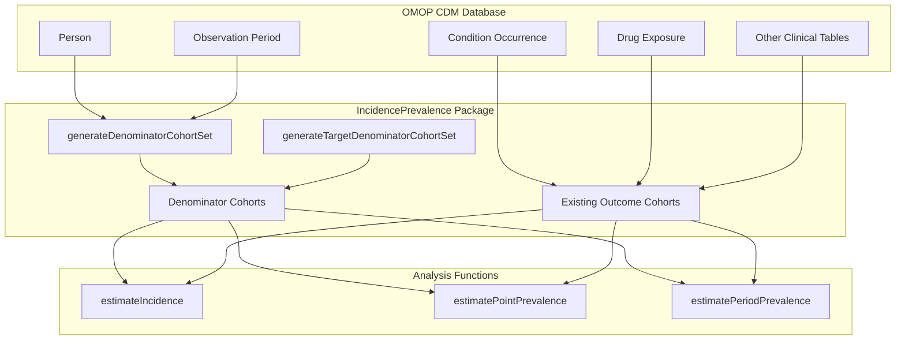
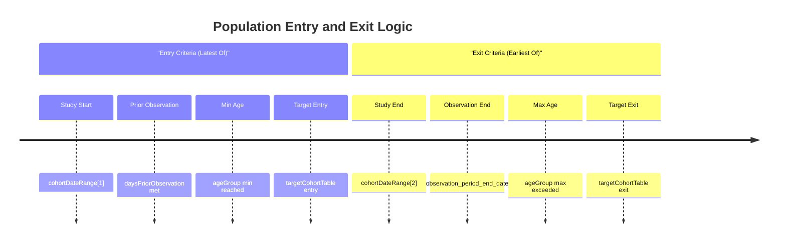
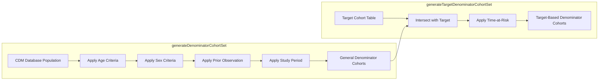
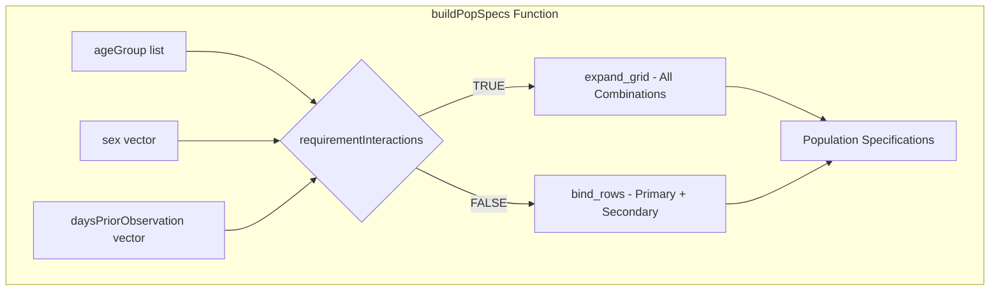

# Page: Cohorts and Populations

# Cohorts and Populations

<details>
<summary>Relevant source files</summary>

The following files were used as context for generating this wiki page:

- [R/generateDenominatorCohortSet.R](R/generateDenominatorCohortSet.R)
- [vignettes/a01_Introduction_to_IncidencePrevalence.Rmd](vignettes/a01_Introduction_to_IncidencePrevalence.Rmd)
- [vignettes/a02_Creating_denominator_populations.Rmd](vignettes/a02_Creating_denominator_populations.Rmd)

</details>


This page defines the fundamental concepts of cohorts and populations used throughout the IncidencePrevalence package. It explains how denominator and outcome cohorts are structured, how populations are defined and filtered, and the relationship between these concepts and the underlying OMOP CDM data model.

For information about the specific calculation methodologies for incidence and prevalence, see [Incidence vs Prevalence](#3.3). For detailed implementation of cohort generation functions, see [Cohort Generation](#4).

## Cohort Types and Roles

In epidemiological studies using the IncidencePrevalence package, two primary types of cohorts serve distinct roles:

### Denominator Cohorts

Denominator cohorts represent the population at risk for developing an outcome. These cohorts define the person-time during which individuals contribute to the study and form the denominator in incidence and prevalence calculations.

### Outcome Cohorts  

Outcome cohorts identify individuals who have experienced the event or condition of interest. These cohorts must already exist in the CDM and are referenced by the analysis functions but not created by this package.



**Sources:** [R/generateDenominatorCohortSet.R:17-24](), [vignettes/a01_Introduction_to_IncidencePrevalence.Rmd:20-27]()

## Population Definition Framework

The package defines populations through a systematic filtering approach that determines when individuals enter and exit the denominator cohort based on multiple criteria.

### Entry Criteria

Individuals enter a denominator population on the latest of:
1. Study start date (`cohortDateRange` parameter)
2. Date achieving sufficient prior observation (`daysPriorObservation` parameter)  
3. Date reaching minimum age (`ageGroup` parameter)
4. Target cohort entry date (for target-based cohorts)

### Exit Criteria

Individuals exit a denominator population on the earliest of:
1. Study end date (`cohortDateRange` parameter)
2. End of observation period
3. Last day meeting maximum age criteria (`ageGroup` parameter)
4. Target cohort exit date (for target-based cohorts)



**Sources:** [vignettes/a02_Creating_denominator_populations.Rmd:25-36](), [R/generateDenominatorCohortSet.R:309-472]()

## Denominator Cohort Generation Methods

The package provides two primary methods for generating denominator cohorts, each serving different study designs:

### General Population Cohorts

The `generateDenominatorCohortSet()` function creates denominator cohorts from the entire database population based on demographic and temporal criteria.

| Parameter | Type | Purpose |
|-----------|------|---------|
| `ageGroup` | list | Age ranges for cohort inclusion |
| `sex` | character | Sex criteria ("Male", "Female", "Both") |
| `daysPriorObservation` | numeric | Required prior observation time |
| `cohortDateRange` | Date vector | Study period boundaries |
| `requirementInteractions` | logical | Whether to create all combinations |

### Target-Based Cohorts

The `generateTargetDenominatorCohortSet()` function creates denominator cohorts restricted to individuals who are also members of a specified target cohort, enabling more focused study populations.



**Sources:** [R/generateDenominatorCohortSet.R:65-85](), [R/generateDenominatorCohortSet.R:148-176]()

## Time-at-Risk Windows

Target-based denominator cohorts support time-at-risk windows that define the period during which individuals contribute person-time relative to their target cohort entry.

### Time-at-Risk Configuration

The `timeAtRisk` parameter accepts ranges defining the observation window:
- `c(0, Inf)` - From target entry to target exit (default)
- `c(0, 30)` - First 30 days after target entry
- `c(31, 60)` - Days 31-60 after target entry
- `list(c(0, 30), c(31, 60))` - Multiple windows

### Time-at-Risk Implementation

```mermaid
gantt
    title Time-at-Risk Window Examples
    dateFormat X
    axisFormat %d
    
    section "Target Cohort"
    Target Period : 0, 100
    
    section "Time-at-Risk Windows"
    0 to 30 days : 0, 30
    31 to 60 days : 31, 60
    0 to Inf : 0, 100
```



The implementation modifies cohort entry and exit dates based on the specified time-at-risk parameters:

- **Entry adjustment:** `cohort_start_date = target_cohort_start_date + timeAtRiskStart`
- **Exit adjustment:** `cohort_end_date = min(cohort_end_date, target_cohort_start_date + timeAtRiskEnd)`

**Sources:** [R/generateDenominatorCohortSet.R:109-116](), [R/generateDenominatorCohortSet.R:197-241]()

## Population Stratification and Interactions

The package supports multiple stratification dimensions that can be combined to create comprehensive denominator cohort sets.

### Requirement Interactions

When `requirementInteractions = TRUE`, the package generates cohorts for all possible combinations of:
- Age groups
- Sex categories  
- Prior observation requirements

When `requirementInteractions = FALSE`, only the first value of non-primary factors is used, with order determining priority.

### Cohort Definition Structure

Each generated cohort receives a unique `cohort_definition_id` and associated metadata stored in the cohort settings:

| Setting Field | Description |
|---------------|-------------|
| `cohort_definition_id` | Unique identifier |
| `cohort_name` | Descriptive name |
| `age_group` | Age range specification |
| `sex` | Sex criteria |
| `days_prior_observation` | Prior observation requirement |
| `target_cohort_definition_id` | Target cohort ID (if applicable) |



**Sources:** [R/generateDenominatorCohortSet.R:760-799](), [R/generateDenominatorCohortSet.R:46-49]()

## OMOP CDM Integration

The denominator cohorts are implemented as standard OMOP CDM cohort tables with full integration into the omopgenerics framework.

### Cohort Table Structure

Generated cohorts follow the standard OMOP cohort table format:

| Column | Type | Description |
|--------|------|-------------|
| `cohort_definition_id` | integer | Links to cohort settings |
| `subject_id` | integer | Person identifier |
| `cohort_start_date` | Date | Entry into denominator |
| `cohort_end_date` | Date | Exit from denominator |

### Metadata Integration

The package leverages omopgenerics functions for cohort metadata management:

- `settings()` - Cohort definitions and parameters
- `cohortCount()` - Subject and record counts per cohort  
- `attrition()` - Population filtering audit trail

```mermaid
classDiagram
    class CohortTable {
        +cohort_definition_id: integer
        +subject_id: integer  
        +cohort_start_date: Date
        +cohort_end_date: Date
    }
    
    class CohortSet {
        +cohort_definition_id: integer
        +cohort_name: character
        +age_group: character
        +sex: character
        +days_prior_observation: integer
    }
    
    class CohortAttrition {
        +cohort_definition_id: integer
        +number_records: integer
        +number_subjects: integer
        +reason: character
    }
    
    CohortTable ||--|| CohortSet : "linked by cohort_definition_id"
    CohortTable ||--|| CohortAttrition : "linked by cohort_definition_id"
```

**Sources:** [R/generateDenominatorCohortSet.R:452-458](), [R/generateDenominatorCohortSet.R:710-735]()