# Page: Configuration Options

# Configuration Options

<details>
<summary>Relevant source files</summary>

The following files were used as context for generating this wiki page:

- [tests/testthat/test-estimatePrevalence.R](tests/testthat/test-estimatePrevalence.R)
- [vignettes/a04_Calculating_prevalence.Rmd](vignettes/a04_Calculating_prevalence.Rmd)

</details>


This document provides a detailed explanation of configuration parameters specific to prevalence analysis in the IncidencePrevalence package. These parameters control how prevalence calculations are performed, including time-related settings, population contribution requirements, and analysis stratification options.

For information about general cohort generation parameters, see [Cohort Generation](#4). For incidence-specific configuration parameters, see [Incidence Parameters](#5.3).

## Core Prevalence Type Configuration

The fundamental distinction in prevalence analysis is between point and period prevalence, controlled by the `type` parameter in `estimatePrevalence()` or by using the specialized functions `estimatePointPrevalence()` and `estimatePeriodPrevalence()`.

### Prevalence Type Parameters

| Parameter | Values | Default | Description |
|-----------|--------|---------|-------------|
| `type` | `"point"`, `"period"` | `"point"` | Determines whether to calculate point or period prevalence |


**Point Prevalence Configuration**
- Calculates prevalence at a specific time point within each interval
- Controlled by `timePoint` parameter
- Cannot use `"overall"` interval

**Period Prevalence Configuration** 
- Calculates prevalence over a time period
- Controlled by `fullContribution` parameter
- Supports `"overall"` interval

Sources: [tests/testthat/test-estimatePrevalence.R:79-85](), [tests/testthat/test-estimatePrevalence.R:133-144](), [vignettes/a04_Calculating_prevalence.Rmd:76-81](), [vignettes/a04_Calculating_prevalence.Rmd:134-139]()

## Time-Related Configuration Parameters

### Time Point Selection (Point Prevalence)

The `timePoint` parameter controls where within each time interval point prevalence is calculated:

| Parameter | Values | Default | Description |
|-----------|--------|---------|-------------|
| `timePoint` | `"start"`, `"middle"`, `"end"` | `"start"` | Position within interval for point prevalence calculation |


### Full Contribution Requirement (Period Prevalence)

The `fullContribution` parameter determines whether individuals must be present for the entire time interval:

| Parameter | Values | Default | Description |
|-----------|--------|---------|-------------|
| `fullContribution` | `TRUE`, `FALSE` | `TRUE` | Whether individuals must be present for full interval to contribute |

When `fullContribution = TRUE`:
- Individuals must be observed for the complete time interval
- More conservative prevalence estimates
- Smaller denominator populations

When `fullContribution = FALSE`:
- Individuals need only be present for one day of the interval
- More inclusive prevalence estimates
- Larger denominator populations

### Complete Database Intervals

The `completeDatabaseIntervals` parameter controls whether to include time intervals not fully captured in the database:

| Parameter | Values | Default | Description |
|-----------|--------|---------|-------------|
| `completeDatabaseIntervals` | `TRUE`, `FALSE` | `TRUE` | Whether to require complete database coverage for intervals |

Sources: [tests/testthat/test-estimatePrevalence.R:122](), [tests/testthat/test-estimatePrevalence.R:383-384](), [tests/testthat/test-estimatePrevalence.R:463-464](), [vignettes/a04_Calculating_prevalence.Rmd:117-123](), [vignettes/a04_Calculating_prevalence.Rmd:166-172]()

## Analysis Level Configuration

The `level` parameter determines whether prevalence is calculated at the person or record level:

| Parameter | Values | Default | Description |
|-----------|--------|---------|-------------|
| `level` | `"person"`, `"record"` | `"person"` | Level of analysis for prevalence calculation |


**Person Level Analysis:**
- Each individual contributes at most once per time interval
- Standard epidemiological approach
- Used for most prevalence studies

**Record Level Analysis:**
- Individuals can contribute multiple times if they have multiple denominator records
- Useful for analyses involving time-at-risk windows or repeated exposures
- Requires careful interpretation

Sources: [tests/testthat/test-estimatePrevalence.R:1606-1619](), [tests/testthat/test-estimatePrevalence.R:1622-1636]()

## Stratification Configuration

### Basic Stratification

The `strata` parameter allows for stratified prevalence analysis:

| Parameter | Type | Description |
|-----------|------|-------------|
| `strata` | `list` or `character` | Variables for stratification analysis |
| `includeOverallStrata` | `logical` | Whether to include overall (non-stratified) results |


### Stratification Examples

**Single Variable Stratification:**
```r
strata = list(c("age_group"))
```

**Multiple Variable Stratification:**
```r
strata = list(c("age_group", "sex"))
```

**Multiple Stratification Sets:**
```r
strata = list(
  c("age_group"),
  c("sex"), 
  c("age_group", "sex")
)
```

Sources: [tests/testthat/test-estimatePrevalence.R:1297](), [tests/testthat/test-estimatePrevalence.R:1327](), [tests/testthat/test-estimatePrevalence.R:1374](), [vignettes/a04_Calculating_prevalence.Rmd:220-225](), [vignettes/a04_Calculating_prevalence.Rmd:242-251]()

## Temporal Interval Configuration

The `interval` parameter defines the time periods for prevalence calculation:

| Parameter | Values | Description |
|-----------|--------|-------------|
| `interval` | `"weeks"`, `"months"`, `"quarters"`, `"years"`, `"overall"` | Time intervals for prevalence calculation |

### Interval-Specific Behaviors


**Calendar Alignment Behavior:**
- Time intervals follow calendar periods (e.g., January 1 - December 31 for years)
- Controlled by `completeDatabaseIntervals` parameter
- When `completeDatabaseIntervals = TRUE`, only complete calendar periods are included

Sources: [tests/testthat/test-estimatePrevalence.R:82-85](), [tests/testthat/test-estimatePrevalence.R:330-335](), [tests/testthat/test-estimatePrevalence.R:542-576]()

## Parameter Dependencies and Interactions

### Type-Specific Parameter Availability

```mermaid
graph TB
    subgraph "Point Prevalence Parameters"
        POINTTYPE["type = 'point'"]
        TIMEPOINT_PARAM["timePoint"]
        NO_OVERALL["interval ≠ 'overall'"]
        NO_FULLCONTRIB["fullContribution N/A"]
    end
    
    subgraph "Period Prevalence Parameters"  
        PERIODTYPE["type = 'period'"]
        FULLCONTRIB_PARAM["fullContribution"]
        ALL_INTERVALS["All intervals allowed"]
        NO_TIMEPOINT["timePoint N/A"]
    end
    
    subgraph "Universal Parameters"
        LEVEL_PARAM["level"]
        STRATA_PARAM["strata"] 
        COMPLETE_PARAM["completeDatabaseIntervals"]
        INTERVAL_PARAM["interval"]
    end
    
    POINTTYPE --> TIMEPOINT_PARAM
    POINTTYPE --> NO_OVERALL
    POINTTYPE --> NO_FULLCONTRIB
    
    PERIODTYPE --> FULLCONTRIB_PARAM
    PERIODTYPE --> ALL_INTERVALS
    PERIODTYPE --> NO_TIMEPOINT
    
    POINTTYPE --> LEVEL_PARAM
    POINTTYPE --> STRATA_PARAM
    POINTTYPE --> COMPLETE_PARAM
    POINTTYPE --> INTERVAL_PARAM
    
    PERIODTYPE --> LEVEL_PARAM
    PERIODTYPE --> STRATA_PARAM
    PERIODTYPE --> COMPLETE_PARAM
    PERIODTYPE --> INTERVAL_PARAM
```



### Configuration Validation

The package performs extensive validation of parameter combinations:

**Point Prevalence Restrictions:**
- Cannot use `interval = "overall"`
- `timePoint` parameter is required and validated
- `fullContribution` parameter is ignored

**Period Prevalence Restrictions:**
- `timePoint` parameter is ignored
- `fullContribution` parameter affects population inclusion
- All interval types are supported

**Universal Validations:**
- Stratification variables must exist in denominator table
- Analysis level must be valid (`"person"` or `"record"`)
- Time intervals must be supported values

Sources: [tests/testthat/test-estimatePrevalence.R:330-335](), [tests/testthat/test-estimatePrevalence.R:1388-1410](), [tests/testthat/test-estimatePrevalence.R:1658-1664]()

## Advanced Configuration Examples

### Record-Level Analysis with Stratification

For complex analyses involving multiple denominator records per person:

```r
estimatePeriodPrevalence(
  cdm = cdm,
  denominatorTable = "denominator", 
  outcomeTable = "outcome",
  level = "record",
  strata = list(c("time_at_risk_group")),
  fullContribution = FALSE,
  completeDatabaseIntervals = FALSE
)
```

### Point Prevalence with Middle Time Point

For prevalence calculated at the middle of each time interval:

```r
estimatePointPrevalence(
  cdm = cdm,
  denominatorTable = "denominator",
  outcomeTable = "outcome", 
  interval = "months",
  timePoint = "middle"
)
```

### Comprehensive Period Prevalence Configuration

For the most inclusive period prevalence analysis:

```r
estimatePeriodPrevalence(
  cdm = cdm,
  denominatorTable = "denominator",
  outcomeTable = "outcome",
  interval = c("months", "years", "overall"),
  fullContribution = FALSE,
  completeDatabaseIntervals = FALSE,
  level = "person",
  strata = list(c("age_group"), c("sex")),
  includeOverallStrata = TRUE
)
```

Sources: [tests/testthat/test-estimatePrevalence.R:1754-1760](), [vignettes/a04_Calculating_prevalence.Rmd:117-123](), [vignettes/a04_Calculating_prevalence.Rmd:166-172]()