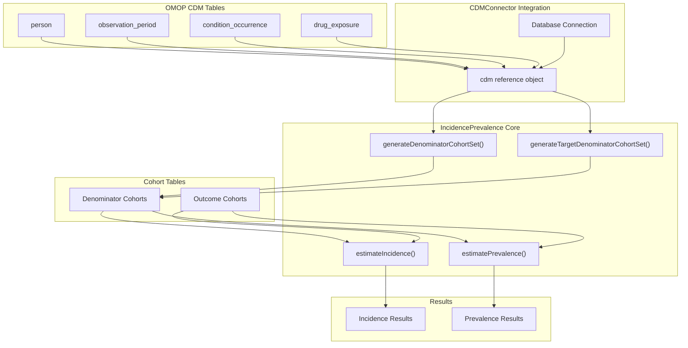
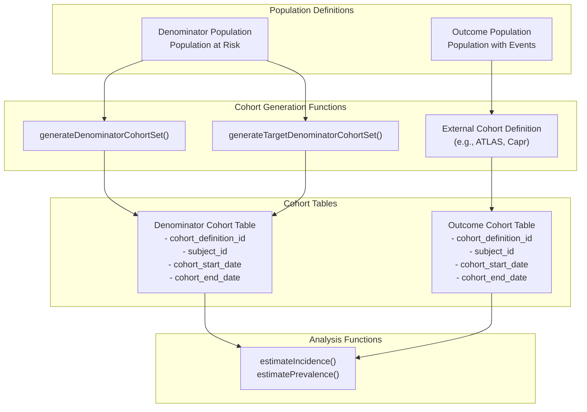
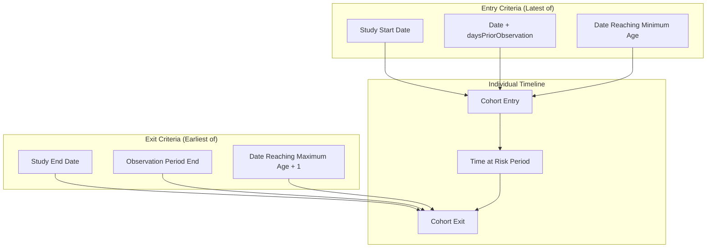
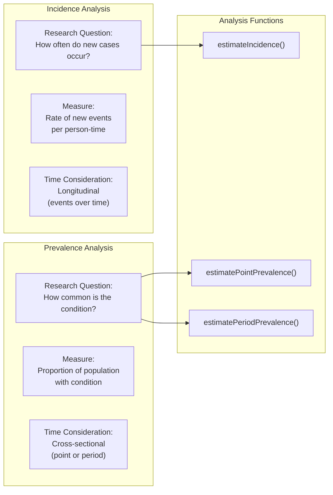
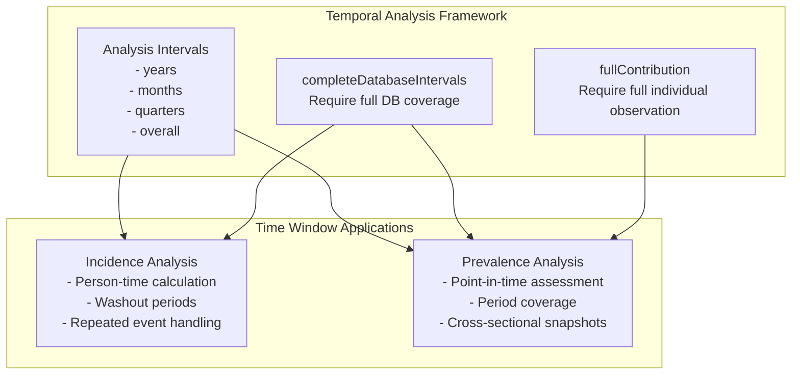

# Page: Core Concepts

# Core Concepts

Relevant source files

The following files were used as context for generating this wiki page:

- [R/generateDenominatorCohortSet.R](R/generateDenominatorCohortSet.R)
- [README.Rmd](README.Rmd)
- [README.md](README.md)
- [vignettes/a02_Creating_denominator_populations.Rmd](vignettes/a02_Creating_denominator_populations.Rmd)

This page covers the fundamental epidemiological and technical concepts that underpin the IncidencePrevalence package. It explains how the package integrates with OMOP CDM data, the core concepts of cohorts and populations, and the differences between incidence and prevalence analyses.

For specific implementation details about cohort generation, see [Cohort Generation](#4). For detailed analysis procedures, see [Incidence Analysis](#5) and [Prevalence Analysis](#6).

## OMOP CDM Foundation

The IncidencePrevalence package is built specifically to work with data in the OMOP Common Data Model (CDM) format. The package integrates seamlessly with the OMOP ecosystem through standardized interfaces and data structures.

### CDM Data Flow Architecture

The package expects data to follow OMOP CDM conventions, with standard table structures and relationships. Key OMOP tables used include:

| Table | Purpose | Key Fields |
|-------|---------|------------|
| `person` | Individual demographics | `person_id`, `gender_concept_id`, `year_of_birth` |
| `observation_period` | Time periods of data availability | `person_id`, `observation_period_start_date`, `observation_period_end_date` |
| `condition_occurrence` | Medical conditions/events | `person_id`, `condition_start_date`, `condition_concept_id` |
| `drug_exposure` | Medication exposures | `person_id`, `drug_exposure_start_date`, `drug_concept_id` |

Sources: [README.md:41-70](), [vignettes/a02_Creating_denominator_populations.Rmd:47-50]()

## Cohorts and Populations

The fundamental building blocks of epidemiological analysis in this package are **denominator cohorts** and **outcome cohorts**. Understanding their relationship is crucial for proper analysis.

### Denominator vs Outcome Cohorts

**Denominator Cohorts** represent the population at risk - individuals who could potentially experience the outcome of interest. These are generated using package functions and define:
- Who is eligible for analysis
- When they enter and exit the analysis period
- Population stratification (age, sex, etc.)

**Outcome Cohorts** represent individuals who experience the event of interest. These are typically defined outside the package using tools like ATLAS or Capr, and define:
- What constitutes an "event"
- When the event occurred
- Event-specific criteria

Sources: [R/generateDenominatorCohortSet.R:17-24](), [vignettes/a02_Creating_denominator_populations.Rmd:23-36]()

### Cohort Entry and Exit Logic

The package implements sophisticated logic for determining when individuals enter and exit denominator cohorts:

This logic is implemented in the `fetchDenominatorCohortSet()` function, which determines eligibility based on multiple criteria:

| Criteria | Description | Parameter |
|----------|-------------|-----------|
| Study Period | Overall analysis timeframe | `cohortDateRange` |
| Prior Observation | Required database history | `daysPriorObservation` |
| Age Requirements | Minimum and maximum age | `ageGroup` |
| Sex Requirements | Male, Female, or Both | `sex` |

Sources: [vignettes/a02_Creating_denominator_populations.Rmd:25-36](), [R/generateDenominatorCohortSet.R:309-472]()

### Time-at-Risk Windows

For analyses with target cohorts, the package supports time-at-risk windows that define specific periods relative to target cohort entry:

```mermaid
gantt
    title Time-at-Risk Window Examples
    dateFormat X
    axisFormat %s
    
    section Target Cohort
    Target Entry    :0, 1
    
    section Time-at-Risk Windows
    0 to 30 days    :0, 30
    31 to 90 days   :30, 90
    0 to Inf        :0, 365
```

Time-at-risk windows are specified using the `timeAtRisk` parameter in `generateTargetDenominatorCohortSet()`:
- `c(0, 30)` - First 30 days after target entry
- `c(31, 90)` - Days 31-90 after target entry  
- `c(0, Inf)` - All time after target entry

Sources: [R/generateDenominatorCohortSet.R:109-116](), [R/generateDenominatorCohortSet.R:197-251]()

## Analysis Types: Incidence vs Prevalence

The package supports two fundamental epidemiological measures, each answering different research questions:

### Conceptual Differences

### Incidence Analysis Characteristics

**Incidence** measures the rate at which new cases occur in a population over time:

- **Focus**: New events only (first occurrence)
- **Denominator**: Person-time at risk
- **Washout periods**: Used to ensure "new" events
- **Repeated events**: Can be included with appropriate washout
- **Result units**: Events per person-year

Key parameters in `estimateIncidence()`:
- `outcomeWashout`: Minimum time between events
- `repeatedEvents`: Whether to include multiple events per person
- `completeDatabaseIntervals`: Require complete follow-up

### Prevalence Analysis Characteristics

**Prevalence** measures the proportion of a population that has a condition at a specific time or during a period:

**Point Prevalence**: Proportion with condition at a specific date
- **Focus**: Existing cases at timepoint
- **Denominator**: Population size at timepoint
- **Result units**: Proportion (0-1)

**Period Prevalence**: Proportion with condition during a time interval
- **Focus**: Anyone with condition during period
- **Denominator**: Population contributing to period
- **Result units**: Proportion (0-1)

Key parameters in prevalence functions:
- `timePoint`: For point prevalence ("start", "middle", "end")
- `fullContribution`: Require complete observation during period
- `completeDatabaseIntervals`: Require complete database coverage

Sources: [README.md:172-231](), [README.Rmd:122-163]()

## Temporal Logic and Analysis Windows

The package implements sophisticated temporal logic to handle different analysis scenarios:

### Analysis Interval Types

### Key Temporal Concepts

| Concept | Description | Applied To |
|---------|-------------|------------|
| **Analysis Intervals** | Time periods for stratified analysis | Both incidence and prevalence |
| **Washout Periods** | Minimum time between events | Incidence only |
| **Complete Database Intervals** | Periods with full database coverage | Both |
| **Full Contribution** | Individuals observed for entire period | Prevalence only |
| **Time-at-Risk Windows** | Specific periods relative to target entry | Target-based analyses |

These temporal concepts ensure robust epidemiological analysis by handling common challenges like:
- Incomplete follow-up
- Database coverage gaps  
- Definition of "new" vs "existing" cases
- Population representativeness

Sources: [R/generateDenominatorCohortSet.R:109-116](), [vignettes/a02_Creating_denominator_populations.Rmd:55-69]()