# Page: Creating Tables

# Creating Tables

Relevant source files

The following files were used as context for generating this wiki page:

- [R/tables.R](R/tables.R)
- [tests/testthat/test-plotting.R](tests/testthat/test-plotting.R)
- [tests/testthat/test-tables.R](tests/testthat/test-tables.R)

This document covers the table generation functionality for incidence and prevalence analysis results in the IncidencePrevalence package. The system provides formatted tables in multiple output formats including GT, Flextable, and Tibble formats, with extensive customization options for headers, grouping, and styling.

For information about creating visualizations from results, see [Plotting Results](#7.1). For details about attrition-specific reporting, see [Attrition Reporting](#7.3).

## Table Generation System Architecture

The table generation system is built around the `visOmopResults` package integration and provides specialized formatting for epidemiological results.

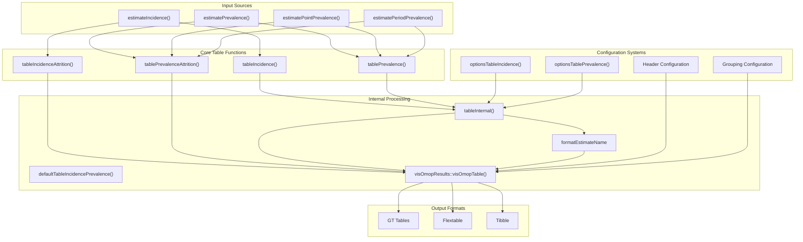

Sources: [R/tables.R:1-426](), [tests/testthat/test-tables.R:1-177]()

## Main Table Functions

### Primary Table Functions

The package provides four main table generation functions, each specialized for different result types:

| Function | Purpose | Result Type Filter |
|----------|---------|-------------------|
| `tableIncidence()` | Format incidence analysis results | `result_type == "incidence"` |
| `tablePrevalence()` | Format prevalence analysis results | `result_type == "prevalence"` |
| `tableIncidenceAttrition()` | Format incidence attrition data | `result_type == "incidence_attrition"` |
| `tablePrevalenceAttrition()` | Format prevalence attrition data | `result_type == "prevalence_attrition"` |

### Function Signatures and Parameters

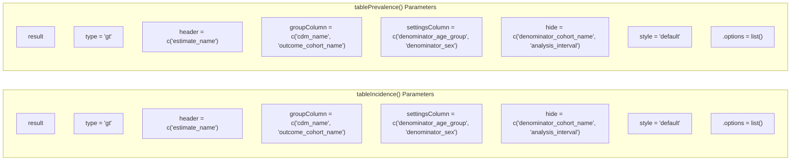

Sources: [R/tables.R:124-153](), [R/tables.R:56-84]()

## Table Configuration Options

### Output Format Types

The `type` parameter controls the output format:

- **`"gt"`** - Creates GT (Grammar of Tables) objects for HTML rendering
- **`"flextable"`** - Creates Flextable objects for Word/PowerPoint compatibility  
- **`"tibble"`** - Returns standard tibble data frames for programmatic use

### Header Configuration

The `header` parameter defines the hierarchical structure of table headers:

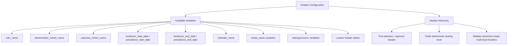

Sources: [R/tables.R:21-27](), [R/tables.R:91-97]()

### Grouping and Column Management

| Parameter | Purpose | Example Values |
|-----------|---------|----------------|
| `groupColumn` | Variables for row grouping | `c("cdm_name", "outcome_cohort_name")` |
| `settingsColumn` | Settings attributes to display | `c("denominator_age_group", "denominator_sex")` |
| `hide` | Columns to exclude from output | `c("denominator_cohort_name", "analysis_interval")` |

## Estimate Name Formatting

### Incidence Table Formatting

The `tableIncidence()` function uses predefined estimate name formatting:

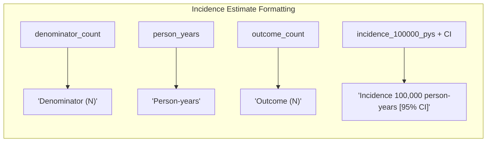

Sources: [R/tables.R:136-143]()

### Prevalence Table Formatting

The `tablePrevalence()` function uses its own formatting schema:

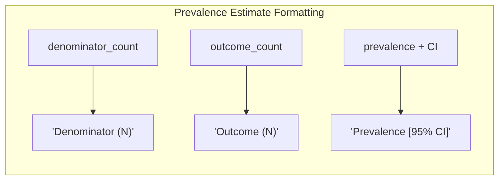

Sources: [R/tables.R:66-70]()

## Internal Processing Architecture

### Data Flow Through tableInternal()

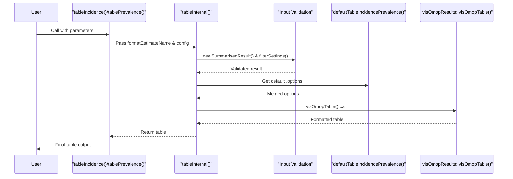

Sources: [R/tables.R:155-206]()

### Result Type Filtering

The system filters results by `result_type` to ensure appropriate data processing:

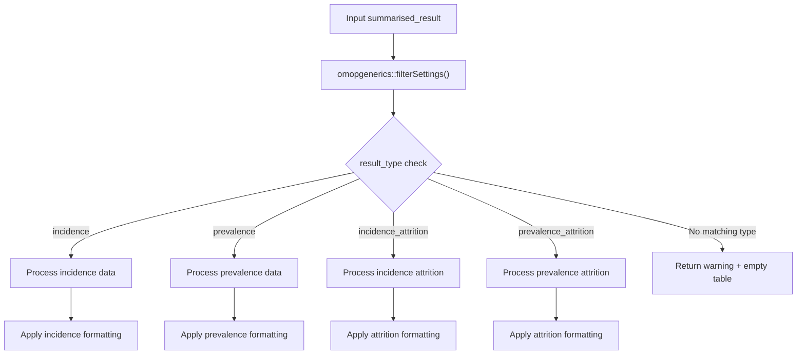

Sources: [R/tables.R:172-177](), [R/tables.R:309-317](), [R/tables.R:386-394]()

## Attrition Table Functions

### Attrition-Specific Processing

The attrition table functions handle specialized formatting for population attrition data:

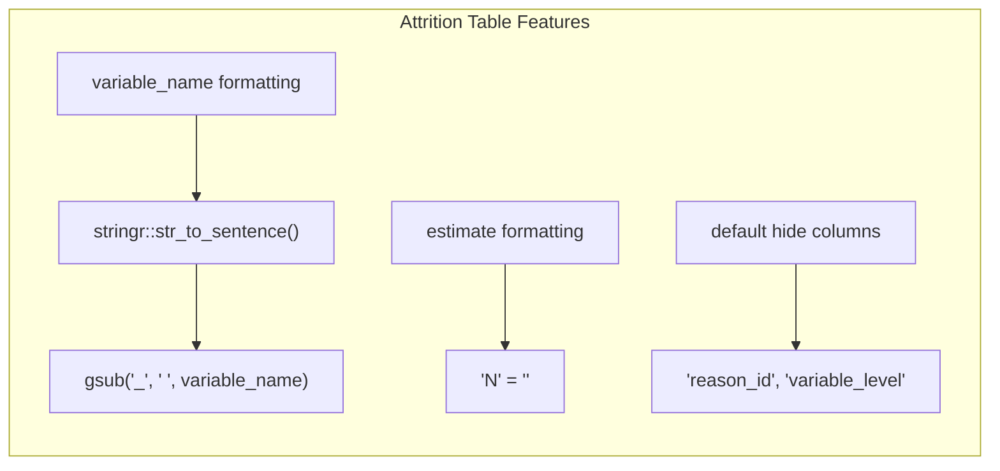

Sources: [R/tables.R:320-321](), [R/tables.R:396-397](), [R/tables.R:325](), [R/tables.R:402]()

## Configuration Options and Defaults

### Options Functions

The package provides functions to retrieve default configuration options:

| Function | Purpose | Returns |
|----------|---------|---------|
| `optionsTableIncidence()` | Get incidence table defaults | Named list with `keepNotFormatted = FALSE` |
| `optionsTablePrevalence()` | Get prevalence table defaults | Named list with standard visOmopResults defaults |

### Option Merging Logic

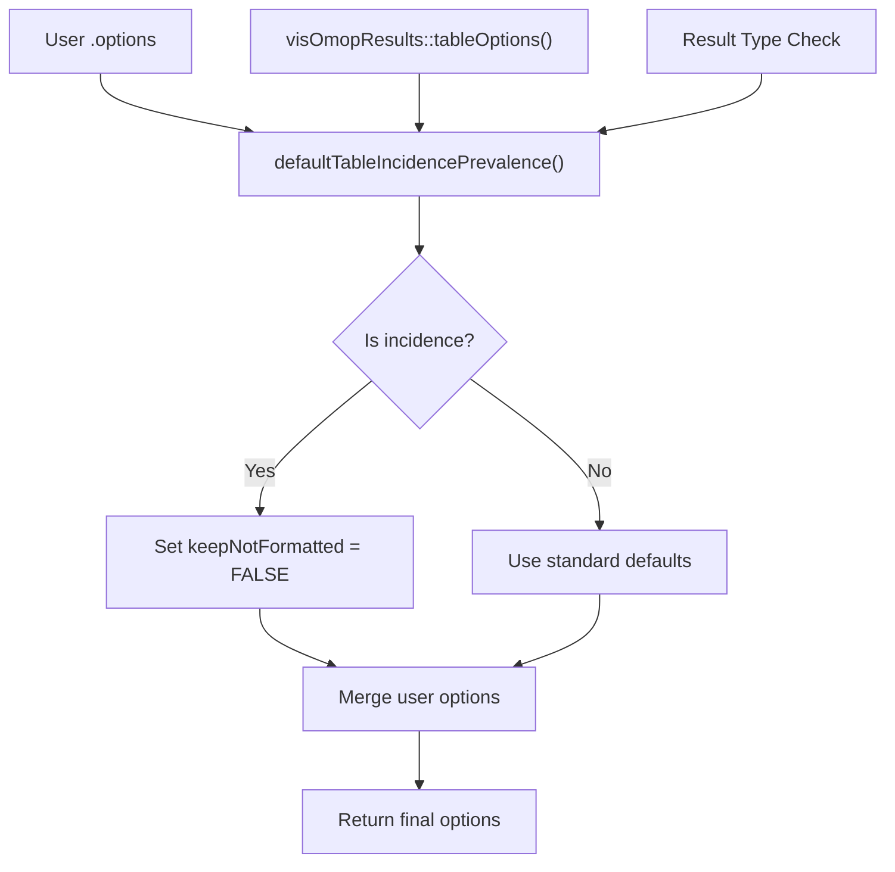

Sources: [R/tables.R:208-220](), [R/tables.R:238-240](), [R/tables.R:258-260]()

## Integration with visOmopResults

### visOmopTable() Integration

The table generation relies heavily on `visOmopResults::visOmopTable()` for core functionality:

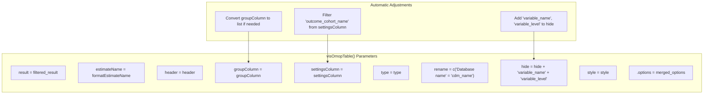

Sources: [R/tables.R:194-205](), [R/tables.R:189-192]()

## Error Handling and Edge Cases

### Empty Result Handling

The system handles empty results gracefully:

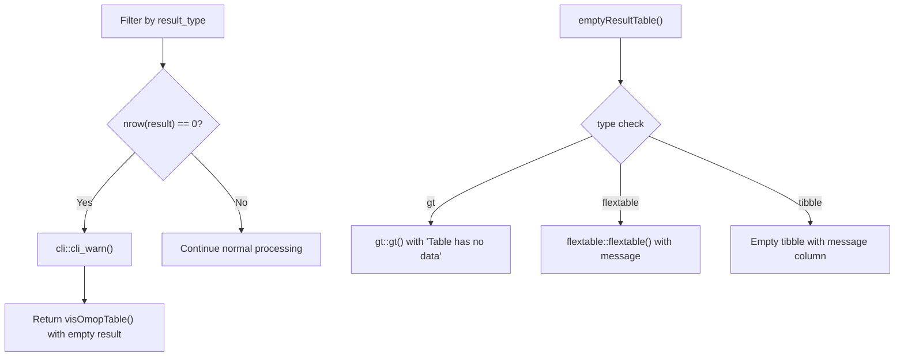

Sources: [R/tables.R:174-177](), [R/tables.R:314-317](), [R/tables.R:391-394](), [R/tables.R:415-425]()