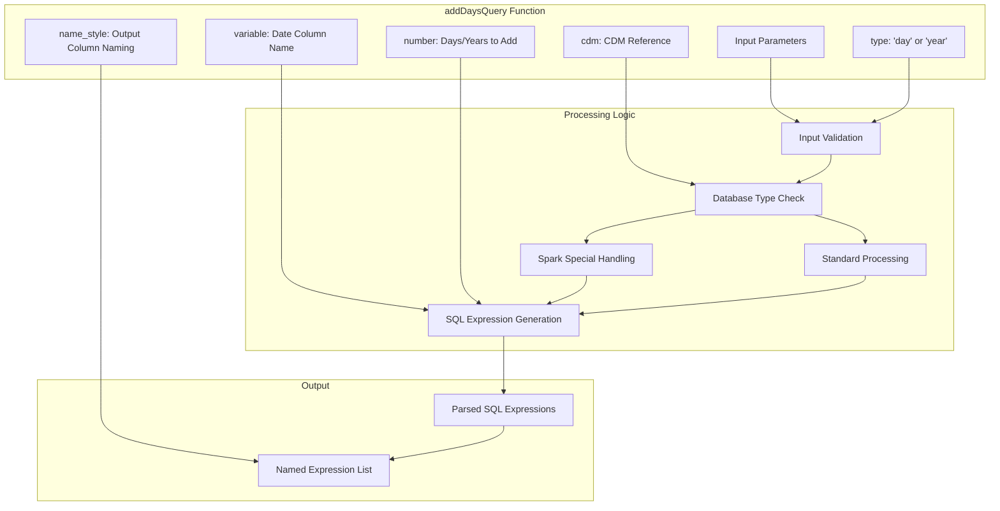
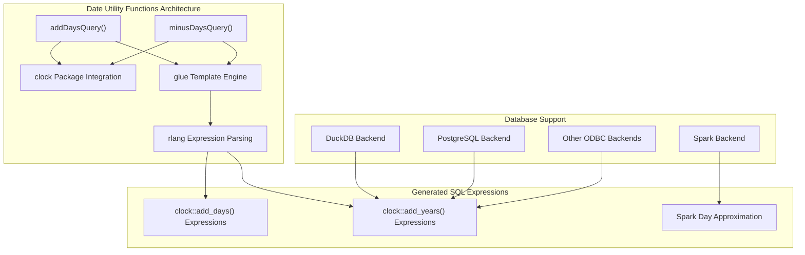
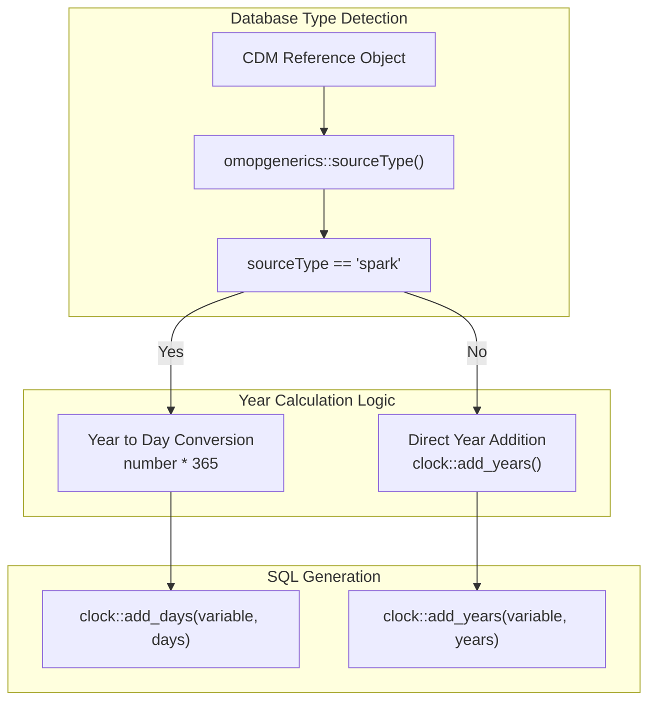
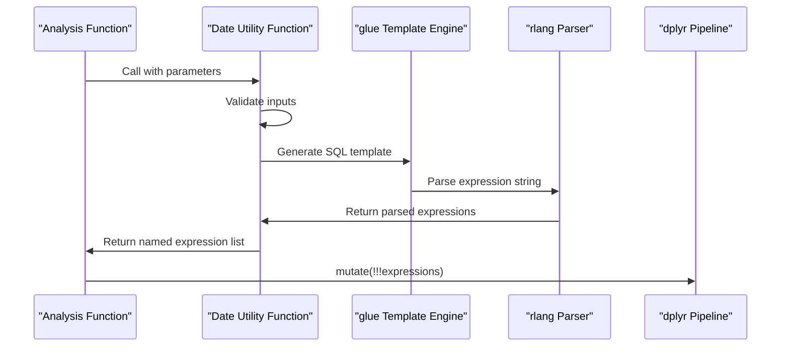
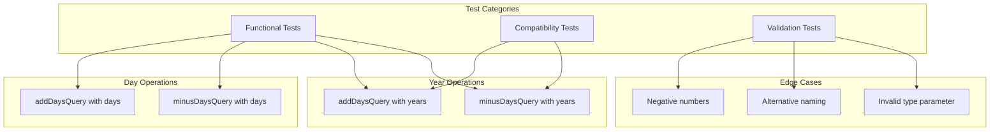
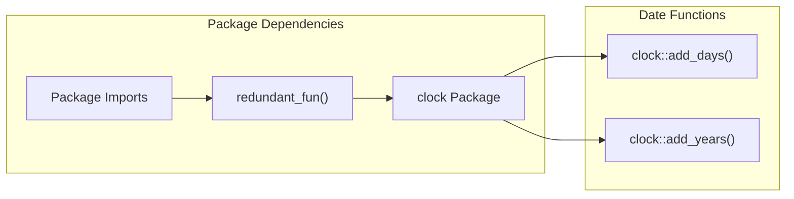

# Page: Date and Time Utilities

# Date and Time Utilities

Relevant source files

The following files were used as context for generating this wiki page:

- [.gitignore](.gitignore)
- [R/dateUtilities.R](R/dateUtilities.R)
- [_pkgdown.yml](_pkgdown.yml)
- [tests/testthat/test-dateUtilities.R](tests/testthat/test-dateUtilities.R)

This page documents the date and time utility functions that provide database-agnostic temporal calculations for incidence and prevalence analyses. These utilities generate SQL expressions for date arithmetic operations that work consistently across different database backends in the OMOP ecosystem.

For information about time-at-risk calculations and temporal windows in cohort generation, see [Target Cohorts and Time-at-Risk](#4.2). For details about analysis intervals and temporal parameters, see [Parameters and Configuration](#5.3).

## Purpose and Scope

The date utilities in IncidencePrevalence provide a consistent interface for performing date arithmetic operations across different database backends. These functions generate SQL expressions that can be used within dplyr pipelines to add or subtract days and years from date columns, with special handling for database-specific quirks like Spark's limited date arithmetic support.

## Core Date Utility Functions

The package provides two main date utility functions that generate SQL expressions for temporal calculations:

### addDaysQuery Function

The `addDaysQuery()` function generates SQL expressions to add days or years to a date variable. It supports vectorized operations and flexible naming conventions.

### minusDaysQuery Function

The `minusDaysQuery()` function provides similar functionality with additional flexibility for negative number handling and alternative naming strategies.

Sources: [R/dateUtilities.R:16-45](), [R/dateUtilities.R:47-88]()

## Database Compatibility Considerations

### Spark Database Special Handling

The date utilities include special logic for Apache Spark databases, which have limited support for year arithmetic operations. When working with Spark backends, year additions are approximated using day calculations:

| Database Type | Year Addition Method | Implementation |
|---------------|---------------------|----------------|
| Spark | Day approximation | `365 * years` conversion |
| Others | Native year arithmetic | `clock::add_years()` |

Sources: [R/dateUtilities.R:33-39](), [R/dateUtilities.R:65-71]()

## Implementation Details

### Expression Generation Process

The date utilities follow a consistent pattern for generating SQL expressions:

1. **Input Validation**: Verify that `type` parameter is either "day" or "year"
2. **Number Conversion**: Convert input numbers to integers
3. **Database Detection**: Check CDM source type for Spark-specific handling
4. **SQL Template Generation**: Use `glue` to create SQL expression strings
5. **Expression Parsing**: Convert strings to parsed R expressions using `rlang`
6. **Naming Application**: Apply naming conventions using either `name_style` or `names` parameters

### Function Parameters

| Parameter | Type | Description | Required |
|-----------|------|-------------|----------|
| `cdm` | CDM Reference | Database connection object | Yes |
| `variable` | Character | Name of date column to modify | Yes |
| `number` | Numeric | Days/years to add/subtract | Yes |
| `type` | Character | "day" or "year" | Yes |
| `name_style` | Character | Naming template (addDaysQuery) | Yes |
| `names` | Character Vector | Explicit column names (minusDaysQuery) | No |

Sources: [R/dateUtilities.R:16-21](), [R/dateUtilities.R:47-52]()

## Usage Patterns

### Integration with dplyr Pipelines

The date utilities are designed to work seamlessly with dplyr `mutate()` operations using the `!!!` (unquote-splice) operator:

### Common Use Cases

The date utilities support several common temporal calculation patterns in epidemiological analysis:

- **Washout Period Calculation**: Subtracting days/years to define washout start dates
- **Follow-up Window Definition**: Adding time periods to define observation windows
- **Age Calculation**: Adding years to birth dates for age-based stratification
- **Interval Boundary Setting**: Defining start and end dates for analysis periods

Sources: [tests/testthat/test-dateUtilities.R:6-25](), [tests/testthat/test-dateUtilities.R:28-47]()

## Testing and Validation

### Test Coverage

The date utilities include comprehensive tests that verify:

- **Functional Correctness**: Results match expected `clock` package operations
- **Database Compatibility**: Functions work with mock CDM databases
- **Parameter Validation**: Proper error handling for invalid inputs
- **Naming Conventions**: Both `name_style` and `names` parameters work correctly

### Test Scenarios

Sources: [tests/testthat/test-dateUtilities.R:1-126]()

## Clock Package Integration

The utilities depend on the `clock` package for date arithmetic operations. A redundant function ensures the `clock` dependency is properly declared:

Sources: [R/dateUtilities.R:92-95]()