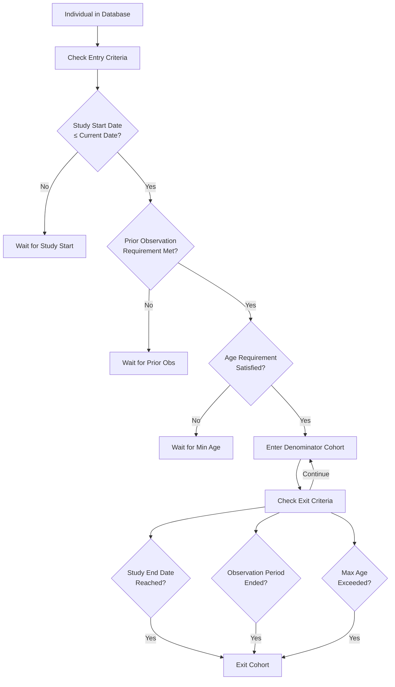
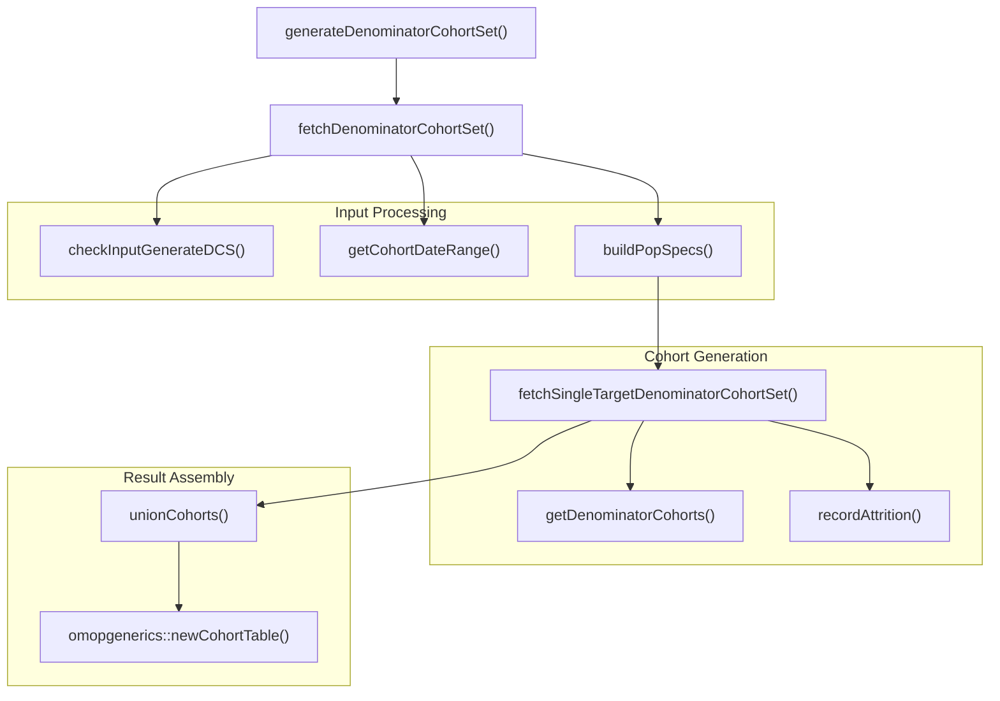
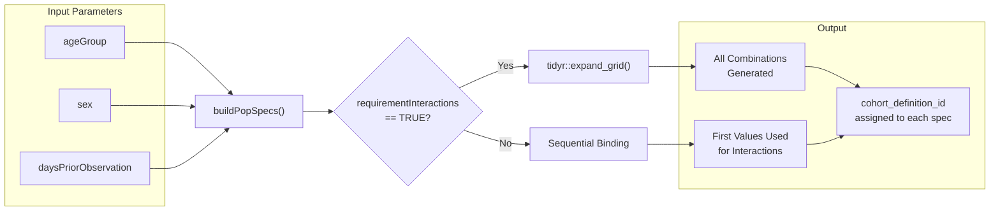
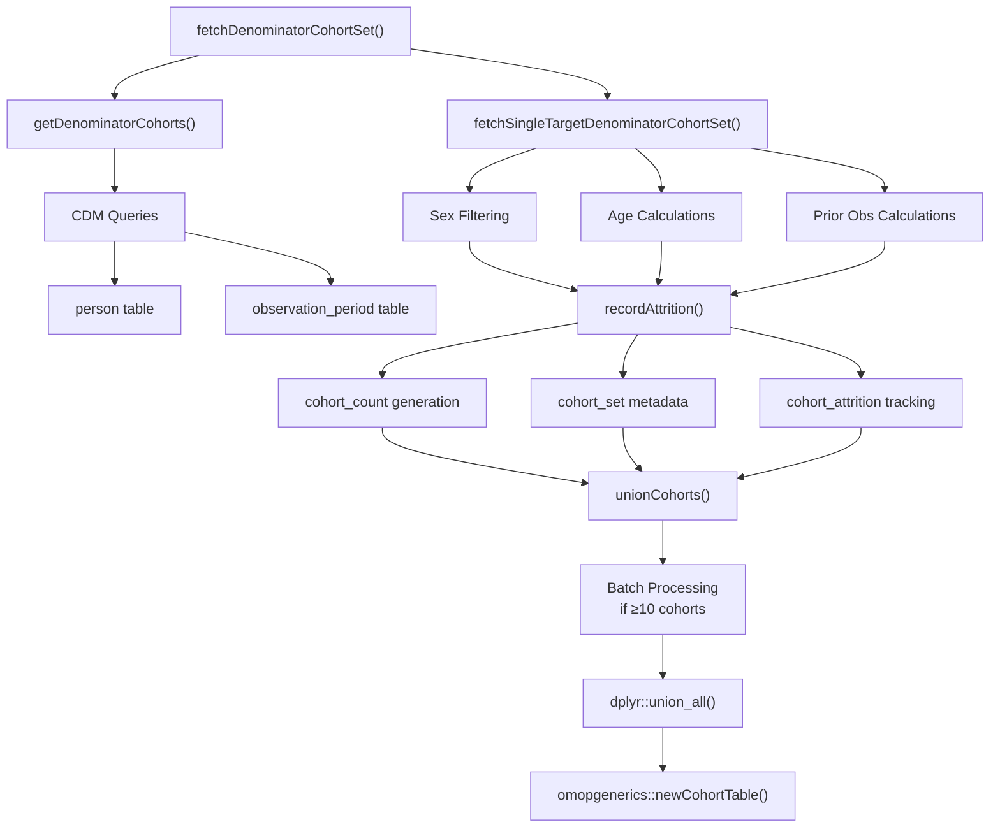

# Page: Denominator Cohort Creation

# Denominator Cohort Creation

<details>
<summary>Relevant source files</summary>

The following files were used as context for generating this wiki page:

- [R/generateDenominatorCohortSet.R](R/generateDenominatorCohortSet.R)
- [vignettes/a02_Creating_denominator_populations.Rmd](vignettes/a02_Creating_denominator_populations.Rmd)
- [vignettes/a03_Creating_target_denominator_populations.Rmd](vignettes/a03_Creating_target_denominator_populations.Rmd)

</details>


## Purpose and Scope

This page covers the creation of denominator cohorts for epidemiological analysis using the `generateDenominatorCohortSet()` function. Denominator cohorts define the population at risk for incidence and prevalence calculations by establishing when individuals enter and exit the study population based on specified criteria including study period, age requirements, sex, and prior observation time.

For information about target-based denominator cohorts and time-at-risk windows, see [Target Cohorts and Time-at-Risk](#4.2). For details on how these denominator cohorts are used in actual incidence and prevalence calculations, see [Incidence Analysis](#5) and [Prevalence Analysis](#6).

## Core Concept: Denominator Cohort Logic

Denominator cohorts define eligible observation time for individuals in the database. The entry and exit logic follows a systematic approach:

**Entry Date**: The latest of:
1. Study start date (`cohortDateRange[1]`)
2. Date of sufficient prior observation (`daysPriorObservation`)
3. Date of minimum age requirement (`ageGroup` lower bound)

**Exit Date**: The earliest of:
1. Study end date (`cohortDateRange[2]`)
2. End of observation period
3. Day before exceeding maximum age (`ageGroup` upper bound)



**Denominator Cohort Entry/Exit Logic**

Sources: [R/generateDenominatorCohortSet.R:25-36](), [vignettes/a02_Creating_denominator_populations.Rmd:25-36]()

## Main Function: generateDenominatorCohortSet

The `generateDenominatorCohortSet()` function serves as the primary interface for creating denominator cohorts. It internally delegates to `fetchDenominatorCohortSet()` which orchestrates the cohort generation process.



**generateDenominatorCohortSet Function Architecture**

Sources: [R/generateDenominatorCohortSet.R:65-85](), [R/generateDenominatorCohortSet.R:309-472]()

### Key Parameters

| Parameter | Type | Description | Default |
|-----------|------|-------------|---------|
| `cdm` | CDM reference | Database connection object | Required |
| `name` | character | Name for the generated cohort table | Required |
| `cohortDateRange` | Date vector | Study period `c(start, end)` | `c(NA, NA)` |
| `ageGroup` | list | Age ranges as `list(c(min, max))` | `list(c(0, 150))` |
| `sex` | character | `"Male"`, `"Female"`, or `"Both"` | `"Both"` |
| `daysPriorObservation` | numeric | Required prior observation days | `0` |
| `requirementInteractions` | logical | Generate all combinations vs sequential | `TRUE` |

Sources: [R/generateDenominatorCohortSet.R:25-50]()

## Population Specification and Stratification

The `buildPopSpecs()` function creates population specifications based on the interaction mode:



**Population Specification Logic**

When `requirementInteractions = TRUE`:
- Creates all combinations using `tidyr::expand_grid()`
- Example: 2 age groups × 2 sexes × 2 prior obs = 8 cohorts

When `requirementInteractions = FALSE`:
- Uses first value of other parameters for each primary parameter
- Reduces combinations for focused analysis

Sources: [R/generateDenominatorCohortSet.R:760-799](), [vignettes/a02_Creating_denominator_populations.Rmd:345-382]()

## Internal Architecture and Data Flow

The cohort generation process involves several key internal functions that work together:



**Internal Data Processing Flow**

The system handles large numbers of cohorts (≥10) through batch processing in `unionCohorts()` to manage memory and performance. Each batch processes 10 cohorts at a time using `split()` and `Reduce()` operations.

Sources: [R/generateDenominatorCohortSet.R:476-738](), [R/generateDenominatorCohortSet.R:802-947]()

## Output Structure and Attributes

The function returns a CDM reference with the new cohort table containing standardized `omopgenerics` attributes:

### Core Table Schema
- `cohort_definition_id`: Integer identifier for each population specification
- `subject_id`: Person identifier from the CDM
- `cohort_start_date`: Calculated entry date for the individual
- `cohort_end_date`: Calculated exit date for the individual

### Cohort Attributes

**`settings()` (cohort_set)**:
```
cohort_definition_id, cohort_name, age_group, sex, days_prior_observation,
start_date, end_date, target_cohort_definition_id, target_cohort_name
```

**`cohortCount()`**:
```
cohort_definition_id, number_records, number_subjects
```

**`attrition()`**:
```
cohort_definition_id, number_records, number_subjects, reason_id, reason,
excluded_records, excluded_subjects
```

The attrition tracking includes standardized reasons like:
- "Not in observation period"
- "Not Male" / "Not Female" (when sex filtering applied)
- "No observation time available after applying criteria"

Sources: [R/generateDenominatorCohortSet.R:705-735](), [vignettes/a02_Creating_denominator_populations.Rmd:384-423]()