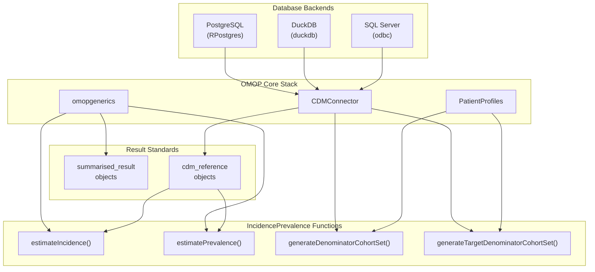
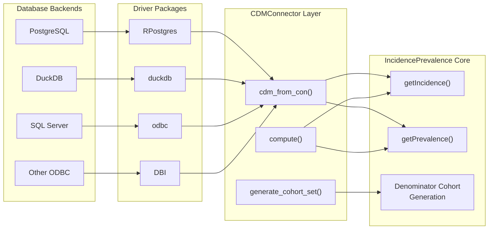
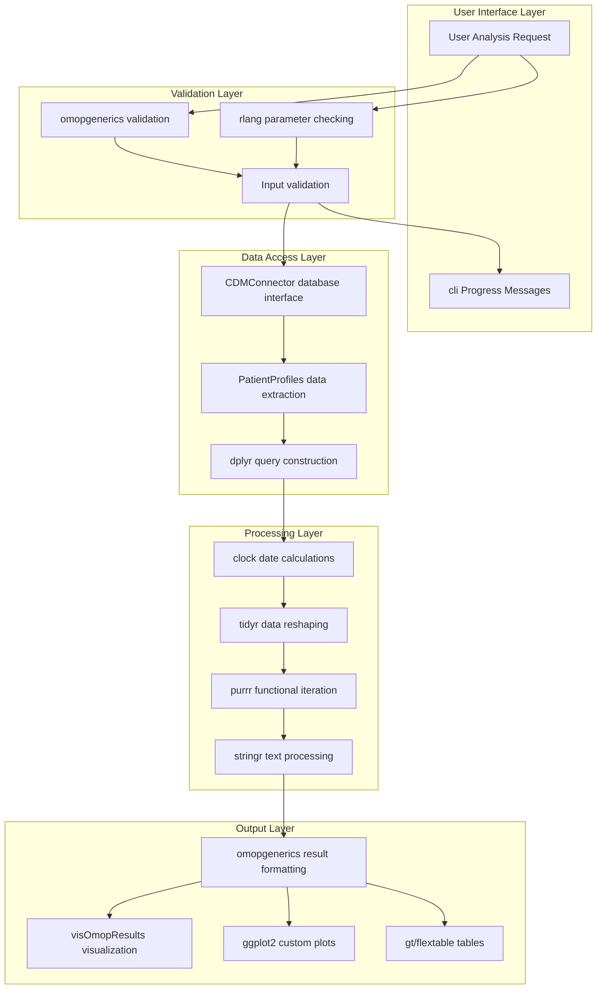

# Page: Dependencies and Integration

# Dependencies and Integration

Relevant source files

The following files were used as context for generating this wiki page:

- [DESCRIPTION](DESCRIPTION)
- [cran-comments.md](cran-comments.md)

This document details the external packages and systems that the IncidencePrevalence package integrates with, focusing on how these dependencies enable epidemiological analysis within the OMOP CDM ecosystem. It covers required dependencies, optional components, database backend integration, and the package's role within the broader OMOP toolchain.

For information about the overall package architecture and components, see [Package Architecture](#1.1). For basic usage patterns and setup procedures, see [Getting Started](#2).

## Core OMOP Ecosystem Dependencies

The IncidencePrevalence package is built as an integral part of the OMOP Common Data Model ecosystem, requiring several core packages that provide standardized data access, validation, and result formatting capabilities.

### OMOP CDM Integration Dependencies

**Sources:** [DESCRIPTION:32-39]()

The package depends on three critical OMOP ecosystem components:

| Package | Version | Purpose | Key Integration Points |
|---------|---------|---------|----------------------|
| `CDMConnector` | ≥ 2.0.0 | Database interface for OMOP CDM | Provides `cdm_reference` objects used throughout analysis functions |
| `omopgenerics` | ≥ 1.1.0 | OMOP data standards and validation | All results return `summarised_result` objects following OMOP conventions |
| `PatientProfiles` | ≥ 1.3.1 | Patient data extraction and profiling | Used for cohort generation and population filtering |

## Database Integration Architecture

The package achieves database-agnostic operation through the `CDMConnector` interface, supporting multiple database backends commonly used in healthcare analytics.

### Database Backend Support

**Sources:** [DESCRIPTION:48-51]()

### Database Driver Dependencies

The package supports multiple database backends through optional driver packages:

- **PostgreSQL**: `RPostgres` package for production PostgreSQL databases
- **DuckDB**: `duckdb` package for in-memory analytics and development
- **SQL Server**: `odbc` package for Microsoft SQL Server connections
- **Generic ODBC**: `DBI` interface for other ODBC-compliant databases

These are listed as `Suggests` dependencies, allowing users to install only the drivers they need.

## Data Science and Visualization Stack

The package leverages the R tidyverse ecosystem for data manipulation, analysis, and visualization, integrating with specialized OMOP visualization tools for standardized output formatting.

### Core Data Processing Dependencies

```mermaid
graph TB
    subgraph "Data Manipulation Core"
        dplyr["dplyr ≥ 1.1.0<br/>filter(), mutate(), summarise()"]
        tidyr["tidyr ≥ 1.2.0<br/>pivot_longer(), nest()"]
        purrr["purrr ≥ 0.3.5<br/>map(), walk()"]
        magrittr["magrittr ≥ 2.0.0<br/>pipe operators"]
    end
    
    subgraph "String and Date Processing"
        stringr["stringr ≥ 1.5.0<br/>str_detect(), str_replace()"]
        glue["glue ≥ 1.5.0<br/>string interpolation"]
        clock["clock<br/>date arithmetic"]
    end
    
    subgraph "Visualization and Output"
        ggplot2["ggplot2 ≥ 3.4.0<br/>plotIncidence(), plotPrevalence()"]
        visOmopResults["visOmopResults ≥ 1.0.2<br/>OMOP result formatting"]
        scales["scales ≥ 1.1.0<br/>axis formatting"]
        patchwork["patchwork<br/>plot composition"]
    end
    
    subgraph "Table Generation"
        gt["gt<br/>HTML tables"]
        flextable["flextable<br/>Word/PowerPoint tables"]
    end
    
    subgraph "Analysis Functions"
        analysis[Analysis Pipeline]
        plotting[Plotting Functions]
        tables[Table Functions]
    end
    
    dplyr --> analysis
    tidyr --> analysis
    purrr --> analysis
    stringr --> analysis
    glue --> analysis
    clock --> analysis
    
    ggplot2 --> plotting
    visOmopResults --> plotting
    visOmopResults --> tables
    scales --> plotting
    patchwork --> plotting
    
    gt --> tables
    flextable --> tables
```

**Sources:** [DESCRIPTION:31-43](), [DESCRIPTION:58-64]()

### Required vs Optional Dependencies

**Required Imports:**
- **Data manipulation**: `dplyr`, `tidyr`, `purrr`, `magrittr` for core data processing
- **String processing**: `stringr`, `glue` for text manipulation and templating
- **Date handling**: `clock` for temporal calculations and date arithmetic
- **R internals**: `rlang` for non-standard evaluation and metaprogramming

**Optional Suggests:**
- **Visualization**: `ggplot2`, `scales`, `patchwork` for plotting functionality
- **OMOP visualization**: `visOmopResults` for standardized OMOP result formatting
- **Table output**: `gt`, `flextable` for formatted table generation

## Development and Testing Dependencies

The package includes comprehensive testing and development tools to ensure reliability and maintain code quality across different environments and database backends.

### Testing and Quality Assurance

| Package | Purpose | Usage Context |
|---------|---------|---------------|
| `testthat` | Unit testing framework | Comprehensive test suite covering all major functions |
| `spelling` | Spell checking | Documentation and code comment validation |
| `tictoc` | Performance benchmarking | Execution time measurement for optimization |
| `here` | Path management | Cross-platform file path handling in tests |

### Statistical Validation Dependencies

The package can optionally integrate with specialized statistical packages for validation and comparison:

- **`Hmisc`**: Advanced statistical functions for confidence interval validation
- **`epitools`**: Epidemiological tools for cross-validation of rate calculations  
- **`binom`**: Binomial confidence interval methods for comparison testing

**Sources:** [DESCRIPTION:52-57](), [DESCRIPTION:64]()

## Integration Patterns and Data Flow

The package follows established patterns for integrating with the OMOP ecosystem while maintaining flexibility for different analysis workflows.

### Dependency Interaction Flow

**Sources:** [DESCRIPTION:31-43]()

## Version Requirements and Compatibility

The package maintains specific version requirements to ensure compatibility with evolving OMOP standards and R ecosystem changes.

### Critical Version Dependencies

- **R**: Requires R ≥ 4.1 for modern R language features
- **CDMConnector**: ≥ 2.0.0 for current OMOP CDM schema support
- **omopgenerics**: ≥ 1.1.0 for latest result standardization
- **dplyr**: ≥ 1.1.0 for enhanced database translation capabilities
- **ggplot2**: ≥ 3.4.0 for improved plot rendering and performance

These version constraints ensure the package can leverage modern R capabilities while maintaining compatibility with current OMOP toolchain standards.

**Sources:** [DESCRIPTION:29-43]()