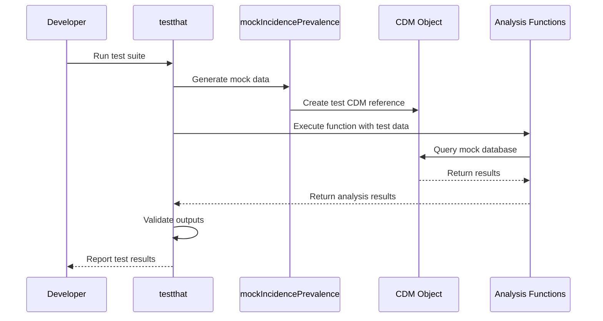
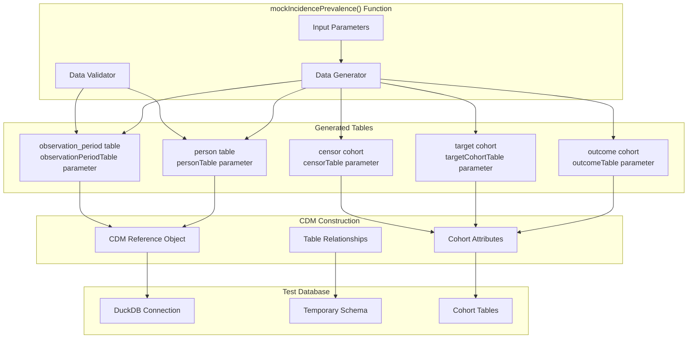
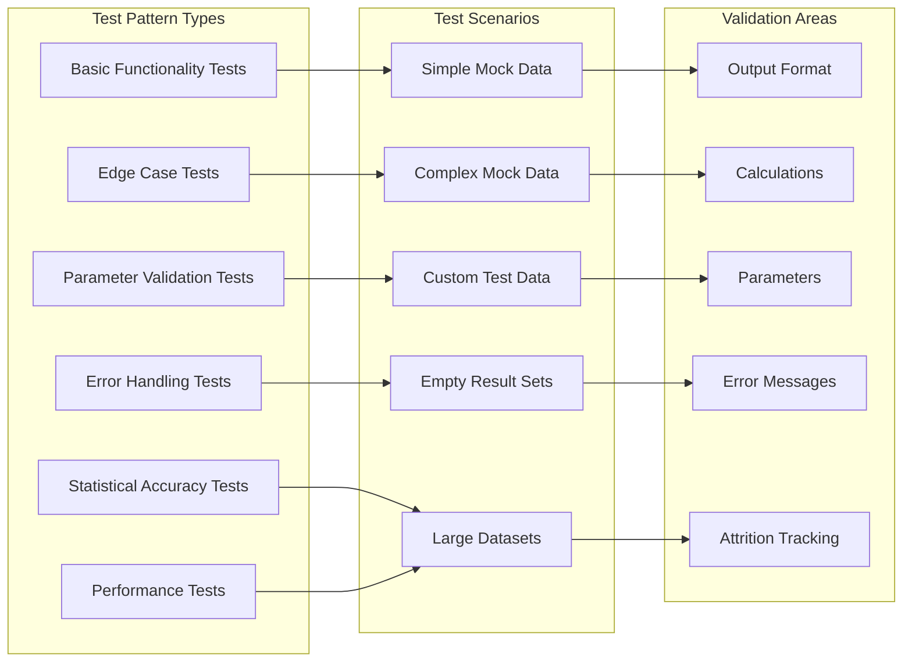
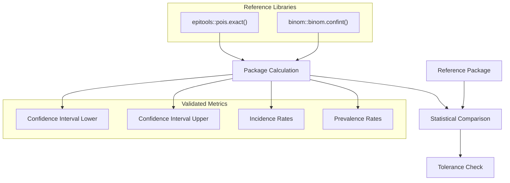
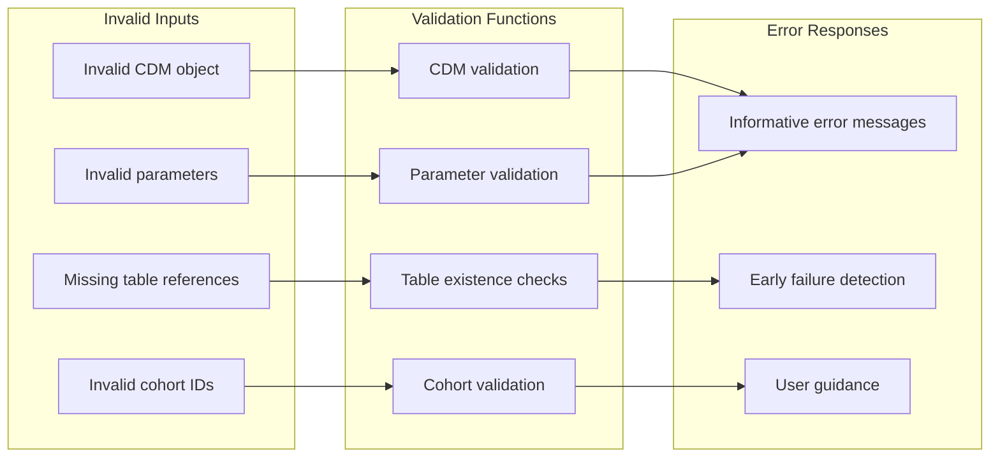

# Page: Development and Testing

# Development and Testing

Relevant source files

The following files were used as context for generating this wiki page:

- [tests/testthat/test-estimateIncidence.R](tests/testthat/test-estimateIncidence.R)
- [tests/testthat/test-estimatePrevalence.R](tests/testthat/test-estimatePrevalence.R)

This document covers the development and testing infrastructure for the IncidencePrevalence package, including the comprehensive test suite, mock data generation system, and testing methodologies used to ensure robust epidemiological analysis functionality.

For information about the core analysis functions being tested, see [Incidence Analysis](#5) and [Prevalence Analysis](#6). For details about the package architecture, see [Package Architecture](#1.1).

## Testing Framework Overview

The IncidencePrevalence package employs a comprehensive testing strategy built on the `testthat` framework. The test suite focuses on validating the core epidemiological calculation engines, input validation systems, and output formatting across various database backends and analytical scenarios.

### Test Architecture

```mermaid
graph TD
    subgraph "Test Infrastructure"
        TESTTHAT["testthat Framework"]
        MOCK["mockIncidencePrevalence()"]
        SKIP["skip_on_cran()"]
    end
    
    subgraph "Core Test Files"
        TEST_INC["test-estimateIncidence.R"]
        TEST_PREV["test-estimatePrevalence.R"]
        TEST_OTHER["Other test files"]
    end
    
    subgraph "Mock Data System"
        MOCK_PERSON["Mock Person Table"]
        MOCK_OBS["Mock Observation Period"]
        MOCK_OUTCOME["Mock Outcome Cohort"]
        MOCK_TARGET["Mock Target Cohort"]
        MOCK_CENSOR["Mock Censor Cohort"]
    end
    
    subgraph "Test Categories"
        UNIT["Unit Tests"]
        INTEGRATION["Integration Tests"]
        EDGE["Edge Case Tests"]
        VALIDATION["Input Validation Tests"]
    end
    
    subgraph "Database Testing"
        DUCKDB["DuckDB Backend"]
        SQLITE["SQLite Backend"]
        TEMP["Temporary Tables"]
        PERMANENT["Permanent Tables"]
    end
    
    TESTTHAT --> TEST_INC
    TESTTHAT --> TEST_PREV
    TESTTHAT --> TEST_OTHER
    
    MOCK --> MOCK_PERSON
    MOCK --> MOCK_OBS
    MOCK --> MOCK_OUTCOME
    MOCK --> MOCK_TARGET
    MOCK --> MOCK_CENSOR
    
    TEST_INC --> UNIT
    TEST_INC --> INTEGRATION
    TEST_INC --> EDGE
    TEST_INC --> VALIDATION
    
    TEST_PREV --> UNIT
    TEST_PREV --> INTEGRATION
    TEST_PREV --> EDGE
    TEST_PREV --> VALIDATION
    
    MOCK --> DUCKDB
    MOCK --> SQLITE
    MOCK --> TEMP
    MOCK --> PERMANENT
```

**Sources:** [tests/testthat/test-estimateIncidence.R:1-50](), [tests/testthat/test-estimatePrevalence.R:1-40]()

### Test Execution Strategy

The test suite uses conditional execution with `skip_on_cran()` for computationally intensive tests, ensuring core functionality is validated while maintaining reasonable execution times for package checks.

**Sources:** [tests/testthat/test-estimateIncidence.R:41](), [tests/testthat/test-estimatePrevalence.R:41]()

## Mock Data Generation System

The `mockIncidencePrevalence()` function provides a sophisticated mock data generation system that creates realistic OMOP CDM-compliant test datasets for comprehensive testing scenarios.

### Mock Data Architecture

**Sources:** [tests/testthat/test-estimateIncidence.R:86-90](), [tests/testthat/test-estimatePrevalence.R:70-74]()

### Mock Data Customization

The mock data system supports extensive customization for testing specific scenarios:

| Parameter | Purpose | Example Usage |
|-----------|---------|---------------|
| `personTable` | Custom person demographics | Age, gender, birth date scenarios |
| `observationPeriodTable` | Custom observation windows | Multiple observation periods, gaps |
| `outcomeTable` | Custom outcome events | Specific outcome timing and patterns |
| `targetCohortTable` | Custom target populations | Denominator cohort variations |
| `censorTable` | Custom censoring events | Death, loss to follow-up scenarios |
| `sampleSize` | Population size control | Performance and edge case testing |

**Sources:** [tests/testthat/test-estimateIncidence.R:58-84](), [tests/testthat/test-estimatePrevalence.R:42-68]()

## Test Organization and Structure

### Core Test Files

The test suite is organized into focused test files that target specific functionality areas:

#### estimateIncidence() Testing
The `test-estimateIncidence.R` file contains comprehensive tests for incidence rate calculations:

- **Output Format Validation**: Tests `summarised_result` structure and column specifications
- **Calculation Accuracy**: Validates incidence rates, confidence intervals, and person-time calculations  
- **Parameter Testing**: Tests washout periods, repeated events, and interval configurations
- **Edge Cases**: Tests overlapping events, multiple observation periods, and boundary conditions

#### estimatePrevalence() Testing  
The `test-estimatePrevalence.R` file focuses on prevalence estimation validation:

- **Point vs Period Prevalence**: Tests both `estimatePointPrevalence()` and `estimatePeriodPrevalence()`
- **Full Contribution Requirements**: Tests period-level analysis requirements
- **Calendar Period Alignment**: Validates time interval calculations and database interval completeness
- **Statistical Accuracy**: Tests confidence interval calculations using Wilson method

**Sources:** [tests/testthat/test-estimateIncidence.R:1-54](), [tests/testthat/test-estimatePrevalence.R:1-38]()

### Test Pattern Categories

**Sources:** [tests/testthat/test-estimateIncidence.R:431-513](), [tests/testthat/test-estimatePrevalence.R:796-842]()

## Key Testing Patterns

### Mock CDM Generation Pattern

Most tests follow a consistent pattern for generating test CDM objects:

1. **Create Mock Tables**: Define `personTable`, `observationPeriodTable`, and `outcomeTable`
2. **Generate CDM**: Call `mockIncidencePrevalence()` with custom tables
3. **Create Denominator**: Use `generateDenominatorCohortSet()` or `generateTargetDenominatorCohortSet()`
4. **Execute Analysis**: Call analysis functions with test parameters
5. **Validate Results**: Assert expected outcomes and formats

**Sources:** [tests/testthat/test-estimateIncidence.R:86-100](), [tests/testthat/test-estimatePrevalence.R:70-87]()

### Statistical Validation Pattern

Critical statistical calculations are validated against established R packages:

**Sources:** [tests/testthat/test-estimateIncidence.R:2942-2988](), [tests/testthat/test-estimatePrevalence.R:1034-1079]()

### Edge Case Testing Strategy

The test suite includes comprehensive edge case coverage:

- **Empty Cohorts**: Tests behavior with no eligible subjects or outcomes
- **Single Day Periods**: Tests boundary conditions for time calculations  
- **Overlapping Events**: Tests handling of concurrent outcome events
- **Multiple Observation Periods**: Tests complex patient histories
- **Database Completeness**: Tests `completeDatabaseIntervals` parameter effects

**Sources:** [tests/testthat/test-estimateIncidence.R:1978-2032](), [tests/testthat/test-estimatePrevalence.R:1245-1263]()

### Input Validation Testing

Comprehensive input validation ensures robust error handling:

**Sources:** [tests/testthat/test-estimateIncidence.R:2431-2514](), [tests/testthat/test-estimatePrevalence.R:833-842]()

## Test Coverage Areas

### Core Analysis Functions

| Function | Test Coverage | Key Scenarios |
|----------|---------------|---------------|
| `estimateIncidence()` | Comprehensive | Washout periods, repeated events, intervals |
| `estimatePrevalence()` | Comprehensive | Point vs period, full contribution, time points |
| `estimatePointPrevalence()` | Full | Time point calculations, calendar alignment |
| `estimatePeriodPrevalence()` | Full | Period calculations, contribution requirements |

### Database Backend Testing

The test suite validates functionality across different database configurations:

- **DuckDB Backend**: Primary testing database for in-memory operations
- **Temporary vs Permanent Tables**: Tests both table creation strategies
- **Local CDM Objects**: Tests with collected (local) CDM references
- **Connection Management**: Tests proper connection handling and cleanup

**Sources:** [tests/testthat/test-estimateIncidence.R:3103-3124](), [tests/testthat/test-estimatePrevalence.R:1193-1217]()

### Attrition and Population Tracking

Comprehensive testing of population filtering and attrition reporting:

- **Attrition Tables**: Validates `incidence_attrition` and `prevalence_attrition` results
- **Minimum Cell Count Suppression**: Tests `omopgenerics::suppress()` integration
- **Population Exclusions**: Tests age, sex, and observation period exclusions
- **Complete Database Intervals**: Tests population filtering for complete periods

**Sources:** [tests/testthat/test-estimateIncidence.R:2990-3043](), [tests/testthat/test-estimatePrevalence.R:1081-1112]()

### Stratification and Multiple Cohorts

Advanced testing scenarios include:

- **Stratified Analysis**: Tests custom stratification variables
- **Multiple Denominator Cohorts**: Tests analysis across different populations  
- **Multiple Outcome Cohorts**: Tests analysis of different outcome definitions
- **Cohort Name Resolution**: Tests both numeric IDs and character names for cohort specification

**Sources:** [tests/testthat/test-estimateIncidence.R:3181-3341](), [tests/testthat/test-estimatePrevalence.R:1265-1413]()