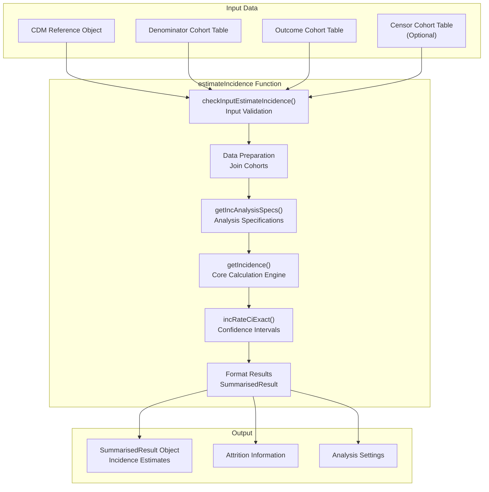
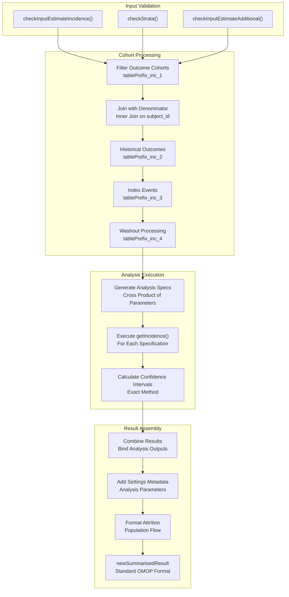
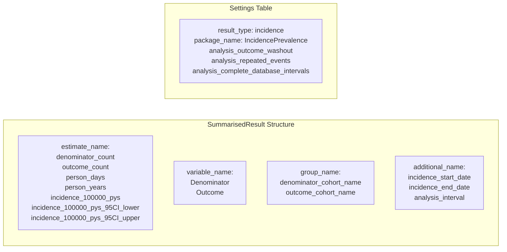
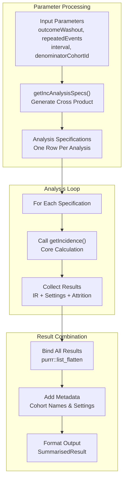

# Page: Estimating Incidence Rates

# Estimating Incidence Rates

<details>
<summary>Relevant source files</summary>

The following files were used as context for generating this wiki page:

- [R/estimateIncidence.R](R/estimateIncidence.R)
- [vignettes/a05_Calculating_incidence.Rmd](vignettes/a05_Calculating_incidence.Rmd)

</details>


This page covers the practical usage of the `estimateIncidence()` function for calculating population incidence rates in epidemiological studies. It focuses on the high-level API, input requirements, output interpretation, and common usage patterns. For detailed technical implementation of the calculation engine, see [Incidence Calculation Engine](#5.2). For comprehensive parameter configuration details, see [Parameters and Configuration](#5.3). For conceptual background on incidence versus prevalence measures, see [Incidence vs Prevalence](#3.3).

## Function Overview

The `estimateIncidence()` function is the primary interface for calculating incidence rates from OMOP CDM data. It takes denominator and outcome cohorts and produces standardized incidence rate estimates with confidence intervals, supporting various temporal intervals, washout periods, and stratification options.

### Core Workflow



Sources: [R/estimateIncidence.R:78-502](), [R/estimateIncidence.R:102-107](), [R/estimateIncidence.R:261-266](), [R/estimateIncidence.R:275-295](), [R/estimateIncidence.R:374-379](), [R/estimateIncidence.R:481-494]()

## Data Flow and Processing



Sources: [R/estimateIncidence.R:102-153](), [R/estimateIncidence.R:156-260](), [R/estimateIncidence.R:261-322](), [R/estimateIncidence.R:324-494]()

## Basic Usage Pattern

The simplest incidence calculation requires only a CDM reference, denominator table, and outcome table:

```r
inc <- estimateIncidence(
  cdm = cdm,
  denominatorTable = "denominator", 
  outcomeTable = "outcome"
)
```

This will calculate yearly incidence rates with default settings (infinite washout, no repeated events).

Sources: [vignettes/a05_Calculating_incidence.Rmd:105-112](), [R/estimateIncidence.R:78-90]()

## Input Requirements

### Required Parameters

| Parameter | Type | Description |
|-----------|------|-------------|
| `cdm` | CDM Reference | OMOP CDM database connection |
| `denominatorTable` | String | Name of denominator cohort table in CDM |
| `outcomeTable` | String | Name of outcome cohort table in CDM |

### Optional Parameters

| Parameter | Default | Description |
|-----------|---------|-------------|
| `censorTable` | `NULL` | Cohort table for censoring events |
| `denominatorCohortId` | `NULL` | Specific denominator cohorts (all if NULL) |
| `outcomeCohortId` | `NULL` | Specific outcome cohorts (all if NULL) |
| `interval` | `"years"` | Time intervals: "weeks", "months", "quarters", "years", "overall" |
| `outcomeWashout` | `Inf` | Days between outcome end and risk contribution restart |
| `repeatedEvents` | `FALSE` | Allow multiple events per person |
| `strata` | `list()` | Variables for stratified analysis |

Sources: [R/estimateIncidence.R:78-90](), [R/estimateIncidence.R:19-61]()

## Output Structure

The function returns a `summarised_result` object containing:

### Main Results
- **Incidence rates**: Per 100,000 person-years with 95% confidence intervals
- **Counts**: Denominator population, outcome events
- **Time**: Person-days and person-years contributed
- **Intervals**: Temporal breakdown by specified intervals

### Metadata
- **Settings**: Analysis parameters and cohort definitions
- **Attrition**: Population flow and exclusions
- **Stratification**: Results by specified strata



Sources: [R/estimateIncidence.R:419-458](), [R/estimateIncidence.R:461-479](), [R/estimateIncidence.R:481-494]()

## Confidence Interval Calculation

The function uses exact confidence intervals based on the chi-square distribution:

```r
incRateCiExact <- function(ev, pt) {
  # Lower CI: qchisq(0.025, df = 2*events) / 2 / person_time * 100000
  # Upper CI: qchisq(0.975, df = 2*(events+1)) / 2 / person_time * 100000
}
```

Sources: [R/estimateIncidence.R:506-516](), [R/estimateIncidence.R:374-379]()

## Parameter Specification Process



Sources: [R/estimateIncidence.R:261-266](), [R/estimateIncidence.R:519-563](), [R/estimateIncidence.R:270-322](), [R/estimateIncidence.R:324-346]()

## Common Usage Examples

### Multiple Time Intervals
```r
inc <- estimateIncidence(
  cdm = cdm,
  denominatorTable = "denominator",
  outcomeTable = "outcome", 
  interval = c("years", "quarters", "overall")
)
```

### With Washout and Repeated Events
```r
inc <- estimateIncidence(
  cdm = cdm,
  denominatorTable = "denominator",
  outcomeTable = "outcome",
  outcomeWashout = 180,
  repeatedEvents = TRUE
)
```

### Stratified Analysis
```r
inc <- estimateIncidence(
  cdm = cdm,
  denominatorTable = "denominator", 
  outcomeTable = "outcome",
  strata = list("age_group", "sex", c("age_group", "sex"))
)
```

### With Censoring
```r
inc <- estimateIncidence(
  cdm = cdm,
  denominatorTable = "denominator",
  outcomeTable = "outcome", 
  censorTable = "censor",
  censorCohortId = 1
)
```

Sources: [vignettes/a05_Calculating_incidence.Rmd:104-300]()

## Temporary Table Management

The function creates several temporary tables during processing with a random prefix to avoid conflicts:

- `{tablePrefix}_inc_1`: Outcome cohorts joined with denominator
- `{tablePrefix}_inc_2`: Historical and concurrent outcomes  
- `{tablePrefix}_inc_3`: Indexed events by person and outcome
- `{tablePrefix}_inc_4`: Events with previous outcome end dates

All temporary tables are automatically dropped after processing.

Sources: [R/estimateIncidence.R:93-95](), [R/estimateIncidence.R:156-260](), [R/estimateIncidence.R:381-388]()