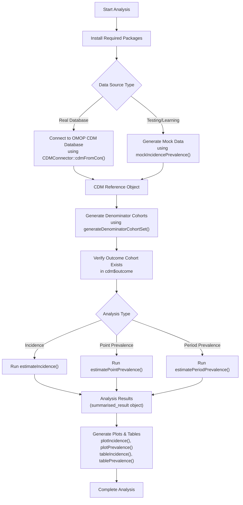
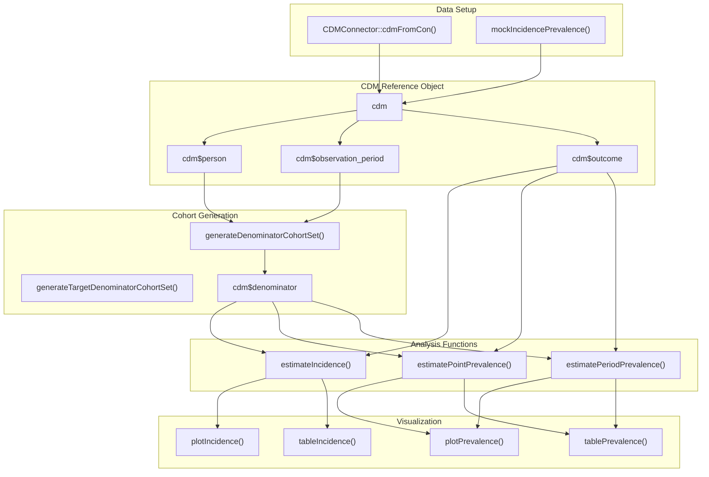

# Page: Getting Started

# Getting Started

<details>
<summary>Relevant source files</summary>

The following files were used as context for generating this wiki page:

- [README.Rmd](README.Rmd)
- [README.md](README.md)
- [vignettes/a01_Introduction_to_IncidencePrevalence.Rmd](vignettes/a01_Introduction_to_IncidencePrevalence.Rmd)

</details>


This page provides a practical guide to setting up and running your first incidence and prevalence analysis using the IncidencePrevalence package. It covers installation, basic workflow patterns, and essential functions needed to perform epidemiological analyses on OMOP CDM data.

For detailed information about core epidemiological concepts, see [Core Concepts](#3). For comprehensive installation instructions, see [Installation and Setup](#2.1). For working examples of specific analysis types, see [Basic Usage Examples](#2.2).

## Prerequisites and Installation

The IncidencePrevalence package requires R and integrates tightly with the OMOP CDM ecosystem. You will need:

| Requirement | Purpose | Installation Method |
|-------------|---------|-------------------|
| R (≥ 4.0) | Base environment | Download from CRAN |
| CDMConnector | Database connectivity | `install.packages("CDMConnector")` |
| IncidencePrevalence | Core analytics | `install.packages("IncidencePrevalence")` |
| OMOP CDM Database | Data source | Database-specific setup |

**Installation from CRAN:**
```r
install.packages("IncidencePrevalence")
```

**Installation from GitHub (development version):**
```r
install.packages("remotes")
remotes::install_github("darwin-eu/IncidencePrevalence")
```

Sources: [README.md:24-37]()

## Core Workflow Overview

**Basic Analysis Workflow**



Sources: [README.md:39-232](), [vignettes/a01_Introduction_to_IncidencePrevalence.Rmd:20-127]()

**Key Function Relationships**



Sources: [README.md:47-81](), [README.md:94-105](), [README.md:185-232]()

## Creating Your First Analysis

### Step 1: Load Required Libraries

```r
library(CDMConnector)
library(IncidencePrevalence)
```

### Step 2: Create CDM Reference

For learning purposes, use mock data:
```r
cdm <- mockIncidencePrevalence(
  sampleSize = 10000,
  outPre = 0.3,
  minOutcomeDays = 365,
  maxOutcomeDays = 3650
)
```

For real databases, connect using `CDMConnector::cdmFromCon()` with your database connection parameters.

Sources: [README.md:74-81](), [README.md:56-69]()

### Step 3: Generate Denominator Cohorts

The `generateDenominatorCohortSet()` function creates the population at risk for your analysis:

```r
cdm <- generateDenominatorCohortSet(
  cdm = cdm,
  name = "denominator",
  cohortDateRange = as.Date(c("2008-01-01", "2018-01-01")),
  ageGroup = list(c(0, 64), c(65, 100)),
  sex = c("Male", "Female", "Both"),
  daysPriorObservation = 180
)
```

This creates multiple denominator cohorts based on different combinations of age groups and sex criteria.

Sources: [README.md:94-105]()

### Step 4: Examine Cohort Structure

**View cohort settings:**
```r
settings(cdm$denominator)
```

**Check cohort counts:**
```r
cohortCount(cdm$denominator)
```

**Inspect cohort table structure:**
```r
cdm$denominator
```

Sources: [README.md:109-144](), [vignettes/a01_Introduction_to_IncidencePrevalence.Rmd:71-86]()

### Step 5: Run Analysis

**Estimate Incidence:**
```r
inc <- estimateIncidence(
  cdm = cdm,
  denominatorTable = "denominator",
  outcomeTable = "outcome",
  interval = "years",
  repeatedEvents = TRUE,
  outcomeWashout = 180,
  completeDatabaseIntervals = TRUE
)
```

**Estimate Point Prevalence:**
```r
prev_point <- estimatePointPrevalence(
  cdm = cdm,
  denominatorTable = "denominator",
  outcomeTable = "outcome",
  interval = "years",
  timePoint = "start"
)
```

**Estimate Period Prevalence:**
```r
prev_period <- estimatePeriodPrevalence(
  cdm = cdm,
  denominatorTable = "denominator",
  outcomeTable = "outcome",
  interval = "years",
  completeDatabaseIntervals = TRUE,
  fullContribution = TRUE
)
```

Sources: [README.md:185-193](), [README.md:203-209](), [README.md:220-227]()

### Step 6: Visualize Results

Generate plots with stratification:
```r
plotIncidence(inc, facet = c("denominator_age_group", "denominator_sex"))
plotPrevalence(prev_point, facet = c("denominator_age_group", "denominator_sex"))
```

Sources: [README.md:194](), [README.md:210]()

## Understanding Key Data Structures

### CDM Reference Object
The `cdm` object contains references to all OMOP CDM tables and generated cohorts. Key components include:
- `cdm$person` - Person demographics
- `cdm$observation_period` - Time periods of observation
- `cdm$outcome` - Outcome cohort definitions
- `cdm$denominator` - Generated denominator cohorts

### Denominator Cohort Settings
The `settings()` function reveals the configuration used to generate each denominator cohort, including age groups, sex criteria, and observation requirements.

### Analysis Results Structure
All analysis functions return `summarised_result` objects that follow OMOP standards and can be processed by visualization and table generation functions.

Sources: [README.md:125-144](), [vignettes/a01_Introduction_to_IncidencePrevalence.Rmd:72-86]()

## Common Parameters and Configuration

| Parameter | Function Usage | Purpose |
|-----------|----------------|---------|
| `interval` | All analysis functions | Time intervals for analysis ("years", "quarters", "months") |
| `outcomeWashout` | `estimateIncidence()` | Minimum days between repeated events |
| `timePoint` | `estimatePointPrevalence()` | When to measure prevalence ("start", "mid", "end") |
| `completeDatabaseIntervals` | Analysis functions | Require complete data coverage for intervals |
| `fullContribution` | `estimatePeriodPrevalence()` | Require full observation period for individuals |
| `repeatedEvents` | `estimateIncidence()` | Allow multiple events per person |

Sources: [README.md:185-227](), [vignettes/a01_Introduction_to_IncidencePrevalence.Rmd:90-118]()

## Next Steps

Once you have completed your first analysis, you can:

1. Explore advanced cohort generation options in [Cohort Generation](#4)
2. Learn about specific analysis types in [Incidence Analysis](#5) and [Prevalence Analysis](#6)
3. Customize visualizations and reporting using [Visualization and Reporting](#7)
4. Understand the underlying epidemiological concepts in [Core Concepts](#3)

Sources: [README.md:1-232](), [vignettes/a01_Introduction_to_IncidencePrevalence.Rmd:1-127]()