# Page: Incidence Analysis

# Incidence Analysis

Relevant source files

The following files were used as context for generating this wiki page:

- [R/estimateIncidence.R](R/estimateIncidence.R)
- [tests/testthat/test-estimateIncidence.R](tests/testthat/test-estimateIncidence.R)

This document covers the incidence rate estimation functionality provided by the `estimateIncidence()` function and its supporting components. Incidence analysis calculates the rate of new events occurring in a population over specified time intervals, accounting for varying observation periods and washout criteria.

For information about the underlying cohort generation that feeds into incidence analysis, see [Cohort Generation](#4). For prevalence analysis instead of incidence, see [Prevalence Analysis](#6). For visualization of incidence results, see [Visualization and Reporting](#7).

## Main Analysis Function

The primary entry point for incidence analysis is `estimateIncidence()`, which orchestrates the entire calculation process from cohort processing through result formatting.

### Function Overview

**Sources:** [R/estimateIncidence.R:78-502](), [tests/testthat/test-estimateIncidence.R:1-3044]()

### Key Parameters

The `estimateIncidence()` function accepts several critical parameters that control the analysis behavior:

| Parameter | Type | Description | Default |
|-----------|------|-------------|---------|
| `denominatorTable` | character | Cohort table containing denominator populations | required |
| `outcomeTable` | character | Cohort table containing outcome events | required |
| `interval` | character | Time intervals: "weeks", "months", "quarters", "years", "overall" | "years" |
| `outcomeWashout` | numeric | Days between outcome end and return to risk | `Inf` |
| `repeatedEvents` | logical | Allow multiple events per person | `FALSE` |
| `completeDatabaseIntervals` | logical | Require complete interval coverage | `TRUE` |

**Sources:** [R/estimateIncidence.R:78-90]()

## Data Processing Pipeline

The incidence calculation follows a systematic data transformation pipeline using temporary tables with specific naming conventions.

### Table Processing Flow

**Sources:** [R/estimateIncidence.R:156-259]()

### Outcome Event Processing

The system processes outcome events through several transformation stages:

1. **Initial Join** - Links outcome events to denominator cohorts by `subject_id`
2. **Pre-cohort Events** - Identifies most recent events before cohort entry (for washout)
3. **During-cohort Events** - Captures events occurring during follow-up period
4. **Event Indexing** - Orders events chronologically per person/outcome combination
5. **Washout Preparation** - Joins event end dates for washout calculations

**Sources:** [R/estimateIncidence.R:156-259]()

## Analysis Specifications

The system generates analysis specifications by expanding all parameter combinations into individual analysis runs.

### Specification Generation

**Sources:** [R/estimateIncidence.R:519-563]()

Each analysis specification contains:
- Unique `analysis_id`
- Outcome and denominator cohort IDs
- Boolean flags for each interval type
- Washout and repeated events settings
- Database interval completion requirements

## Core Calculation Engine

The `getIncidence()` function performs the actual incidence rate calculations for each analysis specification.

### Calculation Process

**Sources:** [R/estimateIncidence.R:275-295]()

### Washout Period Logic

The washout mechanism prevents counting events that occur too soon after previous events:

- **Infinite washout (`Inf`)**: No time contributed after any event
- **Finite washout (days)**: Return to risk after specified days post-event
- **Zero washout (`0`)**: Immediate return to risk after event end

**Sources:** [tests/testthat/test-estimateIncidence.R:597-759]()

## Time Interval Processing

The system supports multiple time interval calculations with calendar-based boundaries.

### Interval Types

**Sources:** [R/estimateIncidence.R:40-47](), [tests/testthat/test-estimateIncidence.R:502-595]()

### Complete Database Intervals

When `completeDatabaseIntervals = TRUE`, the system only includes intervals where the denominator cohort spans the entire calendar period (e.g., full calendar year for yearly intervals).

**Sources:** [tests/testthat/test-estimateIncidence.R:1819-1976]()

## Confidence Interval Calculation

Incidence rates include exact confidence intervals based on the Poisson distribution.

### CI Calculation Method

The exact formula uses chi-square quantiles:
- Lower CI: `qchisq(0.025, df=2*events) / (2*person_years) * 100000`
- Upper CI: `qchisq(0.975, df=2*(events+1)) / (2*person_years) * 100000`

**Sources:** [R/estimateIncidence.R:506-516]()

## Result Structure

The function returns a `summarised_result` object containing incidence estimates, analysis settings, and attrition information.

### Result Components

**Sources:** [R/estimateIncidence.R:419-494]()

### Estimate Names

Each result row contains one of these estimate types:
- `denominator_count`: Number of people in denominator
- `outcome_count`: Number of outcome events
- `person_days`: Total person-days at risk
- `person_years`: Total person-years at risk  
- `incidence_100000_pys`: Incidence rate per 100,000 person-years
- `incidence_100000_pys_95CI_lower`: Lower 95% confidence bound
- `incidence_100000_pys_95CI_upper`: Upper 95% confidence bound

**Sources:** [R/estimateIncidence.R:437-445]()

## Error Handling and Validation

The system includes comprehensive input validation to ensure data quality and parameter consistency.

### Validation Checks

```mermaid
graph TD
    Validation["Input Validation"] --> CDMCheck["CDM reference validation"]
    Validation --> TableCheck["Cohort table existence"]
    Validation --> ParamCheck["Parameter type validation"]
    Validation --> CohortCheck["Cohort ID validation"]
    
    CDMCheck --> CDMRef["Check CDM reference object"]
    TableCheck --> DenomExists["denominatorTable exists"]
    TableCheck --> OutcomeExists["outcomeTable exists"]
    ParamCheck --> IntervalValid["interval values valid"]
    ParamCheck --> WashoutValid["outcomeWashout numeric"]
    CohortCheck --> IDsExist["Cohort IDs exist in tables"]
    CohortCheck --> NoOverlap["Denominator ≠ outcome cohorts"]
```

**Sources:** [R/estimateIncidence.R:102-153](), [tests/testthat/test-estimateIncidence.R:2431-2514]()

The validation prevents common errors such as:
- Using the same cohort as both denominator and outcome
- Specifying non-existent cohort IDs
- Invalid interval specifications
- Missing required tables in CDM