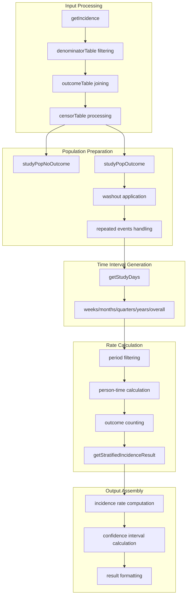
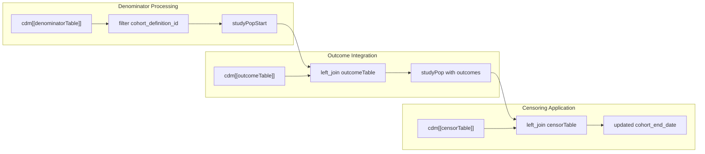
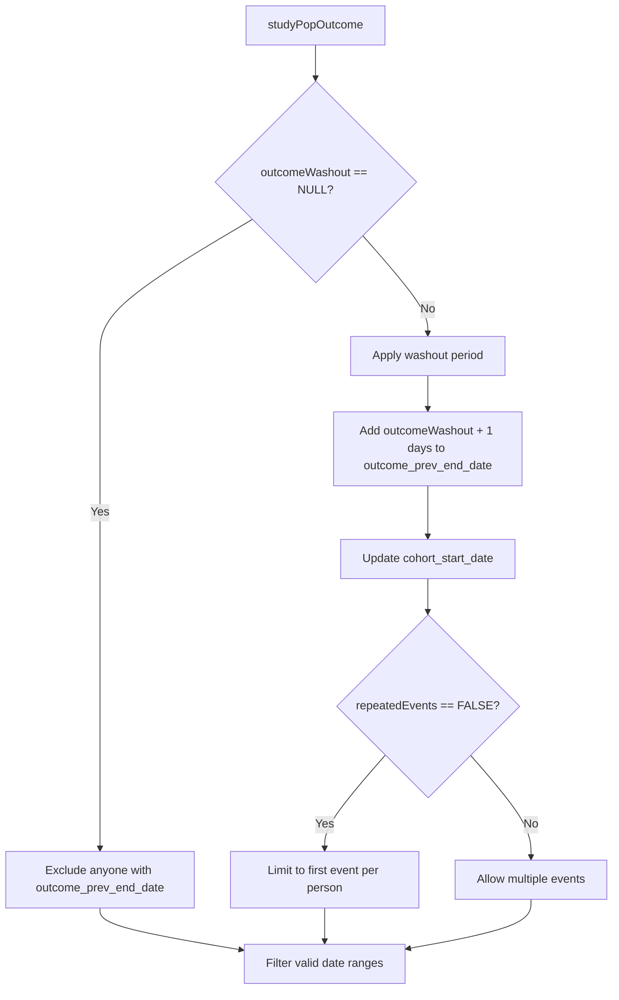
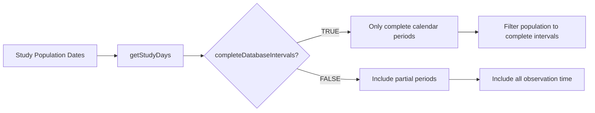
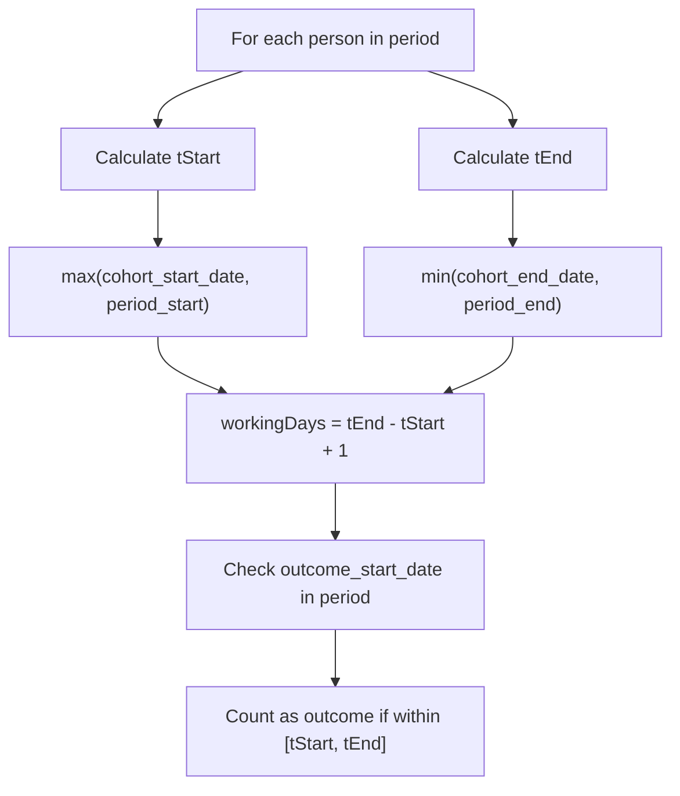
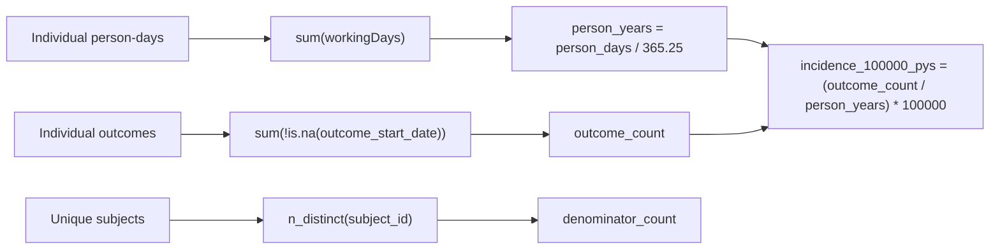
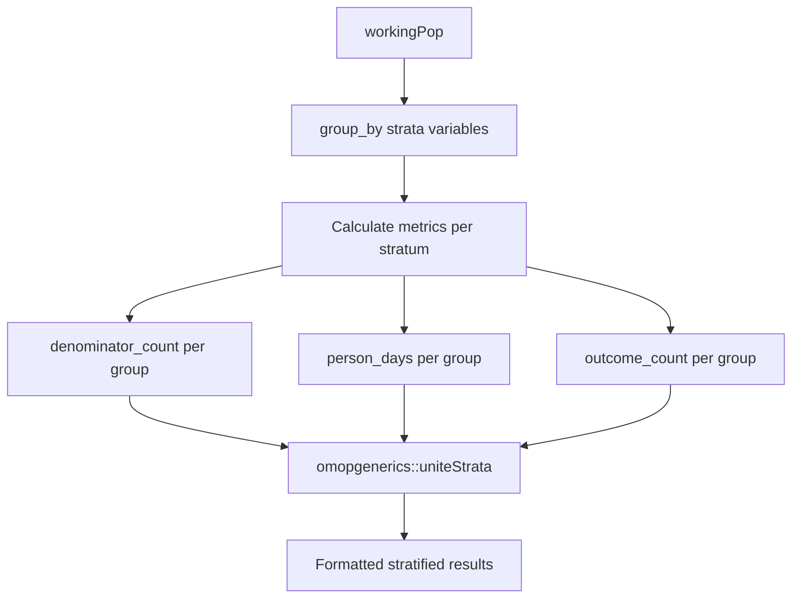
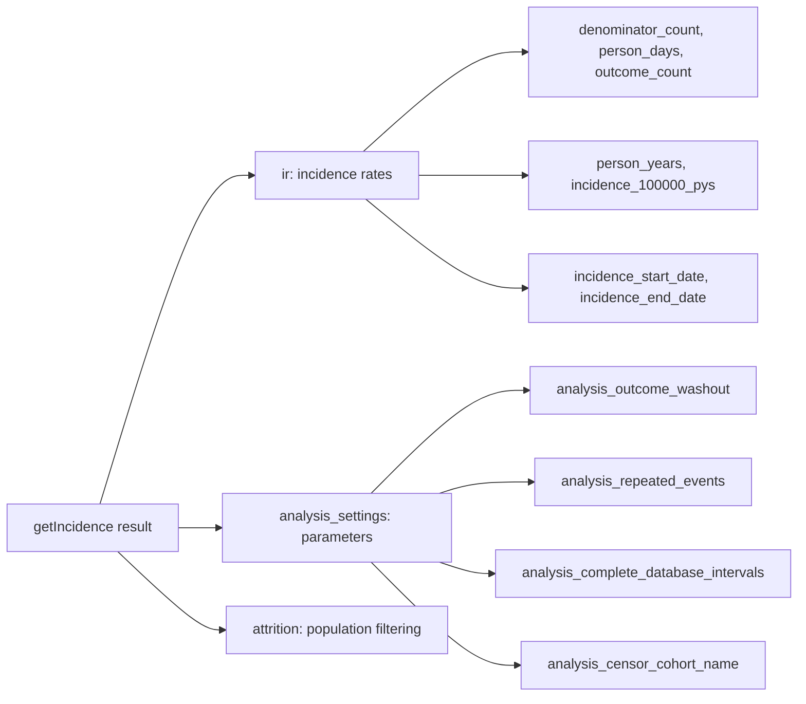

# Page: Incidence Calculation Engine

# Incidence Calculation Engine

Relevant source files

The following files were used as context for generating this wiki page:

- [R/getIncidence.R](R/getIncidence.R)
- [tests/testthat/test-estimateIncidence.R](tests/testthat/test-estimateIncidence.R)

This document covers the core calculation engine that powers incidence rate estimation in the IncidencePrevalence package. The `getIncidence` function serves as the computational heart that processes denominator cohorts, applies washout criteria, handles time intervals, and calculates incidence rates with confidence intervals.

For information about the user-facing incidence estimation functions, see [Estimating Incidence Rates](#5.1). For configuration parameters and their effects, see [Parameters and Configuration](#5.3).

## Core Calculation Workflow

The incidence calculation engine follows a systematic data processing pipeline that transforms cohort data into incidence rate estimates:

Sources: [R/getIncidence.R:17-443]()

## Data Processing Pipeline

The calculation engine processes data through several distinct phases, each handling specific aspects of the incidence calculation:

### Population Assembly and Filtering

The engine begins by assembling the study population from the denominator cohort and joining outcome events:

Sources: [R/getIncidence.R:43-102]()

The population is split into two groups for differential processing:
- `studyPopNoOutcome`: Participants without outcome events [R/getIncidence.R:104-106]()
- `studyPopOutcome`: Participants with outcome events requiring special handling [R/getIncidence.R:111-117]()

### Washout Period Application

The washout logic varies depending on configuration and outcome history:

Sources: [R/getIncidence.R:126-186]()

The washout implementation uses `CDMConnector::dateadd` for database-agnostic date arithmetic [R/getIncidence.R:142-145]().

## Time Interval Processing

The engine supports multiple time interval types through the `getStudyDays` function, which generates calendar-aligned periods:

| Interval Type | Description | Alignment |
|--------------|-------------|-----------|
| `weeks` | Weekly intervals | Monday-Sunday |
| `months` | Monthly intervals | 1st to last day of month |
| `quarters` | Quarterly intervals | Q1 (Jan-Mar), Q2 (Apr-Jun), etc. |
| `years` | Annual intervals | January 1st to December 31st |
| `overall` | Single period | Study start to end |

Sources: [R/getIncidence.R:246-286]()

### Complete Database Intervals

The `completeDatabaseIntervals` parameter controls whether partial periods are included:

Sources: [R/getIncidence.R:251-276](), [R/getIncidence.R:310-324]()

## Person-Time and Outcome Calculation

For each time interval, the engine calculates person-time contribution and counts outcomes:

### Individual Time Contribution

Each person's contribution to a specific time period is calculated using interval overlap logic:

Sources: [R/getIncidence.R:344-371]()

### Aggregation Logic

Results are aggregated using standard epidemiological measures:

Sources: [R/getIncidence.R:375-415]()

## Stratification Support

The engine supports stratified analyses through the `getStratifiedIncidenceResult` function:

Sources: [R/getIncidence.R:446-463]()

The stratification process maintains the same calculation logic while grouping by specified variables and using `omopgenerics::uniteStrata` for consistent formatting.

## Attrition Tracking

Throughout the calculation process, the engine tracks population attrition using `recordAttrition`:

| Reason ID | Description | Location |
|-----------|-------------|----------|
| 11 | Starting analysis population | [R/getIncidence.R:54-59]() |
| 12 | Apply washout criteria | [R/getIncidence.R:219-225]() |
| 13-14 | Complete database interval filtering | [R/getIncidence.R:300-324]() |

This provides transparency into how the population is filtered and enables quality assurance.

## Output Structure

The `getIncidence` function returns a structured list containing:

Sources: [R/getIncidence.R:423-442]()

The results structure enables downstream functions to apply confidence intervals, format output tables, and generate visualizations while preserving all analysis metadata.

Sources: [R/getIncidence.R:17-443](), [tests/testthat/test-estimateIncidence.R:1-3070]()