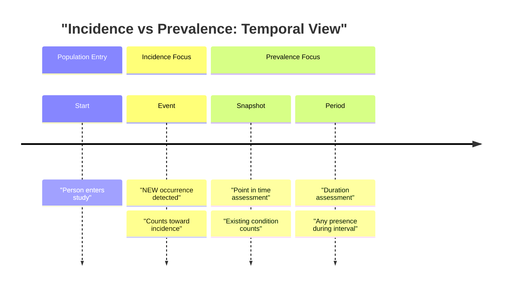
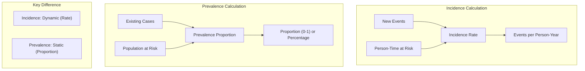
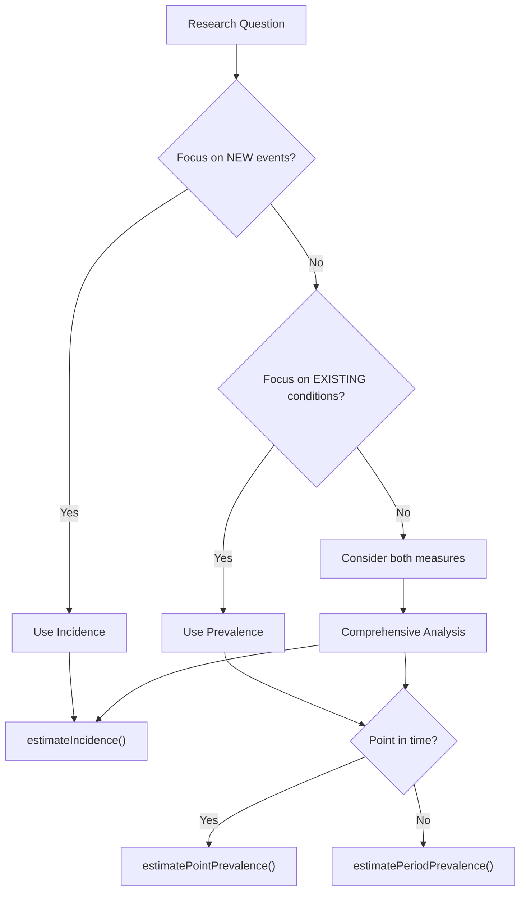
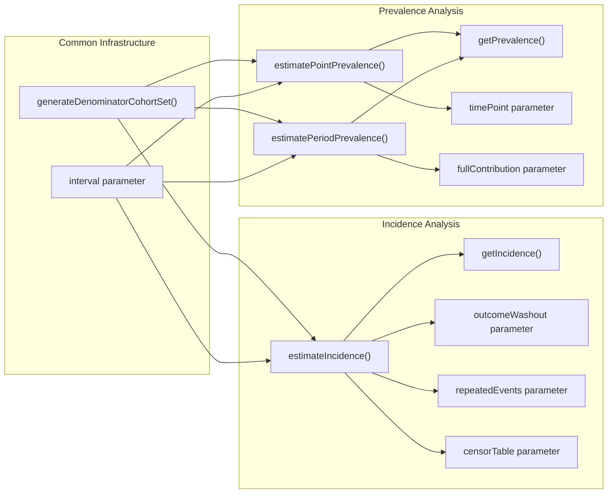
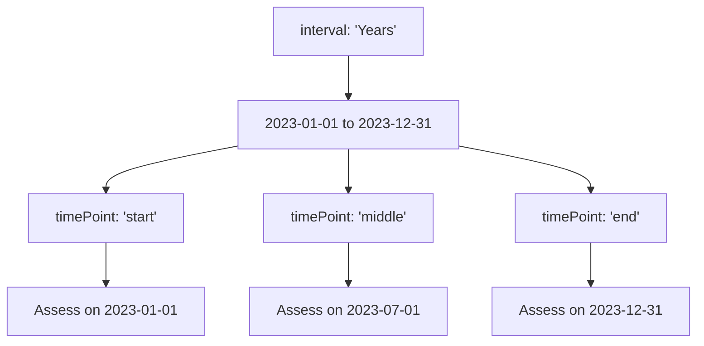
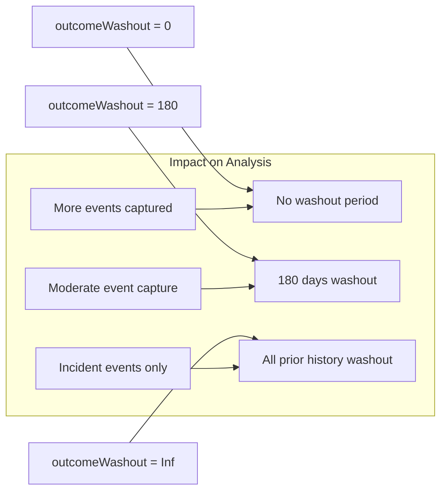
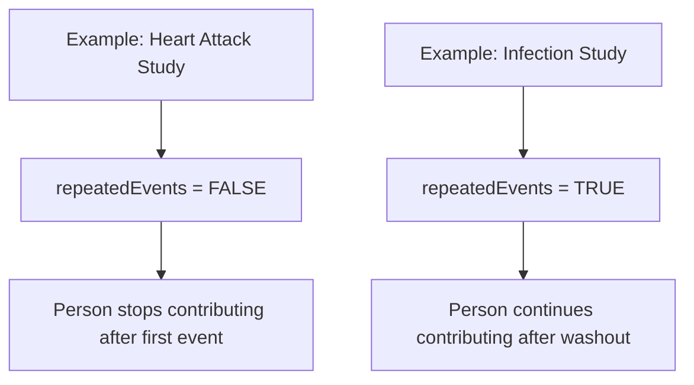
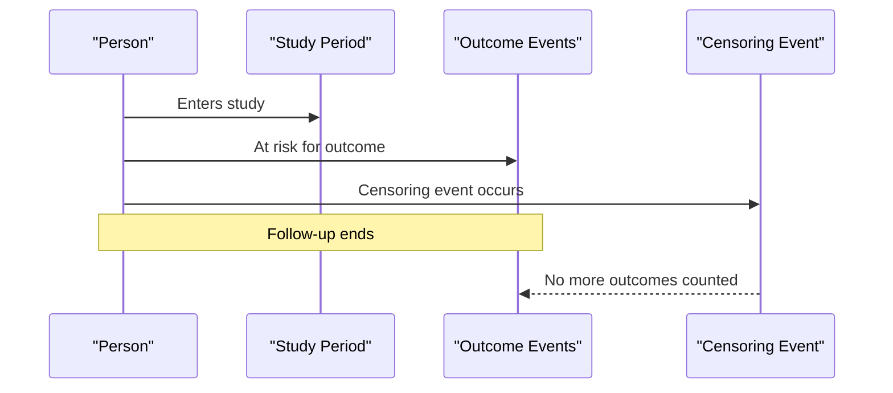
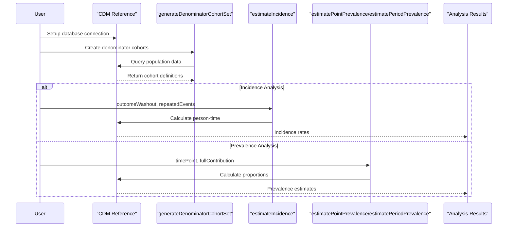

# Page: Incidence vs Prevalence

# Incidence vs Prevalence

Relevant source files

The following files were used as context for generating this wiki page:

- [vignettes/a04_Calculating_prevalence.Rmd](vignettes/a04_Calculating_prevalence.Rmd)
- [vignettes/a05_Calculating_incidence.Rmd](vignettes/a05_Calculating_incidence.Rmd)

## Purpose and Scope

This document explains the fundamental differences between incidence and prevalence measures in epidemiological analysis, their conceptual foundations, and their implementation in the IncidencePrevalence package. It covers when to use each measure, key parameters that affect calculations, and how they are implemented through the package's core functions.

For detailed implementation guides, see [Incidence Analysis](#5) and [Prevalence Analysis](#6). For information about cohort generation that supports both measures, see [Cohorts and Populations](#3.2).

## Conceptual Differences

**Incidence** measures the rate at which new events occur in a population over time, focusing on transitions from a non-diseased to diseased state. **Prevalence** measures the proportion of a population that has a condition at a specific point in time or during a period, regardless of when the condition started.

### Temporal Perspective

**Sources:** [vignettes/a04_Calculating_prevalence.Rmd:27-29](), [vignettes/a05_Calculating_incidence.Rmd:28-28]()

### Mathematical Foundation

**Sources:** [vignettes/a04_Calculating_prevalence.Rmd:27-29](), [vignettes/a05_Calculating_incidence.Rmd:28-28]()

## When to Use Each Measure

| **Use Incidence When** | **Use Prevalence When** |
|------------------------|-------------------------|
| Studying disease onset or first occurrence | Assessing disease burden in population |
| Evaluating risk factors for new events | Planning healthcare resource allocation |
| Measuring intervention effectiveness for prevention | Understanding current health status |
| Analyzing time-to-event outcomes | Describing epidemiological patterns |
| Following cohorts longitudinally | Cross-sectional health assessments |

### Decision Framework

**Sources:** [vignettes/a04_Calculating_prevalence.Rmd:44-45](), [vignettes/a05_Calculating_incidence.Rmd:73-73]()

## Implementation Overview

### Core Function Mapping

**Sources:** [vignettes/a05_Calculating_incidence.Rmd:105-112](), [vignettes/a04_Calculating_prevalence.Rmd:76-81](), [vignettes/a04_Calculating_prevalence.Rmd:134-139]()

## Point vs Period Prevalence

### Conceptual Distinction

**Point Prevalence** assesses the proportion of people with a condition at a specific moment in time. **Period Prevalence** assesses the proportion who had the condition at any time during a specified interval.

```mermaid
gantt
    title Point vs Period Prevalence Example
    dateFormat X
    axisFormat %d
    
    section Person 1
    Condition Present :milestone, 5, 0d
    
    section Person 2  
    Condition Period :active, 2, 8
    
    section Person 3
    No Condition :1, 10
    
    section Point Prevalence
    Assessment Point :milestone, point, 5, 0d
    
    section Period Prevalence
    Assessment Period :active, period, 3, 5
```

### Implementation Parameters

| Parameter | Function | Purpose | Default |
|-----------|----------|---------|---------|
| `timePoint` | `estimatePointPrevalence()` | When to assess within interval | `"start"` |
| `fullContribution` | `estimatePeriodPrevalence()` | Require full period observation | `TRUE` |
| `interval` | Both functions | Time granularity | `"years"` |

**Sources:** [vignettes/a04_Calculating_prevalence.Rmd:114-123](), [vignettes/a04_Calculating_prevalence.Rmd:163-172]()

### TimePoint Options

**Sources:** [vignettes/a04_Calculating_prevalence.Rmd:117-123]()

## Incidence-Specific Considerations

### Outcome Washout

The `outcomeWashout` parameter defines the period after an outcome ends before a person can contribute time at risk again.

**Sources:** [vignettes/a05_Calculating_incidence.Rmd:134-143](), [vignettes/a05_Calculating_incidence.Rmd:151-159]()

### Repeated Events

The `repeatedEvents` parameter controls whether individuals can contribute multiple events during the study period.

| Setting | Behavior | Use Case |
|---------|----------|----------|
| `FALSE` | First event only | Studying disease onset |
| `TRUE` | Multiple events allowed | Studying recurrent conditions |

**Sources:** [vignettes/a05_Calculating_incidence.Rmd:168-177]()

### Censoring Events

The `censorTable` parameter allows specification of events that should end follow-up time.

**Sources:** [vignettes/a05_Calculating_incidence.Rmd:185-195]()

## Comparative Analysis Workflow

### Function Call Patterns

### Parameter Decision Matrix

| Research Question | Measure | Key Parameters | Function |
|-------------------|---------|----------------|----------|
| "How often do people develop diabetes?" | Incidence | `outcomeWashout=Inf, repeatedEvents=FALSE` | `estimateIncidence()` |
| "How many people have diabetes now?" | Point Prevalence | `timePoint="start"` | `estimatePointPrevalence()` |
| "How many people had diabetes this year?" | Period Prevalence | `fullContribution=TRUE` | `estimatePeriodPrevalence()` |
| "How often do infections recur?" | Incidence | `outcomeWashout=30, repeatedEvents=TRUE` | `estimateIncidence()` |

**Sources:** [vignettes/a05_Calculating_incidence.Rmd:105-112](), [vignettes/a04_Calculating_prevalence.Rmd:76-81](), [vignettes/a04_Calculating_prevalence.Rmd:134-139]()