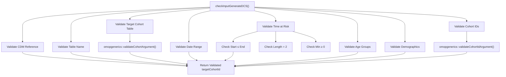
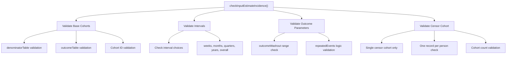
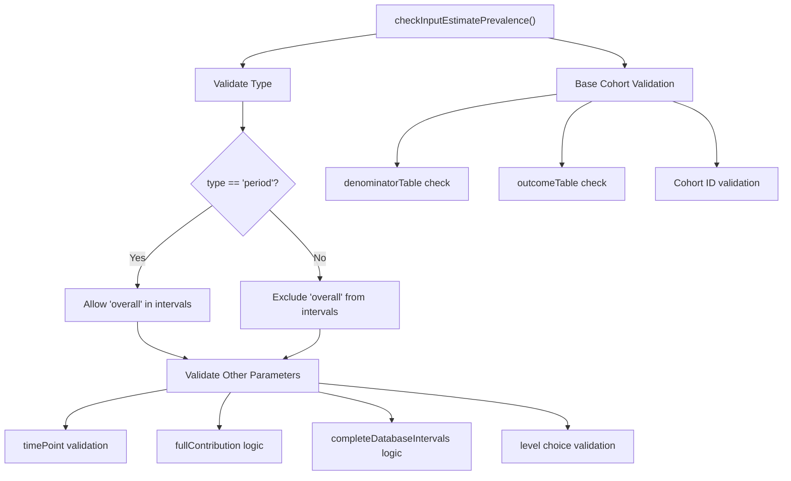
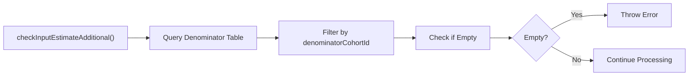
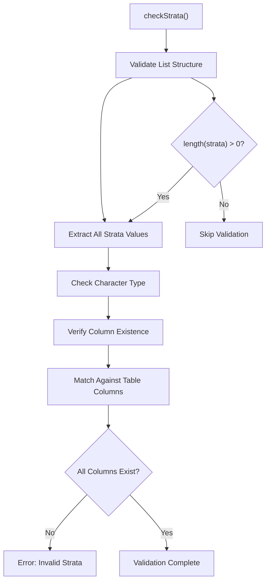
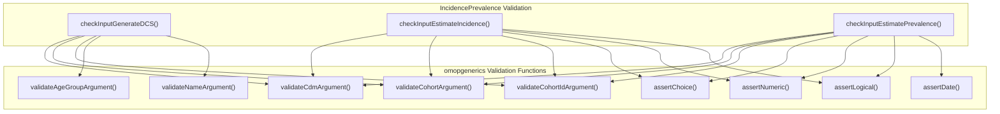
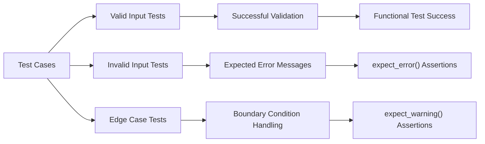

# Page: Input Validation System

# Input Validation System

Relevant source files

The following files were used as context for generating this wiki page:

- [R/inputValidation.R](R/inputValidation.R)
- [tests/testthat/test-generateDenominatorCohortSet.R](tests/testthat/test-generateDenominatorCohortSet.R)

## Purpose and Scope

The Input Validation System provides comprehensive parameter validation and error checking for all main analysis functions in the IncidencePrevalence package. This system ensures data integrity, parameter correctness, and proper OMOP CDM compliance before expensive database operations are performed. The validation layer sits between the user-facing API functions and the core calculation engines, preventing invalid configurations from reaching the database layer.

For information about the core calculation engines that receive validated inputs, see [Incidence Calculation Engine](#5.2) and [Prevalence Calculation Engine](#6.2). For details about the cohort generation process that uses these validations, see [Denominator Cohort Creation](#4.1).

## Validation Architecture Overview

The validation system follows a layered approach where each main analysis function has a corresponding validation function that performs comprehensive checks before proceeding with database operations.

```mermaid
graph TD
    subgraph "User Interface Layer"
        A["estimateIncidence()"]
        B["estimatePrevalence()"]
        C["generateDenominatorCohortSet()"]
        D["generateTargetDenominatorCohortSet()"]
    end
    
    subgraph "Validation Layer"
        E["checkInputEstimateIncidence()"]
        F["checkInputEstimatePrevalence()"]
        G["checkInputGenerateDCS()"]
        H["checkInputEstimateAdditional()"]
        I["checkStrata()"]
    end
    
    subgraph "Core Processing"
        J["getIncidence()"]
        K["getPrevalence()"]
        L["Cohort Generation Logic"]
    end
    
    subgraph "External Validation"
        M["omopgenerics::validateCdmArgument()"]
        N["omopgenerics::validateCohortArgument()"]
        O["omopgenerics::validateCohortIdArgument()"]
        P["omopgenerics::validateAgeGroupArgument()"]
    end
    
    A --> E
    B --> F
    C --> G
    D --> G
    
    E --> H
    F --> H
    G --> I
    
    E --> M
    E --> N
    F --> M
    F --> N
    G --> M
    G --> N
    
    E --> O
    F --> O
    G --> P
    
    E --> J
    F --> K
    G --> L
```

Sources: [R/inputValidation.R:1-203]()

## Main Validation Functions

### checkInputGenerateDCS

The primary validation function for denominator cohort set generation handles validation for both `generateDenominatorCohortSet()` and `generateTargetDenominatorCohortSet()` functions.

| Parameter | Validation Rules | Function Used |
|-----------|------------------|---------------|
| `cdm` | Valid CDM reference object | `omopgenerics::validateCdmArgument()` |
| `name` | Valid table name format | `omopgenerics::validateNameArgument()` |
| `cohortDateRange` | Date vector of length 2, NA allowed | `omopgenerics::assertDate()` |
| `timeAtRisk` | List of numeric pairs, min ≥ 0, start ≤ end | Custom validation loop |
| `ageGroup` | Valid age group list with overlap allowed | `omopgenerics::validateAgeGroupArgument()` |
| `sex` | Choice from "Male", "Female", "Both" | `omopgenerics::assertChoice()` |
| `daysPriorObservation` | Numeric, min = 0 | `omopgenerics::assertNumeric()` |
| `targetCohortTable` | Valid cohort table if specified | `omopgenerics::validateCohortArgument()` |
| `targetCohortId` | Valid cohort IDs if specified | `omopgenerics::validateCohortIdArgument()` |

Sources: [R/inputValidation.R:17-62]()

### checkInputEstimateIncidence

Validates parameters specific to incidence rate estimation, including outcome and censor cohort specifications.

Key validation rules for incidence estimation:
- Censor cohorts limited to one cohort ID and one record per person
- Outcome washout must be between 0 and 99999 days
- Intervals must be from predefined choices including "overall"
- All cohort tables must exist and be properly formatted

Sources: [R/inputValidation.R:64-122]()

### checkInputEstimatePrevalence

Handles validation for prevalence estimation with type-specific interval restrictions.

| Parameter | Type Restrictions | Validation Logic |
|-----------|------------------|------------------|
| `type` | "point" or "period" | `omopgenerics::assertChoice()` |
| `interval` | Point: no "overall"; Period: includes "overall" | Conditional validation |
| `timePoint` | "start", "middle", "end" | `omopgenerics::assertChoice()` |
| `level` | "person" or "record" | `omopgenerics::assertChoice()` |
| `fullContribution` | Logical | `omopgenerics::assertLogical()` |

Sources: [R/inputValidation.R:137-184]()

## Specialized Validation Functions

### checkInputEstimateAdditional

Performs runtime validation to ensure denominator populations are not empty after cohort generation.

This function prevents downstream processing when no subjects remain after applying cohort criteria.

Sources: [R/inputValidation.R:124-135]()

### checkStrata

Validates stratification parameters to ensure referenced columns exist in the denominator table.

Sources: [R/inputValidation.R:186-202]()

## Validation Patterns and Integration

### OMOP Generics Integration

The validation system heavily leverages `omopgenerics` package functions for standardized OMOP CDM validation:

### Error Message Consistency

The validation system provides consistent error messaging through `omopgenerics` assertion functions and custom messages for domain-specific validation rules.

| Validation Type | Error Message Pattern | Example |
|----------------|----------------------|---------|
| CDM Reference | Standard omopgenerics message | Invalid CDM reference object |
| Time at Risk | Custom message with context | "upper time at risk value must be equal or higher than lower time at risk value" |
| Cohort Constraints | Domain-specific rules | "Only one censor cohort can be used" |
| Population Checks | Runtime validation | "nobody in denominatorTable with one of the denominatorCohortId" |

Sources: [R/inputValidation.R:44-46](), [R/inputValidation.R:93-94](), [R/inputValidation.R:132-134]()

## Test-Driven Validation Design

The validation system is thoroughly tested with expected error conditions, ensuring robust input checking:

The test suite validates error handling for scenarios such as:
- Invalid CDM references
- Malformed age groups (negative values)
- Invalid sex specifications
- Negative prior observation periods
- Non-conforming table names
- Missing required tables

Sources: [tests/testthat/test-generateDenominatorCohortSet.R:1373-1446]()