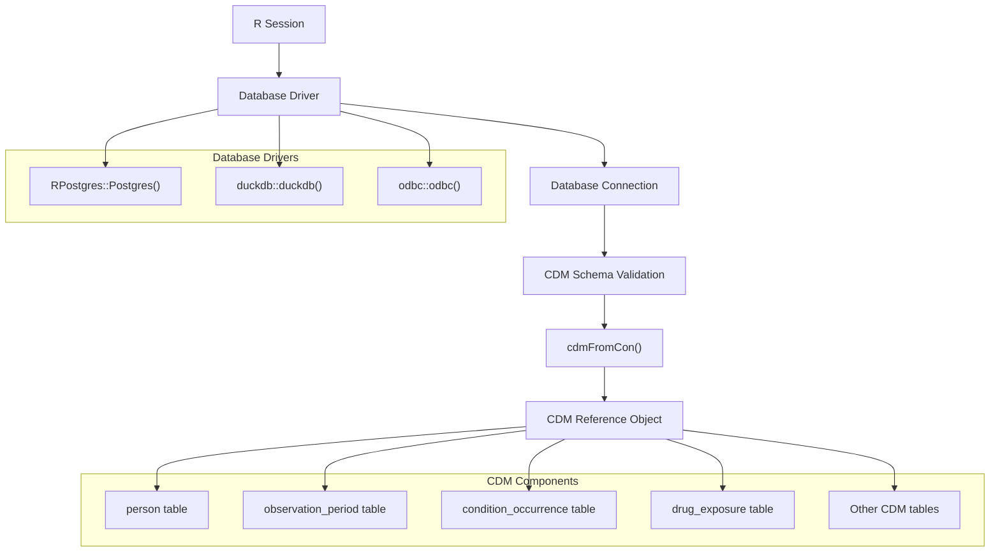
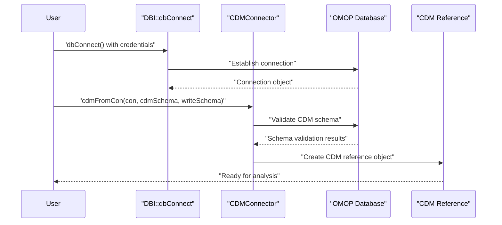

# Page: Installation and Setup

# Installation and Setup

<details>
<summary>Relevant source files</summary>

The following files were used as context for generating this wiki page:

- [DESCRIPTION](DESCRIPTION)
- [README.Rmd](README.Rmd)
- [README.md](README.md)

</details>


This page covers the installation of the IncidencePrevalence R package and the initial setup required to connect to OMOP CDM data sources. This includes package installation methods, dependency management, database connection configuration, and CDM reference object creation.

For information about basic analysis workflows after installation, see [Basic Usage Examples](#2.2). For detailed information about the OMOP CDM structure itself, see [OMOP Common Data Model](#3.1).

## Installation Methods

The IncidencePrevalence package can be installed through multiple channels depending on your requirements.

### CRAN Installation

The stable release version is available from CRAN:

```r
install.packages("IncidencePrevalence")
```

### Development Installation

The latest development version can be installed directly from GitHub:

```r
install.packages("remotes")
remotes::install_github("darwin-eu/IncidencePrevalence")
```

## System Requirements

### R Version Requirements

The package requires R version 4.1 or higher as specified in [DESCRIPTION:30](). This ensures compatibility with modern R language features and package ecosystem.

### Core Dependencies

The package has several mandatory dependencies that are automatically installed:

| Package | Minimum Version | Purpose |
|---------|----------------|---------|
| `CDMConnector` | >= 2.0.0 | Database interface to OMOP CDM |
| `omopgenerics` | >= 1.1.0 | OMOP data standards and validation |
| `PatientProfiles` | >= 1.3.1 | Patient data extraction and profiling |
| `dplyr` | >= 1.1.0 | Data manipulation |
| `cli` | >= 3.0.0 | Command line interface utilities |

Sources: [DESCRIPTION:31-43]()

### Database-Specific Dependencies

Depending on your database backend, you'll need additional packages:

| Database | Required Package | Installation |
|----------|------------------|--------------|
| PostgreSQL | `RPostgres` | `install.packages("RPostgres")` |
| DuckDB | `duckdb` (>= 1.0.0) | `install.packages("duckdb")` |
| SQL Server | `odbc` | `install.packages("odbc")` |
| Generic ODBC | `DBI` (>= 1.0.0) | `install.packages("DBI")` |

Sources: [DESCRIPTION:48-51]()

## Database Connection Architecture

### Connection Flow



Sources: [README.md:56-66]()

### CDM Reference Creation Process



Sources: [README.md:56-66]()

## Database Connection Setup

### PostgreSQL Configuration

For PostgreSQL databases, establish a connection using environment variables or direct credentials:

```r
con <- DBI::dbConnect(RPostgres::Postgres(),
  dbname = Sys.getenv("CDM5_POSTGRESQL_DBNAME"),
  host = Sys.getenv("CDM5_POSTGRESQL_HOST"),
  user = Sys.getenv("CDM5_POSTGRESQL_USER"),
  password = Sys.getenv("CDM5_POSTGRESQL_PASSWORD")
)

cdm <- CDMConnector::cdmFromCon(con,
  cdmSchema = Sys.getenv("CDM5_POSTGRESQL_CDM_SCHEMA"),
  writeSchema = Sys.getenv("CDM5_POSTGRESQL_RESULT_SCHEMA")
)
```

### Environment Variables

The following environment variables should be configured:

| Variable | Description | Example |
|----------|-------------|---------|
| `CDM5_POSTGRESQL_DBNAME` | Database name | `"omop_cdm"` |
| `CDM5_POSTGRESQL_HOST` | Database host | `"localhost"` or `"db.example.com"` |
| `CDM5_POSTGRESQL_USER` | Username | `"cdm_user"` |
| `CDM5_POSTGRESQL_PASSWORD` | Password | `"secure_password"` |
| `CDM5_POSTGRESQL_CDM_SCHEMA` | CDM schema name | `"cdm_schema"` |
| `CDM5_POSTGRESQL_RESULT_SCHEMA` | Results schema name | `"results_schema"` |

Sources: [README.md:56-66]()

### Schema Requirements

The `CDMConnector::cdmFromCon()` function requires two schema specifications:

- **cdmSchema**: Contains the OMOP CDM tables (`person`, `observation_period`, etc.)
- **writeSchema**: Where temporary tables and results will be written (requires write permissions)

Sources: [README.md:63-66]()

## Testing Installation with Mock Data

### Mock Data Generation

For testing and development purposes, use the `mockIncidencePrevalence()` function:

```r
library(CDMConnector)
library(IncidencePrevalence)

cdm <- mockIncidencePrevalence(
  sampleSize = 10000,
  outPre = 0.3,
  minOutcomeDays = 365,
  maxOutcomeDays = 3650
)
```

### Mock Data Parameters

| Parameter | Type | Description | Default |
|-----------|------|-------------|---------|
| `sampleSize` | integer | Number of simulated patients | 10000 |
| `outPre` | numeric | Outcome prevalence rate | 0.3 |
| `minOutcomeDays` | integer | Minimum outcome observation days | 365 |
| `maxOutcomeDays` | integer | Maximum outcome observation days | 3650 |

Sources: [README.md:75-80]()

## Installation Verification

### Package Loading Verification

Verify successful installation by loading the package and its dependencies:

```r
library(CDMConnector)
library(IncidencePrevalence)

# Verify package version
packageVersion("IncidencePrevalence")
```

### CDM Connection Verification

Test your CDM connection by examining the reference object structure:

```r
# Verify CDM tables are accessible
names(cdm)

# Check specific required tables
c("person", "observation_period") %in% names(cdm)

# Verify cohort generation capability
cdm <- generateDenominatorCohortSet(
  cdm = cdm,
  name = "test_denominator",
  cohortDateRange = as.Date(c("2008-01-01", "2018-01-01")),
  ageGroup = list(c(0, 100)),
  sex = "Both",
  daysPriorObservation = 180
)
```

Sources: [README.md:94-104]()

## Troubleshooting Common Issues

### Database Connection Issues

1. **Connection timeouts**: Verify network connectivity and database service status
2. **Schema permissions**: Ensure read access to CDM schema and write access to results schema
3. **Driver installation**: Verify database-specific R packages are properly installed

### Package Dependency Conflicts

1. **Version mismatches**: Use `update.packages()` to ensure compatible versions
2. **Namespace conflicts**: Use explicit package prefixes (e.g., `CDMConnector::cdmFromCon()`)
3. **Missing system dependencies**: Install system-level database drivers if required

Sources: [DESCRIPTION:44-64]()