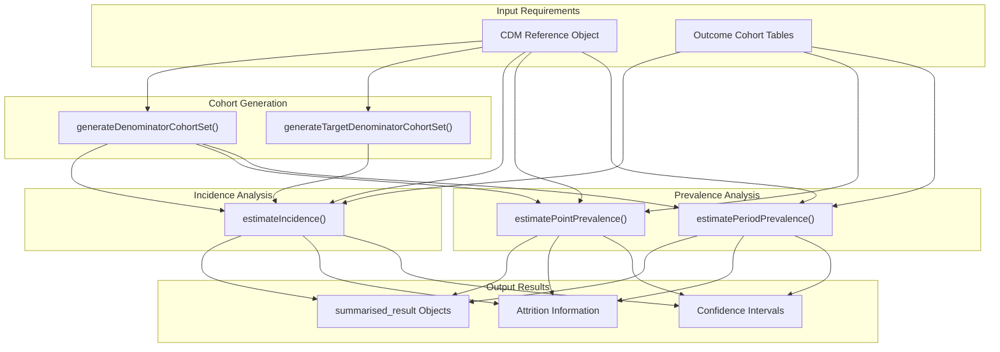
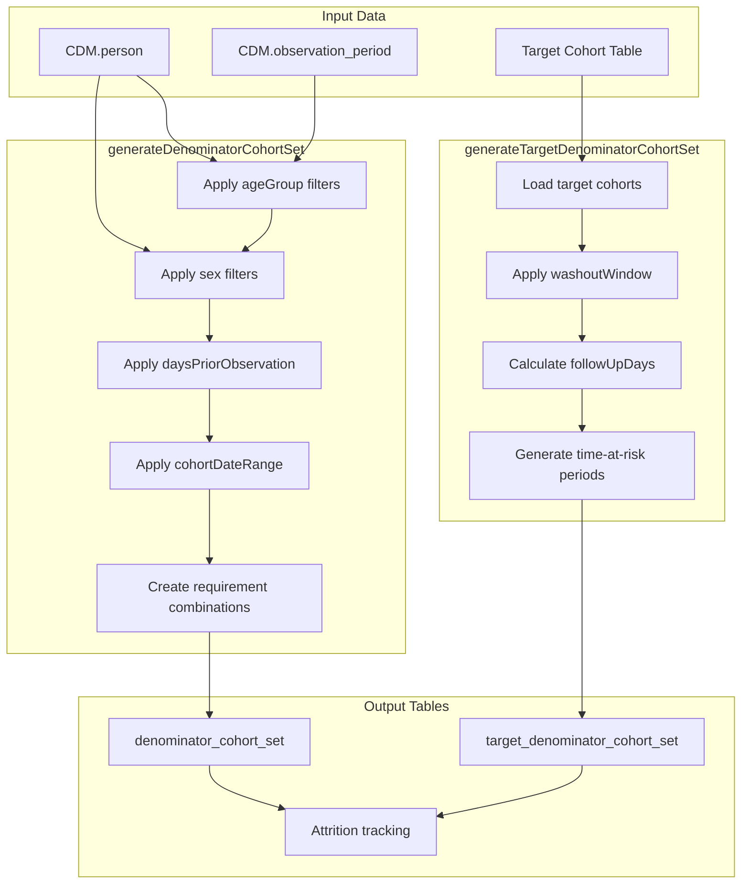
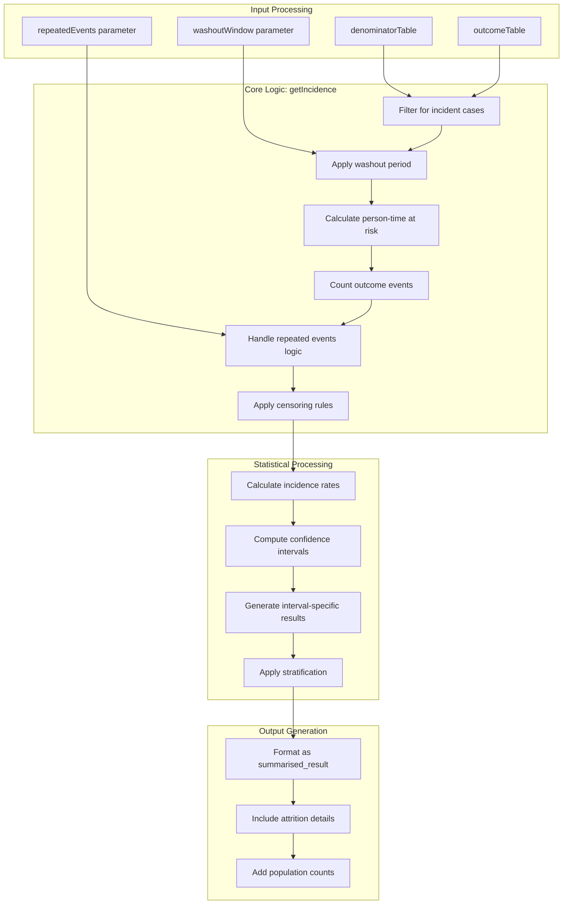
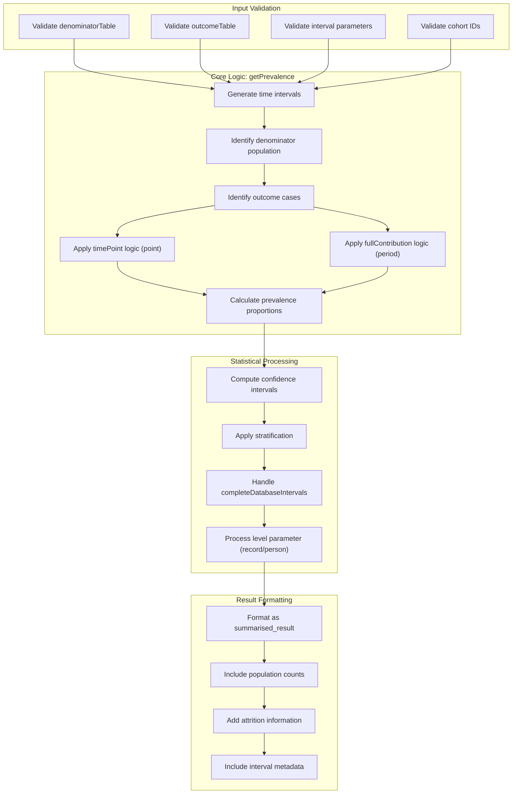
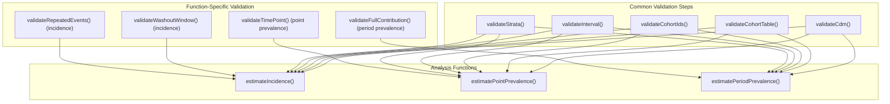

# Page: Main Analysis Functions

# Main Analysis Functions

Relevant source files

The following files were used as context for generating this wiki page:

- [.gitignore](.gitignore)
- [R/dateUtilities.R](R/dateUtilities.R)
- [_pkgdown.yml](_pkgdown.yml)
- [man/estimatePeriodPrevalence.Rd](man/estimatePeriodPrevalence.Rd)
- [man/estimatePointPrevalence.Rd](man/estimatePointPrevalence.Rd)

This document provides detailed reference documentation for the core analysis functions in the IncidencePrevalence package. These functions form the primary user interface for conducting epidemiological analyses and include cohort generation, incidence rate estimation, and prevalence calculation functions.

For visualization and table generation functions, see [Visualization and Table Functions](#9.2). For utility and helper functions, see [Utility and Helper Functions](#9.3). For conceptual background on incidence vs prevalence, see [Incidence vs Prevalence](#3.3).

## Core Function Categories

The main analysis functions are organized into three primary categories:

### Function Category Overview

Sources: [_pkgdown.yml:6-30](), [man/estimatePointPrevalence.Rd:1-72](), [man/estimatePeriodPrevalence.Rd:1-88]()

## Cohort Generation Functions

### generateDenominatorCohortSet

The `generateDenominatorCohortSet()` function creates denominator populations for epidemiological analysis. It defines the population at risk by applying inclusion criteria such as age ranges, prior observation requirements, and study period restrictions.

**Key Parameters:**
- `cdm`: CDM reference object
- `name`: Name for the denominator cohort table
- `cohortDateRange`: Date range for the study period
- `ageGroup`: Age stratification groups
- `sex`: Sex stratification ("Both", "Male", "Female")
- `daysPriorObservation`: Required prior observation period
- `requirementInteractions`: Whether to create cohorts for all combinations of requirements

### generateTargetDenominatorCohortSet

The `generateTargetDenominatorCohortSet()` function creates denominator cohorts specifically for target cohort analysis, incorporating time-at-risk windows and washout periods for incidence calculations.

**Key Parameters:**
- `cdm`: CDM reference object
- `targetCohortTable`: Name of target cohort table
- `targetCohortId`: Specific target cohort IDs to analyze
- `washoutWindow`: Washout period before target cohort entry
- `followUpDays`: Maximum follow-up time

### Cohort Generation Data Flow

Sources: [_pkgdown.yml:7-9]()

## Incidence Analysis Functions

### estimateIncidence

The `estimateIncidence()` function calculates incidence rates by measuring the occurrence of new events over person-time at risk. It supports various configuration options for washout periods, repeated events, and censoring strategies.

**Core Parameters:**
- `cdm`: CDM reference object
- `denominatorTable`: Name of denominator cohort table
- `outcomeTable`: Name of outcome cohort table
- `denominatorCohortId`: Specific denominator cohorts to analyze
- `outcomeCohortId`: Specific outcome cohorts to analyze
- `washoutWindow`: Washout period for incident cases
- `repeatedEvents`: Whether to count multiple events per person
- `censorOnOutcome`: Whether to censor follow-up after first outcome
- `censorOnDeath`: Whether to censor on death
- `interval`: Time intervals for rate calculation
- `completeDatabaseIntervals`: Only include complete database intervals
- `strata`: Variables for stratified analysis

**Return Value:**
Returns a `summarised_result` object containing incidence rates, confidence intervals, person-time calculations, and attrition information.

### Incidence Calculation Logic

Sources: [_pkgdown.yml:10-12]()

## Prevalence Analysis Functions

### estimatePointPrevalence

The `estimatePointPrevalence()` function estimates the proportion of a population with a condition at specific time points. It calculates prevalence at the start, middle, or end of specified intervals.

**Key Parameters:**
- `cdm`: CDM reference object
- `denominatorTable`: Name of denominator cohort table
- `outcomeTable`: Name of outcome cohort table
- `denominatorCohortId`: Specific denominator cohorts to analyze
- `outcomeCohortId`: Specific outcome cohorts to analyze
- `interval`: Time intervals ("weeks", "months", "quarters", "years")
- `timePoint`: Point in interval ("start", "middle", "end")
- `strata`: Variables for stratified analysis
- `includeOverallStrata`: Include overall results with strata

### estimatePeriodPrevalence

The `estimatePeriodPrevalence()` function estimates the proportion of a population with a condition during specified time periods. It measures prevalence over entire intervals rather than at single time points.

**Key Parameters:**
- `cdm`: CDM reference object
- `denominatorTable`: Name of denominator cohort table
- `outcomeTable`: Name of outcome cohort table
- `denominatorCohortId`: Specific denominator cohorts to analyze
- `outcomeCohortId`: Specific outcome cohorts to analyze
- `interval`: Time intervals ("weeks", "months", "quarters", "years", "overall")
- `completeDatabaseIntervals`: Only include complete database intervals
- `fullContribution`: Require full interval presence for inclusion
- `level`: Analysis level ("person" or "record")
- `strata`: Variables for stratified analysis
- `includeOverallStrata`: Include overall results with strata

### Prevalence Function Comparison

| Parameter | `estimatePointPrevalence` | `estimatePeriodPrevalence` |
|-----------|---------------------------|----------------------------|
| `timePoint` | Required - specifies point in interval | Not applicable |
| `completeDatabaseIntervals` | Not applicable | Optional - filters intervals |
| `fullContribution` | Not applicable | Optional - requires full presence |
| `level` | Not applicable | Optional - person vs record level |
| `interval` options | weeks, months, quarters, years | weeks, months, quarters, years, overall |

Sources: [man/estimatePointPrevalence.Rd:1-72](), [man/estimatePeriodPrevalence.Rd:1-88]()

### Prevalence Calculation Logic

Sources: [man/estimatePointPrevalence.Rd:6-19](), [man/estimatePeriodPrevalence.Rd:6-19]()

## Function Integration Patterns

### Common Input Validation

All main analysis functions share common input validation patterns through the validation system:

### Standardized Output Format

All functions return `summarised_result` objects with consistent structure:

| Column | Description | Present in All Functions |
|--------|-------------|-------------------------|
| `result_id` | Unique identifier for each result | Yes |
| `cdm_name` | Name of the CDM database | Yes |
| `group_name` | Grouping variable names | Yes |
| `group_level` | Grouping variable values | Yes |
| `strata_name` | Stratification variable names | Yes |
| `strata_level` | Stratification variable values | Yes |
| `variable_name` | Measure name (incidence_100000_pys, prevalence, etc.) | Yes |
| `variable_level` | Measure category | Yes |
| `estimate_name` | Statistic name (count, rate, confidence intervals) | Yes |
| `estimate_type` | Data type of estimate | Yes |
| `estimate_value` | Calculated value | Yes |
| `additional_name` | Metadata field names | Yes |
| `additional_level` | Metadata field values | Yes |

Sources: [_pkgdown.yml:6-30](), [R/dateUtilities.R:16-45]()