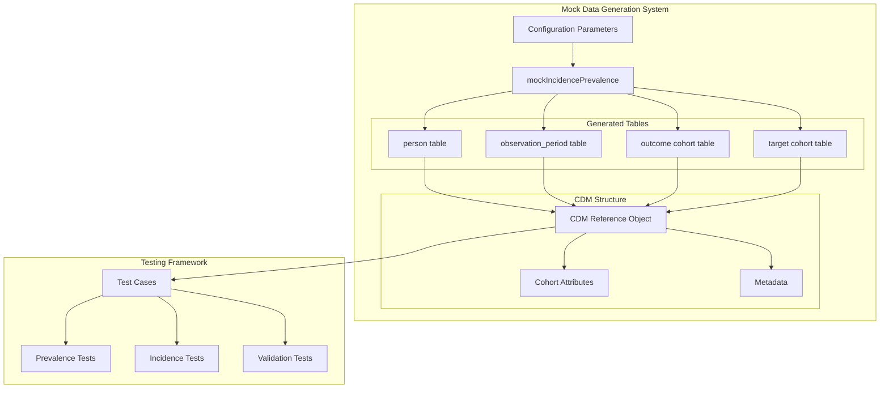
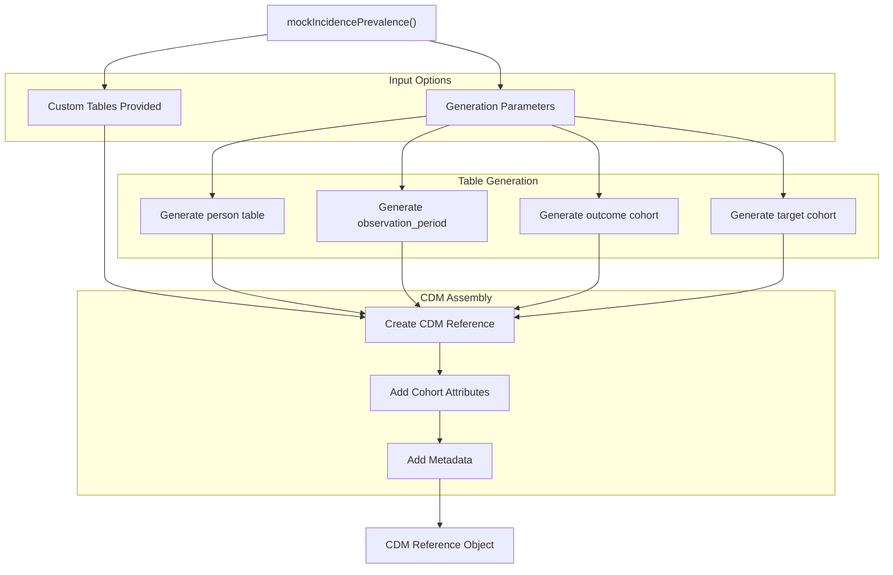
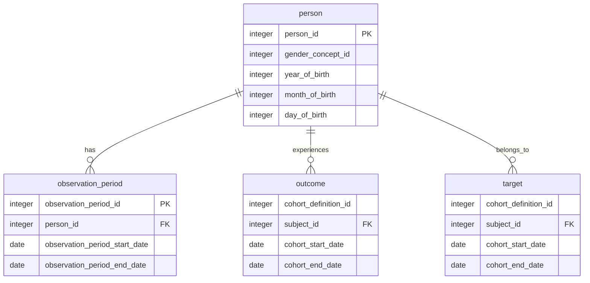
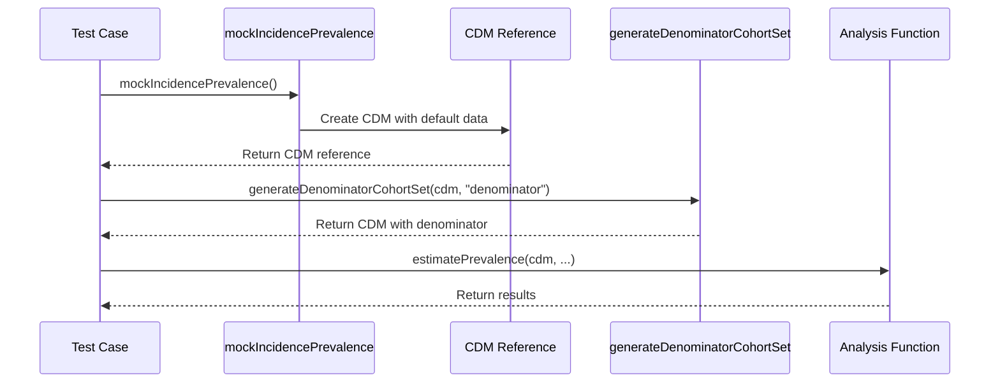
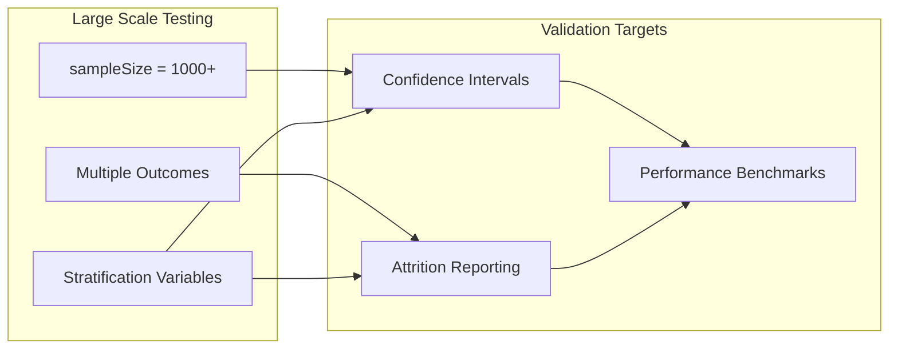
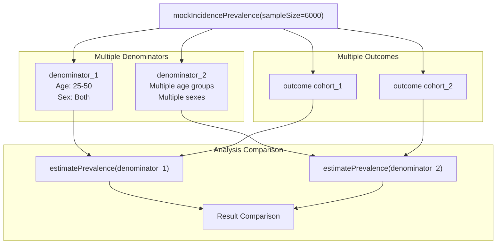
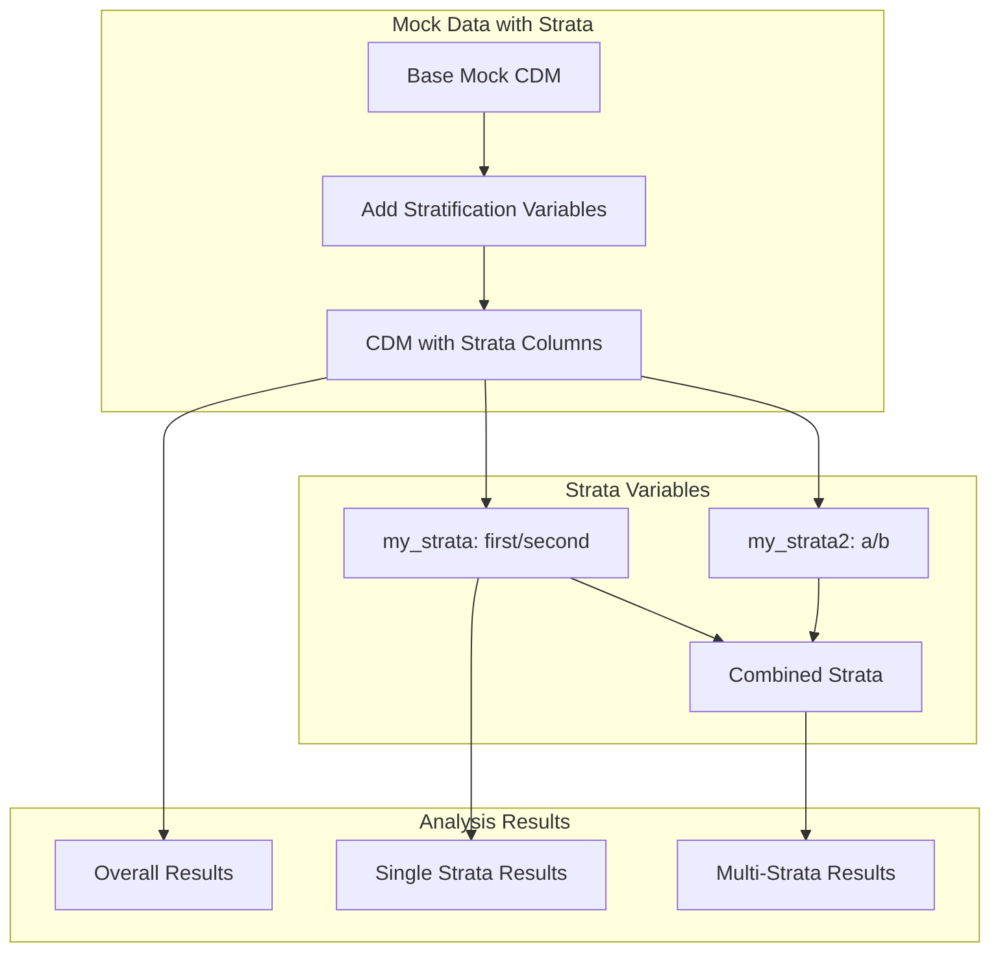
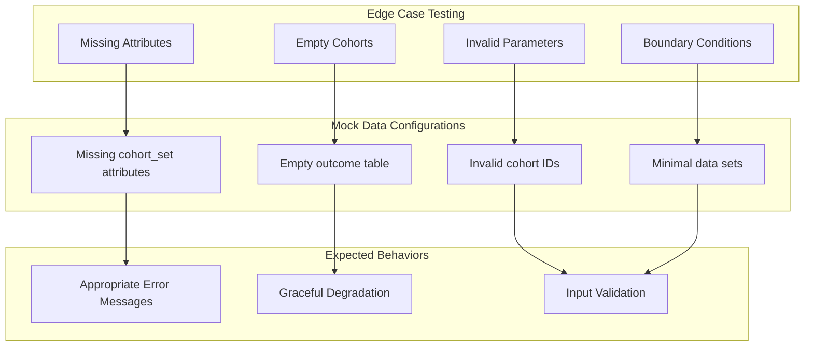

# Page: Mock Data Generation

# Mock Data Generation

Relevant source files

The following files were used as context for generating this wiki page:

- [tests/testthat/test-estimatePrevalence.R](tests/testthat/test-estimatePrevalence.R)
- [tests/testthat/test-tables.R](tests/testthat/test-tables.R)

The mock data generation system provides utilities for creating synthetic OMOP Common Data Model (CDM) databases specifically designed for testing incidence and prevalence calculations. This system enables comprehensive testing of analysis functions without requiring access to real patient data.

For information about the main testing framework that uses these utilities, see [Testing Framework](#10.1). For details about the core analysis functions being tested, see [Main Analysis Functions](#9.1).

## Overview and Purpose

The `mockIncidencePrevalence()` function serves as the primary entry point for generating synthetic CDM databases that conform to OMOP CDM standards. This mock data generation system creates controlled datasets with known characteristics, enabling systematic testing of epidemiological calculations, edge cases, and statistical validations.

Sources: [tests/testthat/test-estimatePrevalence.R:1-38](), [tests/testthat/test-estimatePrevalence.R:70-74]()

## Core Mock Data Generation Function

The `mockIncidencePrevalence()` function creates a complete CDM reference object with synthetic data. The function accepts both predefined table structures and generation parameters for creating randomized datasets.

### Function Signature and Parameters

The mock data generator supports multiple configuration approaches:

| Parameter | Type | Purpose |
|-----------|------|---------|
| `personTable` | tibble | Custom person demographics data |
| `observationPeriodTable` | tibble | Custom observation periods |
| `outcomeTable` | tibble | Custom outcome cohort events |
| `targetCohortTable` | tibble | Custom target cohort definitions |
| `sampleSize` | integer | Number of synthetic persons to generate |
| `maxOutcomeDays` | integer | Maximum days for outcome events |
| `maxOutcomes` | integer | Maximum number of outcomes per person |
| `outPre` | numeric | Outcome prevalence rate |

Sources: [tests/testthat/test-estimatePrevalence.R:42-68](), [tests/testthat/test-estimatePrevalence.R:698-700]()

## Mock CDM Structure

The generated CDM reference object contains all necessary tables and attributes required for incidence and prevalence analysis. The structure follows OMOP CDM conventions with additional cohort-specific metadata.

### Generated Table Structure

Sources: [tests/testthat/test-estimatePrevalence.R:42-48](), [tests/testthat/test-estimatePrevalence.R:49-54](), [tests/testthat/test-estimatePrevalence.R:55-68]()

## Testing Usage Patterns

The mock data generation system supports various testing scenarios through different configuration patterns. Each pattern serves specific validation purposes within the testing framework.

### Basic Mock Data Creation

The simplest usage creates a default CDM with randomized data:

Sources: [tests/testthat/test-estimatePrevalence.R:2-3]()

### Custom Data Scenarios

For specific test cases, custom table data enables precise control over test conditions:

| Test Scenario | Custom Tables Used | Purpose |
|---------------|-------------------|---------|
| Single person analysis | `personTable`, `observationPeriodTable`, `outcomeTable` | Test basic calculations |
| Multiple observation periods | `observationPeriodTable` with gaps | Test temporal discontinuity |
| Minimum count validation | Large `personTable` with controlled outcomes | Test statistical thresholds |
| Empty cohort testing | `outcomeTable` with no matching IDs | Test edge case handling |

Sources: [tests/testthat/test-estimatePrevalence.R:42-90](), [tests/testthat/test-estimatePrevalence.R:149-266]()

### Large-Scale Testing

For performance and statistical validation, the system supports large synthetic datasets:

Sources: [tests/testthat/test-estimatePrevalence.R:1035-1079](), [tests/testthat/test-estimatePrevalence.R:1197-1217]()

## Configuration Options and Advanced Features

The mock data generation system provides sophisticated configuration options for testing complex scenarios including multiple cohorts, stratification variables, and temporal patterns.

### Multiple Cohort Testing

The system supports testing with multiple denominator and outcome cohorts:

Sources: [tests/testthat/test-estimatePrevalence.R:696-739]()

### Stratification Testing

Mock data supports testing of stratification variables by allowing custom columns in generated cohorts:

Sources: [tests/testthat/test-estimatePrevalence.R:1265-1413]()

## Integration with Testing Framework

The mock data generation system integrates seamlessly with the broader testing framework, enabling comprehensive validation of analysis functions across multiple scenarios and edge cases.

### Database Backend Testing

Mock data works with different database backends supported by the package:

| Backend | Usage Pattern | Testing Focus |
|---------|---------------|---------------|
| DuckDB (default) | In-memory testing | Fast iteration, basic functionality |
| Local CDM | `cdm \|> dplyr::collect()` | Non-database analysis validation |
| Permanent tables | `temporary = FALSE` | Performance and persistence testing |

Sources: [tests/testthat/test-estimatePrevalence.R:1503-1551](), [tests/testthat/test-estimatePrevalence.R:1193-1217]()

### Error and Edge Case Testing

The mock system enables systematic testing of error conditions and edge cases:

Sources: [tests/testthat/test-estimatePrevalence.R:1219-1243](), [tests/testthat/test-estimatePrevalence.R:1245-1263](), [tests/testthat/test-estimatePrevalence.R:796-842]()