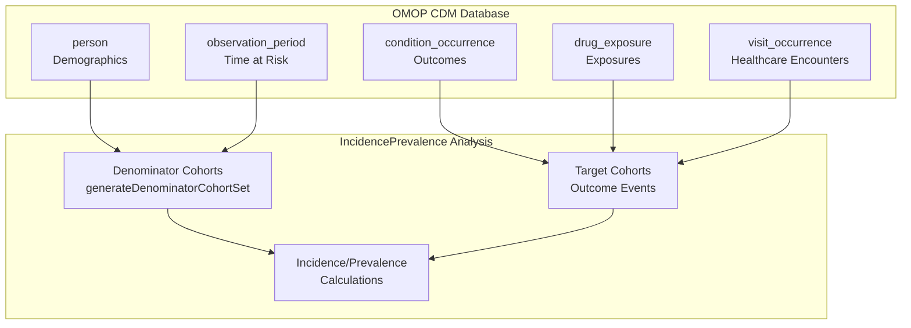
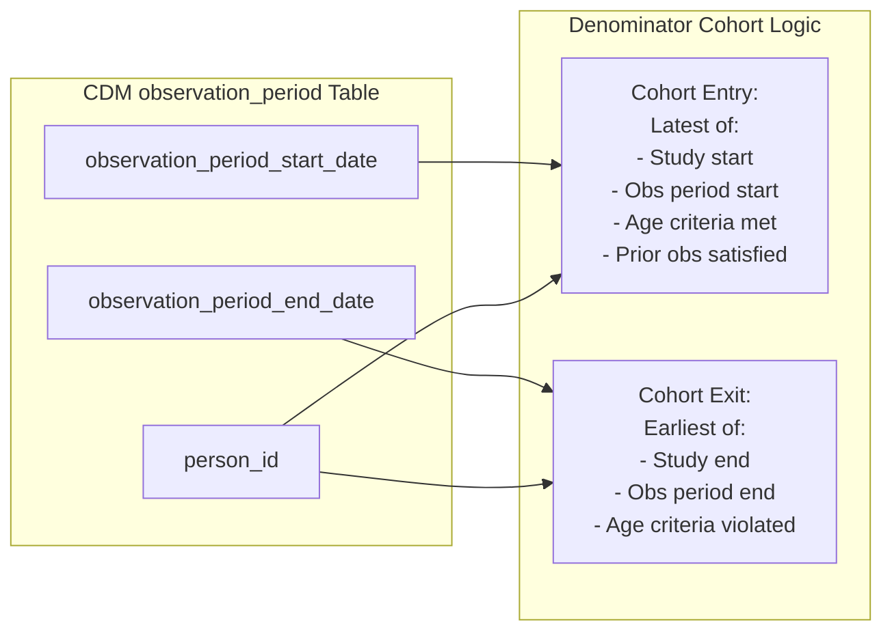
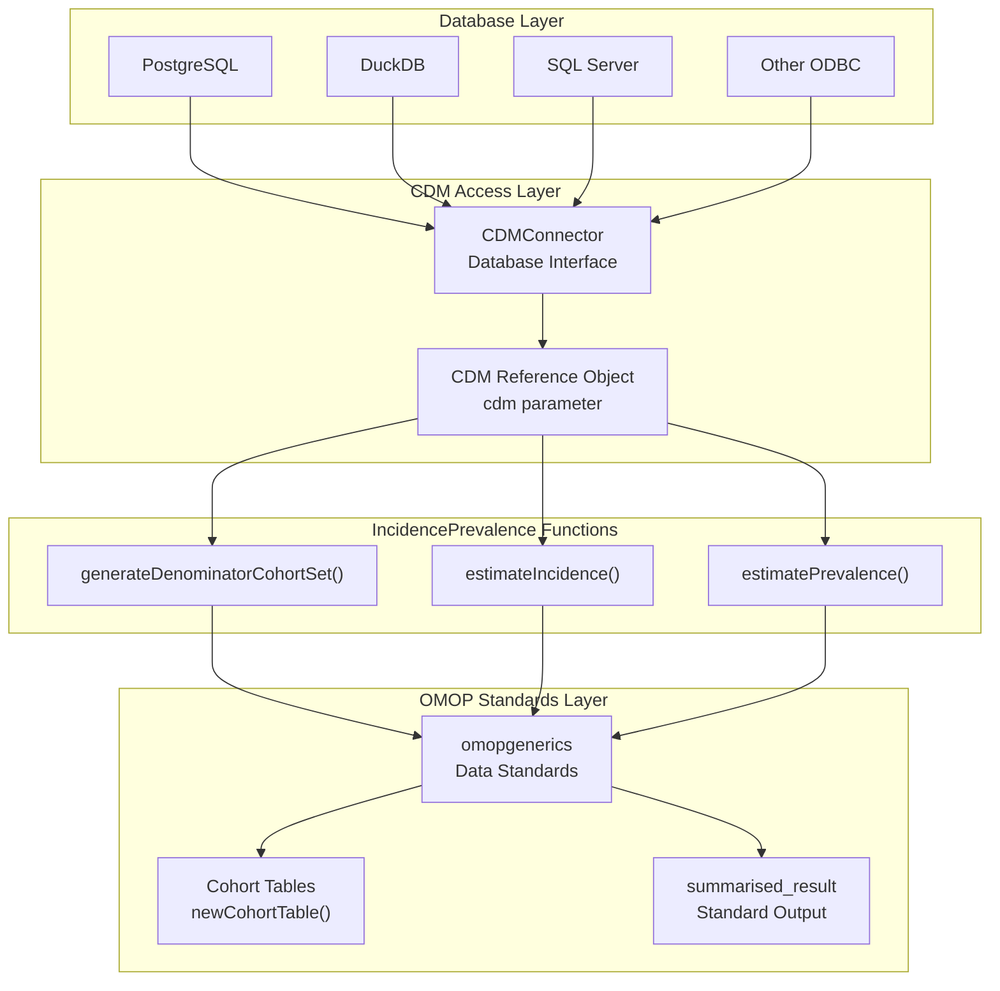
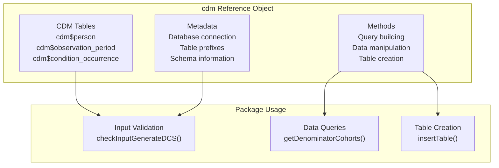
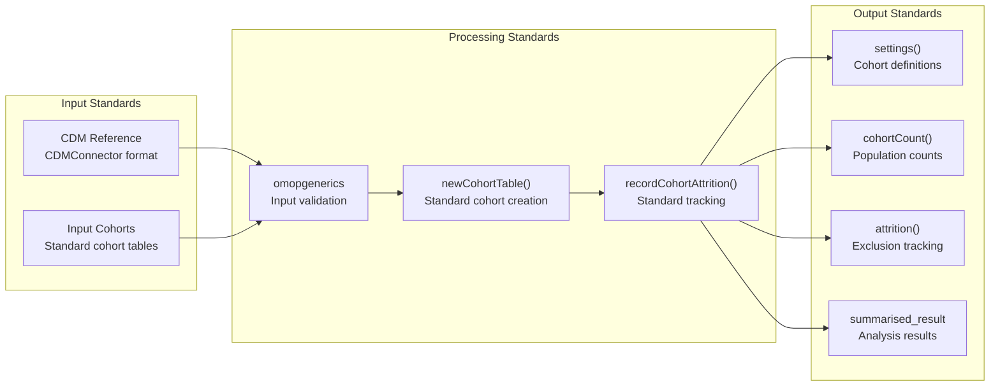
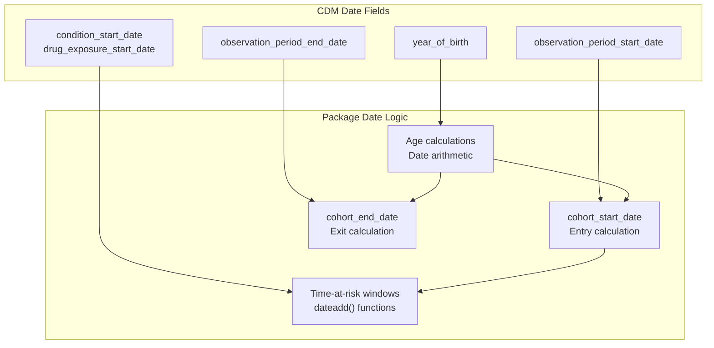

# Page: OMOP Common Data Model

# OMOP Common Data Model

<details>
<summary>Relevant source files</summary>

The following files were used as context for generating this wiki page:

- [DESCRIPTION](DESCRIPTION)
- [R/generateDenominatorCohortSet.R](R/generateDenominatorCohortSet.R)
- [vignettes/a02_Creating_denominator_populations.Rmd](vignettes/a02_Creating_denominator_populations.Rmd)

</details>


This document explains the Observational Medical Outcomes Partnership (OMOP) Common Data Model and how the IncidencePrevalence package integrates with OMOP CDM databases to perform epidemiological analyses. For information about creating specific populations from CDM data, see [Cohorts and Populations](#3.2). For details about package dependencies and integration architecture, see [Dependencies and Integration](#1.2).

## Purpose and Scope

The OMOP Common Data Model provides the foundational data structure that the IncidencePrevalence package operates on. This page covers:

- OMOP CDM structure and key tables used by the package
- How the package accesses and manipulates CDM data through `CDMConnector`
- Integration with OMOP ecosystem standards via `omopgenerics`
- CDM reference objects and their role in package functions

## OMOP CDM Overview

The OMOP Common Data Model is a standardized data schema designed to harmonize observational health data from different sources. The IncidencePrevalence package specifically leverages this standardization to perform consistent incidence and prevalence calculations across different databases.

### Key CDM Principles for Epidemiological Analysis



Sources: [DESCRIPTION:25-43](), [R/generateDenominatorCohortSet.R:25-50]()

## CDM Data Structure and Key Tables

The package primarily interacts with several core CDM tables to establish denominator populations and identify outcome events.

### Core Tables Used

| CDM Table | Purpose in Package | Key Fields Used |
|-----------|-------------------|-----------------|
| `person` | Demographics and basic patient info | `person_id`, `gender_concept_id`, `year_of_birth` |
| `observation_period` | Time periods of data availability | `observation_period_start_date`, `observation_period_end_date` |
| `condition_occurrence` | Disease/condition events | `condition_start_date`, `person_id`, `condition_concept_id` |
| `drug_exposure` | Medication exposures | `drug_exposure_start_date`, `person_id`, `drug_concept_id` |
| `cohort` | Pre-defined patient groups | `subject_id`, `cohort_start_date`, `cohort_end_date` |

### Observation Period Logic



Sources: [R/generateDenominatorCohortSet.R:742-757](), [vignettes/a02_Creating_denominator_populations.Rmd:25-36]()

## Package Integration with CDM

The package integrates with CDM databases through a layered architecture that maintains OMOP standards compliance while providing epidemiological analysis capabilities.

### CDM Access Architecture



Sources: [DESCRIPTION:31-43](), [R/generateDenominatorCohortSet.R:65-85]()

## CDM Reference Objects

All package functions accept a `cdm` parameter that represents a CDM reference object created by `CDMConnector`. This object provides standardized access to CDM tables and maintains database connections.

### CDM Reference Structure



The `generateDenominatorCohortSet()` function demonstrates typical CDM reference usage:

```r
# CDM reference passed as parameter
generateDenominatorCohortSet <- function(cdm, name, ...)

# Access to observation_period table
obsStartEnd <- cdm[["observation_period"]] %>%
  dplyr::summarise(
    min_start = as.Date(min(.data$observation_period_start_date, na.rm = TRUE)),
    max_end = as.Date(max(.data$observation_period_end_date, na.rm = TRUE))
  )
```

Sources: [R/generateDenominatorCohortSet.R:65-71](), [R/generateDenominatorCohortSet.R:743-748]()

## OMOP Standards Integration

The package maintains full compliance with OMOP ecosystem standards through integration with `omopgenerics`, ensuring interoperability with other OMOP tools.

### Standard Data Structures



### Key Integration Points

The package implements several `omopgenerics` standards:

- **Cohort Tables**: Created using `omopgenerics::newCohortTable()` with standardized attributes
- **Settings Management**: Cohort definitions accessible via `omopgenerics::settings()`
- **Attrition Tracking**: Population exclusions tracked with `omopgenerics::recordCohortAttrition()`
- **Count Reporting**: Standard counts via `omopgenerics::cohortCount()`

Example from denominator cohort creation:

```r
# Standard cohort table creation
cdm[[name]] <- cdm[[name]] %>%
  omopgenerics::newCohortTable(
    cohortSetRef = cohortSetRef,
    cohortAttritionRef = cohortAttritionRef
  )

# Standard attrition recording  
cdm[[name]] <- cdm[[name]] |>
  omopgenerics::recordCohortAttrition(
    reason = "Time at risk criteria applied"
  )
```

Sources: [R/generateDenominatorCohortSet.R:452-458](), [R/generateDenominatorCohortSet.R:293-296](), [DESCRIPTION:37]()

## Date and Time Handling

The package leverages CDM's standardized date formats and implements sophisticated temporal logic for epidemiological analyses.

### CDM Date Integration



The package uses `CDMConnector::dateadd()` for database-agnostic date arithmetic:

```r
# Time-at-risk end date calculation
cdm[[workingTmp]] <- cdm[[workingTmp]] %>%
  dplyr::mutate(
    tar_end_date = !!CDMConnector::dateadd(
      "target_cohort_start_date",
      timeAtRiskEnd,
      interval = "day"
    )
  )
```

Sources: [R/generateDenominatorCohortSet.R:213-217](), [R/generateDenominatorCohortSet.R:233-238]()