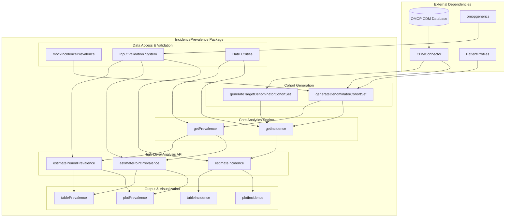
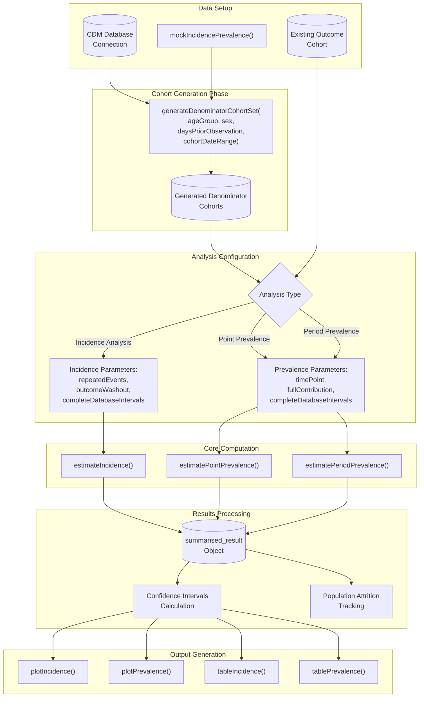

# Page: Overview

# Overview

Relevant source files

The following files were used as context for generating this wiki page:

- [DESCRIPTION](DESCRIPTION)
- [README.Rmd](README.Rmd)
- [README.md](README.md)

This document provides a comprehensive overview of the IncidencePrevalence R package, which implements epidemiological analysis capabilities for calculating population-level incidence rates and prevalence using data structured according to the OMOP Common Data Model (CDM). The package serves as a specialized tool for observational health data research, providing standardized methods for cohort-based analysis.

For detailed information about specific analysis types, see [Incidence Analysis](#5) and [Prevalence Analysis](#6). For implementation details of core calculation methods, see [Core Concepts](#3). For information about result visualization and reporting capabilities, see [Visualization and Reporting](#7).

## Package Purpose and Capabilities

The IncidencePrevalence package provides a comprehensive framework for conducting epidemiological analyses on OMOP CDM data. The package implements standardized approaches for calculating incidence rates, point prevalence, and period prevalence across stratified populations.

**Core Analysis Types:**
- **Incidence Rate Estimation**: Time-to-event analysis with support for repeated events, washout periods, and censoring
- **Point Prevalence**: Cross-sectional prevalence at specific time points  
- **Period Prevalence**: Prevalence over defined time intervals with flexible contribution requirements

**Key Features:**
- Integration with OMOP CDM ecosystem through `CDMConnector` and `omopgenerics`
- Flexible denominator cohort generation with age, sex, and observation period stratification
- Comprehensive input validation and error handling
- Standardized result formats compatible with other OMOP tools
- Built-in visualization and table generation capabilities

Sources: [DESCRIPTION:1-72](), [README.md:9-24]()

## High-Level System Architecture

The following diagram illustrates the overall architecture and key components of the IncidencePrevalence package:

**IncidencePrevalence Package Architecture**

Sources: [DESCRIPTION:31-43](), [README.md:47-81]()

## Main Analysis Workflow

The following diagram shows the typical workflow for conducting epidemiological analyses using the package:

**Analysis Workflow and Data Flow**

Sources: [README.md:84-163](), [README.Rmd:85-163]()

## Key Integration Points and Dependencies

The package integrates extensively with the OMOP CDM ecosystem and R data science tools through well-defined interfaces:

| Component | Purpose | Key Functions |
|-----------|---------|---------------|
| **CDMConnector** | Database abstraction and CDM validation | `cdmFromCon()`, table references |
| **omopgenerics** | Standardized result formats and validation | `summarised_result` objects, `settings()` |
| **PatientProfiles** | Patient data extraction and profiling | Demographic and observation period queries |
| **dplyr/tidyr** | Data manipulation and transformation | SQL generation, data processing pipelines |
| **ggplot2** | Base visualization framework | Plot generation through `plotIncidence()`/`plotPrevalence()` |
| **visOmopResults** | OMOP-specific visualization extensions | Enhanced plotting and table formatting |

**Database Backend Support:**
- PostgreSQL via `RPostgres`
- DuckDB for in-memory analysis
- SQL Server and other ODBC-compatible databases
- Database-agnostic SQL generation through `CDMConnector`

Sources: [DESCRIPTION:31-64]()

## Result Formats and Output Standards

All analysis functions return standardized `summarised_result` objects that comply with `omopgenerics` specifications. These objects contain:

**Core Result Structure:**
- **Estimates**: Calculated rates, proportions, and counts
- **Confidence Intervals**: 95% confidence bounds using appropriate statistical methods
- **Stratification Variables**: Age groups, sex, calendar periods
- **Metadata**: Analysis parameters, cohort definitions, database characteristics
- **Attrition Information**: Population filtering steps and exclusion counts

**Supported Output Formats:**
- Interactive plots via `plotIncidence()` and `plotPrevalence()`
- Formatted tables through `tableIncidence()` and `tablePrevalence()`
- Raw data export for custom analysis
- Integration with `visOmopResults` for enhanced reporting

The standardized format ensures interoperability with other OMOP CDM analysis tools and supports reproducible research workflows.

Sources: [README.md:184-231](), [README.Rmd:125-163]()