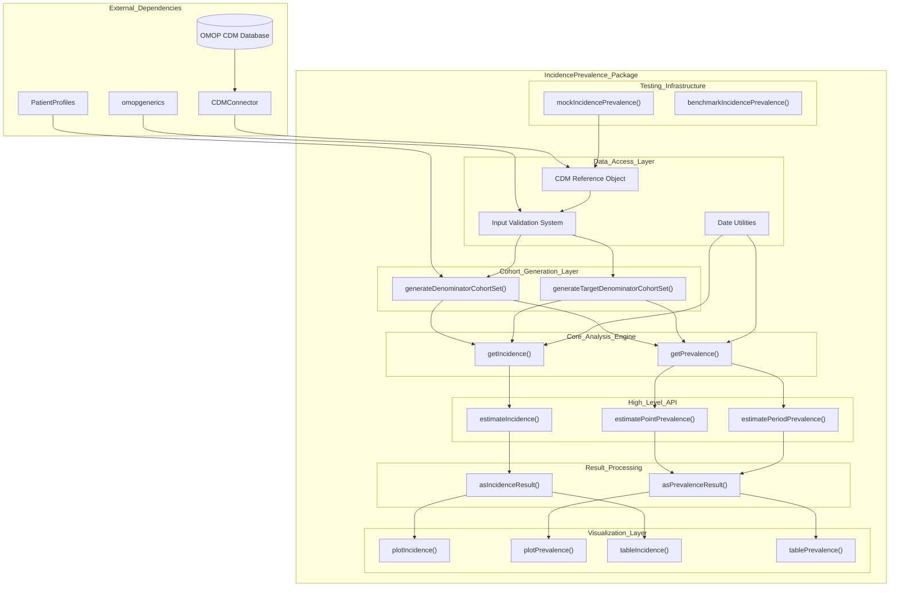
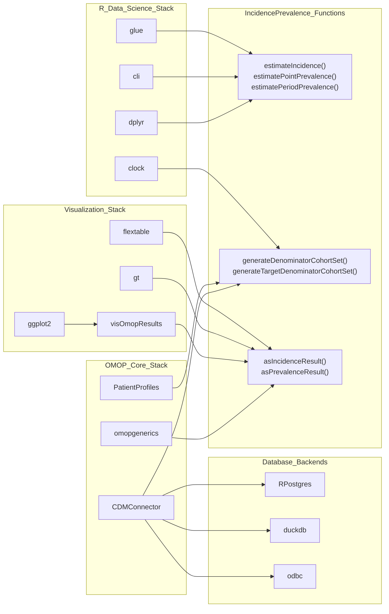

# Page: Package Architecture

# Package Architecture

Relevant source files

The following files were used as context for generating this wiki page:

- [.gitignore](.gitignore)
- [DESCRIPTION](DESCRIPTION)
- [R/dateUtilities.R](R/dateUtilities.R)
- [_pkgdown.yml](_pkgdown.yml)

This document explains the high-level architecture of the IncidencePrevalence R package, detailing its main components, layered design patterns, and integration points with the OMOP ecosystem. It focuses on the structural organization of code modules and their relationships.

For specific function documentation and usage details, see [Main Analysis Functions](#9.1). For information about external package integrations, see [Dependencies and Integration](#1.2).

## Architectural Overview

The IncidencePrevalence package follows a layered architecture designed around epidemiological analysis workflows. The core design separates data access, validation, computation, and presentation concerns while maintaining tight integration with OMOP CDM standards.

### Core Architecture Diagram

Sources: [DESCRIPTION:1-73](), [_pkgdown.yml:6-30]()

## Component Layers

### Data Access and Validation Layer

The foundational layer handles database connectivity, input validation, and date/time operations. This layer ensures data quality and provides consistent interfaces to OMOP CDM databases.

**Key Components:**
- **CDM Reference Objects**: Database connection management through `CDMConnector` integration
- **Input Validation System**: Comprehensive parameter validation before expensive computations
- **Date Utilities**: Cross-database date arithmetic functions in `addDaysQuery()` and `minusDaysQuery()`

The date utilities handle database-specific differences, particularly for Spark databases where year arithmetic requires special handling.

Sources: [DESCRIPTION:32-43](), [R/dateUtilities.R:16-88]()

### Cohort Generation Layer

This layer creates analysis-ready populations from raw OMOP CDM data. It implements the core logic for defining denominator and target cohorts with appropriate observation periods and filtering criteria.

**Primary Functions:**
- `generateDenominatorCohortSet()`: Creates baseline populations with specified age, sex, and observation requirements
- `generateTargetDenominatorCohortSet()`: Generates populations for target cohort analysis with time-at-risk windows

Sources: [_pkgdown.yml:7-9]()

### Core Analysis Engine

The computational core implements the mathematical logic for incidence and prevalence calculations. These functions operate on prepared cohorts and handle the statistical computations.

**Core Functions:**
- `getIncidence()`: Implements incidence rate calculations with confidence intervals
- `getPrevalence()`: Implements point and period prevalence calculations

Sources: [_pkgdown.yml:10-15]()

### High-Level API Layer

This layer provides the main user-facing functions that orchestrate the entire analysis workflow from cohort generation through result formatting.

**Main API Functions:**
- `estimateIncidence()`: End-to-end incidence analysis workflow
- `estimatePointPrevalence()`: Point prevalence estimation workflow  
- `estimatePeriodPrevalence()`: Period prevalence estimation workflow

Sources: [_pkgdown.yml:10-15]()

## Dependency Integration Architecture

The package integrates deeply with the OMOP ecosystem and R data science stack through a carefully designed dependency structure.

### OMOP Ecosystem Integration

Sources: [DESCRIPTION:31-64]()

### Database Abstraction Pattern

The package achieves database independence through `CDMConnector`, enabling consistent behavior across PostgreSQL, DuckDB, SQL Server, and other ODBC-compliant databases. Database-specific optimizations are handled in the date utilities layer, particularly for Spark environments where year arithmetic requires conversion to day-based operations.

Sources: [R/dateUtilities.R:33-40](), [R/dateUtilities.R:65-72]()

## Testing and Development Infrastructure

The package includes comprehensive testing and benchmarking infrastructure to ensure reliability and performance across different database backends and analysis scenarios.

**Infrastructure Components:**
- `mockIncidencePrevalence()`: Generates synthetic OMOP CDM data for testing
- `benchmarkIncidencePrevalence()`: Performance measurement and comparison tools
- Comprehensive test suite with parallel execution support

Sources: [_pkgdown.yml:25-30](), [DESCRIPTION:65-66]()

## Result Standardization Pattern

All analysis results flow through the `omopgenerics::summarised_result` format, ensuring interoperability with other OMOP tools and consistent output structures. The `asIncidenceResult()` and `asPrevalenceResult()` functions handle this standardization while preserving analysis-specific metadata.

Sources: [_pkgdown.yml:16-18]()