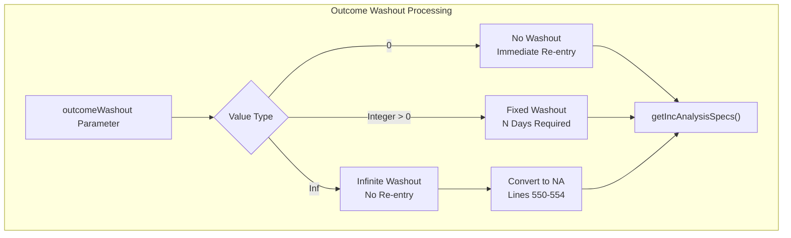
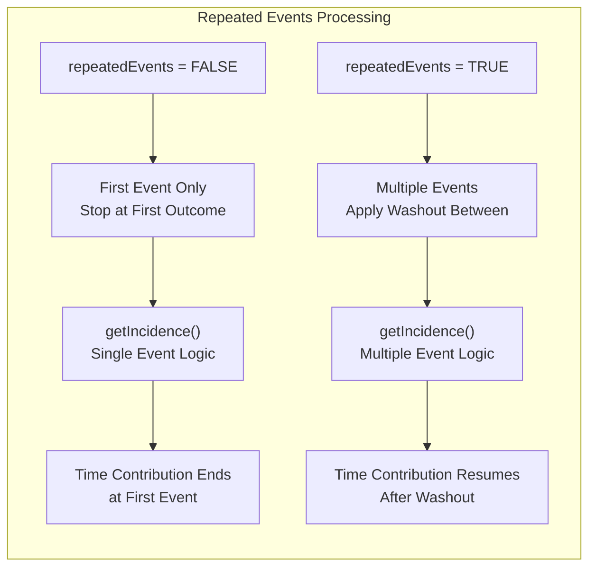
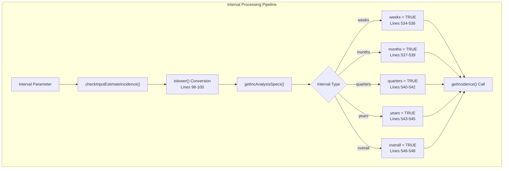
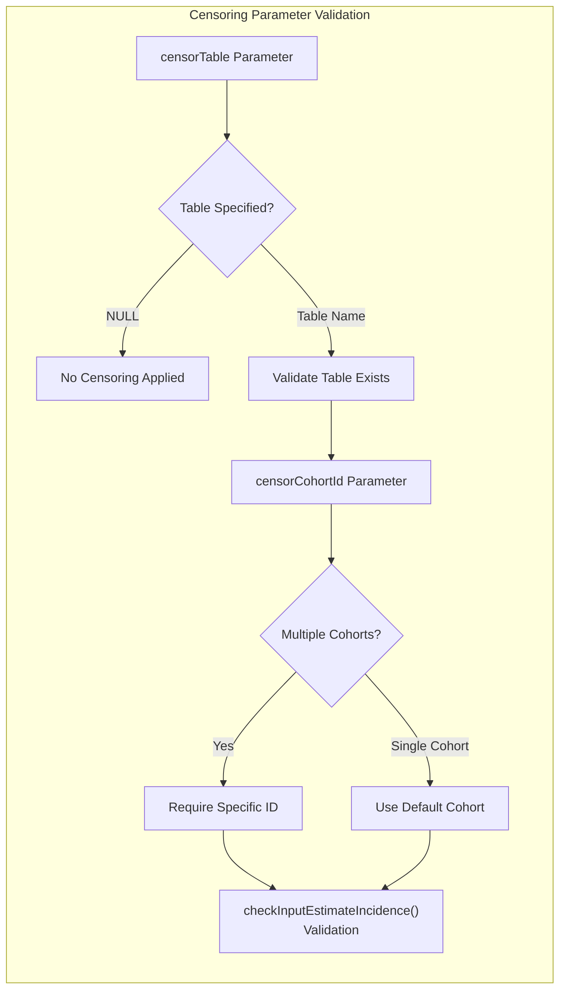
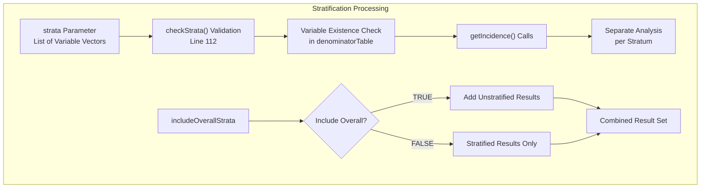
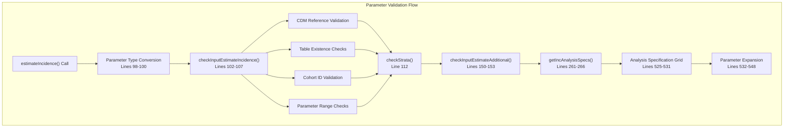

# Page: Parameters and Configuration

# Parameters and Configuration

Relevant source files

The following files were used as context for generating this wiki page:

- [R/estimateIncidence.R](R/estimateIncidence.R)
- [vignettes/a05_Calculating_incidence.Rmd](vignettes/a05_Calculating_incidence.Rmd)

This document provides detailed coverage of the configuration parameters available for incidence analysis in the IncidencePrevalence package. It focuses specifically on temporal parameters, censoring options, stratification settings, and their interactions. For general usage of incidence estimation functions, see [Estimating Incidence Rates](#5.1). For technical details of the calculation engine, see [Incidence Calculation Engine](#5.2).

## Core Temporal Parameters

The fundamental temporal behavior of incidence analysis is controlled by two key parameters that determine how individuals contribute time-at-risk and handle multiple events.

### Outcome Washout Period

The `outcomeWashout` parameter defines the minimum time interval required between the end of one outcome event and when an individual can begin contributing time-at-risk again. This parameter accepts:

| Value Type | Behavior | Use Case |
|------------|----------|----------|
| `0` | No washout period | Immediate re-entry to risk period |
| Positive integer | Days of required washout | Clinically meaningful separation between events |
| `Inf` | Complete exclusion after first event | One-time event analysis |

**Parameter Configuration**

Sources: [R/estimateIncidence.R:48-51](), [R/estimateIncidence.R:550-554]()

### Repeated Events Configuration

The `repeatedEvents` parameter controls whether individuals can contribute multiple outcome events during the study period:

- `FALSE`: Individuals contribute time-at-risk only until their first outcome event
- `TRUE`: Individuals can contribute multiple events, with washout periods applied between events

**Event Handling Logic**

Sources: [R/estimateIncidence.R:52-56](), [vignettes/a05_Calculating_incidence.Rmd:32-57]()

## Time Interval Configuration

Incidence rates can be calculated across different temporal granularities, with options to handle incomplete database coverage periods.

### Analysis Intervals

The `interval` parameter accepts single values or vectors specifying the temporal resolution:

| Interval Type | Description | Implementation |
|---------------|-------------|----------------|
| `"weeks"` | ISO week-based calculation | Calendar weeks starting Monday |
| `"months"` | Calendar month intervals | Month boundaries |
| `"quarters"` | Calendar quarter intervals | Q1-Q4 boundaries |
| `"years"` | Calendar year intervals | January 1 - December 31 |
| `"overall"` | Entire study period | Single estimate across full timeframe |

Sources: [R/estimateIncidence.R:39-44](), [R/estimateIncidence.R:98-100](), [R/estimateIncidence.R:534-548]()

### Complete Database Intervals

The `completeDatabaseIntervals` parameter controls whether to include time periods with incomplete database coverage:

- `TRUE` (default): Only estimate incidence for intervals where the denominator cohort captures the complete interval
- `FALSE`: Include partial intervals in estimation

This parameter is particularly important when the database observation period does not align with the chosen interval boundaries (e.g., data ending mid-year when calculating yearly incidence).

Sources: [R/estimateIncidence.R:45-47](), [vignettes/a05_Calculating_incidence.Rmd:287-289]()

## Censoring Configuration

Censoring allows for the limitation of follow-up time based on external events, such as treatment initiation or competing risks.

### Censor Table Setup

Censoring requires specification of both the cohort table containing censoring events and the specific cohort to use:

### Censoring Constraints

The censoring implementation enforces several important constraints:

- Only one censoring cohort can be specified per analysis
- Each individual can have at most one record in the censoring cohort
- Individuals appearing in the censor cohort before entering the denominator cohort are excluded
- Time-at-risk contribution stops from the date of the first censoring event

Sources: [R/estimateIncidence.R:25-38](), [vignettes/a05_Calculating_incidence.Rmd:185-201]()

## Stratification Parameters

Stratification enables subgroup analysis within the same incidence estimation call.

### Strata Configuration

The `strata` parameter accepts a list of variable combinations for stratified analysis:

**Example Stratification Configurations:**
- `strata = list("age_group")`: Stratify by age group only
- `strata = list("sex")`: Stratify by sex only  
- `strata = list(c("age_group", "sex"))`: Stratify by age group and sex combination
- `strata = list("age_group", "sex", c("age_group", "sex"))`: Multiple stratification levels

Sources: [R/estimateIncidence.R:57-60](), [R/estimateIncidence.R:112](), [vignettes/a05_Calculating_incidence.Rmd:239-283]()

## Parameter Validation and Processing

The parameter validation follows a structured pipeline ensuring data integrity and logical consistency.

### Validation Pipeline

### Analysis Specification Generation

The `getIncAnalysisSpecs()` function creates a comprehensive grid of analysis specifications by expanding all parameter combinations:

**Specification Components:**
- Outcome cohort and denominator cohort combinations
- Complete database interval settings
- Outcome washout configurations
- Repeated events settings
- Temporal interval specifications

Sources: [R/estimateIncidence.R:102-107](), [R/estimateIncidence.R:112](), [R/estimateIncidence.R:150-153](), [R/estimateIncidence.R:519-563]()

## Configuration Best Practices

### Clinical Considerations

When configuring parameters for epidemiological studies:

1. **Washout Periods**: Should reflect the clinical understanding of event independence
2. **Repeated Events**: Consider whether the outcome represents a repeatable condition or one-time event
3. **Censoring**: Include competing risks or treatment initiation events that meaningfully alter follow-up
4. **Intervals**: Choose temporal resolution appropriate for the expected incidence rate and study duration

### Performance Considerations

Parameter choices impact computational performance:

- Multiple interval types increase processing time proportionally
- Complex stratification schemes create exponential analysis combinations
- Large washout periods with repeated events require more complex temporal calculations

Sources: [vignettes/a05_Calculating_incidence.Rmd:67-72](), [vignettes/a05_Calculating_incidence.Rmd:286-289]()