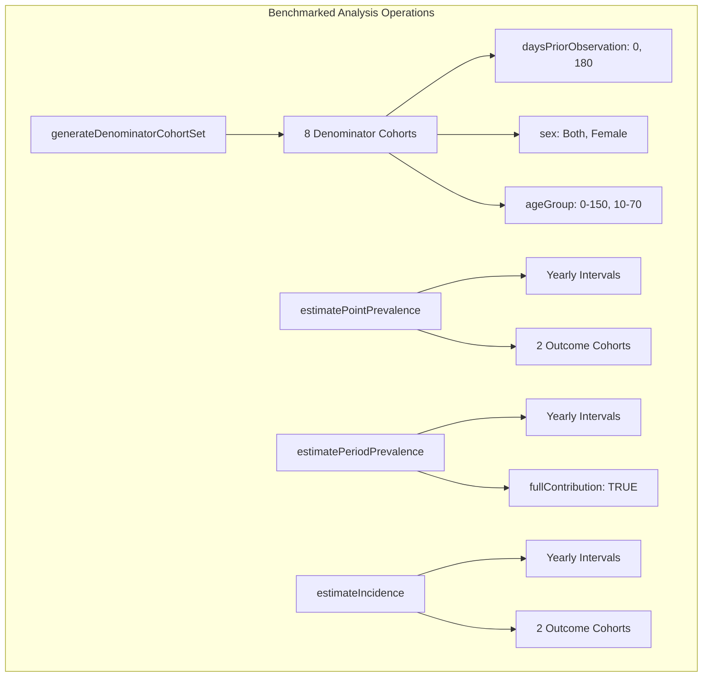
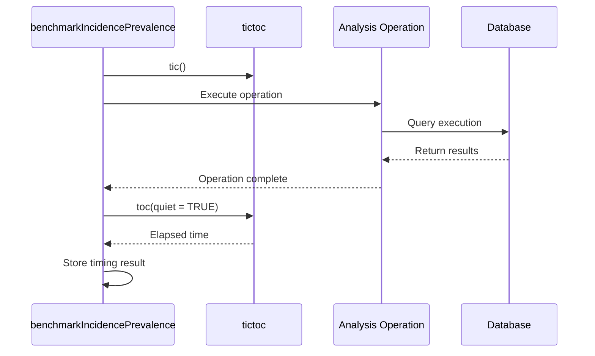
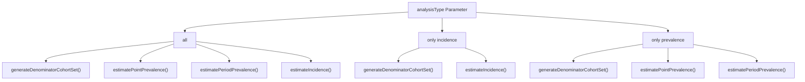
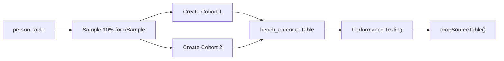

# Page: Performance Benchmarking

# Performance Benchmarking

<details>
<summary>Relevant source files</summary>

The following files were used as context for generating this wiki page:

- [R/benchmarkIncidencePrevalence.R](R/benchmarkIncidencePrevalence.R)
- [R/plotting.R](R/plotting.R)
- [tests/testthat/test-benchmarkIncidencePrevalence.R](tests/testthat/test-benchmarkIncidencePrevalence.R)

</details>


This page covers the performance benchmarking tools and methodologies available in the IncidencePrevalence package. The benchmarking system provides standardized performance measurements for core analysis operations, enabling users to assess computational efficiency across different database backends and data volumes.

For information about visualization of analysis results, see [Plotting Results](#7.1). For details about the core analysis functions being benchmarked, see [Incidence Analysis](#5) and [Prevalence Analysis](#6).

## Benchmarking Function Overview

The package provides a dedicated benchmarking function `benchmarkIncidencePrevalence()` that systematically measures the performance of key analysis operations. This function creates standardized test scenarios and measures execution times for denominator cohort generation, incidence estimation, and prevalence estimation.

```mermaid
flowchart TD
    subgraph "Benchmarking Workflow"
        A["benchmarkIncidencePrevalence()"] --> B["Input Validation"]
        B --> C["generateDenominatorCohortSet()"]
        C --> D["Create Benchmark Outcome Cohorts"]
        D --> E{"analysisType Parameter"}
        
        E -->|"all" or "only prevalence"| F["estimatePointPrevalence()"]
        E -->|"all" or "only prevalence"| G["estimatePeriodPrevalence()"]
        E -->|"all" or "only incidence"| H["estimateIncidence()"]
        
        F --> I["Collect Timing Results"]
        G --> I
        H --> I
        
        I --> J["Format as summarised_result"]
        J --> K["Clean Up Temporary Tables"]
        K --> L["Return Timing Results"]
    end
```

Sources: [R/benchmarkIncidencePrevalence.R:39-236]()

## Benchmarked Operations

The benchmarking system measures performance across four core operations, each representing a typical analysis workflow component:

| Operation | Function Called | Description |
|-----------|----------------|-------------|
| Denominator Generation | `generateDenominatorCohortSet()` | Creates 8 denominator cohorts with varying age groups, sex criteria, and prior observation requirements |
| Point Prevalence | `estimatePointPrevalence()` | Calculates yearly point prevalence for two outcome cohorts across all denominator cohorts |
| Period Prevalence | `estimatePeriodPrevalence()` | Calculates yearly period prevalence with full contribution requirement |
| Incidence Estimation | `estimateIncidence()` | Calculates yearly incidence rates for two outcome cohorts |



Sources: [R/benchmarkIncidencePrevalence.R:54-162]()

## Timing Methodology

The benchmarking system uses the `tictoc` package to measure execution times with high precision. Each operation is wrapped with timing calls that capture start and end timestamps.



The timing capture mechanism follows this pattern for each benchmarked operation:

1. Call `tictoc::tic()` to start timing
2. Execute the target analysis function
3. Call `tictoc::toc(quiet = TRUE)` to capture elapsed time
4. Calculate duration as `t$toc - t$tic`
5. Store result with descriptive task name

Sources: [R/benchmarkIncidencePrevalence.R:53-67](), [R/benchmarkIncidencePrevalence.R:112-125](), [R/benchmarkIncidencePrevalence.R:128-142](), [R/benchmarkIncidencePrevalence.R:147-161]()

## Output Format

The benchmarking function returns results as a `summarised_result` object following the omopgenerics standard format. This ensures compatibility with downstream analysis and visualization tools.

| Column | Content |
|--------|---------|
| `group_level` | Task description (e.g., "generating denominator (8 cohorts)") |
| `estimate_value` | Time taken in minutes |
| `additional_level` | Database type, person count, observation period bounds |
| `cdm_name` | CDM reference name |
| `result_type` | "IncidecnePrevalence benchmark" |

The output includes contextual metadata to enable performance comparison across different environments:

- **Database Management System**: Extracted from CDM source attributes
- **Person Count**: Total number of persons in the CDM
- **Observation Period Range**: Minimum start date and maximum end date
- **Package Version**: IncidencePrevalence package version used

Sources: [R/benchmarkIncidencePrevalence.R:164-186](), [R/benchmarkIncidencePrevalence.R:199-232]()

## Configuration Options

The `analysisType` parameter controls which operations are benchmarked, providing flexibility for targeted performance assessment:



This configuration allows users to focus benchmarking efforts on specific analysis types when full benchmarking is unnecessary or when investigating performance issues in particular operations.

Sources: [R/benchmarkIncidencePrevalence.R:42-48](), [R/benchmarkIncidencePrevalence.R:109-143](), [R/benchmarkIncidencePrevalence.R:145-162]()

## Resource Management

The benchmarking function implements automatic cleanup of temporary database objects to prevent resource accumulation during performance testing. This includes:

### Temporary Table Cleanup

The function creates temporary database tables during benchmarking and ensures their removal upon completion:

- **Denominator Tables**: All tables matching pattern "denominator_typical"
- **Outcome Tables**: All tables matching pattern "bench_outcome"

### Outcome Cohort Generation

Benchmark outcome cohorts are generated by sampling approximately 10% of the available person population, creating realistic test scenarios without requiring pre-existing outcome definitions.



The cleanup mechanism uses `omopgenerics::dropSourceTable()` to remove temporary objects, ensuring that benchmarking operations do not leave database artifacts.

Sources: [R/benchmarkIncidencePrevalence.R:69-107](), [R/benchmarkIncidencePrevalence.R:189-196](), [tests/testthat/test-benchmarkIncidencePrevalence.R:44-66]()