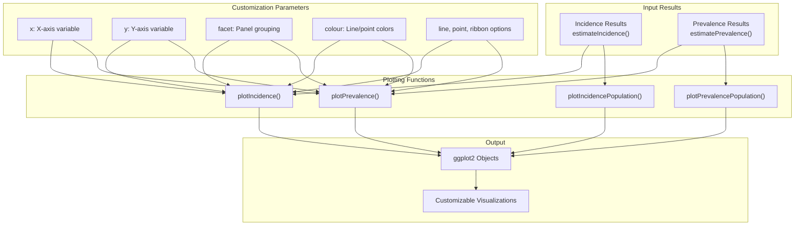
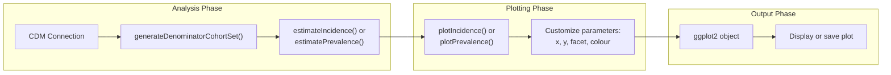
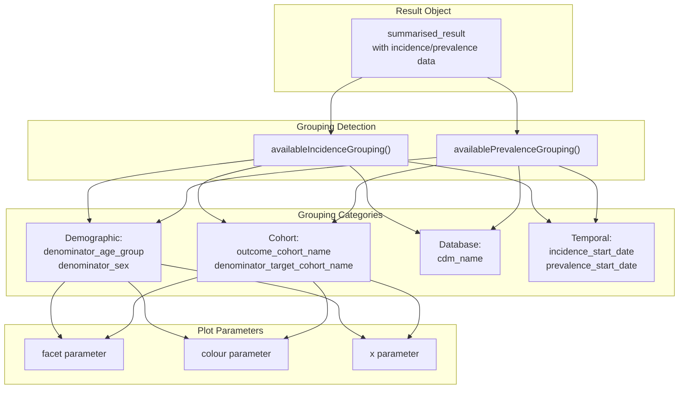
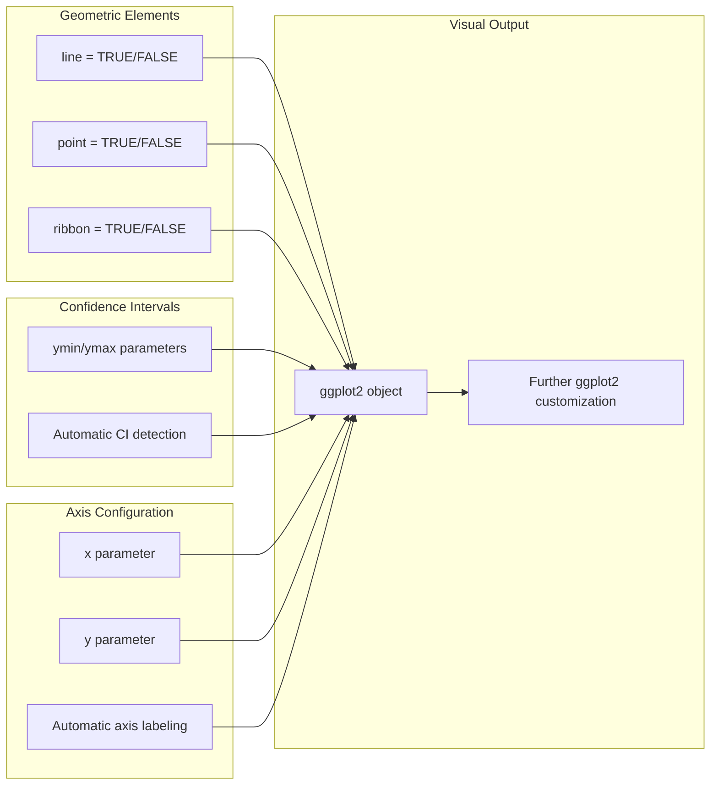

# Page: Plotting Results

# Plotting Results

<details>
<summary>Relevant source files</summary>

The following files were used as context for generating this wiki page:

- [R/tables.R](R/tables.R)
- [tests/testthat/test-plotting.R](tests/testthat/test-plotting.R)

</details>


This page covers the visualization capabilities of the IncidencePrevalence package, focusing on creating plots from incidence and prevalence analysis results. The plotting system provides flexible options for visualizing epidemiological rates, population counts, and trends over time with extensive customization options.

For information about creating formatted tables from results, see [Creating Tables](#7.2). For details about the underlying analysis functions that generate the results to be plotted, see [Incidence Analysis](#5) and [Prevalence Analysis](#6).

## Overview of Plotting Functions

The package provides four main plotting functions that work with `summarised_result` objects from incidence and prevalence analyses:

| Function | Purpose | Input Type |
|----------|---------|------------|
| `plotIncidence()` | Plot incidence rates with confidence intervals | Incidence results |
| `plotPrevalence()` | Plot prevalence rates with confidence intervals | Prevalence results |
| `plotIncidencePopulation()` | Plot population counts from incidence analyses | Incidence results |
| `plotPrevalencePopulation()` | Plot population counts from prevalence analyses | Prevalence results |

All plotting functions return `ggplot2` objects that can be further customized using standard `ggplot2` syntax.

**Plotting Function Architecture**



Sources: [tests/testthat/test-plotting.R:18-46](), [tests/testthat/test-plotting.R:84-114]()

## Basic Plotting Workflow

The typical workflow for creating plots involves three steps: generating analysis results, creating plots, and optionally customizing the output.

**Standard Plotting Workflow**



The plotting functions automatically handle data preparation, confidence interval visualization, and appropriate axis labeling based on the result type and selected variables.

Sources: [tests/testthat/test-plotting.R:12-32](), [tests/testthat/test-plotting.R:84-96]()

## X-Axis and Y-Axis Configuration

### X-Axis Options

The `x` parameter determines the variable used for the x-axis. Available options depend on the grouping variables in your results:

- **Date variables**: `incidence_start_date`, `prevalence_start_date`, automatically formatted as years
- **Stratification variables**: `denominator_age_group`, `denominator_sex`, `denominator_target_cohort_name`
- **Database variables**: `cdm_name`, `outcome_cohort_name`

When using date variables, the plotting functions automatically convert dates to years and format axis breaks appropriately.

### Y-Axis Options

The `y` parameter specifies which measure to plot on the y-axis:

**For Incidence Plots:**
- `incidence_100000_pys` (default): Incidence rate per 100,000 person-years
- `denominator_count`: Number of people in denominator
- `outcome_count`: Number of outcome events
- `person_days`: Total person-time contributed

**For Prevalence Plots:**
- `prevalence` (default): Prevalence proportion
- `denominator_count`: Number of people in denominator  
- `outcome_count`: Number of people with outcome

Sources: [tests/testthat/test-plotting.R:77-82](), [tests/testthat/test-plotting.R:365-399]()

## Grouping and Stratification

### Available Grouping Variables

The package provides helper functions to identify available grouping variables in your results:

- `availableIncidenceGrouping()`: Returns grouping variables for incidence results
- `availablePrevalenceGrouping()`: Returns grouping variables for prevalence results

These functions can show all possible grouping variables (with `showOverallColumns = TRUE`) or just those with multiple unique values in the current results.

**Grouping Variable Detection**



### Faceting

The `facet` parameter creates separate panels for different groups. You can facet by single variables or combinations:

```r
# Single variable faceting
plotIncidence(results, facet = "denominator_age_group")

# Multiple variable faceting  
plotIncidence(results, facet = c("denominator_age_group", "denominator_sex"))
```

### Coloring

The `colour` parameter assigns different colors to groups within the same panel:

```r
# Color by single variable
plotIncidence(results, colour = "denominator_age_group")

# Color by combined variables
plotIncidence(results, colour = c("denominator_age_group", "denominator_sex"))
```

Sources: [tests/testthat/test-plotting.R:49-62](), [tests/testthat/test-plotting.R:202-249](), [tests/testthat/test-plotting.R:251-299]()

## Population Plotting Functions

The population plotting functions (`plotIncidencePopulation()` and `plotPrevalencePopulation()`) visualize the underlying population counts rather than rates.

### Default Behavior

- **X-axis**: Automatically uses date variables when available
- **Y-axis**: Defaults to `denominator_count`
- **Confidence intervals**: Not applicable for count data

### Customization Options

Population plots support the same x-axis, faceting, and coloring options as rate plots:

```r
# Plot outcome counts over time
plotIncidencePopulation(results, y = "outcome_count")

# Plot person-time contributed
plotIncidencePopulation(results, y = "person_days")

# Facet by age group
plotPrevalencePopulation(results, facet = "denominator_age_group")
```

Sources: [tests/testthat/test-plotting.R:33-48](), [tests/testthat/test-plotting.R:96-100]()

## Visual Customization Options

### Confidence Intervals

By default, plots include 95% confidence intervals. You can control their display:

- `ymin = NULL, ymax = NULL`: Removes confidence intervals
- Default: Uses appropriate CI variables (`incidence_100000_pys_95CI_lower`, `incidence_100000_pys_95CI_upper`, etc.)

### Geometric Elements

For rate plots, you can control which geometric elements are displayed:

| Parameter | Default | Description |
|-----------|---------|-------------|
| `line` | `TRUE` | Connect points with lines |
| `point` | `TRUE` | Show data points |
| `ribbon` | `FALSE` | Show confidence intervals as ribbons instead of error bars |

**Plot Customization Options**



Sources: [tests/testthat/test-plotting.R:301-363]()

## Error Handling and Edge Cases

### Empty Results

When plotting empty or filtered results, the functions issue warnings but still return valid `ggplot2` objects that can be displayed or further customized.

### Mixed Result Types

The plotting functions can handle mixed result objects (containing both incidence and prevalence results) by automatically filtering to the appropriate result type based on the function called.

### Imported Results

Plots work identically with results that have been exported and re-imported using `omopgenerics::exportSummarisedResult()` and `omopgenerics::importSummarisedResult()`.

### Tidy Results

The plotting functions also work with "tidy" result objects created using `asIncidenceResult()` or `asPrevalenceResult()`, but enforce that the correct result type is used with the corresponding plotting function.

Sources: [tests/testthat/test-plotting.R:133-150](), [tests/testthat/test-plotting.R:167-198]()