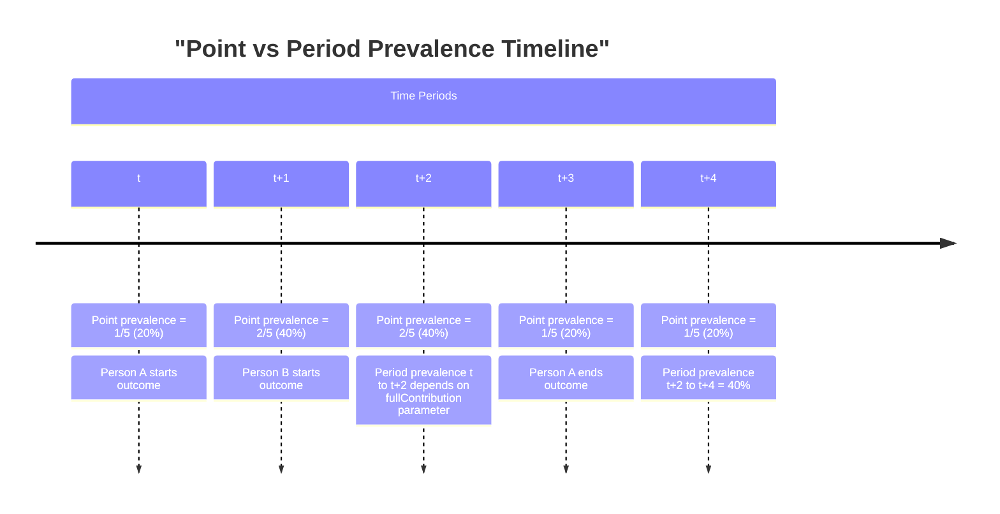
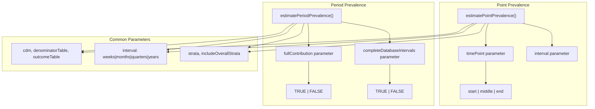
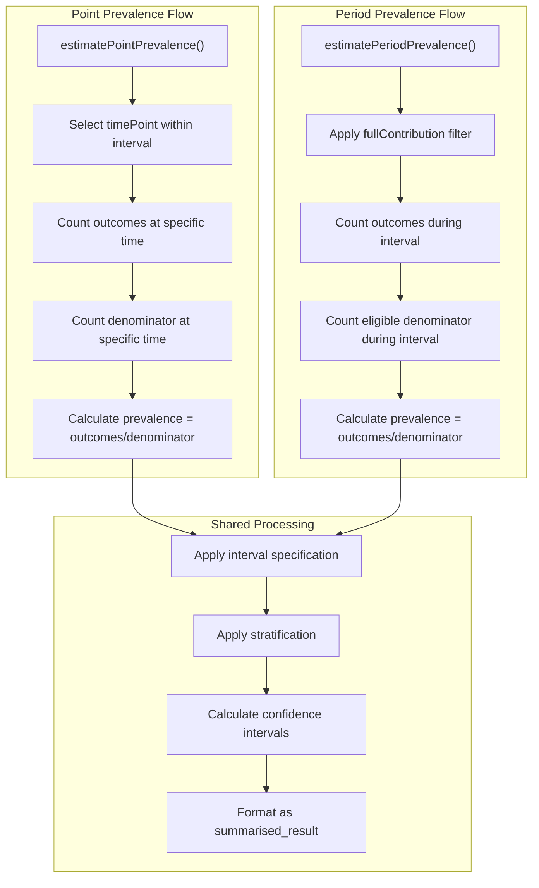
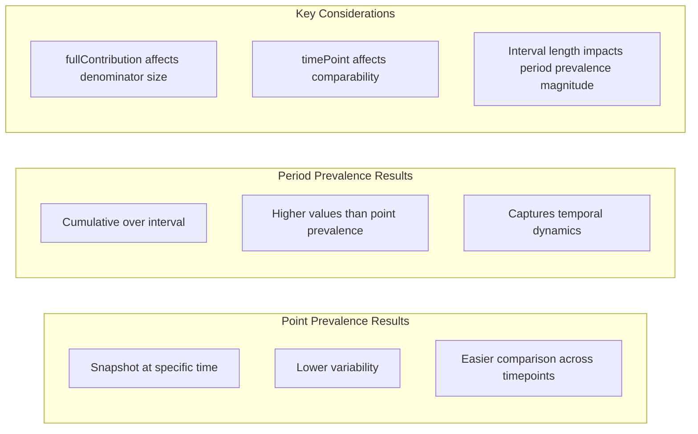

# Page: Point vs Period Prevalence

# Point vs Period Prevalence

<details>
<summary>Relevant source files</summary>

The following files were used as context for generating this wiki page:

- [man/estimatePeriodPrevalence.Rd](man/estimatePeriodPrevalence.Rd)
- [man/estimatePointPrevalence.Rd](man/estimatePointPrevalence.Rd)
- [vignettes/a04_Calculating_prevalence.Rmd](vignettes/a04_Calculating_prevalence.Rmd)

</details>


## Purpose and Scope

This document explains the fundamental differences between point prevalence and period prevalence calculations in the IncidencePrevalence package, including their conceptual definitions, technical implementations, and when to use each approach. For general prevalence calculation methodology, see [6.2](#6.2). For detailed configuration options specific to prevalence calculations, see [6.3](#6.3).

## Conceptual Differences

Prevalence measures the proportion of people in a population who have a health condition at a specific time or during a time period. The package implements two distinct types of prevalence calculations:

**Point Prevalence**: The proportion of people with an outcome at a specific point in time. This provides a "snapshot" view of disease burden at a particular moment.

**Period Prevalence**: The proportion of people with an outcome during a specified time interval. This captures the disease burden over a period of time and includes anyone who had the outcome at any point during that interval.

### Timeline Illustration

The following diagram illustrates how point and period prevalence differ in their temporal perspective:



Sources: [vignettes/a04_Calculating_prevalence.Rmd:27-29]()

## Function Implementation

The package provides separate functions for each prevalence type, with distinct parameter sets optimized for their specific calculation requirements:



Sources: [man/estimatePointPrevalence.Rd:6-17](), [man/estimatePeriodPrevalence.Rd:6-19]()

## Key Parameter Differences

### Point Prevalence: `timePoint` Parameter

The `timePoint` parameter in `estimatePointPrevalence()` determines where within each time interval the prevalence is calculated:

| timePoint Value | Description | Use Case |
|-----------------|-------------|----------|
| `"start"` | Beginning of interval (default) | Traditional point prevalence at interval start |
| `"middle"` | Middle of interval | Representative prevalence for the interval |
| `"end"` | End of interval | Prevalence at interval conclusion |

### Period Prevalence: `fullContribution` Parameter

The `fullContribution` parameter in `estimatePeriodPrevalence()` controls how partial contributions are handled:

| fullContribution Value | Description | Impact on Results |
|------------------------|-------------|-------------------|
| `TRUE` | Requires presence for entire interval | More conservative, lower prevalence estimates |
| `FALSE` (default) | Requires presence for at least one day | More inclusive, higher prevalence estimates |

Sources: [vignettes/a04_Calculating_prevalence.Rmd:163-172](), [man/estimatePointPrevalence.Rd:43](), [man/estimatePeriodPrevalence.Rd:50-53]()

## Calculation Logic Flow

The following diagram shows how each function processes temporal data differently:



Sources: [vignettes/a04_Calculating_prevalence.Rmd:114-129](), [vignettes/a04_Calculating_prevalence.Rmd:163-178]()

## When to Use Each Approach

### Use Point Prevalence When:
- Measuring disease burden at specific time points
- Comparing prevalence across different calendar dates
- Regulatory reporting requiring specific date snapshots
- Cross-sectional study designs

### Use Period Prevalence When:
- Measuring overall disease burden during a time period
- Accounting for seasonal variations or trends
- Longitudinal study designs
- Resource planning based on period-based utilization

## Example Usage Patterns

### Point Prevalence Example
```r
# Calculate yearly point prevalence at interval start
estimatePointPrevalence(
  cdm = cdm,
  denominatorTable = "denominator", 
  outcomeTable = "outcome",
  interval = "years",
  timePoint = "start"
)
```

### Period Prevalence Example
```r
# Calculate monthly period prevalence with full contribution required
estimatePeriodPrevalence(
  cdm = cdm,
  denominatorTable = "denominator",
  outcomeTable = "outcome", 
  interval = "months",
  fullContribution = TRUE
)
```

Sources: [vignettes/a04_Calculating_prevalence.Rmd:75-81](), [vignettes/a04_Calculating_prevalence.Rmd:165-172]()

## Impact on Results Interpretation

The choice between point and period prevalence significantly affects result interpretation:



Sources: [vignettes/a04_Calculating_prevalence.Rmd:27-29](), [vignettes/a04_Calculating_prevalence.Rmd:260-262]()